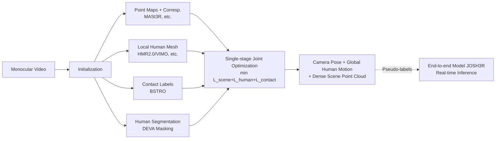

# Joint Optimization for 4D Human-Scene Reconstruction in the Wild

**Conference**: ICLR 2026  
**OpenReview**: [https://openreview.net/forum?id=7eLE4mfEpz](https://openreview.net/forum?id=7eLE4mfEpz)  
**Code**: [https://vail-ucla.github.io/JOSH/](https://vail-ucla.github.io/JOSH/)  
**Area**: 3D Vision / 4D Human-Scene Reconstruction  
**Keywords**: 4D reconstruction, global human motion estimation, dense scene reconstruction, human-scene contact constraints, joint optimization, monocular video  

## TL;DR
JOSH proposes using "human-scene contact" as a bridge to integrate camera pose, global human motion, and dense scene point clouds into a **single-stage joint optimization**. It reconstructs physically consistent 4D human-scene interactions from casual monocular web videos and further utilizes JOSH to generate pseudo-labels for 20 hours of web video to train JOSH3R, an end-to-end model capable of real-time inference.

## Background & Motivation

**Background**: Understanding how humans interact with their environment (e.g., pedestrians crossing streets, people sitting on benches or climbing stairs) requires simultaneous acquisition of human motion, scene geometry, and camera trajectories. One approach involves multi-view RGBD/LiDAR scanning of scenes in controlled environments followed by fitting human motion (e.g., PROX, RICH lines), which suffers from high acquisition costs and monotonous scenarios. Another approach recovers global human motion from casual web videos (e.g., WHAM, TRAM), but these typically focus on humans while ignoring the scene, causing motion to lack environmental support and semantics.

**Limitations of Prior Work**: The few works attempting 4D human-scene reconstruction (e.g., SynCHMR, Luvizon) follow a **multi-stage serial** pipeline—estimating the camera first, then reconstructing the scene, and finally optimizing human motion independently. This fragmentation ignores the potential for **mutual refinement** between the camera, human, and scene: where a foot steps provides scale and depth cues for the scene, while scene geometry in turn constrains the global position of the human. Under serial workflows, contact details between humans and scenes often mismatch, resulting in physically implausible results such as feet penetrating the ground or floating. Most methods also only reconstruct a single person, failing to guarantee consistency among multiple people in a shared world coordinate system.

**Key Challenge**: 4D human-scene reconstruction is inherently a **tripartite-coupled** problem (camera ↔ human ↔ scene). However, mainstream methods break this coupling through serial decomposition, leading to scale drift, contact penetration, and multi-person inconsistency.

**Goal**: To simultaneously recover the global motion of all individuals, dense scene point clouds, and camera parameters from monocular in-the-wild videos, while ensuring physically valid human-scene contacts and metric-scale results.

**Core Idea (Contact as Constraint + Single-stage Joint Optimization)**: **Human-scene contact is the most natural form of interaction, providing geometric constraints that bind humans, scenes, and cameras together**. Instead of solving in series, JOSH incorporates all parameters into a **single** gradient optimization, using two contact losses (alignment and stillness) to guide the entire system toward a consistent and physically plausible reconstruction.

## Method

### Overall Architecture

JOSH (Joint Optimization of Scene Geometry and Human Motion) consists of two steps: an **initialization** phase using off-the-shelf models, followed by a **single-stage joint optimization**. The initialization phase extracts four elements from the video: dense scene point maps with inter-frame correspondences (from MASt3R/MonST3R/DROID-SLAM, etc.), local human meshes (from HMR2.0/WHAM/VIMO, etc.), per-vertex contact labels (from the BSTRO contact prediction model), and monocular depth priors (ZoeDepth). A critical step involves using the DEVA video segmentation model to mask out moving humans, using only background point clouds for scene reconstruction to prevent dynamic humans from contaminating geometry matching based on static assumptions. The optimization phase treats camera intrinsics $K^t$, extrinsics $P^t$, per-frame scale $\sigma^t$, depth maps $Z^t$, and local SMPL parameters $\Theta_c^t$ for all individuals as variables, updating them simultaneously via a total loss.

### Key Designs

**1. Contact Scene Loss $L_{c1}$: Aligning human and scene contact points to anchor metric scale.** This is the source of physical grounding. For each predicted human contact vertex $x_h^t$ (requiring it to be visible and projected within the non-human mask $1-M^t$ to avoid depth ambiguity), JOSH searches the background point cloud for the closest projected point as the corresponding scene contact point $x_s^t = \arg\min_{x^t\in \tilde X^t}|\pi(K^t,x^t)-\pi(K^t,x_h^t)|_2$, filtering incorrect correspondences with monocular depth priors. After obtaining the correspondence set $D$, the loss constrains the two to align in 3D space:

$$L_{c1}=\sum_{(x_h^t,x_s^t)\in D}\rho(x_h^t-\sigma^t x_s^t)$$

Since human prior losses contain metric information via SMPL parameters, this contact loss drags the scene scale $\sigma^t$, depth maps, and camera poses toward the correct metric scale. Ablation studies show that removing $L_{c1}$ causes the foot floating rate to spike from 2.9% to 92.9% and ATE to jump from 3.21 to 22.47, identifying it as the key anchor for preventing scale drift. Note that $x_h^t$ is updated during optimization, so corresponding scene points $x_s^t$ are re-searched in each iteration.

**2. Contact Stillness Loss $L_{c2}$: Maintaining static body parts between adjacent frames.** Contact implies not just alignment but also that a vertex remaining in contact across consecutive frames should be stationary relative to the scene (e.g., feet should not slide when touching the ground). JOSH identifies sets $E$ where the same vertex maintains contact across frames, constraining the human and scene contact points to remain static:

$$L_{c2}=\sum_{(x_h^i,x_h^j)\in E}\big(\rho(P^i x_h^i-\sigma^j P^j x_s^j)+\rho(P^j x_h^j-\sigma^i P^i x_s^i)\big)$$

This term specifically addresses foot sliding; ablations show it reduces foot sliding from 68.2mm to 28.2mm.

**3. Single-stage Total Loss: Co-optimizing scene reconstruction, human priors, and contact constraints.** The total loss is the sum of three components: scene reconstruction loss $L_{scene}$ (3D correspondence + 2D re-projection for background points), human prior loss $L_{human}$ (temporal smoothness + SMPL parameter initialization proximity + 2D keypoint re-projection), and the core contact loss $L_{contact}=w_{c1}L_{c1}+w_{c2}L_{c2}$:

$$L=L_{scene}+L_{human}+L_{contact}$$

All parameters $\{K^t,P^t,\sigma^t,Z^t,\Theta_c^t\}$ are **simultaneously updated in one gradient optimizer**, which is the fundamental difference between JOSH and serial methods like SynCHMR.

**4. Joint Focal Length Optimization: Coupling focal length with human root depth.** Web videos often lack camera intrinsics. Previous works often assumed a fixed focal length $f$ based on pixel diagonals. However, the root depth $t_z$ output by human mesh estimators is proportional to focal length; an incorrect focal length leads to irreversible errors in global motion. JOSH includes $f$ as an optimization variable and scales the depth component of SMPL local translation as $t_z' = \frac{f}{f_{init}}t_z$ in each iteration, ensuring consistent depth and focal length updates.

**5. JOSH3R: Distilling an end-to-end model for real-time inference.** While accurate, optimization is slow (JOSH3 runs at 0.8 FPS). Since in-the-wild videos lack ground truth, JOSH is used to generate pseudo-labels for 20 hours of web video. The authors then train JOSH3R, which adds a lightweight "human trajectory head" to a MASt3R geometric backbone. It directly predicts relative human transformations $\Delta T_c^i$ and calculates global motion and camera poses via $T_g^t=\prod_{i=1}^{t-1}\Delta T_c^i\cdot T_c^1$ without optimization, reaching 15.4 FPS for real-time inference.

## Key Experimental Results

### Main Results: 4D Human-Scene Reconstruction (SLOPER4D vs. Serial Baseline SynCHMR⋆)

| Method | Init (Human/Scene) | WA-MPJPE↓ | W-MPJPE↓ | ATE↓ | CD↓ | Jitter↓ | FS↓ | FFR%↓ |
|------|------|------|------|------|------|------|------|------|
| SynCHMR⋆ | HMR2.0 / DROID-SLAM | 233.2 | 1125.4 | 17.47 | 17.76 | 123.9 | 67.4 | 9.0 |
| JOSH1 | HMR2.0 / DROID-SLAM | 206.3 | 1094.2 | 17.18 | 16.84 | **7.6** | 56.9 | 3.3 |
| JOSH2 | WHAM / MonST3R | 210.4 | 994.3 | 14.53 | 9.09 | 7.8 | 45.3 | 2.1 |
| JOSH3 | VIMO / MASt3R | **120.0** | **438.3** | **3.21** | **5.31** | 7.1 | **28.2** | 2.9 |

With the same initialization, JOSH1 outperforms SynCHMR⋆ across the board, notably reducing Jitter from 123.9 to 7.6. JOSH3, using stronger initialization, reduces WA-MPJPE by 46.6% and CD by 70.1% compared to SynCHMR⋆. On EMDB, JOSH3 sets a new SOTA for global human motion estimation with a W-MPJPE of 174.7.

### Ablation Study (SLOPER4D, based on JOSH3 variants)

| Variant | W-MPJPE↓ | RTE%↓ | AbsRel↓ | ATE↓ | FS↓ | FFR%↓ |
|------|------|------|------|------|------|------|
| −$L_{c1}$ (No contact alignment) | 1361.4 | 4.7 | 0.49 | 22.47 | 47.3 | 92.9 |
| −opt $\Theta_c$ (No human opt) | 486.4 | 1.8 | 0.17 | 3.28 | 35.6 | 3.2 |
| −$L_{c2}$ (No stillness loss) | 448.3 | 1.9 | 0.18 | 3.26 | 68.2 | 3.2 |
| **JOSH3 (Full)** | **438.3** | 1.8 | 0.17 | **3.21** | **28.2** | **2.9** |

### Key Findings
- **$L_{c1}$ is the scale anchor**: Removing it causes FFR to crash to 92.9% and ATE to jump, proving its role in grounding the system to metric scale.
- **Jointly optimizing humans provides gains**: Optimizing $\Theta_c$ improves W-MPJPE from 486.4 to 438.3 compared to optimizing only the scene/camera.
- **$L_{c2}$ prevents foot sliding**: Reduces FS from 68.2 to 28.2.
- **Intrinsics must be optimized in the wild**: Optimizing focal length consistently outperforms fixed assumptions in the absence of ground truth.
- **Pseudo-label training outperforms GT training**: JOSH3R trained on JOSH labels improves WA-MPJPE by 59.2% over training on EMDB ground truth.

## Highlights & Insights
- **Transforming "Contact" from Passive Result to Active Constraint**: While previous works used contact as a post-reconstruction physical check, JOSH uses contact correspondences as the core signal driving the optimization.
- **Value of Single-stage Joint Optimization**: Integrating cameras, humans, and scenes into one loss allows continuous mutual refinement, resulting in scale consistency and plausible contacts.
- **Framework Versatility**: JOSH is not tied to specific initializers; it can be improved "for free" as upstream models (HMR2.0/WHAM vs. DROID-SLAM/MASt3R) evolve.
- **Optimization-to-Distillation Loop**: Using a slow, accurate optimization method as a large-scale automatic annotator to distill a fast model is a practical paradigm for leveraging unlabeled web data.

## Limitations & Future Work
- **Inference Speed**: JOSH3 is slow (0.8 FPS), and real-time capability relies on JOSH3R, which currently has a significant accuracy gap (e.g., EMDB W-MPJPE 174.7 vs. 661.7).
- **Initialization Dependence**: Contact labels, depth, and human meshes all rely on external models; errors in initialization propagate through the optimization.
- **Heuristic Contact Search**: Nearest neighbor search with depth filtering is effective for limbs but may fail in complex or occluded contacts.
- **Static Background Assumption**: Dependence on DEVA masking and static backgrounds remains a vulnerability in scenes with other dynamic objects.

## Related Work & Insights
- **In-the-wild vs. Controlled**: JOSH bypasses the need for pre-scanned scenes required by PROX/RICH by leveraging casual video.
- **Global Motion Advancement**: JOSH treats global motion estimators (SLAHMR, WHAM) as initializers and refines them with scene feedback, achieving a new SOTA.
- **Insight**: The paradigm of "using physical interaction constraints to jointly solve sub-tasks that were previously decoupled" is transferable to tasks like hand-object interaction or multi-agent reconstruction.

## Rating
- **Novelty**: ⭐⭐⭐⭐ — The combination of single-stage optimization and contact-driven signals is elegant. While individual components are recycled, the unified refinement framework is a solid conceptual contribution.
- **Experimental Thoroughness**: ⭐⭐⭐⭐ — Covers three datasets, multiple initialization variants, detailed ablations, and a pseudo-label loop. Quantitative multi-person assessment is the only minor missing piece.
- **Writing Quality**: ⭐⭐⭐⭐ — Logical flow from motivation to method, with clear loss definitions and illustrations.
- **Value**: ⭐⭐⭐⭐ — Sets a new SOTA for global motion and provides a scalable path for training with web videos, relevant for embodied AI and autonomous driving.

<!-- RELATED:START -->

## Related Papers

- [\[CVPR 2026\] EmbodMocap: In-the-Wild 4D Human-Scene Reconstruction for Embodied Agents](../../CVPR2026/3d_vision/embodmocap_in-the-wild_4d_human-scene_reconstruction_for_embodied_agents.md)
- [\[CVPR 2026\] 4D Primitive-Mâché: Glueing Primitives for Persistent 4D Scene Reconstruction](../../CVPR2026/3d_vision/4d_primitive-mache_glueing_primitives_for_persistent_4d_scene_reconstruction.md)
- [\[CVPR 2026\] CARI4D: Category Agnostic 4D Reconstruction of Human-Object Interaction](../../CVPR2026/3d_vision/cari4d_category_agnostic_4d_reconstruction_of_human_object_interaction.md)
- [\[ICLR 2026\] UFO-4D: Unposed Feedforward 4D Reconstruction from Two Images](ufo-4d_unposed_feedforward_4d_reconstruction_from_two_images.md)
- [\[ICLR 2026\] A Step to Decouple Optimization in 3DGS](a_step_to_decouple_optimization_in_3dgs.md)

<!-- RELATED:END -->
