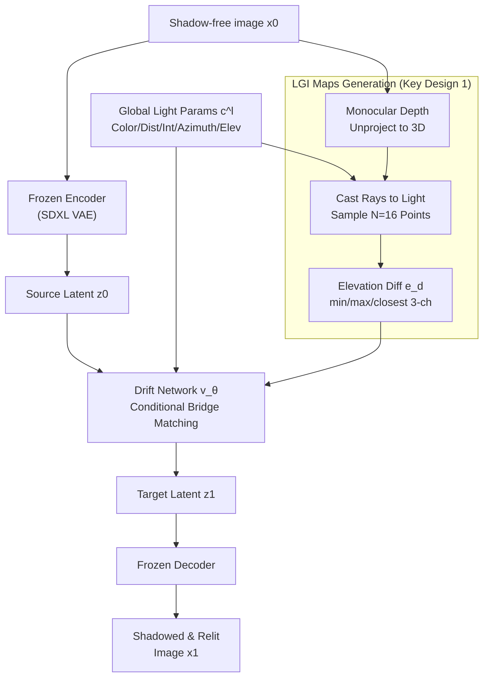

# Joint Shadow Generation and Relighting via Light-Geometry Interaction Maps

**Conference**: ICLR2026  
**arXiv**: [2602.21820](https://arxiv.org/abs/2602.21820)  
**Code**: To be confirmed  
**Area**: 3D Vision  
**Keywords**: shadow generation, relighting, light-geometry interaction, bridge matching, monocular depth  

## TL;DR

This paper proposes Light-Geometry Interaction (LGI) maps, a 2.5D representation encoding light-occlusion relationships from monocular depth estimation. These maps are embedded into a bridge matching generation framework to achieve joint modeling of shadow generation and object relighting, attaining SOTA performance on both synthetic and real images.

## Background & Motivation

**Background**: Shadow generation and relighting are essential for scenarios such as virtual product placement, augmented reality, and image editing.  
**Limitations of Prior Work**: Traditional methods rely on full 3D reconstruction and ray tracing, which are computationally expensive and infeasible in single-view settings. Recent generative methods based on diffusion models and bridge matching can synthesize shadows from RGB inputs, but due to the lack of physical constraints, they often suffer from:

- **Floating shadows**: Shadows inconsistent with object geometry.
- **Lighting inconsistency**: Contradiction between the relighting direction and shadow direction.
- **Unreasonable shadow geometry**: Failure in scenes with complex occlusions.

**Key Challenge**: Most importantly, existing methods treat shadow generation and relighting as **independent tasks**, ignoring the inherent coupling between them—accurate modeling requires simultaneous consideration of direct lighting, secondary reflections, and mutual reflections.

## Core Problem

How to efficiently encode light-geometry interactions in a single-view scenario using only monocular depth, and embed this as a physical prior into a generative model to achieve joint modeling of shadow generation and relighting?

## Method

### Overall Architecture

The method addresses the lack of physical constraints and the separation of shadow generation and relighting in single-view scenarios. It is built upon the Latent Bridge Matching (LBM) framework: a shadow-free image $x_0$ is first mapped to a source latent $z_0$ via a frozen Stable Diffusion XL encoder. A drift network $v_\theta$ then bridges it to the shadow latent $z_1$ along a Brownian bridge. Finally, a frozen decoder reconstructs the image $x_1$ with both generated shadows and relighting. The encoder and decoder remain frozen, while training only optimizes the drift network. The key lies in feeding the drift network a set of light-aware conditions $c=\{c^l, c^m\}$: $c^l$ represents global light parameters (color, radius, distance, intensity, azimuth, elevation), and $c^m$ represents the proposed LGI maps—which compress light-geometry occlusion relationships into a differentiable 2.5D condition map to guide the generation process. Additionally, the pipeline is extended to image harmonization (by self-supervising a light estimation network via LGI) and utilizes a new joint shadow-relighting dataset, ShadRel.

### Key Designs

**1. LGI maps: Compressing Ray Tracing into Elevation Differences**  
Shadows are essentially occlusions of light by geometry. Since full reconstruction is costly, LGI maps approximate these cues from monocular depth. Specifically, a depth map $D$ is estimated and scaled to light coordinates; each pixel is unprojected to 3D via $p = D(u,v)\cdot K^{-1}[u,v,1]^\top$. From $p$, a ray is cast towards light $l$ with $N=16$ sampled points. For each sample, the difference $e^d_n = e^s_n - e^l$ between the surface elevation $e^s_n$ and light elevation $e^l$ is computed. A surface elevation exceeding the light elevation indicates occlusion. These differences are aggregated into three channels: $c^m_1=\min e^d_n$ (start of occlusion), $c^m_2=\max e^d_n$ (end of occlusion), and $c^m_3 = e^d_{i^*}$ (closest occlusion, where $i^*=\arg\min|e^d_n|$). This representation encodes occlusion range and 2.5D uncertainty while remaining within a range $(-\pi,\pi)$ suitable for neural networks.

**2. Self-Supervised Extension for Image Harmonization**  
To generalize the method to image harmonization, a light estimation network is introduced to infer light conditions from composite images. Since the LGI map generation is fully differentiable, the light estimation can be trained via self-supervision using shadow masks as signals, requiring no ground-truth light labels.

**3. ShadRel Dataset: Specialized Data for Joint Tasks**  
As concurrent shadow and relighting annotations were previously unavailable, the authors created the ShadRel dataset using Blender Cycles. It includes 817K virtual objects with diverse materials (glossy, metallic, transparent) based on principled BSDF. Each object is rendered from 4 camera views under 5 lighting configurations, covering difficult cases like soft shadows, reflections, and mutual reflections.

### Loss & Training

A weighted L1 loss is used to prevent the loss from being diluted by the unchanged background. Pixels where shadow changes occur (identified by a threshold $\tau=0.01$ and dilation) are highlighted:

$$\mathcal{L}_x(\hat{x}_1, x_1) = \frac{1}{M}\sum_{m=1}^M w^{(m)} \cdot |x_1^{(m)} - \hat{x}_1^{(m)}|$$

The final loss combines the latent bridge matching term and the weighted pixel loss ($\lambda=10$).

## Key Experimental Results

### Main Results: Joint Shadow Generation and Relighting (ShadRel Dataset)

| Method | Overall RMSE↓ | Overall SSIM↑ | Shadow BER↓ | Shadow IoU↑ | Object RMSE↓ |
|------|:---:|:---:|:---:|:---:|:---:|
| LBM | 0.0417 | 0.7148 | 0.0847 | 0.7166 | 0.0298 |
| **Ours** | **0.0334** | **0.7227** | **0.0588** | **0.8096** | **0.0282** |

RMSE in shadow regions decreased from 0.1543 to 0.0898 (**42% improvement**), and BER decreased from 0.1549 to 0.1103.

### Ablation Study Key Findings

- **LGI maps** are the most critical component; removing them degrades Shadow BER from 0.0588 to 0.0940.
- Simply replacing LGI with a raw depth map yields marginal results (BER of 0.0932).
- The three-channel LGI design outperforms a single-channel version (BER 0.0588 vs 0.0670).
- Robustness: Results vary minimally when switching between DepthAnythingV2 or GT depth.
- Efficiency: Parameter count increases by only 0.0004%, and FLOPs by 0.0011%.

## Highlights & Insights

1.  **LGI Map Design**: Simplifies ray tracing into a differentiable 2.5D representation, providing physical intuition without full 3D reconstruction.
2.  **Joint Modeling Paradigm**: Unifies shadow generation and relighting to capture the coupled effects of direct and indirect lighting.
3.  **Generalization**: Trained solely on synthetic data, yet performs excellently on real-world images (including portraits) without fine-tuning.
4.  **Efficiency**: LGI module has negligible overhead and naturally scales to multiple light sources.

## Limitations & Future Work

- **2.5D Ambiguity**: Cannot handle missing depth information in occluded regions, leading to ambiguous shadows.
- **Synthetic Data**: Dependence on synthetic training may lead to failures in extreme real-world scenarios.
- **Scale and Light Specs**: Monocular depth lacks metric scale; current modeling is limited to point light sources rather than area or environment lighting.

## Related Work & Insights

| Dimension | CSG / LBM | SGDGP | SwitchLight | Ours |
|------|-----------|-------|-------------|------|
| Shadow Gen | ✓ | ✓ | ✗ | ✓ |
| Relighting | ✗ | ✗ | ✓ | ✓ |
| Joint Model | ✗ | ✗ | ✗ | ✓ |
| Geom. Prior | None/2D Template | Box + Template | None | LGI maps (2.5D) |
| Physical Constraint | Weak | Medium | Weak | Strong |

## Rating
- Novelty: ⭐⭐⭐⭐
- Experimental Thoroughness: ⭐⭐⭐⭐
- Writing Quality: ⭐⭐⭐⭐
- Value: ⭐⭐⭐⭐

<!-- RELATED:START -->

## Related Papers

- [\[CVPR 2026\] LumiMotion: Improving Gaussian Relighting with Scene Dynamics](../../CVPR2026/3d_vision/lumimotion_gaussian_relighting_dynamics.md)
- [\[ICLR 2026\] DreamCS: Geometry-Aware Text-to-3D Generation with Unpaired 3D Reward Supervision](dreamcs_geometry-aware_text-to-3d_generation_with_unpaired_3d_reward_supervision.md)
- [\[ICLR 2026\] SSD-GS: Scattering and Shadow Decomposition for Relightable 3D Gaussian Splatting](ssd-gs_scattering_and_shadow_decomposition_for_relightable_3d_gaussian_splatting.md)
- [\[ECCV 2024\] JointDreamer: Ensuring Geometry Consistency and Text Congruence in Text-to-3D Generation via Joint Score Distillation](../../ECCV2024/3d_vision/jointdreamer_ensuring_geometry_consistency_and_text_congruence_in_text-to-3d_gen.md)
- [\[ICLR 2026\] LiTo: Surface Light Field Tokenization](lito_surface_light_field_tokenization.md)

<!-- RELATED:END -->
