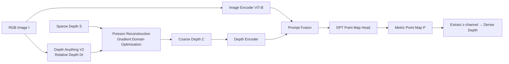

# Large Depth Completion Model from Sparse Observations

**Conference**: ICLR 2026  
**OpenReview**: [https://openreview.net/forum?id=I9o2OkPwCX](https://openreview.net/forum?id=I9o2OkPwCX)  
**Code**: [https://pkqbajng.github.io/ldcm/](https://pkqbajng.github.io/ldcm/) (Project Page)  
**Area**: 3D Vision / Depth Completion / Point Map Estimation  
**Keywords**: Depth completion, Point map regression, Monocular depth foundation models, Poisson reconstruction, Metric scale, Zero-shot generalization  

## TL;DR
LDCM employs a minimalist framework for sparse depth completion without complex modules. At the front end, it uses Poisson reconstruction to align the relative depth from monocular foundation models with sparse observations into metric-consistent coarse depth. At the back end, it replaces traditional depth regression heads with pixel-wise 3D point map regression heads, achieving SOTA performance in zero-shot depth completion and point map estimation across six benchmarks.

## Background & Motivation
- **Background**: Depth completion aims to recover dense metric depth from an RGB image and sparse depth (LiDAR, SfM keypoints, low-cost depth cameras). Traditional methods (SPN series, 2D-3D joint methods) perform well on single-domain data like NYUv2 and KITTI. Recently, prompt-based methods (PromptDA, MarigoldDC, PriorDA) treat sparse depth as a conditional signal to prompt monocular/diffusion foundation models, guiding predictions toward a metric scale.
- **Limitations of Prior Work**: These methods essentially treat depth completion as a **depth recovery task**—models learn to interpolate or denoise depth values under sparse observations, favoring local smoothness and texture-aware completion but lacking explicit 3D geometric reasoning. They struggle with severe domain shifts or highly irregular sparse maps (e.g., uneven density from SfM point clouds).
- **Key Challenge**: Sparse priors follow diverse distributions (random points, keypoints, LiDAR scans). Existing alignment strategies are either too coarse (global affine assuming uniform scale/shift prevents recovering pixel-wise metric values) or too fragile (LWLR is extremely sensitive to sparse density and distribution). Setting the task as depth recovery prevents the supervision signal from explicitly representing 3D structure.
- **Goal**: To build a simple, effective, and robust large depth completion model capable of outputting accurate metric dense depth under highly sparse and irregular observations with zero-shot generalization to unseen data.
- **Core Idea**: **The problem lies not in network complexity, but in restructuring "input preprocessing" and "training goals."** ① Use Poisson reconstruction in the gradient domain to fuse the relative depth structure of foundation models with sparse metric anchors into high-quality coarse depth. ② Replace the output representation from depth maps to pixel-wise point maps in the camera coordinate system, allowing the network to learn 3D scene structure directly rather than pixel-wise depth repair, while eliminating reliance on camera intrinsics.

## Method

### Overall Architecture
Given an RGB image $I \in \mathbb{R}^{H\times W\times 3}$ and sparse depth map $S \in \mathbb{R}^{H\times W}$, LDCM predicts a metric point map $P \in \mathbb{R}^{H\times W\times 3}$ in the camera coordinate system. The final dense depth is extracted from the z-channel of the point map. The pipeline consists of two stages: the first uses a monocular foundation model (DepthAnythingV2-S) and Poisson reconstruction to generate a metric-consistent coarse depth map $C$; the second uses a ViT-B (DINOv2 pretrained) dual-encoder network to take $I$ and $C$ as input and regress the final point map $P$.

### Key Designs

**1. Poisson Coarse Depth Alignment: Anchoring relative depth to metric space.** Directly interpolating sparse points creates artifacts due to a lack of geometric priors. Global affine alignment suffers from pixel-wise metric errors, and LWLR is sensitive to sparse distributions. LDCM reformulates alignment as a gradient-domain reconstruction problem, ensuring the coarse depth $C$ fits the geometric structure of relative depth $D_r$ while preserving sparse values $S$:

$$C = \arg\min_{D} \left( \sum_i \lVert \nabla\log D_i - G_i \rVert^2 + \lambda \sum_{i\in\Omega}(D_i - S_i)^2 \right),$$

where $\Omega$ is the set of valid sparse points and $\lambda$ balances the terms. The target gradient field $G$ is constructed by first using global affine alignment $(\alpha, \beta)$ to define $\gamma = \beta/\alpha$, then setting $G = \nabla\log(D_r + \gamma)$. This shift $\gamma$ aligns the gradient structure to the metric scale. Solving via conjugate gradient allows every sparse point to act as a global anchor, propagating influence through structural constraints, making it robust even at extreme sparsity.

**2. Point Map Regression Head: Directly learning 3D structure.** The completion network uses dual encoders to extract features from $C$ and $I$, fused via Prompt Fusion blocks. The key change is at the output: instead of depth, it uses a point map head to predict pixel-wise 3D coordinates $P$. While depth maps are 2.5D representations tied to camera intrinsics, point maps explicitly model 3D structure. This end-to-end formulation allows the model to output metric 3D point maps without needing camera intrinsics. Ablations (Table 5) show point map representation outperforms depth map or depth+ray map, reducing REL from 0.026 to 0.022.

**3. Three Complementary Point Map Losses: Global structure + Local detail + Surface normal.** The loss is defined as $L = L_{global} + \lambda_{local}L_{local} + \lambda_{normal}L_{normal}$ over predicted $P$ and ground truth $\hat{P}$. $L_{global}$ uses inverse-depth weighted L1 for overall consistency; $L_{local}$ samples anchors to define 3D spherical neighborhoods to encourage viewpoint-invariant local consistency; $L_{normal}$ constrains surface normals estimated from the point map to promote surface smoothness. Together, these supervise 3D geometric structure across scales.

## Key Experimental Results

Training involved approximately 2.7 million samples from 11 public RGB-D datasets, using 16 H20 GPUs for about 6 days (200K iterations) with a global batch size of 128. Sparse inputs were synthesized using the OMNI-DC protocol (noisy random sampling, SIFT/ORB keypoints, LiDAR line simulations).

### Main Results: Zero-shot Depth Completion (Table 1, Average REL↓)

| Method | KITTI | iBims-1 | DIODE Indoors | DIODE Outdoors | ETH3D | Average |
|------|-------|---------|-----------|-----------|-------|------|
| OMNI-DC | 0.042 | 0.018 | 0.022 | 0.049 | 0.016 | 0.029 |
| PriorDA | 0.044 | 0.018 | 0.012 | 0.051 | 0.017 | 0.028 |
| SPNet | 0.041 | 0.016 | 0.028 | 0.048 | 0.019 | 0.030 |
| **LDCM (Ours)** | **0.026** | **0.012** | **0.008** | **0.031** | **0.008** | **0.017** |

With an average REL of 0.017, LDCM significantly outperforms PriorDA (0.028) and OMNI-DC (0.029), ranking first across all five datasets.

### Point Map Estimation (Table 2, Average, Zero-shot)

| Method | MAEp↓ | RMSEp↓ | RELp↓ | δp₁↑ |
|------|-------|--------|-------|------|
| OMNI-DC | 0.629 | 0.996 | 0.075 | 0.950 |
| PriorDA | 0.622 | 0.971 | 0.071 | 0.961 |
| SPNet | 0.624 | 1.092 | 0.075 | 0.952 |
| **LDCM (Ours)** | **0.404** | **0.743** | **0.042** | **0.991** |

For affine-invariant point map estimation (Table 3), the average RELp of 0.037 surpasses pure relative geometry methods like VGGT and MoGe V2, indicating that introducing metric supervision does not sacrifice relative geometric accuracy.

### Ablation Study
**Coarse Depth Alignment Strategy (Table 4, REL↓)**:

| Configuration | Coarse Depth Avg | Final Prediction Avg |
|------|-----------|------------|
| Sparse points only | - | 0.029 |
| Global Alignment | 0.087 | 0.024 |
| LWLR | 0.088 | 0.025 |
| Poisson w/o Global | 0.147 | - |
| **Poisson (Full)** | **0.059** | **0.022** |

**Output Representation (Table 5)**: SI-Log depth REL 0.026 → Point map 0.022; Point map estimation RELp 0.067 → 0.045.

### Key Findings
- Poisson alignment significantly outperforms global/LWLR strategies at extreme sparsity, and the **global alignment step is essential** (removing it degrades coarse depth REL from 0.059 to 0.147).
- Point map output representation provides more effective 3D structural guidance compared to depth maps or depth+ray maps.
- The model maintains high accuracy under extreme sparsity and demonstrates strong zero-shot generalization, proving the benefits of restructuring inputs and targets over stacking complex modules.

## Highlights & Insights
- **Paradigm Shift**: Redefining depth completion as "3D Point Map Estimation" upgrades the supervision signal from 2.5D to explicit 3D while removing dependency on camera intrinsics. This is the most significant insight of the work.
- **Elegant Reuse of Poisson Reconstruction**: Borrowing classic gradient-domain Poisson editing to fuse foundational structure with metric anchors is more stable than affine or LWLR methods and naturally propagates sparse influences globally.
- **Validation of Minimalism**: High performance is achieved without fancy modules by focusing on input preprocessing and training objectives, offering a counterpoint to the "module arms race."

## Limitations & Future Work
- Dependency on the quality of the monocular foundation model (DepthAnythingV2); coarse depth upper bounds are capped by its relative depth accuracy.
- Poisson reconstruction requires conjugate gradient iterations, which introduces additional inference overhead not explicitly detailed in terms of end-to-end latency.
- High training costs (2.7M samples, 16×H20, 6 days) make reproduction expensive. Sensitivity to hyper-parameters like $\lambda_{local}$ and $\lambda_{normal}$ is not fully explored.

## Related Work & Insights
- **Depth Completion**: Moves from the SPN series (CSPN, NLSPN) to 2D-3D methods, and recently to prompt-based foundation model exploitation (PromptDA, PriorDA). LDCM identifies their shared "depth recovery" limitation.
- **Monocular Depth Models**: Models like DepthAnything and Marigold provide generalizable geometric priors. LDCM replaces the standard LWLR alignment in these pipelines with Poisson alignment.
- **Geometric Estimation Models**: DUSt3R, VGGT, and MoGe demonstrate the potential of point map representations. LDCM is among the first to systematically introduce this representation to the depth completion task.

## Rating
- **Novelty**: ⭐⭐⭐⭐ The combination of Poisson alignment and swapping depth heads for point map heads is a convincing demonstration that restructuring inputs/targets is superior to stacking modules.
- **Experimental Thoroughness**: ⭐⭐⭐⭐⭐ Comprehensive coverage across six benchmarks, three sparsity modes, and multiple evaluation metrics, with detailed ablations.
- **Writing Quality**: ⭐⭐⭐⭐ Logic is clear; the derivation of the Poisson alignment ($\gamma$ offset) is well-explained.
- **Value**: ⭐⭐⭐⭐⭐ Zero-shot metric completion is immediately useful for robotics, autonomous driving, and AR. High practical value due to its independence from intrinsics.

<!-- RELATED:START -->

## Related Papers

- [\[ICLR 2026\] ORCaS: Unsupervised Depth Completion via Occluded Region Completion as Supervision](orcas_unsupervised_depth_completion_via_occluded_region_completion_as_supervisio.md)
- [\[CVPR 2026\] Dense Metric Depth Completion from Sparse Direct Time-of-Flight Sensors](../../CVPR2026/3d_vision/dense_metric_depth_completion_from_sparse_direct_time-of-flight_sensors.md)
- [\[CVPR 2026\] Zero-Shot Depth Completion with Vision-Language Model](../../CVPR2026/3d_vision/zero-shot_depth_completion_with_vision-language_model.md)
- [\[CVPR 2026\] PatchScene: Patch-based Voxel Diffusion Model for Large-Scale Scene Completion](../../CVPR2026/3d_vision/patchscene_patch-based_voxel_diffusion_model_for_large-scale_scene_completion.md)
- [\[ICCV 2025\] Omni-DC: Highly Robust Depth Completion with Multiresolution Depth Integration](../../ICCV2025/3d_vision/omni-dc_highly_robust_depth_completion_with_multiresolution_depth_integration.md)

<!-- RELATED:END -->
