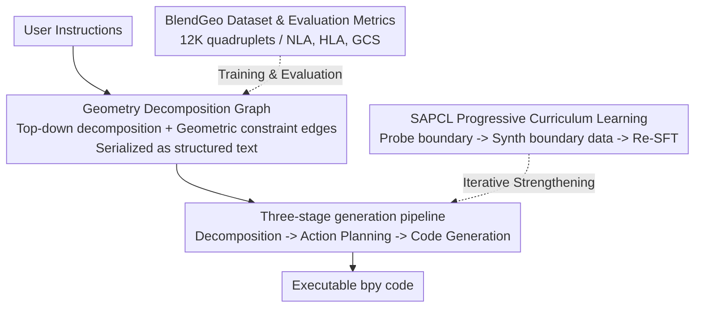

# Learning Hierarchical and Geometry-Aware Graph Representations for Text-to-CAD

**Conference**: ICLR 2026  
**OpenReview**: [https://openreview.net/forum?id=oKMomThD6n](https://openreview.net/forum?id=oKMomThD6n)  
**Code**: https://github.com/SCUT-MMPR/Graph-CAD  
**Area**: 3D Vision / CAD Generation / Code Generation  
**Keywords**: Text-to-CAD, Geometry Decomposition Graph, Intermediate Representation, Curriculum Learning, Geometric Constraints

## TL;DR
Graph-CAD decomposes the long-horizon "text-to-CAD code" task into three stages. It first leverages an LLM to generate an **explicit decomposition graph expressing assembly hierarchies and geometric constraints** as an intermediate representation. It then plans actions and generates bpy code sequentially, integrated with a structure-aware progressive curriculum learning approach to push the model's capability boundaries. This pulls the Geometric Constraint Satisfaction (GCS) rate on CADBench from ~0.40 (end-to-end) to 0.90.

## Background & Motivation
**Background**: Text-to-CAD aims to convert natural language instructions directly into executable CAD programs (e.g., Blender bpy code), lowering the barrier for professional design. Mainstream approaches (Text2CAD, CADLLM, BlenderLLM) utilize Transformer/LLMs to decode text **end-to-end** into parametric program code.

**Limitations of Prior Work**: CAD generation is a typical **long-horizon task**—complex assemblies must be translated into a long sequence of interdependent operations. End-to-end decoding "flattens" the design process into a linear token sequence, lacking explicit assembly hierarchies and explicit geometric constraints between parts. Consequently, the decoder operates blindly within a massive search space. Small early errors (e.g., part dimensions or positioning) propagate through the sequence, causing complex assemblies to fail. These methods perform adequately for single-part objects but frequently collapse with multi-part designs.

**Key Challenge**: Complex assembly requires both **global structural consistency** (the final assembly matches user intent) and **strict satisfaction of local geometric dependencies** (correct contact, alignment, and relative orientation for each operation). Flattened code sequences carry both types of information simultaneously, where constraint information is buried implicitly within the token stream. Models struggle to maintain global structure while respecting local constraints, leading to accumulated errors.

**Goal**: Introduce an intermediate representation capable of explicitly carrying "assembly hierarchies + geometric constraints" to break down the difficult one-step problem into controllable sub-stages. This aims to prune the search space and enhance geometric fidelity and constraint satisfaction, while addressing the generalization issues as part count and constraint density increase.

**Key Insight**: The authors observe that CAD assemblies are inherently **hierarchical**—a product can be recursively decomposed top-down into components, sub-components, and finally atomic components implemented by basic operators (bpy primitives). Spatial relationships between parts are essentially a set of **geometric constraints** (alignment, mating, offsets). This structure is naturally represented by a graph: nodes = multi-level parts/components, edges = explicit geometric constraints between them.

**Core Idea**: Instead of mapping text directly to code, the model learns a **hierarchical, geometry-aware decomposition graph** as an intermediate representation, allowing the model to "determine the structure and constraints before generating code."

## Method

### Overall Architecture
Graph-CAD is a three-stage serial framework where each stage is handled by an independent, LLM-based module, splitting the "user instruction → executable bpy code" process into three steps: **Geometry Decomposition → Action Planning → Code Generation**.

- **Stage 1: Geometry Decomposition**: The decomposition model receives user instructions and constructs a graph based on two principles: ① Top-down recursive decomposition (from product to atomic components to form multi-level nodes); ② Establishing geometric constraints (encoding spatial relationships as edges). The graph is serialized into **structured text** (listing nodes and constraint edges layer by layer, e.g., `Align(XYZ) Door.back_face to Body.front_face`).
- **Stage 2: Action Planning**: The planning model uses node features and constraints from the decomposition graph to determine an optimal **graph traversal order**, converting the non-linear graph into a linear CAD operation sequence (which part to build first, how to align it, and how to assemble it).
- **Stage 3: Code Generation**: The code generation model translates the planned operation sequence into executable bpy code.

Training is wrapped in **SAPCL (Structure-Aware Progressive Curriculum Learning)**, which alternates between fine-tuning the components on full data and exploring capability boundaries to synthesize difficult new data. All generation modules use Qwen3-8B as the backbone with LoRA (rank 64) fine-tuning.

### Key Designs

**1. Hierarchical, Geometry-Aware Decomposition Graph: Making Implicit Constraints Explicit**

This is the foundation of the work, specifically targeting the error accumulation caused by buried constraints in flat code. In the defined graph $G=(V,E)$, nodes $V$ represent multi-level parts/components obtained via **top-down recursive decomposition**, ending at atomic components viable for bpy primitives (Cuboid, Disc, etc.). Edges $E$ encode **explicit geometric constraints** between parts, such as `Align(XYZ) Turntable.bottom_face to Body_shell.bottom_face; offset(0,0,0.056)`. The serialization into structured text serves as the conditional input for subsequent stages.

Providing these structural priors (part existence, nesting, and alignment) explicitly prunes the search space. Table 1 shows that even without task-specific fine-tuning, using this graph-mediated process with few-shot prompting on general LLMs increases GCS significantly (GPT-5 on Wild: 0.40 → 0.58), proving that the benefits stem from the paradigm itself.

**2. Three-stage Decoupled Generation Pipeline: Bridging the Gap from Graph to Code**

A non-linear graph cannot be directly mapped to linear code without deciding the build order. The authors insert an **Action Planning** stage where the model determines the traversal order to produce an explicit CAD operation sequence (e.g., "Build Panel_base → Build Control_buttons and align → Assemble Control_panel..."). 

Ablations (Table 3) show that removing Action Planning (direct Graph → Code) significantly degrades instruction following (Inst.) and the syntax error rate (Esyntax)—Esyntax on Wild rises from 4.5% to 11.0%. This confirms that explicitly planning the linear sequence from a non-linear graph is vital for generating executable code.

**3. SAPCL: Probing and Pushing Capability Boundaries**

As assembly complexity increases, error compounding becomes more severe. SAPCL addresses this by **measuring the model's current stable difficulty level and synthesizing new data right at that boundary**. It alternates between **SFT** (fine-tuning on all data) and **SAPCE (Structure-Aware Progressive Curriculum Exploration)**.

In SAPCE, a **Problem Generator** creates three difficulty variants for seed samples: Easy (simple attribute changes), Intermediate (local structure changes), and Advanced (cross-category migration). A **Multi-modal Discriminator** verifies if the fine-tuned model can solve these. **Boundary Data Generation** then synthesizes new training samples at or slightly beyond the model's success threshold to expand its capabilities. This cycle is repeated for 4 rounds.

**4. BlendGeo Dataset and Graph Fidelity Metrics**

To support this paradigm, the authors constructed **BlendGeo**, featuring 12K quadruplets (instructions, decomposition graph, action sequence, bpy code) covering 1.4K categories. They introduced new metrics: **Node-Level Accuracy (NLA)**, **Hierarchy-Level Accuracy (HLA)**, and **Geometric Constraint Satisfaction (GCS)**. GCS measures whether the final assembly satisfies contact, alignment, and orientation constraints, providing a means to evaluate intermediate representations rather than just final renders.

## Key Experimental Results

### Main Results
Evaluated on CADBench-Sim (in-distribution) and CADBench-Wild (out-of-distribution). Metrics include Attr., Spat., Inst., Avg. (VLM scores), Esyntax, CLIP (semantic alignment), and GCS.

| Method | Sim Avg.↑ | Sim Esyntax↓ | Sim GCS↑ | Wild Avg.↑ | Wild Esyntax↓ | Wild GCS↑ |
|------|-----------|--------------|----------|------------|---------------|-----------|
| BlenderLLM | 0.5832 | 2.4% | 0.5513 | 0.5909 | 5.3% | 0.4983 |
| GPT-5 (End-to-end) | 0.6203 | 2.8% | 0.3846 | 0.6515 | 5.5% | 0.4017 |
| Claude-opus-4-1 | 0.6662 | 7.4% | 0.4932 | 0.6687 | 14.5% | 0.5062 |
| Graph-CAD (SFT) | 0.6431 | 2.2% | 0.7830 | 0.6692 | 4.5% | 0.8025 |
| **Graph-CAD (SAPCL)** | **0.6883** | **2.0%** | **0.9018** | **0.7114** | **2.5%** | **0.8943** |

Graph-CAD (SAPCL) achieves the best performance across all metrics, with a massive lead in GCS (Wild 0.89 vs ~0.40 for end-to-end). Strong OOD performance suggests the graph-mediated paradigm learns more generalizable solutions.

### Ablation Study
Three-stage pipeline ablation (SFT setting, Table 3):

| Configuration | Sim Avg.↑ | Sim Esyntax↓ | Sim GCS↑ | Wild Esyntax↓ | Wild GCS↑ | Inference Time (s)↓ |
|------|-----------|--------------|----------|---------------|-----------|--------------|
| End-to-end | 0.5573 | 5.8% | 0.6923 | 8.0% | 0.7012 | 64.9 |
| w/o Graph Decom. | 0.6166 | 5.0% | 0.7268 | 6.5% | 0.7207 | 79.5 |
| w/o Action Planning | 0.5874 | 6.4% | 0.7545 | 11.0% | 0.7451 | 91.8 |
| **Graph-CAD (SFT)** | **0.6431** | **2.2%** | **0.7830** | **4.5%** | **0.8025** | 104.8 |

### Key Findings
- **GCS shows the most gain**: Explicit constraint modeling solves the primary failure mode of end-to-end methods.
- **Intermediate representations are non-negotiable**: Removing either graph decomposition or action planning degrades performance; decomposition captures structure, while planning ensures code executability.
- **Accuracy costs time**: Reasoning time increases by ~1.6x compared to end-to-end models, but results in drastically improved GCS and reduced syntax errors.
- **Structured curriculum is essential**: Random instruction paraphrasing is insufficient; targeting the capability boundary is necessary to scale to complex assemblies.

## Highlights & Insights
- **Using "Graphs" as CAD Blueprints**: Explicitly modeling hierarchy and constraints acts as structural prior-based search space pruning. This approach is transferable to other structured long-horizon generation tasks like circuit layout or robot task planning.
- **Boundary-Adaptive Curriculum Learning**: SAPCL identifies where the model specifically fails and synthesizes "boundary-focused" data, which is invaluable when paired data is scarce.
- **Diagnosable Intermediate Steps**: The NLA/HLA metrics allow researchers to determine whether failures occur in the decomposition, planning, or coding phase, moving away from "black-box" evaluation.

## Limitations & Future Work
- **Increased Inference Cost**: Three serial LLM calls make the system slower and more expensive for real-time or bulk scenarios.
- **Dependency on Discriminators**: The curriculum's success relies on the reliability of the Multi-modal Discriminator; misjudgments can pollute the synthetic data.
- **Constraint Types**: The work focuses on geometric constraints (alignment, orientation). Coverage of more complex functional or parametric constraints (e.g., joints, kinematic pairs) remains to be explored.

## Related Work & Insights
- **vs Text2CAD / CADLLM**: These map text directly to parameters. Graph-CAD's explicit structure modeling yields much higher robustness for multi-part assemblies where Text2CAD often scores significantly lower on CADBench.
- **vs BlenderLLM**: BlenderLLM uses iterative refinement on sequences. Graph-CAD’s SAPCL introduces difficulty tiers and boundary detection, leading to superior GCS.
- **vs CoT/Planning Enhancements**: While CoT improves planning, it lacks an explicit persistent structural model. Graph-CAD makes the "structure" a learnable and verifiable graph intermediate.

## Rating
- **Novelty**: ⭐⭐⭐⭐⭐ High. First significant use of hierarchical+geometric graphs as learnable intermediates for Text-to-CAD with boundary-adaptive curriculum.
- **Experimental Thoroughness**: ⭐⭐⭐⭐ Strong. Comprehensive ablations and cross-distribution evaluations.
- **Writing Quality**: ⭐⭐⭐⭐ Clear framework and diagrams.
- **Value**: ⭐⭐⭐⭐⭐ Significant. Huge gains in GCS and provides the infrastructure (BlendGeo) for graph-mediated CAD generation.

<!-- RELATED:START -->

## Related Papers

- [\[CVPR 2026\] Velox: Learning Representations of 4D Geometry and Appearance](../../CVPR2026/3d_vision/velox_learning_representations_of_4d_geometry_and_appearance.md)
- [\[ICLR 2026\] DreamCS: Geometry-Aware Text-to-3D Generation with Unpaired 3D Reward Supervision](dreamcs_geometry-aware_text-to-3d_generation_with_unpaired_3d_reward_supervision.md)
- [\[CVPR 2026\] Learning Hierarchical Hyperbolic Mixture Model for Part-aware 3D Generation](../../CVPR2026/3d_vision/learning_hierarchical_hyperbolic_mixture_model_for_part-aware_3d_generation.md)
- [\[ICLR 2026\] $\pi^3$: Permutation-Equivariant Visual Geometry Learning](pi3_permutation-equivariant_visual_geometry_learning.md)
- [\[AAAI 2026\] Graph Smoothing for Enhanced Local Geometry Learning in Point Cloud Analysis](../../AAAI2026/3d_vision/graph_smoothing_for_enhanced_local_geometry_learning_in_point_cloud_analysis.md)

<!-- RELATED:END -->
