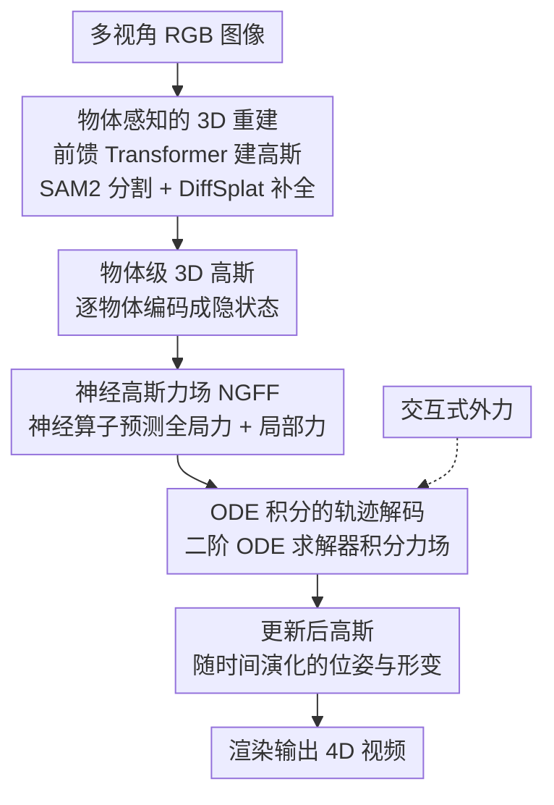

# Learning Physics-Grounded 4D Dynamics with Neural Gaussian Force Fields

**Conference**: ICLR 2026  
**arXiv**: [2602.00148](https://arxiv.org/abs/2602.00148)  
**Code**: [Project Page](https://neuralgaussianforcefield.github.io/)  
**Area**: 3D Vision/Physical Simulation  
**Keywords**: 3D Gaussian Splatting, Force Field Learning, Physical Reasoning, 4D Video Prediction, Neural Operator

## TL;DR
The NGFF framework is proposed to construct 3D Gaussian representations from multi-view RGB images and learn explicit neural force fields to drive physical dynamics. By employing ODE solvers, it achieves interactive, physically realistic 4D video generation, running two orders of magnitude faster than traditional Gaussian simulators and surpassing Veo3 and NVIDIA Cosmos.

## Background & Motivation

**Background**: Video generation models produce impressive visual effects but lack physical understanding, frequently violating fundamental laws such as gravity and object permanence. Methods combining 3DGS with traditional physical engines offer good physical consistency but at a high computational cost.

**Limitations of Prior Work**: (1) Particle/mesh-based methods requires predefined physical models and structured inputs, leading to poor generalization; (2) MPM-based Gaussian methods provide high physical fidelity but come with unacceptable computational costs; (3) Large video models tend to overfit surface visual features rather than learning underlying physical principles.

**Key Challenge**: There is a need for a solution that provides both physical consistency (force modeling) and computational efficiency (avoiding MPM) while being learnable directly from visual observations (not depending on structured inputs).

**Key Insight**: Instead of predefining physical models, this work learns explicit force fields—using neural operators to predict forces between objects and simulating dynamics through ODE integration. 3D Gaussians provide an object-aware representation interface.

## Method

### Overall Architecture
NGFF addresses the contradiction between making video generation "physically plausible" and "computationally fast": traditional MPM Gaussian simulators are physically accurate but require per-particle iteration, making them prohibitively slow, while large video models only learn surface visuals and frequently violate gravity and object permanence. The core idea is to bypass predefined physical models and directly learn an **explicit force field** from visual observations, then integrate forces into trajectories using an ODE. The pipeline proceeds as follows: multi-view RGB images are reconstructed into 3D Gaussians via a feed-forward Transformer and segmented by object. Each object is encoded into latent features and fed into a neural operator to predict the forces it experiences. The force field is integrated via a second-order ODE solver to compute the pose and deformation trajectories of each object over time. Finally, the updated Gaussians are rendered into 4D videos. The entire process is fully differentiable, allowing for end-to-end training and enabling interactive generation by applying external forces during inference.

### Key Designs

**1. Object-aware 3D Reconstruction: Decomposing scenes into object-level representations suitable for physical simulation**

Physical simulation cannot be performed on an un-decomposed point cloud—forces act on "objects." Therefore, the reconstruction phase must produce object-level decomposed representations. A feed-forward Transformer is used to construct 3D Gaussians directly from multi-view RGB: image features are extracted using DINOv2, and a Transformer with alternating attention simultaneously predicts camera poses and Gaussian parameters, avoiding per-scene optimization. The reconstructed Gaussians are segmented into independent objects via SAM2, while occluded parts are refined and completed by DiffSplat, ensuring that the geometry of each object is complete before simulation.

**2. Neural Gaussian Force Field (NGFF): Using neural operators for one-shot force prediction instead of per-particle simulation**

This is the core contribution and the source of the two-order-of-magnitude acceleration. MPM is slow because it iterates through mechanical equations per particle; NGFF uses a neural operator to directly map an object's latent state to the force it currently experiences. Forces are decomposed into global and local components: global forces handle the overall translation and rotation of rigid bodies. For a query object $q$, it is computed by the element-wise multiplication of features from neighboring objects $i \in \mathcal{N}(q)$ via two branches $f_\eta$ and $f_\phi$, followed by linear transformation aggregation:

$$\mathbf{F}^{\text{global}}(\mathbf{z}^q(t)) = \sum_{i \in \mathcal{N}(q)} \mathbf{W}\big(f_\eta(\mathbf{z}^i) \odot f_\phi(\mathbf{z}^q)\big) + \mathbf{b},$$

where the neighborhood graph encodes the contact structure between objects. Local forces handle soft body deformation and are determined by latent force features, a contact area mask (CAM), and the position and velocity of the query object:

$$\mathbf{F}^{\text{local}} = \Phi(\mathbf{F}^{\text{latent}}, \text{CAM}, \mathbf{x}^q, \dot{\mathbf{x}}^q).$$

The CAM identifies the actual contact regions between objects, ensuring that stress is applied only where forces are generated. Decoupling rigid motion and soft deformation into global and local paths based on physical meaning allows for better generalization than direct end-to-end regression of overall motion.

**3. ODE-integrated Trajectory Decoding: Transforming predicted forces into time-evolving states**

To connect forces back to dynamics, NGFF uses a second-order ODE solver to integrate the force field starting from the initial latent state, yielding the object state at any time $t$:

$$\mathbf{z}^q(t) = \text{ODESolve}(\mathbf{z}^q(0), \mathbf{F}, 0, t),$$

Velocity is accumulated by integrating the force over time according to Newton’s second law: $\dot{\mathbf{s}}(t) = \dot{\mathbf{s}}(0) + \int_0^t \mathbf{F}(\mathbf{z}^q(t))\, dt$. Because ODESolve is fully differentiable, the force field prediction and dynamics simulation are combined into an end-to-end trainable pipeline, which also permits the insertion of external forces to modify trajectories during inference.

### Loss & Training
Training occurs in two stages: first, the feed-forward reconstruction module is fine-tuned on WildRGBD; second, the dynamics prediction component is trained on synthetic MPM data. The dynamics loss is the MSE between the predicted and ground truth Gaussian configurations and motion trajectories.

## Key Experimental Results

### GSCollision Dataset
- 640K rendered physical videos (~4TB), including 10 types of daily objects (both rigid and soft), covering falling, collisions, rotation, sliding, and container interactions.

### Main Results (Dynamics Prediction)

| Model | Spatial RMSE↓ | Temporal RMSE↓ | Combined RMSE↓ | Inference Time↓ |
|-------|---------------|----------------|----------------|-----------------|
| VLM-MPM | High | High | High | >100s |
| Pointformer | Medium | Medium | Medium | Medium |
| **NGFF** | **Lowest** | **Lowest** | **Lowest** | **~1s** |

### Video Generation Comparison

| Model | Physical Consistency | Visual Quality |
|-------|----------------------|----------------|
| Veo3 | Poor (Violates Physics) | High |
| NVIDIA Cosmos | Poor | High |
| **NGFF** | **Strong** | **Reasonable** |

### Key Findings
- NGFF is two orders of magnitude faster than MPM-based Gaussian simulators because it learns force fields instead of per-particle simulation.
- It demonstrates superior performance in compositional generalization (4-6 objects, while trained on 3) and temporal generalization (beyond training lengths).
- Explicit force field modeling enables interactive generation, allowing external forces to alter trajectories.
- Sim-to-real transfer is achieved through the decoupled interface of the 3D Gaussian representation.

## Highlights & Insights
- **Learning Force Fields instead of Dynamics**: Instead of directly predicting the state of the next frame, the model predicts force $\rightarrow$ ODE integration yields states. This provides better generalization as the laws of force are more universal than state transitions.
- **Two Orders of Magnitude Acceleration**: The key lies in using neural operators to predict forces in one shot, rather than the iterative per-particle stepping required by MPM.
- **Global + Local Force Field Decoupling**: Global forces (translation + rotation) are used for rigid motion, while local stress handles soft body deformation. This physics-driven decomposition generalizes better than end-to-end learning.

## Limitations & Future Work
- Training data is derived from synthetic MPM simulations; the diversity of real-world physical parameters (friction, elasticity) is limited.
- SAM2 segmentation may fail in scenes with complex occlusions.
- Currently only models rigid bodies and simple soft bodies—complex materials like fluids and cloth are not yet considered.
- The quality of DiffSplat completion impacts downstream dynamics prediction.

## Related Work & Insights
- **vs Veo3/Cosmos**: Large video models have high visual quality but lack physical understanding; NGFF provides strong physics with reasonable visuals.
- **vs MPM-Gaussian**: MPM is physically accurate but two orders of magnitude slower; NGFF replaces explicit simulation with neural force fields.
- **vs GNN-based**: While GNNs learn relationships via graph neural networks, NGFF uses neural operators to learn force fields, providing clearer physical meaning.

## Rating
- Novelty: ⭐⭐⭐⭐⭐ The combination of neural force fields and 3D Gaussians is original with clear physical significance.
- Experimental Thoroughness: ⭐⭐⭐⭐ The GSCollision dataset is comprehensive, with multi-dimensional generalization evaluations.
- Writing Quality: ⭐⭐⭐⭐ The framework is clear, and capability demonstrations are intuitive.
- Value: ⭐⭐⭐⭐⭐ Represents a significant step toward physics-driven world models.

<!-- RELATED:START -->

## Related Papers

- [\[ICLR 2026\] DiffWind: Physics-Informed Differentiable Modeling of Wind-Driven Object Dynamics](diffwind_physics-informed_differentiable_modeling_of_wind-driven_object_dynamics.md)
- [\[NeurIPS 2025\] MPMAvatar: Learning 3D Gaussian Avatars with Accurate and Robust Physics-Based Dynamics](../../NeurIPS2025/3d_vision/mpmavatar_learning_3d_gaussian_avatars_with_accurate_and_robust_physics-based_dy.md)
- [\[ICLR 2026\] Splat the Net: Radiance Fields with Splattable Neural Primitives](splat_the_net_radiance_fields_with_splattable_neural_primitives.md)
- [\[ICLR 2026\] Einstein Fields: A Neural Perspective To Computational General Relativity](einstein_fields_a_neural_perspective_to_computational_general_relativity.md)
- [\[CVPR 2026\] Dynamic Black-hole Emission Tomography with Physics-informed Neural Fields](../../CVPR2026/3d_vision/dynamic_black-hole_emission_tomography_with_physics-informed_neural_fields.md)

<!-- RELATED:END -->
