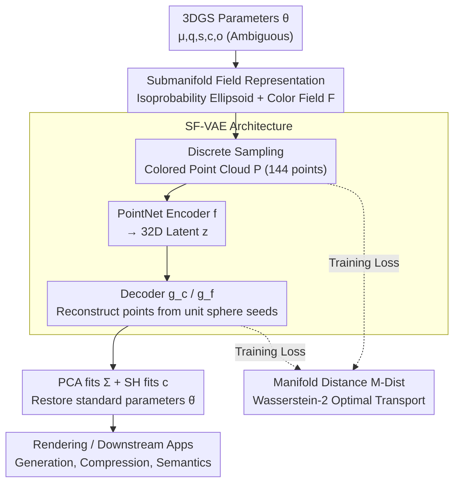

# Learning Unified Representation of 3D Gaussian Splatting

**Conference**: ICLR 2026  
**arXiv**: [2509.22917](https://arxiv.org/abs/2509.22917)  
**Code**: [GitHub](https://github.com/cilix-ai/gs-embedding)  
**Area**: 3D Vision/Representation Learning  
**Keywords**: 3D Gaussian Splatting, Submanifold Field Representation, Representation Uniqueness, VAE, Optimal Transport  

## TL;DR

Native 3DGS parameters $\boldsymbol{\theta}=\{\mu,\mathbf{q},\mathbf{s},\mathbf{c},o\}$ suffer from non-uniqueness and numerical heterogeneity, making them unsuitable as a learning space for neural networks. This paper proposes the **Submanifold Field** representation: mapping each Gaussian primitive to a continuous color field on its isoprobability ellipsoid. This mapping is proven to be injective, eliminating parameter ambiguity at the source. Combined with a manifold distance (M-Dist) based on optimal transport to train a VAE embedding, this method significantly outperforms parameter-based baselines in reconstruction fidelity, cross-domain generalization, and latent space stability.

## Background & Motivation

3DGS has become a core method for 3D reconstruction and rendering. An increasing number of downstream tasks—compression (Shin et al.), generation (Yi et al.), and semantic understanding (Guo et al.)—directly use Gaussian parameters $\boldsymbol{\theta}$ as network inputs/outputs. However, this approach inherently faces three fundamental problems:

1.  **Non-uniqueness**: Quaternion sign ambiguity ($\mathbf{q}$ and $-\mathbf{q}$ represent the same rotation), geometric symmetry, and rotation-SH interactions create equivalent parameter combinations—forming a many-to-one mapping that generates conflicting gradient signals during training. In experiments, simply flipping the quaternion sign ($\mathbf{q}\to-\mathbf{q}$) causes parameter-based autoencoders to fail reconstruction entirely.
2.  **Numerical Heterogeneity**: Positions $\mu\in\mathbb{R}^3$ can span a large range, quaternions are unit-normalized, pre-activation scaling ranges from $-15$ to $3$, and SH coefficients decay exponentially. Squeezing these into a single vector violates the assumption of homogeneous feature distributions required by standard modules like BatchNorm.
3.  **Manifold Mismatch**: Positions reside in $\mathbb{R}^3$, rotations in $\text{SO}(3)$, and scaling in $(\mathbb{R}^+)^3$—forcing these diverse manifold variables into Euclidean space destroys their intrinsic geometric structures.

In downstream generative tasks, these issues manifest as geometric "jitter" during latent space interpolation, high sensitivity to noise, and poor cross-domain (indoor $\leftrightarrow$ outdoor) generalization. **Key Insight**: Instead of learning the parameters themselves, a geometric-photometric representation with a proven unique mapping should be learned.

## Method

### Overall Architecture

This work addresses the **Key Challenge** that 3DGS parameters are unsuitable as a learning space: rather than learning ambiguous parameters $\boldsymbol{\theta}$, it is better to convert each Gaussian primitive into a geometric-photometric representation with proven uniqueness. The pipeline follows three steps: first, $\boldsymbol{\theta}$ is mapped to a **Submanifold Field** (an isoprobability ellipsoid surface + its associated color field), which is discretely sampled into a colored point cloud; second, the **SF-VAE** uses a PointNet encoder to compress the point cloud into a 32-dimensional latent variable, while a decoder reconstructs the point cloud from unit sphere seed points; finally, PCA and SH fitting are used to restore the reconstructed points into standard Gaussian parameters $\hat{\boldsymbol{\theta}}$ for rendering. During training, error is not calculated in the parameter space but rather by comparing the input and reconstructed point clouds using a **Manifold Distance (M-Dist)** based on optimal transport. The entire learning and measurement process occurs within this unambiguous representation space.

### Key Designs

**1. Submanifold Field Representation: Replacing Ambiguous Parameters with Ellipsoids and Color Fields**

The non-uniqueness of parameter representation stems from many-to-one mappings like quaternion signs and geometric symmetry. Thus, the method avoids learning $\boldsymbol{\theta}$ directly and instead takes the isoprobability surface where the Mahalanobis distance is a constant $r$ as a 2D submanifold $\mathcal{M} = \{\mathbf{x}\in\mathbb{R}^3 \mid (\mathbf{x}-\boldsymbol{\mu})^\top \Sigma^{-1}(\mathbf{x}-\boldsymbol{\mu}) = r^2 \}$. A color field $F(\mathbf{x})=\sigma(o)\cdot\text{Color}(\mathbf{d}_\mathbf{x})$ is defined on this ellipsoid, where the direction is $\mathbf{d}_\mathbf{x}=(\mathbf{x}-\mu)/\|\mathbf{x}-\mu\|$. The shape of the ellipsoid naturally encodes rotation and scale, while the color field encodes appearance and opacity, unifying variables from different manifolds into a single geometric object. Its effectiveness is guaranteed by **Proposition 2**: different Gaussians correspond to different Submanifold Fields $\mathcal{E}$, meaning the mapping is injective—ambiguities like quaternion flipping are eliminated as they do not change the isoprobability surface.

**2. SF-VAE Architecture: Encoding Submanifold Fields into Point Cloud VAE with Full Reversibility**

Since the Submanifold Field is continuous, it must be discretized before being fed into the network. The method samples $P=12^2=144$ points uniformly on the ellipsoid surface to form a colored point cloud $\mathcal{P}$. A PointNet encoder $f$ compresses this into a 32D latent variable $\mathbf{z}\sim f(\mathbf{z}\mid\mathcal{P})$. On the decoding side, $P'$ seed points $\mathcal{U}_{P'}$ are sampled from a unit sphere and fed into a coordinate transformation network $g_c$ and a color field network $g_f$ to reconstruct the point cloud $\hat{\mathcal{P}}$. To return to the rendering pipeline, PCA is used to fit the covariance matrix $\Sigma$ from the reconstructed points, and SH basis functions are used to fit the color coefficients $\mathbf{c}$, ensuring the entire chain is reversible. Notably, the training data consists of 500,000 randomly generated Gaussian primitives—since individual primitives lack semantics outside of a scene, the embedding model is inherently domain-agnostic and requires no real-world scene data.

**3. Manifold Distance (M-Dist): A Perceptually-Aligned Metric via Optimal Transport**

With a reversible codec chain, an error signal is needed to drive it. Direct $L_1/L_2$ metrics in the parameter space are unreliable as they decouple from rendered perceptual quality. Consequently, the method defines a Wasserstein-2 distance between Submanifold Fields based on optimal transport: $W_2^2(\mathcal{E}, \hat{\mathcal{E}}) = \inf_{\gamma\in\Gamma} \int_{\mathcal{M}\times\hat{\mathcal{M}}} \left(\|\mathbf{x}-\mathbf{y}\|^2 + \lambda\|c_x - c_y\|^2\right) d\gamma$, where $\lambda$ balances spatial and color terms. In practice, this is calculated discretely between the input and reconstructed point clouds. The SF-VAE training objective combines this as a reconstruction term with KL regularization:

$$\mathcal{L}_\text{VAE} = \hat{W}_2^2(\mathcal{P}, \hat{\mathcal{P}}) + \beta \cdot D_\text{KL}\!\left(f(\mathbf{z}\mid\mathcal{P}) \,\|\, \mathcal{N}(0,\mathbf{I})\right)$$

Experiments show that M-Dist correlates much more strongly with PSNR/LPIPS than parameter-space $L_1$ distance, leading to its use as both a reconstruction loss and an evaluation metric.

## Key Experimental Results

### Zero-Shot Reconstruction Quality (Trained on Random Data)

| Setting | Input Representation | Encoder/Decoder | PSNR↑ | SSIM↑ | LPIPS↓ | M-Dist↓ |
| :--- | :--- | :--- | :--- | :--- | :--- | :--- |
| ShapeSplat | Parameters $\boldsymbol{\theta}$ | MLP/MLP | 37.51 | 0.888 | 0.152 | 0.184 |
| ShapeSplat | Parameters $\boldsymbol{\theta}$ | MLP/SF-Dec | 44.73 | 0.896 | 0.136 | 0.051 |
| **ShapeSplat** | **Submanifold Field** | **SF-VAE (Ours)** | **63.41** | **0.990** | **0.010** | **0.041** |
| Mip-NeRF 360 | Parameters $\boldsymbol{\theta}$ | MLP/MLP | 18.82 | 0.564 | 0.452 | 0.510 |
| Mip-NeRF 360 | Parameters $\boldsymbol{\theta}$ | MLP/SF-Dec | 20.92 | 0.730 | 0.359 | 0.055 |
| **Mip-NeRF 360** | **Submanifold Field** | **SF-VAE (Ours)** | **29.83** | **0.953** | **0.079** | **0.048** |

The Submanifold Field representation outperforms the best parameter-based baseline by **+18.7 dB** on object-level data (ShapeSplat) and **+8.9 dB** on scene-level data (Mip-NeRF 360). Given that parameter counts are matched (0.62M/0.66M/0.62M), the difference stems entirely from the choice of representation.

### Cross-Domain Generalization (Train on A $\to$ Test on B)

| Training Set | Test Set | Input Representation | PSNR↑ | SSIM↑ | LPIPS↓ |
| :--- | :--- | :--- | :--- | :--- | :--- |
| ShapeSplat | Mip-NeRF 360 | Parameters (MLP/MLP) | 9.75 | 0.356 | 0.615 |
| ShapeSplat | Mip-NeRF 360 | **Submanifold Field** | **19.19** | **0.821** | **0.309** |
| Mip-NeRF 360 | ShapeSplat | Parameters (MLP/MLP) | 55.62 | 0.957 | 0.067 |
| Mip-NeRF 360 | ShapeSplat | **Submanifold Field** | **62.58** | **0.990** | **0.014** |

The advantage of Submanifold Fields is even more pronounced in cross-domain scenarios (a jump of nearly **+10 dB** from object to scene). Interestingly, models trained on random data outperform those migrated from real domains, proving the inherent domain-agnostic nature of the Submanifold Field representation.

### Gaussian Neural Field (GNF) Downstream Validation

| Regression Target | PSNR↑ | SSIM↑ | LPIPS↓ | Parameters |
| :--- | :--- | :--- | :--- | :--- |
| Native Parameters $\boldsymbol{\theta}$ (ShapeSplat) | 51.66 | 0.925 | 0.141 | 0.21M |
| **SF Embedding** (ShapeSplat) | **58.62** | **0.980** | **0.043** | 0.20M |
| Native Parameters $\boldsymbol{\theta}$ (Mip-NeRF 360) | 19.92 | 0.648 | 0.410 | 1.87M |
| **SF Embedding** (Mip-NeRF 360) | **24.40** | **0.804** | **0.261** | 1.85M |

Regressing SF embeddings from spatial coordinates using a lightweight MLP is significantly easier than regressing native parameters, verifying that this representation is more neural-network-friendly.

### Sensitivity & Ablation

- **Robustness to Quaternion Flipping**: For $\mathbf{q}\to-\mathbf{q}$, parameter-based VAE decoding fails completely; SF-VAE is unaffected (as the Submanifold Field is naturally invariant to quaternion signs).
- **Noise Robustness**: Injecting noise into the embedding space results in a much slower M-Dist degradation for SF embeddings compared to parameter embeddings.
- **Interpolation Smoothness**: Linear interpolation in the parameter latent space causes rotation/scale jitter, whereas SF latent space interpolation shows smooth transitions.
- **Embedding Dimensions**: 32 dimensions provide the optimal balance (quality drops significantly below 32, while gains diminish above 32).
- **Training Data Volume**: Only 2% of the data (10k samples) is needed to reach near-baseline performance.
- **Discretization Resolution**: $P=144$ is the optimal number of sampling points; higher values show negligible improvement.

## Highlights & Insights

- **The diagnosis of the problem is as valuable as the solution**: The paper clearly formalizes three fundamental flaws of parameter representation (non-uniqueness, heterogeneity, manifold mismatch), serving as a warning for all methods using 3DGS parameters as network targets. The experiment where $q$ flipping causes total collapse is highly compelling.
- **Mathematical Elegance of Submanifold Fields**: The isoprobability surface is the intrinsic geometry of a 3D Gaussian—the ellipsoid encodes rotation/scale, and the color field encodes appearance/opacity. Proposition 2 ensures uniqueness without requiring special parameterization tricks.
- **Clever Domain-Agnostic Design**: Individual Gaussian primitives lack semantic meaning when isolated from a scene, allowing the embedding model to be trained on random data. Remarkably, random-data-trained models perform better on real domains than domain-specific models perform across domains.
- **Practicality of M-Dist**: It provides a metric closer to perceptual indices than parameter $L_1/L_2$, offering direct guidance for selecting training losses in future 3DGS learning systems.

## Limitations & Future Work

- Currently operates at the **per-primitive level**, lacking modeling of inter-primitive relationships; extending to the scene level would require permutation-invariant attention mechanisms.
- Discretization of Submanifold Fields involves a trade-off between sampling resolution and efficiency ($P=144$ is empirically optimal).
- M-Dist is based on optimal transport, which has higher computational overhead than $L_2$.
- The work focuses on reconstruction, embedding quality, and unsupervised clustering; full generative pipelines (diffusion/flow matching) have yet to be integrated.
- Temporal extensions for dynamic scenes (4D GS) remain unexplored.

## Related Work & Insights

- **vs Direct Parameter Regression (pixelSplat, MVSplat)**: These methods have networks directly output $\boldsymbol{\theta}$; this work points out fundamental flaws in that representation.
- **vs 3DGS Generation (DiffGS, GaussianDiffusion)**: By moving diffusion from the parameter space to the Submanifold Field space, one could achieve a smoother latent space.
- **vs 3DGS Compression (HAC, CompGS)**: Compression methods reduce the number of parameters, while Submanifold Fields improve parameter quality—the two are orthogonal and can be combined.

## Rating

- Novelty: ⭐⭐⭐⭐⭐ First systematic diagnosis of 3DGS parameter representation flaws with a theoretically guaranteed unique alternative.
- Experimental Thoroughness: ⭐⭐⭐⭐ Strict control of variables; multi-angle validation via quaternion flipping, cross-domain tests, and GNF is highly persuasive.
- Writing Quality: ⭐⭐⭐⭐⭐ Complete logic chain from definitions to propositions, proofs, and experiments; problem motivation is exceptionally clear.
- Value: ⭐⭐⭐⭐⭐ Fundamental significance for all future learning systems based on 3DGS parameters.

<!-- RELATED:START -->

## Related Papers

- [\[ICLR 2026\] Light of Normals: Unified Feature Representation for Universal Photometric Stereo](light_of_normals_unified_feature_representation_for_universal_photometric_stereo.md)
- [\[ICLR 2026\] Open-Set Semantic Gaussian Splatting SLAM with Expandable Representation](open-set_semantic_gaussian_splatting_slam_with_expandable_representation.md)
- [\[ICLR 2026\] Weight Space Representation Learning on Diverse NeRF Architectures](weight_space_representation_learning_on_diverse_nerf_architectures.md)
- [\[CVPR 2026\] UniLight: A Unified Representation for Lighting](../../CVPR2026/3d_vision/unilight_a_unified_representation_for_lighting.md)
- [\[ICLR 2026\] MEGS2: Memory-Efficient Gaussian Splatting via Spherical Gaussians and Unified Pruning](megs2_memory-efficient_gaussian_splatting_via_spherical_gaussians_and_unified_pr.md)

<!-- RELATED:END -->
