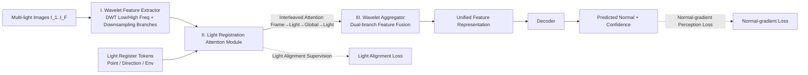

# Light of Normals: Unified Feature Representation for Universal Photometric Stereo

**Conference**: ICLR 2026  
**OpenReview**: [https://openreview.net/forum?id=LRA5z3oXOI](https://openreview.net/forum?id=LRA5z3oXOI)  
**Code**: To be confirmed  
**Area**: 3D Vision / Photometric Stereo  
**Keywords**: Universal Photometric Stereo, Normal Estimation, Illumination Decoupling, Register Token, Wavelet Transform, ViT  

## TL;DR
LINO UniPS utilizes "Light Register Tokens with light alignment supervision + interleaved attention" to explicitly decouple illumination from normal features within the encoder. It further employs a "wavelet dual-branch + normal-gradient perception loss" to preserve high-frequency geometric details, achieving new SOTA normal accuracy on benchmarks like DiLiGenT and Luces.

## Background & Motivation
**Background**: Photometric Stereo (PS) aims to recover surface normals from multiple images taken from the same viewpoint under varying, unknown lighting conditions. From traditional methods relying on calibrated light sources to "Universal PS" like UniPS and SDM UniPS, the mainstream paradigm has shifted to "encoder extracts multi-light features → fused into global lighting context → decoder outputs normals as a calibration network," moving away from explicit physical lighting models.

**Limitations of Prior Work**: The authors identify two persistent issues. First, **light and normals are not effectively decoupled**. Existing encoders process lighting and normals together without explicit light representation, forcing the decoder to inherit unstable features, which leads to inconsistent normal predictions across different input images. The authors observe a key phenomenon: higher consistency in normal features produced by the encoder (higher CSIM/SSIM) leads to higher final normal accuracy (lower MAE). Second, **high-frequency geometric details are easily lost**. Feature extraction in UniPS on downsampled maps is naturally blurry, while the split-and-merge approach in SDM UniPS destroys high-frequency semantics, causing significant degradation in normal quality for complex textures and subtle surface undulations.

**Key Challenge**: Stronger encoders tend to pass the most difficult task of "decoupling light" to weaker decoders, creating a paradox of "strong encoder + weak decoder carrying the heavy load." Simultaneously, conventional up/down-sampling inevitably loses high-frequency details while pursuing semantic aggregation, making it difficult to satisfy both requirements.

**Goal**: To enable the encoder to produce consistent, decoupled normal features, demoting the decoder to a "simple refiner," while safeguarding high-frequency details throughout the entire pipeline.

**Core Idea**:
- **Explicit Illumination Container**: Introduce Light Register Tokens specialized by light source type (point/directional/environmental) and force them to absorb corresponding lighting information via **light alignment supervision**, thereby "extracting" light from normal features.
- **Cross-image Global Attention**: Utilize interleaved attention blocks to attend to tokens across all lighting conditions simultaneously, aggregating light at the patch, frame, and cross-image levels to further decouple illumination.
- **Frequency Domain Detail Preservation**: A wavelet dual-branch structure combined with a normal-gradient perception loss specifically targets high-frequency geometry.

## Method

### Overall Architecture
LINO UniPS is a ViT encoder-decoder framework. The encoder consists of three sequential stages: **(I) Wavelet Feature Extractor** performs simultaneous wavelet decomposition (low-frequency LL + high-frequency LH/HL/HH) and standard downsampling on multi-light images, converting them into independent token sequences; **(II) Light Registration Attention Module** prepends three types of Light Register Tokens to the sequences, aggregating global light and decoupling via multi-layer interleaved attention blocks; **(III) Wavelet Aggregator** fuses features from the downsampling and wavelet branches into a unified representation for the decoder. Training is guided by two supervision signals: Light Alignment Loss ensures register tokens learn corresponding light source characteristics, and Normal-gradient Perception Loss strengthens high-frequency detail reconstruction.

### Key Designs

**1. Light Register Tokens + Light Alignment Supervision.** Inspired by the DINO register mechanism, the authors introduce learnable Light Register Tokens to absorb global lighting information. Crucially, unlike the unsupervised approach in DINO, these are categorized into point, directional, and environmental light tokens with **explicit light alignment supervision**. Borrowing feature alignment ideas used to accelerate generative model training (e.g., VAVAE, REPA), the three types of tokens are constrained to align with ground-truth light information from the training set using a cosine similarity loss: $L_{light}=\lambda_1 L_{env}+\lambda_2 L_{point}+\lambda_3 L_{direction}$. After supervision, the attention maps show clear specialization: Point tokens focus sharply on high-intensity specular regions, while Direction/Env tokens attend to large-scale, spatially diffuse areas, proving that light is physically decomposed and decoupled from normal features.

**2. Interleaved Attention Block.** Previous models like UniPS/SDM UniPS relied on Frame Attention and Light Axis Attention, which allows for local information flow but is insufficient for decoupling light and normals. Inspired by VGGT, the authors add a stronger **Global Attention** that attends to all tokens across all input images simultaneously. Four layers of attention are stacked in an interleaved pattern: `Frame → Light → Global → Light`. These aggregate information at the patch level (Light-axis), within a single image (Frame), and across images (Global), establishing a comprehensive understanding of global lighting to better separate it from intrinsic normals.

**3. Wavelet Dual-Branch Architecture.** To mitigate information loss from downsampling, the encoder uses Discrete Wavelet Transform (DWT) to decompose multi-light images into high/low-frequency components for separate modeling. A standard downsampling branch is maintained to preserve global image domain semantics. During upsampling, Inverse Wavelet Transform (IDWT) reconstructs features from the frequency domain, ensuring that details are not smoothed out throughout the network. This frequency-domain bypass acts as a "high-frequency vault" that surpasses the split-and-merge approach of SDM UniPS.

**4. Normal-gradient Perception Loss.** Instead of treating all pixels equally, predicted normal gradients $\tilde{G}$ are used to generate a confidence map $C=e^{\tilde{G}}$, amplifying error signals in high-frequency regions: $L_n=\lambda_4\sum (N-\tilde{N})^2\odot C+\lambda_5\sum(\tilde{G}-G)^2$. The first term is a confidence-weighted normal reconstruction error, and the second term supervises the predicted gradient directly with the ground truth gradient $G=\nabla N$, making the network highly sensitive to subtle surface undulations. This is complemented by curriculum learning (Level 1→4 increasing in difficulty, with Level 5 fine-tuned on normal maps), further enhancing detail reconstruction. The total loss is $L=L_{light}+L_n$.

Additionally, the authors constructed the **PS-Verse** large-scale synthetic dataset: 17,805 models with UV/PBR selected from Objaverse, grouped into scenes across four levels of geometric complexity. Materials follow a ratio of original/diffuse/specular/metallic (1:4:2.5:2.5). The dataset also introduces normal mapping as a fifth complexity level to inject high-frequency lighting details, totaling 100,000 scenes with 20 images at 512 resolution per scene. Its complexity metric (mean normal gradient 26.7) far exceeds PS-Mix (11.5) and PS-Uni MS-PS (8.6).

## Key Experimental Results

### Main Results
Comparison of normal error on DiLiGenT (96 images, MAE↓ in degrees) and Luces (52 images):

| Method | DiLiGenT Avg.MAE↓ | Luces Avg.MAE↓ |
|------|------|------|
| UniPS | 14.70 | 23.77 |
| SDM UniPS | 5.80 | 13.50 |
| Uni MS-PS | 5.01 | 11.21 |
| **Ours** | **4.65** | **9.43** |
| Ours (K=16) | 4.88 | — |

Parameter count and inference time comparison (K=16):

| Method | Params(M) | 4000×4000 Inference(s) | DiLiGenT MAE↓ | Luces MAE↓ |
|------|------|------|------|------|
| Ours | 84.2 | 85.1 | 4.65 | 9.43 |
| Ours-S2 | 60.4 | 81.0 | 4.95 | 10.89 |
| SDM UniPS | 59.9 | 92.7 | 5.83 | 13.52 |
| Uni MS-PS | 75.5 | 3012.2 | 5.01 | 11.21 |

At a similar parameter scale, Ours-S2 (60.4M) outperforms SDM UniPS (59.9M) across the board. High-resolution inference is approximately 35x faster than Uni MS-PS.

### Ablation Study
Module-wise ablation on PS-Verse Testdata (20 input images):

| Configuration | CSIM↑ | SSIM↑ | Avg.MAE↓ |
|------|------|------|------|
| Baseline | 0.71 | 0.69 | 8.73 |
| + Light Register Tokens | 0.74 | 0.73 | 8.13 |
| + Global Attention | 0.80 | 0.78 | 6.44 |
| + Light Alignment | 0.86 | 0.82 | 5.58 |
| + Wavelet Branch | 0.85 | 0.82 | 5.15 |
| + Grad Perception Loss | 0.86 | 0.83 | 4.84 |
| + Curriculum Learning | **0.88** | **0.86** | **4.51** |

Dataset ablation: Uni MS-PS trained on PS-Verse (MAE 7.82) significantly outperforms training on PS-Mix (10.02) and PS-Uni MS-PS (9.02), proving PS-Verse is superior for training high-performance models.

### Key Findings
- **Correlation between Feature Consistency and Reconstruction Accuracy**: Global attention and light alignment together increased CSIM from 0.74 to 0.86 and decreased MAE from 8.13 to 5.58. These were the most impactful steps, validating the core argument that "better decoupling leads to more accurate normals."
- **Encoder as the Primary Contributor**: Replacing the decoder with a simple MLP (w/mlp variant) actually increased feature consistency; although reconstruction slightly decreased, it still surpassed SDM UniPS, indicating performance stems mainly from the encoder's decoupling ability.
- **Wavelet Branch + Gradient Loss for Details**: These modules have little impact on CSIM/SSIM but significantly improve results on complex geometric data, aligning with the design objectives.
- **Single Point of Failure**: SOTA was achieved in all scenes except for 'Ball', which has the simplest geometry. On 'Ball', the MLP decoder variant performed best, suggesting simple geometry is better suited for simpler decoders.

## Highlights & Insights
- **Shifting "Decoupling" from Decoder to Encoder**: Using a verifiable observation (feature consistency ↔ accuracy) as leverage, the design is goal-oriented and cleanly mapped to the ablation results.
- **Supervised Upgrade of Register Tokens**: Unlike the unsupervised by-products in DINO, these tokens are physically categorized by light type with explicit alignment supervision. The attention maps are highly interpretable, showing a physical division of labor.
- **Frequency Domain Bypass as a Clever Solution**: Using DWT/IDWT to create a dedicated channel for high-frequency information avoids the blurring of downsampling, balancing semantic aggregation and detail preservation more naturally than split-and-merge.
- **Dataset as a Contribution**: PS-Verse leads existing datasets in geometric complexity, material diversity, and the introduction of normal mapping for high-frequency details, forming a closed loop with curriculum learning.

## Limitations & Future Work
- **Computational Threshold**: 84.2M parameters and ~3 days of training on 2×H100, combined with the cost of rendering 100k scenes in PS-Verse, requires significant resources for replication.
- **Fixed Light Source Types**: The categorization into point/directional/environmental tokens is manually defined. Generalization to mixed or special lighting (e.g., area lights, strong indirect light) remains undiscussed.
- **Synthetic Data Dependence**: Core gains are derived from PS-Verse training; the sim-to-real gap for real-world materials (strong transparency, sub-surface scattering) requires more systematic evaluation.
- **Anomaly on Simple Geometry**: The fact that complex decoders underperform compared to MLPs on simple shapes like balls suggests that decoder capacity should adapt to geometric complexity.

## Related Work & Insights
- **Universal PS Lineage**: From UniPS (first proposed by Ikehata 2022) to SDM UniPS (split-and-merge) and Uni MS-PS (multi-scale), this work advances the line of "consistent encoder features" by addressing the failures of predecessors (incomplete decoupling, high-frequency loss).
- **Register Token / Feature Alignment**: Migrating DINO's registers and the feature alignment supervision from VAVAE/REPA to illumination decoupling is a successful cross-domain application of "assigning explicit semantics to intermediate tokens."
- **Cross-image Global Attention**: Leveraging global attention from VGGT for multi-image aggregation suggests that for multi-view/multi-light tasks, "seeing everything at once" is superior for stripping away nuisance factors compared to per-frame or per-axis attention.
- **Frequency Domain Preservation**: The wavelet dual-branch provides a bypass paradigm for any dense prediction task (depth, normal, super-resolution) that requires both semantic downsampling and detail preservation.

## Rating
- Novelty: ⭐⭐⭐⭐ Moving light decoupling to the encoder using Supervised Light Register Tokens, Cross-image Attention, and Wavelet Bypass is a clear and clever configuration.
- Experimental Thoroughness: ⭐⭐⭐⭐ Comprehensive benchmarks (DiLiGenT/Luces/PS-Verse), module-wise ablation, parameter controls, and MLP decoder probes support the core claims well.
- Writing Quality: ⭐⭐⭐⭐ The central verifiable observation guides the narrative; design and ablation are perfectly aligned; charts are strong and the text is fluent.
- Value: ⭐⭐⭐⭐ Set a new SOTA for Universal PS with high efficiency (~35x faster than Uni MS-PS) and provided a valuable large-scale dataset (PS-Verse).

<!-- RELATED:START -->

## Related Papers

- [\[AAAI 2026\] Geometry Meets Light: Leveraging Geometric Priors for Universal Photometric Stereo under Limited Multi-Illumination Cues](../../AAAI2026/3d_vision/geometry_meets_light_leveraging_geometric_priors_for_universal_photometric_stere.md)
- [\[ICLR 2026\] Learning Unified Representation of 3D Gaussian Splatting](learning_unified_representation_of_3d_gaussian_splatting.md)
- [\[ICLR 2026\] LiTo: Surface Light Field Tokenization](lito_surface_light_field_tokenization.md)
- [\[ICLR 2026\] Universal Beta Splatting](universal_beta_splatting.md)
- [\[CVPR 2026\] UniLight: A Unified Representation for Lighting](../../CVPR2026/3d_vision/unilight_a_unified_representation_for_lighting.md)

<!-- RELATED:END -->
