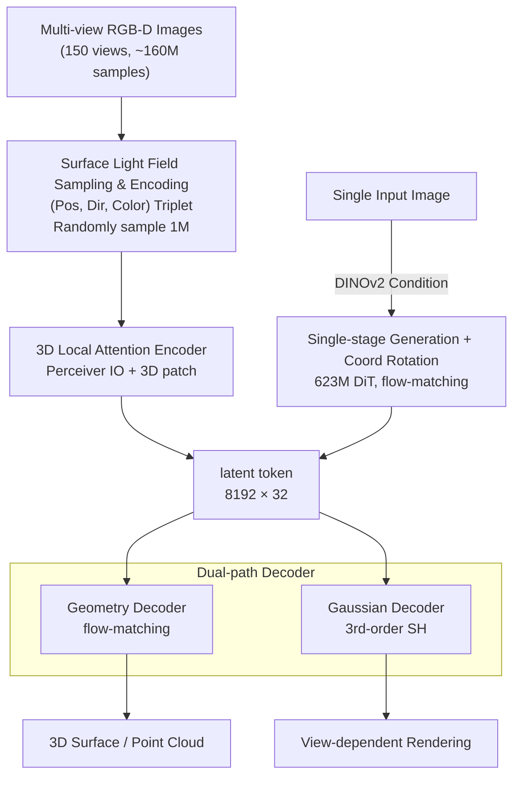

# LiTo: Surface Light Field Tokenization

**Conference**: ICLR 2026  
**arXiv**: [2603.11047](https://arxiv.org/abs/2603.11047)  
**Code**: None (Apple internal)  
**Area**: 3D Vision/Generation  
**Keywords**: Surface Light Field, 3D latent representation, view-dependent appearance, Gaussian Splatting, flow matching

## TL;DR
LiTo is proposed to simultaneously model 3D geometry and view-dependent appearance by encoding the surface light field into a compact set of latent vectors. By using random sub-sampling of light fields from multi-view RGB-D images as input, a Perceiver IO encoder (supporting local 3D attention for 1 million tokens) coupled with a flow-matching geometry decoder and a high-order Spherical Harmonic Gaussian decoder is employed. This achieves reconstruction and single-image-to-3D generation results that surpass TRELLIS, marking the first time view-dependent effects like specular highlights and Fresnel reflections are modeled in a latent 3D representation.

## Background & Motivation

**Background**: 3D latent representations are generally divided into two categories: geometry-only representations (3DShape2VecSet/TripoSG/ShapeTokens) which only model shape without appearance, and geometry+appearance representations (TRELLIS/3DTopia-XL) which include appearance but only support view-independent diffuse color.

**Limitations of Prior Work**: (1) Geometry-only methods cannot render realistic 3D content due to the lack of color, material, and lighting effects; (2) While TRELLIS includes appearance, it uses mean pooling of DINOv2 features, discarding viewing direction information, thus failing to model view-dependent effects such as highlights and Fresnel reflections; (3) Although 3DTopia-XL models PBR materials, it requires a preprocessing step of optimizing primitive representations from meshes.

**Key Challenge**: The appearance of real-world objects strongly depends on the viewing angle (e.g., metallic reflections, Fresnel effects), yet existing 3D latent representations discard directional information. To model view-dependent effects, it is necessary to encode the surface light field—not just surface positions and colors, but also the viewing directions.

**Key Insight**: Multi-view RGB-D images are discrete samples of a surface light field—each pixel provides a tuple of (surface point position, viewing direction, color). By using random sub-sampling of these light field samples as input, the encoder performs interpolation while the 3rd-order Spherical Harmonic Gaussian decoder generates the output.

**Core Idea**: Encode random sub-samplings of the surface light field into compact latent tokens, using a dual-path decoder (flow-matching for geometry + Spherical Harmonic Gaussians for appearance) to achieve a unified 3D representation of geometry and view-dependent appearance.

## Method

### Overall Architecture
LiTo aims to compress the **surface light field** of an object (the color at a specific surface point from a specific direction) into a set of compact latent tokens that carry both geometry and view-dependent appearance. The pipeline operates as follows: first, 150 multi-view RGB-D images of an object are rendered to extract approximately 160 million surface light field samples. 1 million samples are randomly selected and fed into the encoder to be transformed into $k=8192$ latent tokens of dimension $d=32$. Once these tokens are obtained, two decoders reconstruct the output: a flow-matching geometry decoder restores the 3D surface, and a Spherical Harmonic Gaussian decoder restores view-dependent rendering. In addition to encoding from multi-view images, these tokens can be directly generated from a single image via a DiT model to achieve single-image-to-3D.

### Key Designs

**1. Surface Light Field Sampling & Encoding: Packaging "Position+Direction+Color" into learnable latents**

To model view-dependent effects, direction information must be included in the input, which is precisely what TRELLIS discards via mean pooling. LiTo decomposes each RGB-D image into a set of sampling triplets $\{(\mathbf{x}_i, \hat{\mathbf{d}}_i, \mathbf{c}_i)\}$: the surface point $\mathbf{x}$ is obtained via depth back-projection, the viewing direction $\hat{\mathbf{d}}$ is calculated from the pinhole camera model, and the color $\mathbf{c}$ is the pixel value. Since the full light field contains 160 million samples and is highly redundant, the encoder only processes a random subset of $N=2^{20}$ (approx. 1 million) samples using Perceiver IO to output 8192 latent tokens of dimension 32. Random sub-sampling is not just for efficiency—it forces the encoder to learn **interpolation**, generalizing from a sparse subset back to the full light field, while the preserved $\hat{\mathbf{d}}$ in each sample serves as the source for rendering highlights and Fresnel reflections.

**2. 3D Local Attention: Enabling Perceiver IO to handle millions of tokens**

Standard Perceiver IO cross-attention is computationally infeasible for 1 million tokens. LiTo addresses this with a 3D patchification scheme. All input samples are assigned to spatial patches corresponding to the 8192 queries using K-NN, and each query only attends to samples within its own patch—essentially generalizing ViT's 16×16 image patches to 3D surfaces. Self-attention between queries uses voxel-based windowed attention, shifting by half a voxel per layer to bridge window boundaries. L2 distance is used to approximate "surface locality"; while it occasionally crosses surfaces, the resulting speed gains make million-scale inputs feasible, representing a practical trade-off between accuracy and efficiency.

**3. Dual-path Decoder: Separating geometry and view-dependent appearance**

The same set of latents is used to reconstruct two outputs via separate decoders. The **Geometry Decoder** uses flow-matching to directly model the 3D surface distribution $p(\mathbf{x}|\mathcal{S}) \approx \delta(\mathbf{x} \in \partial\Omega)$, with the training objective:

$$\mathcal{L}_{geo} = \mathbb{E}_{t,\mathbf{x}} \|V(\mathbf{x}_t; t) - (\mathbf{x} - \epsilon)\|^2$$

Point clouds are obtained by sampling from this distribution during inference; crucially, it **does not require mesh / occupancy / SDF preprocessing** and learns directly from point clouds. The **Gaussian Decoder** handles appearance: it uses a sparse occupancy grid as queries to cross-attend to the latent tokens, then outputs 64 3D Gaussians with 3rd-order Spherical Harmonics (SH degree 3) for each occupied voxel. The rendering loss is defined as $\mathcal{L}_{radiance} = \|I_{est} - I_{gt}\|^2 + 0.2 \cdot \text{LPIPS}$. Compared to the view-independent color in TRELLIS, 3rd-order SH captures high-frequency view-dependent variations, directly leading to a significant PSNR increase in close-up observations.

**4. Single-stage Generation + Coordinate Rotation: Simpler than TRELLIS's two stages with automatic alignment**

Since the latents already package the complete object information, generation does not need to follow TRELLIS's two-stage process (coarse occupancy followed by SLAT). LiTo directly trains a 623M parameter DiT flow-matching model using DINOv2 encoded input images as conditions to generate latents in one step. A clever detail is the rotation of the world coordinate system during training so that the input camera view is the identity. Consequently, the generated object is **automatically aligned with the input view**—unlike TRELLIS, which generates in a canonical coordinate system and requires post-processing for alignment.

### Loss & Training
- Encoder + Decoder: 256 batch, 64 GPUs, 90K iterations, 9 days
- Generation Model (DiT): 256 batch, 128 H100 GPUs, 600K iterations, 20 days
- Data: A subset of 500K objects from Objaverse-XL (same source as TRELLIS), with 3 lighting conditions x 150 views per object.

## Key Experimental Results

### Main Results: Reconstruction Quality (Toys4k)

| Method | PSNR↑ (simple) | SSIM↑ | LPIPS↓ | PSNR↑ (hard) | SSIM↑ | LPIPS↓ |
|------|---------------|-------|--------|-------------|-------|--------|
| TRELLIS | 31.12 | 0.974 | 0.034 | 27.57 | 0.941 | 0.090 |
| **LiTo** | **34.16** | **0.985** | **0.023** | **32.36** | **0.967** | **0.055** |

### Ablation Study: Generation Quality (Toys4k)

| Method | CLIP↑ | Conditioning View FID↓ | KID↓ | Novel View FID↓ |
|------|-------|----------------------|------|----------------|
| TRELLIS | 0.899 | 12.84 | 0.088 | 7.600 |
| **LiTo** | **0.905** | **6.219** | **0.009** | **6.216** |

### Key Findings
- **3dB PSNR improvement in reconstruction**: In the "hard" setting (close-up cameras), PSNR rose from 27.57 to 32.36, indicating that view-dependent modeling is especially critical for near-field observations.
- **Improved geometry quality**: Modeling appearance does not compromise geometry accuracy—LiTo achieves the best geometry (lowest Chamfer distance) among methods not using GT coarse geometry.
- **Significant boost in generation input fidelity**: Conditioning view FID dropped from 12.84 to 6.219, proving the effectiveness of the coordinate rotation strategy.
- **Different SH degrees capture distinct features**: Degree 0 represents diffuse reflection; degree 1 represents coarse directionality; degrees 2-3 capture highlights and Fresnel effects.
- **Compact Latent Space**: 8192x32 = 262K parameters, which is larger than TRELLIS (20Kx11=220K) and TripoSG (2048x64=131K) but eliminates the need for GT coarse geometry.

## Highlights & Insights
- **Surface light field as a unified framework for 3D representation**: Theoretically, the surface light field can reconstruct images from any camera pose—making it the most complete 3D appearance representation. Tokenizing it is a natural but previously under-explored direction.
- **Elegant "random sub-sampling + encoder interpolation" strategy**: There is no need for a complete surface light field (which is impossible to obtain); a random subset is sufficient for the encoder to learn to generalize.
- **3D patchification** cleverly solves the efficiency problem for million-scale token inputs, and the concept is consistent with ViT patches, making it easy to understand.
- **Single-stage generation + coordinate rotation** is simpler than TRELLIS's two-stage approach and naturally solves the output alignment problem.

## Limitations & Future Work
- Training data requires multi-view RGB-D rendering (150 views), which is costly to obtain.
- 3D patchification uses L2 distance to approximate surface locality, which may cause cross-surface attention when multiple surfaces are near each other.
- Transparent or semi-transparent objects are not modeled (due to the first-intersection depth assumption).
- High computational overhead: Encoder+Decoder training requires 64 GPUs for 9 days; DiT requires 128 H100s for 20 days.

## Related Work & Insights
- **vs TRELLIS**: TRELLIS uses DINOv2 mean pooling, discarding directional information to yield only diffuse color. LiTo encodes directional info for view-dependence. Furthermore, TRELLIS requires two-stage generation and canonical coordinates, while LiTo is single-stage and input-aligned.
- **vs TripoSG**: Geometry-only methods lack appearance. LiTo models view-dependent appearance and achieves better geometry quality even without GT coarse geometry.
- **vs 3DTopia-XL**: PrimX requires mesh-to-primitive optimization. LiTo builds inputs directly from RGB-D renderings, making it more scalable.

## Rating
- Novelty: ⭐⭐⭐⭐⭐ First to implement view-dependent appearance modeling in 3D latent representations; the surface light field tokenization concept is novel.
- Experimental Thoroughness: ⭐⭐⭐⭐ Detailed comparisons for both reconstruction and generation across multiple datasets.
- Writing Quality: ⭐⭐⭐⭐ Clear methodology and explicit comparisons with TRELLIS and other baselines.
- Value: ⭐⭐⭐⭐⭐ Significant advancement in 3D generative representation by addressing the critical blind spot of view-dependence.

<!-- RELATED:START -->

## Related Papers

- [\[CVPR 2025\] ProbeSDF: Light Field Probes for Neural Surface Reconstruction](../../CVPR2025/3d_vision/probesdf_light_field_probes_for_neural_surface_reconstruction.md)
- [\[ICLR 2026\] Positional Encoding Field](positional_encoding_field.md)
- [\[ICLR 2026\] Light of Normals: Unified Feature Representation for Universal Photometric Stereo](light_of_normals_unified_feature_representation_for_universal_photometric_stereo.md)
- [\[ICLR 2026\] Station2Radar: Query-Conditioned Gaussian Splatting for Precipitation Field](station2radar_query_conditioned_gaussian_splatting_for_precipitation_field.md)
- [\[ICLR 2026\] WAFT: Warping-Alone Field Transforms for Optical Flow](waft_warping-alone_field_transforms_for_optical_flow.md)

<!-- RELATED:END -->
