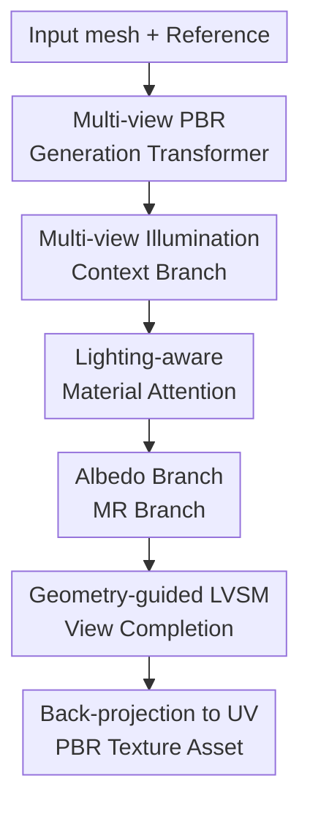

# LumiTex: Towards High-Fidelity PBR Texture Generation with Illumination Context

**Conference**: ICLR2026  
**OpenReview**: [https://openreview.net/forum?id=CDwG0Bebfo](https://openreview.net/forum?id=CDwG0Bebfo)  
**Paper**: [https://lumitex.vercel.app](https://lumitex.vercel.app)  
**Code**: Not disclosed  
**Area**: 3D Vision / PBR Texture Generation  
**Keywords**: PBR Materials, Illumination Context, Multi-view Diffusion, Material Decomposition, Texture Completion

## TL;DR
LumiTex focuses on PBR texture generation given a mesh and a reference image, integrating multi-view illumination context, branched albedo/metallic-roughness material inference, and geometry-guided view completion based on LVSM into a single pipeline. It outperforms open-source and commercial baselines in texture quality, relighting consistency, and human preference.

## Background & Motivation
**Background**: In the production of game, film, and AR/VR assets, PBR (physically-based rendering) is the de facto standard for describing the interaction between materials and light. A reusable 3D asset must not only resemble the reference image but also decompose into material maps such as albedo, metallic, and roughness, ensuring correct reflection, darkening, or metallic appearance under new environmental lighting. Current mainstream approaches typically use multi-view diffusion models to generate consistent views from a reference and mesh, then project these views back to UV space.

**Limitations of Prior Work**: PBR textures are more challenging than standard textures; the difficulty lies not in "looking good" but in distinguishing "which colors belong to the material and which highlights belong to the light." Two-stage methods first generate shaded images with baked lighting and then use optimization or specialized models for material decomposition; any poor quality in the intermediate shaded views is inherited by the subsequent albedo/MR inference. Another category, multi-channel methods, treats albedo, metallic, and roughness as multiple output channels generated end-to-end. However, this ignores the semantic differences: albedo represents intrinsic diffuse color, while MR depends more on specular highlights, environment, and surface physics. Forcing them into a shared output space easily bakes lighting artifacts into the maps.

**Key Challenge**: PBR generation requires lighting cues to determine material properties, but the final output must strip lighting away from the materials. Reference images often provide only single or limited illumination, and high-quality MR maps in training data are significantly scarcer than shaded/albedo images. If lighting is ignored entirely, material decomposition becomes unstable; if shaded images are used directly as intermediate results, error accumulation and baked lighting occur.

**Goal**: Ours aims to generate multi-view consistent PBR maps from an input mesh and a reference image and synthesize these maps into seamless, relightable UV materials. Specifically, the model must solve three tasks: extracting stable multi-view illumination context from limited references, allowing albedo and metallic-roughness to be inferred separately according to their physical semantics, and completing surface regions not visible in sparse views to avoid discontinuities and semantic drift caused by UV-space hole filling.

**Key Insight**: LumiTex observes that while shaded images are unsuitable as fragile intermediate products, they serve effectively as supervision signals for "illumination context." Instead of generating shaded images for a separate decomposition model, an illumination context branch can be trained to learn multi-view consistent shaded features, which are then injected into the material branches as cross-attention keys and values.

**Core Idea**: A frozen multi-view illumination context branch provides shared illumination priors, which the albedo and MR branches read through lighting-aware attention. Finally, a geometry-guided LVSM completes missing textures in view space rather than filling holes in fragmented UV space.

## Method

### Overall Architecture
LumiTex takes a reference image and a 3D mesh as input and outputs GLB/PBR assets with albedo, metallic, and roughness UV maps. The pipeline first trains a multi-view illumination context branch to generate and encode shaded images, then freezes it to feed shaded keys/values into albedo and MR material branches. After obtaining sparse multi-view PBR material maps, a geometry-guided LVSM synthesizes additional target views, and all views are back-projected into UV space.

The underlying generator consists of two Transformers. The Multi-Modal DiT fuses reference images, mesh geometry, and material tokens for each view. The Multi-View DiT then concatenates latents from all views into a single sequence, allowing cross-view token communication to ensure consistency. After material generation, instead of filling holes in the UV map, additional target views are selected based on unobserved UV areas and synthesized using LVSM in 2D view space before dense projection back to UV.

### Key Designs
**1. Multi-view PBR Generation Transformer: Integrating References, Geometry, and Consistency**

Standard image diffusion models excel at single-image generation, but for 3D meshes, the model must know that different views see the same surface and that textures should be continuous over geometry. LumiTex uses VAE and DINOv2 to encode reference images, and VAE to encode normal maps and canonical coordinate maps for each view. These, along with learnable material embeddings and current view latents, are fed into the Multi-Modal DiT to help each view understand the reference, geometry, and target material domain.

Subsequently, image and domain tokens are discarded, leaving only view latents for global denoising in the Multi-View DiT. This process, denoted as $\{\hat z_i\}_{i=1}^{N}=\mathrm{MV\text{-}T}(z_1, z_2, \ldots, z_N)$, ensures views align in texture, structure, and material properties. The training uses flow matching loss to constrain the $L_2$ distance between generated and target noise.

**2. Multi-view Illumination Context Branch: Turning Shaded Images into Attention Priors**

Two-stage PBR methods suffer from errors in intermediate shaded images propagating to inverse rendering. LumiTex trains a multi-view illumination context branch to reconstruct shaded images but uses its latent tokens as illumination context instead of the images themselves. These tokens are encoded with view-aware RoPE and use cross-view attention to form $K_{shaded}$ and $V_{shaded}$. The attention mechanism is $s_i=\sum_j \mathrm{Softmax}_j(q_i k_j^T + \phi(t,i,j))v_j$, where $\phi(t,i,j)$ represents the spatial-view relationship. This allows the use of abundant shaded/albedo data even when high-quality MR maps are scarce and provides material branches with consistent lighting context.

**3. Lighting-aware Material Attention: Shared Priors with Branched Inference**

Albedo and MR errors differ: albedo often incorrectly bakes in shadows and highlights, while MR requires judging metallic/roughness from highlight intensity and reflection patterns. Using a single multi-channel output often mixes these semantics, leading to "plastic" looks in metallic areas. LumiTex uses independent albedo and MR branches that perform cross-attention with the same shaded keys/values: $\mathrm{Attn}_{albedo}=\mathrm{Softmax}(Q_{albedo}K_{shaded}^T / \sqrt d)V_{shaded}$ and $\mathrm{Attn}_{mr}=\mathrm{Softmax}(Q_{mr}K_{shaded}^T / \sqrt d)V_{shaded}$. This allows each branch to extract specific evidence: albedo focuses on stripping brightness variations, while MR focuses on reflection patterns.

**4. Geometry-guided LVSM Texture Completion: Synthesis in View Space**

Sparse multi-view generation leaves holes in occluded or recessed areas. Many methods fill these in UV space, which can lead to semantic drift (e.g., wheel textures on the undercarriage) due to the discontinuity of UV atlases. LumiTex treats completion as novel view synthesis. Given generated views, Plucker ray maps, and geometry, the model greedily selects $M$ target views to cover unobserved UV areas and predicts them using a decoder-only LVSM. Tokens are formed as $x_i=\mathrm{MLP}([P_i,G_i,I_i])$ and target tokens as $x_i^t=\mathrm{MLP}([P_i^t,G_i^t])$. Completing in 2D view space with geometric constraints results in better local semantics and global consistency.

### Loss & Training
The PBR generation Transformer is initialized from FLUX.1-dev. Training consists of two stages: training the multi-view illumination context branch (~20,000 steps) for shaded reconstruction, then freezing it to train the PBR generation Transformer (~20,000 steps). The main loss is a multi-view $L_2$ flow matching loss:

$$
L_{pbr}=\mathbb{E}_t\left[\sum_{i=1}^{N}\|G_\theta(I_t^i)-\hat I_t^i\|_2^2\right]
$$

Training begins at $512\times512$ then moves to $768\times768$. For $N=6$ views, the optimizer is Prodigy with a batch size of 32. The LVSM model is trained separately using MSE and LPIPS losses:

$$
L_{lvsm}=\sum_{i=1}^{M}\left(\mathrm{MSE}(\hat I_i,I_i)+\mathrm{LPIPS}(\hat I_i,I_i)\right)
$$

At inference, 18 target views are selected from 48 candidates for dense synthesis. An inverse renderer projects these into a $2048\times2048$ UV map, taking ~3 minutes on a 40GB GPU at 768 resolution.

## Key Experimental Results

### Main Results
Quantitative evaluations were conducted on 133 unseen objects, comparing against texture-only, open-source PBR, and commercial methods.

| Method | Type | Texture FID↓ | Texture CLIP-I↑ | Texture LPIPS↓ | Relighting FID↓ | Relighting CLIP-I↑ | Relighting LPIPS↓ |
|------|------|--------------|-----------------|----------------|-----------------|--------------------|-------------------|
| SyncMVD-IPA | Texture | 222.1 | 0.9187 | 0.2504 | 149.1 | 0.9101 | 0.1202 |
| MV-Adapter | Texture | 237.3 | 0.9022 | 0.2574 | 123.2 | 0.9246 | 0.1034 |
| Step1X-3D | Texture | 240.9 | 0.9053 | 0.2540 | 120.0 | 0.9288 | 0.1000 |
| UniTEX | Texture | 230.7 | 0.9133 | 0.2473 | 124.8 | 0.9282 | 0.0974 |
| Paint-it | PBR | 293.3 | 0.8648 | 0.3769 | 162.9 | 0.8666 | 0.1564 |
| DreamMat | PBR | 231.6 | 0.9016 | 0.2816 | 160.1 | 0.8983 | 0.1346 |
| Hunyuan3D-2.1* | PBR | 196.6 | 0.9268 | 0.2413 | 103.7 | 0.9420 | 0.0808 |
| LumiTex | PBR | 160.8 | 0.9417 | 0.1903 | 99.6 | 0.9436 | 0.0831 |

LumiTex demonstrates a clear advantage in both texture quality and relighting performance, particularly in FID and LPIPS metrics.

### Ablation Study
Ablations verified the superiority of the one-stage approach, the multi-branch design, and the illumination branch.

| Config | Key Observation |
|------|---------|
| Two-stage shaded generation + IDArb | High metallic errors and "plastic" surfaces due to intermediate error propagation. |
| Multi-channel joint albedo / MR | Unstable MR maps and mixed semantics in metallic regions. |
| w/o multi-view illumination branch | Inaccurate metallic prediction; plastic appearance under relighting. |
| LumiTex full model | Cleaner albedo, reflection-aware MR, and natural relighting. |

User studies with 3D modelers also ranked LumiTex highest across quality, completeness, and material accuracy.

| Method | Quality↑ | Completeness↑ | Diffuse↑ | Metallic↑ | Roughness↑ |
|------|----------|---------------|----------|-----------|------------|
| Hunyuan3D-2.1* | 3.69 | 3.98 | 3.57 | 3.34 | 3.61 |
| LumiTex | 4.48 | 4.61 | 4.34 | 4.14 | 4.07 |

### Key Findings
- **One-stage vs. Multi-channel**: End-to-end generation is not simply shoving channels together. Branched inference prevents semantic contamination between albedo and MR.
- **Illumination Priors**: Shaded images are easier to obtain than PBR maps, making the illumination context branch a clever way to utilize unbalanced data.
- **View-space Completion**: Novel view synthesis via LVSM preserves local semantics better than direct UV-space painting.
- **Performance**: LumiTex excels in removing highlights from albedo in reflective cases but still faces challenges with small text and transparency.

## Highlights & Insights
- Using a frozen illumination branch as an attention memory instead of a hard pixel-wise output prevents error propagation while maintaining light awareness.
- The shared $K_{shaded}, V_{shaded}$ with branch-specific queries ensures that different PBR maps stem from the same lighting interpretation but fulfill different physical roles.
- View-space completion proves that many "UV problems" are better solved in a geometrically constrained 2D domain.

## Limitations & Future Work
- **Resolution**: Despite $2048\times2048$ output, fine details like printed text remain difficult to restore fully.
- **Material Scope**: Lack of an alpha or transmission channel means inability to represent glass or translucent materials.
- **Hardware Cost**: High VRAM requirement (~40GB for 768px) limits accessibility.
- **Geometry Dependency**: Performance depends heavily on the quality and topology of the input mesh.

## Related Work & Insights
- **vs. DreamMat**: Ours reduces optimization time and stage-wise errors by using an end-to-end diffusion approach.
- **vs. Hunyuan3D-2.1**: LumiTex achieves better FID and human preference scores despite the strong industrial baseline of Hunyuan.
- **vs. Paint3D**: View-space LVSM completion handles seams and topological issues more naturally than UV atlas methods.
- **Insight**: Latent contexts represent a powerful paradigm for inverse rendering tasks, where unstable intermediate variables can be softened into attention priors.

## Rating
- Novelty: ⭐⭐⭐⭐☆ Excellent integration of illumination context and branched PBR generation.
- Experimental Thoroughness: ⭐⭐⭐⭐⭐ Comprehensive benchmarks against industrial and open-source models.
- Writing Quality: ⭐⭐⭐⭐☆ Clear motivation and technical detail.
- Value: ⭐⭐⭐⭐⭐ Significant for high-quality 3D asset generation and PBR workflows.

<!-- RELATED:START -->

## Related Papers

- [\[CVPR 2026\] MatLat: Material Latent Space for PBR Texture Generation](../../CVPR2026/3d_vision/matlat_material_latent_space_for_pbr_texture_generation.md)
- [\[ICCV 2025\] MaterialMVP: Illumination-Invariant Material Generation via Multi-view PBR Diffusion](../../ICCV2025/3d_vision/materialmvp_illumination-invariant_material_generation_via_multi-view_pbr_diffus.md)
- [\[CVPR 2026\] LATTICE: Democratize High-Fidelity 3D Generation at Scale](../../CVPR2026/3d_vision/lattice_democratize_high-fidelity_3d_generation_at_scale.md)
- [\[CVPR 2025\] Towards High-fidelity 3D Talking Avatar with Personalized Dynamic Texture](../../CVPR2025/3d_vision/towards_high-fidelity_3d_talking_avatar_with_personalized_dynamic_texture.md)
- [\[CVPR 2026\] MV2UV: Generating High-quality UV Texture Maps with Multiview Prompts](../../CVPR2026/3d_vision/mv2uv_generating_high-quality_uv_texture_maps_with_multiview_prompts.md)

<!-- RELATED:END -->
