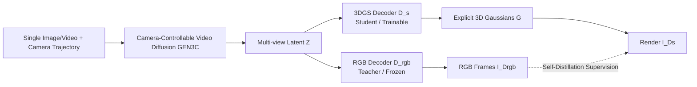

# Lyra: Generative 3D Scene Reconstruction via Video Diffusion Model Self-Distillation

**Conference**: ICLR 2026  
**OpenReview**: [https://openreview.net/forum?id=tIVCfVnIHo](https://openreview.net/forum?id=tIVCfVnIHo)  
**Project Page**: [https://research.nvidia.com/labs/toronto-ai/lyra](https://research.nvidia.com/labs/toronto-ai/lyra)  
**Code**: To be confirmed  
**Area**: 3D Vision / Generative 3D Reconstruction  
**Keywords**: 3D Gaussian Splatting, Video Diffusion Models, Self-distillation, Feed-forward 3D Reconstruction, 4D Scene Generation  

## TL;DR
Lyra employs a camera-controllable video diffusion model as a "teacher" and uses its RGB decoding branch to supervise a newly added 3DGS decoding "student." It achieves feed-forward generation of explicit 3D (and even 4D) Gaussian scenes from a single image or video using only synthetic video self-distillation, without requiring any real-world multi-view data.

## Background & Motivation
**Background**: Utilizing virtual environments for closed-loop simulations in games, robotics, and autonomous driving requires **explicit 3D representations** that support real-time rendering, physical interaction, and multi-view consistency. Neural reconstruction methods like NeRF/3DGS rely on precise camera poses and high-quality multi-view images, which are difficult to scale. Dynamic scenes further require synchronized multi-camera arrays. Feed-forward reconstruction models (e.g., GS-LRM, pixelSplat) are fast but limited by the scarcity of large-scale 3D training data, leading to poor out-of-distribution generalization.

**Limitations of Prior Work**: Video diffusion models (e.g., Cosmos, Wan) are trained on massive internet videos and implicitly encode significant real-world 3D cues while being able to "imagine" unobserved content. However, they only output **2D frames** and lack explicit 3D representations, making them unsuitable for simulations requiring geometric consistency and physical interaction. Prior works (CAT3D, Wonderland, Bolt3D) either require an expensive optimization stage that cannot be amortized across scenes or still rely on real multi-view data to train feed-forward networks.

**Key Challenge**: There is a divide between the reconstruction paradigm (geometric consistency but limited by observations and data availability) and the generative paradigm (strong imagination and generalization but 2D-only). The challenge is how to distill the "implicit 3D knowledge" from video diffusion models into explicit 3DGS while removing the dependence on real multi-view data.

**Goal**: Propose "Generative 3D Scene Reconstruction" to generate explicit 3DGS from a single image or text in a single feed-forward pass, supporting real-time rendering and geometric consistency without additional optimization or post-processing, and extending to dynamic 4D with minimal changes.

**Core Idea**: **Self-distillation**—Parallelize a 3DGS decoder (student) with the latent space of a video diffusion model and use the frozen RGB decoder (teacher) for supervision. The student is trained solely on **synthetic data** generated by the video model, completely eliminating the need for real-world multi-view datasets.

## Method

### Overall Architecture
Lyra is built upon GEN3C, a camera-controllable video diffusion model. Given a single image (or video) and a sampled camera trajectory, the video model performs denoising to obtain video latents $z$. These are decoded through two branches: the pre-trained RGB decoder $D_{rgb}$ outputs video frames as the teacher, while the new 3DGS decoder $D_s$ outputs explicit Gaussians $G$ from the **same latent space**. The rendered images of $G$ are supervised to align with the teacher's RGB frames, creating a self-distillation loop. During training, the VAE and diffusion model are frozen, and only the 3DGS decoder is optimized. During inference, the RGB branch is discarded, and only the 3DGS decoder is run.

### Key Designs

**1. Self-distillation teacher–student: Replacing real data with synthetic videos.** This is the core of the paper. Diverse text prompts are generated using LLMs, which are then used by image diffusion models to generate images $I$. GEN3C expands these single images into multi-view video sequences with known poses. The entire "Lyra dataset" is synthetic. The video model $\mathcal{V}$ generates latents $z=\mathcal{V}(I,\{C_t\})$, the teacher $D_{rgb}(z)$ provides RGB supervision, and the student $D_s$ outputs Gaussians $G$ such that $\text{Render}(G,\{C_t\})$ fits the teacher. Ablations confirm that using only self-distillation (no real data) achieves PSNR 24.77, while using only real data yields 19.08. Combining both does not improve results (24.74), indicating synthetic supervision is sufficiently diverse and consistent.

**2. Multi-trajectory supervision: Fusing in latent space to expand coverage.** Since a single trajectory has limited views, $V=6$ camera trajectories are sampled per input image. Each trajectory constructs a spatio-temporal buffer with $L=121$ poses, resulting in 6 sets of latents $z_v$. The 3DGS decoder learns to **fuse** these 6 latents into a coherent set of Gaussians and completes occluded regions. Ablations show that generating Gaussians independently per trajectory (w/o multi-view fusion) drops PSNR to 17.73. Using cross-attention between tokens in reconstruction blocks to learn fusion improves PSNR to 24.77.

**3. Latent space 3DGS decoder: Handling 726 views without memory overflow.** The video model produces $V \times L = 6 \times 121 = 726$ views at $704 \times 1280$ resolution, far exceeding the capacity of GS-LRM or AnySplat. The bottleneck is the quadratic growth of attention over visual tokens. Lyra **avoids expansion in pixel space** and directly processes compressed video latents $Z \in \mathbb{R}^{V \times L' \times C \times h \times w}$ (where $C=16$, with 8x spatial and temporal compression). The architecture uses a $2 \times 2$ patchify layer to convert latents and Plücker embeddings $E$ into tokens for the reconstruction blocks (16 layers total, featuring Transformer and Mamba-2). Mamba-2 reduces feed-forward time from 20922ms to 3213ms (6.5x speedup), whereas pixel-space approaches would result in OOM.

**4. Depth supervision + Opacity pruning: Geometry and speed improvements.** RGB loss alone can lead to "flattened" geometry. The authors use consistent video depth estimated via ViPE and a scale-invariant depth loss $L_{depth}$. They apply L1 regularization $L_{opacity}$ to prune the bottom 80% of Gaussians by opacity, making the representation compact and reducing $704 \times 1280$ rendering time from 30ms to 18ms (1.67x). The total loss is:
$$L=\lambda_{mse}L_{mse}+\lambda_{lpips}L_{lpips}+\lambda_{depth}L_{depth}+\lambda_{opacity}L_{opacity}$$
where $\lambda_{mse}=1.0, \lambda_{lpips}=0.5, \lambda_{depth}=0.05, \lambda_{opacity}=0.1$.

**5. Dynamic 4D extension and reverse video augmentation.** Extending the static framework to 4D involves adding source/target time embeddings $T_{src}, T_{tgt}$ to the decoder. The time-conditioned decoder $G=D_d(Z,E,T_{src},T_{tgt})$ is fine-tuned from the pre-trained $D_s$. A challenge in dynamic scenes is that only the frame at a specific timestamp provides supervision, which can cause the model to ignore other frames and lead to opacity collapse. The authors propose **dynamic data augmentation**: reversing the input video to create "far-to-near" trajectories along with the original "near-to-far" ones. This ensures paired supervision (12 views total) for every time step during training.

## Key Experimental Results

### Main Results
Comparison for single-image to 3D generation on RealEstate10K, DL3DV, and Tanks-and-Temples:

| Method | RE10K PSNR↑ | RE10K SSIM↑ | RE10K LPIPS↓ | DL3DV PSNR↑ | DL3DV LPIPS↓ | T&T PSNR↑ | T&T LPIPS↓ |
|---|---|---|---|---|---|---|---|
| ZeroNVS | 13.01 | 0.378 | 0.448 | 13.35 | 0.465 | 12.94 | 0.470 |
| ViewCrafter | 16.84 | 0.514 | 0.341 | 15.53 | 0.352 | 14.93 | 0.384 |
| Wonderland | 17.15 | 0.550 | 0.292 | 16.64 | 0.325 | 15.90 | 0.344 |
| Bolt3D | 21.54 | 0.747 | 0.234 | - | - | - | - |
| **Ours** | **21.79** | **0.752** | **0.219** | **20.09** | **0.313** | **19.24** | **0.336** |

Ours achieves SOTA across all metrics on the three datasets, with a PSNR gain of 3.4+ over Wonderland on DL3DV.

### Ablation Study
Ablations on the Lyra dataset (out-of-distribution diverse prompts):

| Category | Variant | PSNR↑ | SSIM↑ | LPIPS↓ |
|---|---|---|---|---|
| — | **Ours** | **24.77** | **0.837** | **0.224** |
| Data | real data only | 19.08 | 0.659 | 0.413 |
| Data | self-distill. + real data | 24.74 | 0.823 | 0.236 |
| Loss | w/o depth loss | 24.31 | 0.811 | 0.247 |
| Loss | w/o opacity pruning | 24.55 | 0.820 | 0.237 |
| Loss | w/o LPIPS loss | 23.74 | 0.766 | 0.370 |
| Architecture | w/o multi-view fusion | 17.73 | 0.632 | 0.446 |
| Architecture | w/o Mamba-2 | 24.58 | 0.818 | 0.241 |
| Architecture | w/o latent 3DGS | OOM | — | — |

### Key Findings
- **Self-distillation > Real Data**: Pure real data yields 19.08, while self-distillation yields 24.77. Adding real data provides no further gain, suggesting synthetic supervision is sufficient.
- **Multi-view fusion is critical**: Removing fusion causes the largest performance drop (to 17.73).
- **Latent space is necessary**: Pixel-space 3DGS results in OOM. Mamba-2 provides a 6.5x feed-forward speedup, and opacity pruning provides a 1.67x rendering speedup.
- Training Scale: 3D used 59,031 images → 354,186 videos; 4D used 7,378 videos → 44,268 videos (all synthetic).

## Highlights & Insights
- **Shifting from "Data Acquisition" to "Data Generation"**: Uses video diffusion as an infinite multi-view source and supervision signal, bypassing the bottleneck of real multi-view collection and enabling imagination of unseen content.
- **Elegance of Self-distillation**: Teacher and student share the same latent space; the teacher is frozen, and only one branch is trained. This is lightweight yet achieves SOTA results.
- **Scalability of Latent Reconstruction**: Processing 726 views simultaneously is possible only by avoiding pixel-space expansion. Mamba-2 is key to handling long sequences efficiently for 3DGS output.
- **Simple Dynamic Extension**: 4D is enabled simply by adding time embeddings and reverse video augmentation, addressing a task (feed-forward 4D) that was previously almost empty.

## Limitations & Future Work
- **Quality ceiling tied to teacher**: Improvements depend largely on stronger video generation models. Geometric inconsistencies or hallucinations in the video model propagate to 3DGS.
- **Dependency on external depth**: Geometric quality relies on the consistency of ViPE's video depth; failures lead to flattened geometry.
- **Evaluation constraints**: Due to the lack of open-source code for many baselines, comparisons rely on reported values from papers, which may affect fairness.
- **Synthetic data bias**: Training distribution is determined by LLM prompts and diffusion models, potentially inheriting biases in style or content.

## Related Work & Insights
- **Camera-controllable video generation** (MotionCtrl, ReCamMaster, GEN3C): Lyra "grounds" the 2D output of these models into 3D.
- **Feed-forward 3D Reconstruction** (GS-LRM, AnySplat, Bolt3D, Wonderland): Closest to Wonderland, but Lyra removes the need for real multi-view data via self-distillation and extends to 4D.
- **Insight**: When a powerful generative model implicitly masters structural knowledge, self-distillation (parallel target decoder + original decoder as teacher) serves as a universal paradigm for making implicit knowledge explicit.

## Rating
- **Novelty**: ⭐⭐⭐⭐⭐ — "Using video diffusion for self-distillation of explicit 3DGS without real data" is a clean and impactful new paradigm.
- **Experimental Thoroughness**: ⭐⭐⭐⭐ — SOTA on three datasets and systematic ablations; limited by the inability to reproduce all baselines locally.
- **Writing Quality**: ⭐⭐⭐⭐⭐ — Clear motivation, excellent figures, and well-linked methodology and results.
- **Value**: ⭐⭐⭐⭐⭐ — Directly addresses the 3D data scarcity problem with outputs suitable for real-time rendering and robotics.

<!-- RELATED:START -->

## Related Papers

- [\[ICLR 2026\] Splat and Distill: Augmenting Teachers with Feed-Forward 3D Reconstruction for 3D-Aware Distillation](splat_and_distill_augmenting_teachers_with_feed-forward_3d_reconstruction_for_3d.md)
- [\[ICLR 2026\] StreamSplat: Towards Online Dynamic 3D Reconstruction from Uncalibrated Video Streams](streamsplat_towards_online_dynamic_3d_reconstruction_from_uncalibrated_video_str.md)
- [\[ECCV 2024\] Open Vocabulary 3D Scene Understanding via Geometry Guided Self-Distillation](../../ECCV2024/3d_vision/open_vocabulary_3d_scene_understanding_via_geometry_guided_self-distillation.md)
- [\[ICCV 2025\] Momentum-GS: Momentum Gaussian Self-Distillation for High-Quality Large Scene Reconstruction](../../ICCV2025/3d_vision/momentum-gs_momentum_gaussian_self-distillation_for_high-quality_large_scene_rec.md)
- [\[CVPR 2026\] iLRM: An Iterative Large 3D Reconstruction Model](../../CVPR2026/3d_vision/ilrm_an_iterative_large_3d_reconstruction_model.md)

<!-- RELATED:END -->
