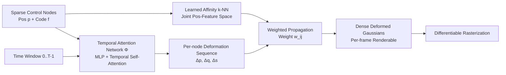

# Mango-GS: Enhancing Spatio-Temporal Consistency in Dynamic Scenes Reconstruction using Multi-Frame Node-Guided 4D Gaussian Splatting

**Conference**: ICLR 2026  
**OpenReview**: [https://openreview.net/forum?id=N4VKlSxCLc](https://openreview.net/forum?id=N4VKlSxCLc)  
**Code**: To be confirmed  
**Area**: 3D Vision / Dynamic Scene Reconstruction  
**Keywords**: 4D Gaussian Splatting, Dynamic scenes, Temporal consistency, Control nodes, Temporal Transformer, Multi-frame modeling  

## TL;DR
Mango-GS drives dense 4D Gaussians using a set of sparse control nodes with decoupled "position + latent code," and performs multi-frame temporal Transformer operations in the node space. By shifting from "frame-by-frame memorization of transients" to "modeling motion trends," it achieves SOTA image quality, optimal temporal consistency, and 149.5 FPS real-time rendering for dynamic scene reconstruction.

## Background & Motivation

**Background**: 3DGS has achieved real-time high-fidelity reconstruction for static scenes. Researchers have since extended it to dynamic scenes, with mainstream approaches adding time-dependent parameters to each Gaussian or using an MLP deformation network (e.g., D-3DGS, 4DGS, Deformable 3DGS) to predict translation/rotation/scaling frame by frame.

**Limitations of Prior Work**: These **frame-by-frame optimization** strategies treat each frame in isolation. Models tend to "memorize" the specific state of each moment rather than learning inherent motion patterns. This results in poor temporal consistency—flickering, blurring, and ghosting artifacts occur under fast or complex motion. A natural remedy is to observe multiple frames simultaneously using Transformers to capture motion trends; however, a typical scene contains millions of Gaussians, and running temporal Transformers on all Gaussians would explode computational and memory costs, negating the efficiency of 3DGS.

**Key Challenge**: Achieving temporal consistency requires multi-frame joint modeling, but the cost of multi-frame modeling naturally conflicts with the "sparse-dense + fast" nature of 3DGS. SC-GS uses sparse control nodes + k-NN to propagate motion from a few nodes to dense Gaussians; while the direction is correct, its **spatial k-NN** neighborhood in the initial frame fails under large motions: points that are initially close may move to entirely different components, causing unrelated regions to be incorrectly driven by the same control node.

**Goal**: Achieve high-fidelity and temporally coherent dynamic reconstruction while maintaining 3DGS efficiency, specifically overcoming fast/aggressive motion scenarios.

**Key Insight**: **(1) Decoupled Control Nodes**—Upgrade nodes from a "3D position" to "canonical position + persistent latent code," using learned affinity (rather than pure Euclidean distance) to establish semantic neighborhoods and prevent neighborhood drift; **(2) Node-Space Multi-Frame Temporal Attention**—Run temporal Transformers only on sparse nodes to learn coherent motion, then propagate the motion back to dense Gaussians, fundamentally replacing "frame-by-frame memorization" with "motion trend modeling."

## Method

### Overall Architecture

Mango-GS represents dynamic scenes as deformations of a canonical 3D Gaussian point cloud. Dense Gaussians $G=\{g_j\}_{j=1}^N$ are driven by sparse control nodes $N=\{n_i\}_{i=1}^M$ ($M\ll N$), where each node $n_i=(p_i,f_i)$ is decoupled into a canonical position $p_i$ and a learnable latent code $f_i$. The influence of nodes on Gaussians is established through learned k-NN relationships in a joint "position + feature" space. A temporal attention network takes the canonical node positions and a time window $[0,T]$ to predict the deformation of each node across the entire window at once. These deformations are then interpolated back to each Gaussian using pre-stored k-NN weights, resulting in a dynamic Gaussian cloud renderable at any time and viewpoint. The entire framework is trained end-to-end with temporal input masking and composite losses.

### Key Designs

**1. Decoupled Control Node Representation: Replacing Euclidean neighborhoods with learned affinity to prevent neighborhood drift.** SC-GS links nodes to Gaussians using spatial k-NN in canonical space. However, under large non-rigid motion, "initially close" does not imply "consistent motion." Static spatial neighborhoods wrongly bind independent moving parts, causing deformation blur. Mango-GS splits each node into position $p_i$ and latent code $f_i$, adopting **learning affinity**: for each Gaussian $g_j$, its canonical parameters $\phi_j=(x_j,q_j,s_j)$ (position, rotation, scale) are mapped to an embedding via a lightweight MLP. This embedding is compared with node codes to obtain affinity scores, and a softmax is applied to the top-$k$ scores to get the influence weights:

$$w_{ij}=\frac{\exp(-D(g_j,n_i))}{\sum_{i'\in K(j)}\exp(-D(g_j,n_{i'}))},\quad \forall i\in K(j)$$

where $D$ measures the distance in the joint position-feature space. Thus, neighborhoods reflect semantic consistency in shape, orientation, and position rather than mere proximity. Visualizations show these k-NN connections can be "non-local but semantically correct" long-range links that remains valid under large displacements. Since it reuses existing Gaussian attributes and avoids extra latent features per Gaussian, the parameter overhead is minimal.

**2. Node Dynamics with Multi-Frame Temporal Attention: Predicting whole-window motion in sparse node space instead of frame-by-frame memorization.** To generate coherent motion, the model must reason across time. Mango-GS designs a multi-frame deformation network $\phi$ that processes all $N$ nodes simultaneously. The canonical position $p_i$ of each node is encoded as $x_{emb}$, and timestamps $t_0,\dots,t_{T-1}$ are encoded as $t_{emb}$, forming an initial tensor $H^{(0)}\in\mathbb{R}^{N\times T\times C_{in}}$. This passes through $L$ layers: mostly standard MLP blocks with ReLU, with **temporal self-attention blocks** inserted at specific layers. Multi-head self-attention is performed along the time axis $H_{attn}=\mathrm{MHA}(H^{(l)}_{in},H^{(l)}_{in},H^{(l)}_{in})$, allowing each node to correlate with all time steps in the window. The attention result is fused back via a lightweight gating module $(w_{gate},w_{bias})$ rather than simple residuals:

$$H^{(l+1)}=H^{(l)}\otimes\sigma(w_{gate})+w_{bias}$$

Gating allows the network to adaptively decide how much temporal information to absorb. Finally, independent linear heads decode the translation $\Delta p$, rotation $\Delta q$, and scale $\Delta s$ for each node across $T$ frames, which are propagated to dense Gaussians via k-NN weights: $\{\Delta(x_j)(t)\}=\sum_{i\in K(j)}w_{ij}\{\Delta p_i(t)\}$.

**3. Input Time Masking + Composite Loss: Forcing context extrapolation, targeting hard frames, and explicitly constraining temporal changes.** To prevent the temporal attention network from simply memorizing timestamps and per-frame appearance, **a portion of the time embeddings is randomly masked** during training. This forces the network to predict the whole window's deformation using only the visible temporal context. The total loss is $L=0.8\,L_{frame}+0.2\,L_{motion}$. $L_{frame}$ is a **top-k hard frame photometric loss**: it calculates a weighted combination of L1 and DSSIM per frame, but only averages the losses of the $K=0.6\times\text{batch}$ frames with the highest errors, continuously pushing gradients toward the most difficult moments. $L_{motion}$ is a **motion-aware loss** acting on the temporal difference of adjacent frames $\delta\hat I_t=\hat I_t-\hat I_{t-1}$:

$$L_{motion}=\lambda_{diff}L_{diff}+\lambda_{amp}L_{amp}+\lambda_{dir}L_{dir}$$

The terms are $L_{diff}=\sum\|\delta\hat I_t-\delta I_t\|_1$ (aligning spatial support of inter-frame changes), $L_{amp}=\sum\max(0,\|\delta I_t\|_1-\|\delta\hat I_t\|_1)$ (penalizing underestimated motion magnitude to prevent over-smoothing), and $L_{dir}=\sum(1-\cos(\delta\hat I_t,\delta I_t))$ (constraining change direction). Weights are $(0.7, 0.2, 0.1)$. Together, they require the model to not only reconstruct single frames but also match how frames evolve, significantly reducing flickering.

## Key Experimental Results

### Main Results (Neural 3D Video + HyperNeRF-vrig)

| Method | N3DV PSNR↑ | N3DV SSIM↑ | N3DV LPIPS↓ | Hyper PSNR↑ | Hyper MS-SSIM↑ | tLPIPS↓ | FPS↑ | Storage↓ |
|---|---|---|---|---|---|---|---|---|
| D-3DGS | 31.15 | 0.941 | 0.078 | 25.0 | 0.70 | 0.0234 | 14.2 | 172 MB |
| E-D3DGS | 30.86 | 0.938 | **0.048** | 25.4 | 0.70 | 0.0257 | 45.2 | 64 MB |
| 4DGS | 31.58 | 0.942 | 0.055 | 25.2 | 0.68 | 0.0248 | 45.0 | 59 MB |
| SC-GS | 30.20 | 0.935 | 0.067 | 23.6 | 0.66 | 0.0236 | 24.5 | 85 MB |
| GaGS | 31.10 | 0.944 | 0.060 | 24.3 | 0.65 | 0.0233 | 12.0 | **48 MB** |
| MotionGS | - | - | - | 24.6 | 0.71 | 0.0229 | 39.9 | 69 MB |
| TimeFormer | 31.84 | 0.941 | - | 24.3 | 0.68 | 0.0265 | 40.9 | 46 MB |
| **Ours** | **31.89** | **0.942** | 0.049 | **26.2** | **0.78** | **0.0196** | **149.5** | 60 MB |

### Ablation Study

Time window $T$ and number of neighbors $K$ (HyperNeRF):

| $T$ | PSNR↑ | SSIM↑ | tLPIPS↓ | FPS↑ | | $K$ | PSNR↑ | SSIM↑ | tLPIPS↓ |
|---|---|---|---|---|---|---|---|---|---|
| 2 | 27.53 | 0.925 | 0.0225 | 87.9 | | 2 | 27.41 | 0.920 | 0.0205 |
| 4 | 28.19 | 0.937 | 0.0203 | 117.8 | | **3** | **28.39** | **0.942** | **0.0196** |
| **6** | **28.35** | **0.942** | **0.0196** | 149.5 | | 4 | 28.26 | 0.938 | 0.0199 |
| 8 | 28.24 | 0.940 | 0.0197 | 156.2 | | 5 | 27.90 | 0.931 | 0.0203 |

Incremental contribution of core components:

| Step | Configuration | PSNR↑ | SSIM↑ | LPIPS↓ | tLPIPS↓ |
|---|---|---|---|---|---|
| 1 | Baseline (Single Frame) | 25.15 | 0.875 | 0.139 | 0.0250 |
| 2 | + Nodes (No Learned Affinity) | 24.52 | 0.868 | 0.142 | 0.0235 |
| 3 | + Decoupled Nodes (Learned Affinity) | 25.31 | 0.892 | 0.118 | 0.0223 |
| 4 | + Multi-Frame (No Temporal Attention) | 27.30 | 0.928 | 0.096 | 0.0225 |
| 5 | + Multi-Frame (With Temporal Attention) | 27.78 | 0.937 | 0.084 | 0.0196 |
| 6 | + Top-k Loss | 28.05 | 0.941 | 0.077 | 0.0202 |
| 7 | + Motion-Aware Loss | 28.32 | 0.942 | 0.071 | 0.0192 |

### Key Findings
- **Quality + Speed Win-Win**: Leads comprehensively in PSNR/MS-SSIM/tLPIPS on HyperNeRF, with 149.5 FPS being over $3\times$ faster than MotionGS or TimeFormer, while maintaining a storage cost of only 60 MB.
- **Node Injection alone can hurt performance** (Step 2, PSNR 25.15 $\rightarrow$ 24.52): Pure spatial propagation without learned affinity hurts stability; decoupling and learned affinity (Step 3) are required to restore correspondences and improve detail.
- **Multi-frame modeling is the largest gain source** (Step 3 $\rightarrow$ 4, PSNR +2.0), and temporal self-attention further reduces tLPIPS to 0.0196.
- **Sweet spot for Hyperparameters**: $T=6$ and $K=3$ are optimal—windows/neighbors that are too small lack information, while those that are too large lead to over-smoothing and slower speeds.

## Highlights & Insights
- **Precise Diagnosis**: Identifies the core issues of dynamic GS as "frame-by-frame memorization of transients" and "spatial k-NN neighborhood drift," with its solutions directly addressing these.
- **Node-Space Temporal Modeling**: A key engineering trade-off. Running Transformers on only 2048 nodes bypasses the computational wall of millions of Gaussians, fundamentally allowing for both multi-frame modeling and real-time performance.
- **Learned Affinity vs. Euclidean k-NN**: Visualizations show that effective correspondences can be "non-local long-range connections," challenging the intuition that "proximity equals correctness."
- **Motion-Aware Loss**: Directly supervises the magnitude and direction of inter-frame differences, a practical design turning temporal consistency from an implicit expectation into an explicit supervision signal.

## Limitations & Future Work
- Validated only on HyperNeRF and Neural 3D Video datasets; systematic testing on larger scales, longer sequences, or synthetic benchmarks is missing.
- Fixed time window $T=6$ is suitable for short-term dependencies; whether hierarchical or sliding window mechanisms are needed for ultra-long or periodic motions is undiscussed.
- The number of control nodes (2048) is a fixed initial value; adaptive addition/deletion of nodes based on scene complexity remains unexplored.
- The weights for the three terms of the motion-aware loss were determined via pre-experiments; robustness across different scenes and automatic parameter tuning deserve further study.

## Related Work & Insights
- **Node-Driven Lineage**: Directly benchmarks against SC-GS, with "decoupled nodes + node-space multi-frame modeling" as differentiators; belongs to the same "enhanced temporal modeling" family as 4DGS (spatio-temporal encoding), GaGS (geometric feature injection), and MotionGS (flow-based decoupling).
- **Temporal Transformer Usage**: While TimeFormer applies cross-time Transformers to dense Gaussians, this work shrinks them to sparse nodes for efficiency—a controlled experiment on "at which granularity to perform attention."
- **Inspiration**: The sparse control + learned affinity paradigm can be transferred to other tasks requiring "few proxies driving massive primitives" (e.g., character rigging, point cloud registration). The combination of hard frame mining and inter-frame difference supervision is valuable for any temporal video generation or reconstruction task.

## Rating
- **Novelty**: ⭐⭐⭐⭐ Decoupled nodes + node-space multi-frame temporal attention is a clear and effective improvement over the SC-GS paradigm. Components (affinity, gated attention, motion loss) are clever combinations of existing ideas.
- **Experimental Thoroughness**: ⭐⭐⭐⭐ Main comparisons on two datasets + complete component ablation + $T/K$ hyperparameter scans. However, the number of datasets is limited.
- **Writing Quality**: ⭐⭐⭐⭐ Narrative flow from motivation to solution is clean. Figures 2/3 illustrate "neighborhood drift" and architecture intuitively.
- **Value**: ⭐⭐⭐⭐ Simultaneously achieves SOTA quality, optimal temporal consistency, and 149.5 FPS. Highly practical for dynamic scene reconstruction.

<!-- RELATED:START -->

## Related Papers

- [\[AAAI 2026\] Sparse4DGS: 4D Gaussian Splatting for Sparse-Frame Dynamic Scene Reconstruction](../../AAAI2026/3d_vision/sparse4dgs_4d_gaussian_splatting_for_sparse-frame_dynamic_scene_reconstruction.md)
- [\[ICLR 2026\] Uncertainty-Aware 3D Reconstruction for Dynamic Underwater Scenes](uncertainty-aware_3d_reconstruction_for_dynamic_underwater_scenes.md)
- [\[CVPR 2026\] LangField4D: Learning Identity-Adaptive and Spatio-Temporal Continuous 4D Language Fields for Dynamic Scenes](../../CVPR2026/3d_vision/langfield4d_learning_identity-adaptive_and_spatio-temporal_continuous_4d_languag.md)
- [\[CVPR 2026\] ST4R-Splat: Spatio-Temporal Referring Segmentation in 4D Gaussian Splatting](../../CVPR2026/3d_vision/st4r-splat_spatio-temporal_referring_segmentation_in_4d_gaussian_splatting.md)
- [\[ICLR 2026\] Implicit 4D Gaussian Splatting for Fast Motion with Large Inter-Frame Displacements](implicit_4d_gaussian_splatting_for_fast_motion_with_large_inter-frame_displaceme.md)

<!-- RELATED:END -->
