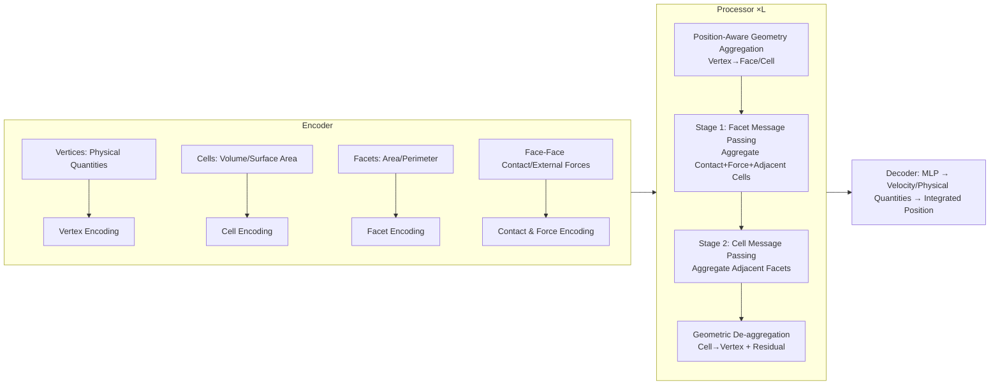

# MAVEN: A Mesh-Aware Volumetric Encoding Network for Simulating 3D Flexible Deformation

**Conference**: ICLR 2026  
**OpenReview**: [https://openreview.net/forum?id=XmULVr15E0](https://openreview.net/forum?id=XmULVr15E0)  
**Code**: [https://github.com/zhe-feng27/MAVEN](https://github.com/zhe-feng27/MAVEN)  
**Area**: 3D Vision / Graph Neural Network-based Physical Simulation  
**Keywords**: Mesh Simulation, Graph Neural Networks, 3D Flexible Deformation, Volumetric Encoding, Contact Modeling, Sparse Mesh  

## TL;DR
MAVEN treats 2D facets and 3D cells within the mesh as explicit nodes for message passing, utilizing "geometry-aware volumetric encoding" to more accurately simulate flexible deformation and contact of 3D solids on sparse meshes.

## Background & Motivation
- **Background**: Physical simulators based on Graph Neural Networks (GNNs) such as MGN have become mainstream solutions for simulating flexible deformation and contact of solids. These methods abstract the mesh as a "point-edge" graph—treating vertices as nodes and mesh edges as graph edges—and use an Encoder-Processor-Decoder architecture for message passing to regress dynamics.
- **Limitations of Prior Work**: Such methods **only use vertices to build the graph**, discarding high-dimensional geometric elements (2D facets, 3D cells) inherent in the mesh. This is particularly problematic under the **sparse meshes** commonly used in industrial practice: ① Contact occurs between facets, but point-edge graphs approximate this via "vertex distance + interaction radius." In coarse meshes, the deviation between vertex distance and true surface distance is large, leading to missed contact detections. ② GNNs treat message passing as a discrete approximation of local integral kernels; insufficient sampling of sparse vertices leads to inaccurate estimation of geometric quantities (e.g., volume/surface area), with errors accumulating along the message-passing trajectory.
- **Key Challenge**: High precision requires high-dimensional geometric continuity, while efficiency demands sparse discretization—node-level modeling cannot balance both.
- **Goal**: To ensure both contact representation accuracy and internal physical quantity propagation stability under sparse mesh conditions, approaching the accuracy of numerical solvers like FEM while maintaining the efficiency of deep learning (DL).
- **Core Idea**: **Explicitly model high-dimensional geometric elements** by constructing each cell and facet as independent nodes and assigning them geometric features such as volume, area, and perimeter. This allows physical quantities to propagate along a "volume-facet" graph rather than a "point-edge" graph, modeling contact as face-to-face geometry and internal propagation within volumetric elements.

## Method

### Overall Architecture
MAVEN follows the three-stage Encoder–Processor–Decoder framework but introduces cells and facets as explicit nodes in every step. The Encoder extracts features for vertices (physical quantities), cells (volume/surface area), and facets (area/perimeter), and constructs face-to-face contact edges and external force features. The Processor consists of $L$ stacked layers; each layer first uses a position-aware aggregator to pool vertex information into cells/facets, then performs two-stage message passing on a "volume-facet bipartite graph" (facets first, then cells), and finally de-aggregates back to vertices for residual updates. The Decoder maps vertex features back to velocities and physical quantities, followed by first-order integration to obtain the next position.

### Key Designs

**1. Explicit Modeling of High-Dimensional Geometric Elements: Elevating facets and cells to nodes.** The fundamental shift in MAVEN is moving away from simplifying meshes into vertex graphs. Instead, it instantiates the set of cells $\{C\}$, facets $\{F\}$, and vertices $V$ as nodes participating in message passing. Vertex nodes retain physical quantities like displacement, velocity, and pressure $h^0_{v_i}=\mathcal{A}_V(u^t_{v_i})$. Since cells and facets have no direct physical inputs, MAVEN borrows from the Finite Volume Method (FVM) and initializes them with pure geometric attributes—cells use current and initial volume and surface area, while facets use area and perimeter: $h_{c_i}=\mathcal{A}_C(\Omega(c^t_i),\Sigma(c^t_i),\Omega(c^0_i),\Sigma(c^0_i))$ and $h_{f_i}=\mathcal{A}_F(\alpha(f^t_i),\lambda(f^t_i),\alpha(f^0_i),\lambda(f^0_i))$. These three types of features are projected into a 128-dimensional latent space. Pre-computing and feeding these geometric quantities relieves the network from the burden of implicitly inferring geometry from vertex coordinates, which is the source of accuracy in sparse meshes.

**2. Face-to-Face Contact Modeling: Contact as geometry rather than vertex distance.** Unlike connecting edges between vertices, MAVEN establishes connections directly between contacting facets. A simplified Bounding Volume Hierarchy (BVH) algorithm detects all facet pairs within a collision radius $r$. For a pair of contacting facets $f_s, f_r$, it constructs translation-invariant vectors as edge features: the relative displacement of facet centers $d^F_{rs}=p_r-p_s$, vectors from each vertex to the opposing facet center $d^F_{v_i}=x_{s_i}-p_s$, and the normal vectors $n_s, n_r$ of both facets. These are aggregated into $h_{f_s\to f_r}=\mathcal{A}_{F\leftrightarrow F}([d^F_{rs},[d^F_{s_j}],[d^F_{r_j}],n_s,n_r])$. Thus, contact is expressed as a "face-to-face" geometric relationship, enabling stable contact capture even with sparse vertices in coarse meshes.

**3. Position-Aware Geometry Aggregator: Weighted pooling inspired by shape functions.** Each layer of the Processor must aggregate updated vertex features into cells/facets. Directly concatenating all vertices is costly (e.g., 8 vertices for a hexahedron), while simple averaging homogenizes features and loses relative geometric relationships. Inspired by **shape functions** in numerical solvers that describe internal fields using local coordinates, MAVEN learns normalized aggregation weights based on the element's local coordinate system. Using the position vectors $\vec d_{c_i,v_j}$ from the cell center to each vertex as input, $a_{c_i,v_0},\dots,a_{c_i,v_{K-1}}=\text{MLP}(\text{concat}_v(\vec d_{c_i,v}))$, it performs weighted aggregation $h^l_{c_i}=\mathcal{A}^{V\to C}_l(h_{c_i},\sum_v a_{c_i,v}h^l_v)$ (similarly for facets). These coefficients are shared across layers and sorted to ensure permutation invariance, effectively allowing the network to learn a "soft shape function" for field interpolation.

**4. Two-Stage Volume-Facet Message Passing + Geometric De-aggregation.** Propagation occurs in two stages on the bipartite graph $G=(\{C,F\},E_G)$, where edges exist for all $(c_i,f_j)$ where $f_j\in c_i$. In the first stage, facets act as "edges," bridging adjacent cells and serving as hubs for external forces, contact, and internal dynamics—aggregating all facet-to-facet contact edges, external force features $h^S_{f_i}$, and adjacent cell features. In the second stage, each cell aggregates information from its facets using symmetric coefficients $a_{c_i,f_j}=a_{f_i,c_j}$. Finally, a **geometric de-aggregator** uses symmetric coefficients $a_{v_i,c_j}=a_{c_j,v_i}$ to dispatch cell-level features back to vertices, followed by a residual connection and FFN: $h^{l+1}_{v_i}=h^l_{v_i}+h^{\to V,l}_{v_i}+\text{FFN}(\cdot)$. This "vertex → facet/cell → vertex" round trip achieves boundary-aware smooth predictions, allowing contact information to propagate far from the deformation zone. Training uses a one-step MSE loss regressing both positions and physical quantities.

## Key Experimental Results

### Main Results (Rollout RMSE, ×10³, lower is better)
Comparison across three datasets: DP (Dense Mesh Elasticity), CG (Coarse Mesh Elastic Grasping), and MBD (Extremely Coarse Hex-mesh, Elasto-plastic large deformation metal bending, newly created in this work):

| Model | CG-Pos(ALL) | DP-Pos(ALL) | MBD-Pos(ALL) | MBD-Stress(ALL) | MBD-PEEQ(ALL) |
|---|---|---|---|---|---|
| MGN | 16.89 | 23.65 | 2012.16 | 9737.58 | 1.45 |
| GT | 16.69 | 26.77 | 1406.61 | 14255.72 | 2.07 |
| HCMT | 16.87 | 24.94 | 2003.30 | 11539.27 | 1.30 |
| HOOD | 18.84 | 24.01 | 1762.41 | 8352.52 | 1.56 |
| FIGNet | 17.59 | 26.51 | 1030.57 | 5402.31 | 1.09 |
| **MAVEN** | **15.41** | **23.41** | **810.42** | **4776.72** | **1.01** |
| Gain | 13.07% | 1.33% | 33.82%(Pos) | 11.90% | 8.67% |

As the mesh becomes coarser, MAVEN's average improvement increases from 3.41% → 13.07% → 18.13%, indicating **greater gains on sparser meshes**. On MBD, geometric methods (FIGNet, MAVEN) significantly outperform node-based methods, and MAVEN captures 3D volume changes better than FIGNet (which only uses facets) due to explicit cell modeling.

### Ablation Study (CG / MBD, Pos & Stress)

| Model | CG-Pos(ALL) | MBD-Pos(ALL) | MBD-Stress(ALL) |
|---|---|---|---|
| Ours | **15.41** | **810.42** | **4776.72** |
| A: Geometry Aggregation → Degree Average | 17.45 | 926.71 | 6683.94 |
| B: w/o Explicit Geometric Features (Zero-padding) | 15.93 | 1652.31 | 6680.39 |
| C: w/o High-Dim Element Nodes (Geo-features averaged to vertices) | 17.08 | 1680.20 | 10375.86 |

### Key Findings
- **Geometry Aggregation (A)** shows significant performance drops on sparse CG; sparse scenarios must capture intra-element geometric details to surpass node-based methods.
- **Explicit Geometric Features (B)** causes collapse on extremely sparse MBD (Pos 810 → 1652), suggesting GNNs cannot implicitly infer local geometry under extreme sparsity.
- **High-Dimension Element Modeling (C)** is most critical: adding geometric features without building high-dimensional topological nodes causes performance to revert to standard node-based methods, proving that "modeling high-dimensional elements" is indispensable.

## Highlights & Insights
- **Injecting Numerical Inductive Biases into GNNs**: Borrowing from the Finite Volume Method (volume/area as key descriptors) and shape functions (weighted interpolation via local coordinates) provides the DL simulator with FEM-like stability on sparse meshes.
- **Clear Division of Labor**: Facets handle contact and force aggregation, while cells manage volume and internal physical fields—this cell-facet synergy is the core advancement over FIGNet (facet-only, strong in rigid contact) and PhyMPGN (reliant on 2D cotangent Laplacians, difficult to extend to 3D).
- **Sparse Gain Curve**: The magnitude of improvement rises monotonically with mesh coarseness, directly addressing the industrial demand for "coarse meshes for efficiency."
- The new MBD metal bending dataset fills a gap in evaluating elasto-plasticity, large displacements, long-duration contact, and extremely coarse meshes.

## Limitations & Future Work
- **Sensitivity to Mesh Quality**: Geometric modeling highly depends on mesh quality; scenarios involving distortion or fracture are currently excluded.
- **Lack of Efficient Long-Range Interaction**: As a local operator, it does not natively support long-range interactions; the authors leave "hierarchical graph extensions via automated mesh pooling" for future work.
- **Extension Costs**: Transitioning to thin shells, curved surfaces, or Eulerian systems requires additional geometry-aware adaptations.

## Related Work & Insights
- **Node-based GNN Simulation**: MGN (Pfaff et al. 2020) is the foundational baseline; subsequent work mostly improved message-passing architectures, hierarchical graphs (HOOD, HCMT), or hybrid designs, but all focused on vertex-only modeling.
- **Geometric Element Simulation**: PhyMPGN uses discrete Laplace-Beltrami operators (limited to 2D); FIGNet uses face-to-face edges for rigid contact. MAVEN unifies these threads into a 3D Lagrangian framework while adding internal cell propagation.
- **Insights**: Treating classical numerical concepts (FVM/FEM shape functions, integration kernels) as structural priors for GNNs demonstrates that physical ML should not be a complete black box but should absorb geometric inductive biases from numerical methods.

## Rating
- **Novelty**: ⭐⭐⭐⭐ Explicitly elevating 2D facets and 3D cells to message-passing nodes, combined with shape-function-style geometric aggregation, constitutes a clear and theoretically grounded paradigm shift in mesh GNN simulation.
- **Experimental Thoroughness**: ⭐⭐⭐⭐ Evaluated across three levels of mesh sparsity + 5 strong baselines + 4 ablation groups; the sparse gain curve and functional division are well-validated; the new MBD dataset is valuable.
- **Writing Quality**: ⭐⭐⭐⭐ The motivation progresses logically (contact omission + integration distortion), the correspondence with numerical methods is clear, and the discussion provides a thorough comparison with existing literature.
- **Value**: ⭐⭐⭐⭐ Directly addresses the core industrial need for "high accuracy on coarse meshes," is open-source, and offers significant insights for the physical ML and geometric deep learning communities.

<!-- RELATED:START -->

## Related Papers

- [\[ICLR 2026\] Variation-Aware Flexible 3D Gaussian Editing](variation-aware_flexible_3d_gaussian_editing.md)
- [\[ICLR 2026\] Positional Encoding Field](positional_encoding_field.md)
- [\[CVPR 2026\] FlexAvatar: Flexible Large Reconstruction Model for Animatable Gaussian Head Avatars with Detailed Deformation](../../CVPR2026/3d_vision/flexavatar_flexible_large_reconstruction_model_for_animatable_gaussian_head_avat.md)
- [\[ICLR 2026\] UniUGG: Unified 3D Understanding and Generation via Geometric-Semantic Encoding](uniugg_unified_3d_understanding_and_generation_via_geometric-semantic_encoding.md)
- [\[ICLR 2026\] VoMP: Predicting Volumetric Mechanical Property Fields](vomp_predicting_volumetric_mechanical_property_fields.md)

<!-- RELATED:END -->
