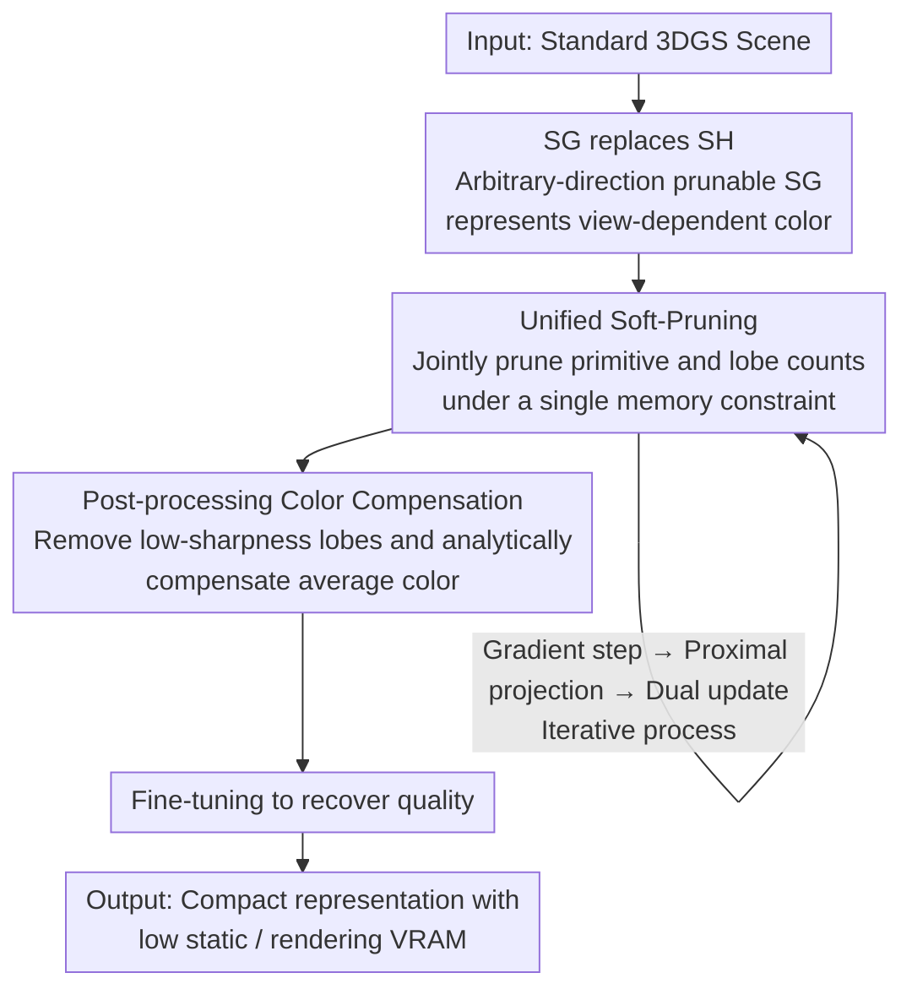

# MEGS2: Memory-Efficient Gaussian Splatting via Spherical Gaussians and Unified Pruning

**Conference**: ICLR 2026  
**arXiv**: [2509.07021](https://arxiv.org/abs/2509.07021)  
**Code**: To be released  
**Area**: 3D Vision/Rendering Compression  
**Keywords**: 3D Gaussian Splatting, Memory Compression, Spherical Harmonics Replacement, Spherical Gaussians, Unified Pruning

## TL;DR
MEGS2 is proposed to compress 3DGS from the perspective of rendering VRAM: using prunable arbitrary-direction Spherical Gaussians (SG) to completely replace Spherical Harmonics (SH) to reduce parameters per primitive, and a unified soft-pruning framework to model primitive and lobe count pruning as a single memory-constrained optimization problem. It achieves 8x static VRAM and 6x rendering VRAM compression while maintaining rendering quality, enabling 3DGS to run in real-time on mobile devices for the first time.

## Background & Motivation

**Background**: 3DGS has become a mainstream technique for novel view synthesis, but high memory consumption severely limits its deployment on edge devices. Numerous compression methods have been proposed, but the vast majority focus only on storage compression (file size) while ignoring rendering memory (VRAM).

**Limitations of Prior Work**: (1) Methods based on neural compression/VQ/hash grids (CompactGaussian/EAGLES/HAC++) achieve high storage compression but must decompress all parameters before rendering, resulting in VRAM usage that sometimes exceeds original 3DGS; (2) Primitive pruning methods (GaussianSpa/Mini-Splatting) reduce VRAM but have limited compression rates—over-pruning severely damages quality; (3) Spherical Harmonics (SH) are parameter-inefficient for color representation, with many high-order coefficients but poor utilization.

**Key Challenge**: Rendering VRAM = number of primitives $\times$ parameters per primitive. Existing methods only optimize one of these factors. Both must be reduced simultaneously to break the VRAM bottleneck.

**Key Insight**: SH is a global basis function requiring many high-order coefficients to represent local high-frequency details (sharp highlights). Spherical Gaussians (SG) are local basis functions that efficiently model view-dependent effects with a few lobes, and the number of lobes can be flexibly adjusted—making them naturally suitable for pruning.

**Core Idea**: Replace SH with prunable SG to reduce the parameter cost of each primitive, then use unified constrained optimization to prune the number of primitives and lobes simultaneously to achieve optimal VRAM allocation.

## Method

### Overall Architecture
MEGS2 addresses the rendering VRAM bottleneck of 3DGS. Since rendering VRAM is approximately "number of primitives $\times$ parameters per primitive," both factors must be compressed. The approach first replaces expensive Spherical Harmonics (SH) with Spherical Gaussians (SG), which have fewer parameters and a prunable number of lobes, to represent view-dependent colors. Then, a unified soft-pruning framework is employed to simultaneously decide which primitives to remove and how many lobes each primitive should retain under a single memory budget constraint. Finally, a post-processing stage removes redundant primitives and lobes, performs color compensation for deleted lobes, and applies a brief fine-tuning to recover quality. The pipeline takes a standard 3DGS scene as input and outputs a compact representation with significantly reduced static and rendering VRAM.

### Key Designs

**1. Arbitrary-direction prunable Spherical Gaussians (SG) replacing SH: Replacing global basis functions with parameter-efficient, prunable local basis functions**

The problem with SH is that it is a global basis; representing local high-frequency signals like sharp highlights requires stacking many high-order coefficients, leading to low parameter efficiency. MEGS2 instead uses SG to represent the view-dependent color of each primitive: $c(\mathbf{v}) = c_0 + \sum_{i=1}^n G(\mathbf{v}; \mu_i, s_i, a_i)$, where $c_0$ is the diffuse component, and each SG lobe is defined by a direction axis $\mu_i$, sharpness $s_i$, and RGB amplitude $a_i$. Crucially, lobe directions are not constrained to be orthogonal—arbitrary directions provide higher fitting freedom. This yields double benefits: in terms of parameters, a 3rd-order SH requires 48 parameters (16 coefficients $\times$ 3 channels), while a 3-lobe SG needs roughly half that and captures local high-frequencies better. In terms of expressiveness, SG variants with fixed orthogonal axes (SG-Splatting) lose about 0.6dB PSNR, while arbitrary-direction SG avoids this loss. More importantly, the variable number of SG lobes is naturally suited for subsequent pruning.

**2. Unified Soft-Pruning Framework (ADMM-inspired): Simultaneously pruning primitive and lobe counts under a single memory constraint**

Pruning primitives first and then lobes leads to sub-optimal results because the optimal allocation for these two types of pruning is coupled. Given the same memory budget, the trade-off between keeping more primitives versus more lobes must be weighed together. MEGS2 formulates this as a unified constrained optimization: $\min \mathcal{L}(\mathbf{o}, \mathbf{s}, \Theta)$ subject to $\rho_o \|\mathbf{o}\|_0 + \rho_s \|\mathbf{s}\|_0 \leq \kappa$, where $\rho_o=11$ is the base parameter count per primitive, $\rho_s=7$ is the parameter count per SG lobe, and $\kappa$ is the total parameter budget. Since the L0 norm is non-differentiable, the framework draws inspiration from ADMM by introducing proxy variables and splitting the problem into several solvable sub-problems: gradient steps, proximal projection steps, and dual updates. This automatically finds the optimal trade-off between primitive and lobe counts under the total budget, rather than manually specifying them in two steps. Experiments prove that unified pruning outperforms sequential pruning.

**3. Post-processing Color Compensation: Analytically restoring average color contributions when removing low-sharpness lobes**

The pruning stage removes lobes with very low sharpness. While these lobes do not contribute high-frequency details, they still contribute to the average color of the primitive; simply deleting them causes overall color shifts. MEGS2 addresses this with an analytical compensation: after removing lobe $i$, a compensation term $\Delta c_0 = a_i \cdot \frac{1 - e^{-2s_i}}{2s_i}$ is calculated, and the diffuse color is updated as $c_0' = c_0 + \Delta c_0$. This expression is a closed-form solution derived by minimizing the integral of color differences over the sphere. It adds almost no extra computation while successfully folding the energy of deleted lobes back into the diffuse term, preventing color shifts.

### Loss & Training
- Based on the standard 3DGS training pipeline (Kerbl et al., 2023).
- ADMM optimization alternates through three steps: Gradient step (update rendering loss) $\rightarrow$ Proximal projection step (enforce sparsity) $\rightarrow$ Dual variable update.
- Post-processing pipeline: Remove primitives with near-zero opacity and lobes with near-zero sharpness $\rightarrow$ Apply color compensation to deleted lobes $\rightarrow$ Brief fine-tuning to recover quality.

## Key Experimental Results

### Main Results (Mip-NeRF360)

| Method | PSNR | SSIM | LPIPS | Static VRAM (MB) | Rendering VRAM (MB) |
|------|------|------|-------|-------------|-------------|
| 3DGS | 27.48 | 0.813 | 0.217 | 648 | 1717 |
| GaussianSpa | 27.56 | 0.824 | 0.215 | 115 | 448 |
| **Ours (HQ)** | **27.54** | **0.824** | **0.209** | **55** | **265** |
| Ours (LM) | 27.21 | 0.814 | 0.227 | 40 | 224 |

### Ablation Study (Mip-NeRF360)

| Configuration | PSNR | LPIPS | VRAM (MB) | Explanation |
|------|------|-------|---------|------|
| GaussianSpa + Reduced3DGS | 26.05 | 0.280 | 402 | Naive combination severely degrades quality |
| GaussianSpa (SH->SG) | 27.01 | 0.230 | 339 | Simple replacement is insufficient |
| soft->hard pruning | 27.23 | 0.228 | 288 | Hard pruning is inferior to soft pruning |
| unified->sequential | 27.33 | 0.222 | 328 | Sequential is inferior to unified |
| w/o color comp. | 27.46 | 0.213 | 265 | Color compensation helps |
| **Full model** | **27.54** | **0.209** | **265** | All components synergize optimally |

### Key Findings
- **VRAM Compression**: Achieves 8x static VRAM compression (648->55MB) and 6x rendering VRAM compression (1717->265MB) compared to 3DGS. Compared to the SOTA GaussianSpa, it further reduces static VRAM by 2x and rendering VRAM by 40%.
- **Quality Maintenance**: PSNR remains nearly lossless (27.54 vs 27.56), while LPIPS is even improved (0.209 vs 0.215).
- **SG Superior to SH**: SG fits local high-frequency signals (sharp reflections/highlights) better, significantly outperforming SH in specular reflections in scenes like Bicycle/Truck.
- **Lobe Distribution**: Most primitives require only 0-1 lobe (strong diffuse), while a minority require 2-3 lobes (specular highlights), averaging 1.3-1.7 lobes per primitive.

## Highlights & Insights
- **Precision in Problem Definition**: Distinguishing between storage compression and memory compression is a key insight. Existing works focus heavily on the former but ignore the latter, which is the true bottleneck for edge deployment.
- **Rationality of SG replacing SH**: Most surfaces in a scene are diffuse (requiring no lobes), with only a small portion being specular/highlighted (requiring lobes) $\rightarrow$ the variable lobe count of SG perfectly matches this long-tail distribution.
- **ADMM for Unified Pruning**: Unifying two discrete optimizations into a single continuous optimization decomposed via ADMM is elegant and theoretically grounded. This framework can generalize to any scenario requiring simultaneous optimization of "entity count" and "per-entity complexity."
- **Analytical Color Compensation**: Deriving a closed-form solution via spherical integration provides a simple and effective method with no extra computational overhead.

## Limitations & Future Work
- Focuses on static VRAM; optimization of dynamic VRAM (related to renderer implementation) is left for the future.
- Performance on highly complex specular scenes (e.g., full mirror objects) requires further validation.
- Could be combined with neural compression methods (e.g., HAC++) for simultaneous optimization of storage and VRAM.
- Optimal initialization strategies for SG lobes are worth exploring.

## Related Work & Insights
- **vs GaussianSpa**: Only performs primitive pruning while each primitive still uses full SH $\rightarrow$ the VRAM floor remains high. Ours breaks this bottleneck by further compressing per-primitive parameters.
- **vs Reduced3DGS**: Attempts to prune SH coefficients, but the global nature of SH makes it unsuitable for sparse pruning (removing high orders causes global detail loss). The local nature of SG makes lobe pruning safer.
- **vs CompactGaussian/EAGLES**: High storage compression but VRAM may actually increase due to decompression. Does not fundamentally solve the rendering memory issue.

## Rating
- Novelty: ⭐⭐⭐⭐ Complete replacement of SH with SG + Unified pruning framework; clear and innovative concepts.
- Experimental Thoroughness: ⭐⭐⭐⭐⭐ Full comparisons across three datasets, detailed ablation studies, and WebGL on-device validation.
- Writing Quality: ⭐⭐⭐⭐ Clear VRAM analysis and well-defined problem decomposition.
- Value: ⭐⭐⭐⭐⭐ Systematically addresses the rendering memory bottleneck of 3DGS for the first time, directly advancing edge deployment.

<!-- RELATED:START -->

## Related Papers

- [\[ICLR 2026\] Learning Unified Representation of 3D Gaussian Splatting](learning_unified_representation_of_3d_gaussian_splatting.md)
- [\[CVPR 2025\] SGCR: Spherical Gaussians for Efficient 3D Curve Reconstruction](../../CVPR2025/3d_vision/sgcr_spherical_gaussians_for_efficient_3d_curve_reconstruction.md)
- [\[ICLR 2026\] 3DGEER: 3D Gaussian Rendering Made Exact and Efficient for Generic Cameras](3dgeer_3d_gaussian_rendering_made_exact_and_efficient_for_generic_cameras.md)
- [\[ICLR 2026\] FastAvatar: Towards Unified and Fast 3D Avatar Reconstruction with Large Gaussian Reconstruction Transformers](fastavatar_towards_unified_and_fast_3d_avatar_reconstruction_with_large_gaussian.md)
- [\[ICCV 2025\] MEGA: Memory-Efficient 4D Gaussian Splatting for Dynamic Scenes](../../ICCV2025/3d_vision/mega_memory-efficient_4d_gaussian_splatting_for_dynamic_scenes.md)

<!-- RELATED:END -->
