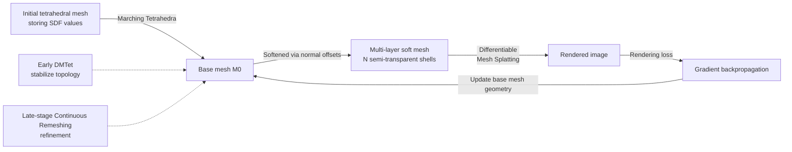

# Mesh Splatting for End-to-end Multiview Surface Reconstruction

**Conference**: ICLR 2026  
**OpenReview**: [https://openreview.net/forum?id=PSgps4JXTb](https://openreview.net/forum?id=PSgps4JXTb)  
**Code**: To be confirmed  
**Area**: 3D Vision / Multi-view Surface Reconstruction  
**Keywords**: Surface reconstruction, mesh optimization, differentiable rendering, volume rendering, Mesh Splatting, topology control  

## TL;DR
The authors "soften" a mesh into multiple semi-transparent shells along its normals and make these layers differentiable with respect to the base mesh. This allows for end-to-end optimization of the mesh surface using volume rendering, reconstructing high-quality meshes with minimal vertices within 20 minutes.

## Background & Motivation
**Background**: There are two main paradigms for surface reconstruction from images. One is the volumetric approach (NeuS, Neuralangelo, 2DGS, GaussianSurfel, etc.), which populates density/transparency in 3D space. These benefit from a large effective receptive field along rays and can be optimized stably via volume rendering. The other is direct mesh optimization (NvdiffRec, IMLS-Splatting, SuGaR), which allows for mesh quality control through remeshing during optimization.

**Limitations of Prior Work**: Volumetric methods require an additional meshing step (Marching Cubes / Poisson / Marching Tetrahedra) after optimization, which accumulates errors and often produces redundant, dense meshes; post-hoc remeshing is typically non-differentiable, further accumulating error. Direct mesh methods avoid meshing but only describe boundary geometry with a "single-layer" receptive field. When the mesh does not yet lie on the true surface, multi-view observations can only optimize the color of that specific point on the mesh, providing almost no spatial gradient to "push" the geometry toward the ground truth. Consequently, they rely heavily on priors like shading, normals, and depth, which are often inaccurate or uninformative in complex materials/lighting.

**Key Challenge**: Volumetric methods have large receptive fields but lack differentiable meshing; mesh methods control topology but struggle to learn details due to single-layer receptive fields and over-reliance on weak priors. Both lack the critical capability of the other.

**Goal**: To supplement meshes with volumetric-style "3D receptive field + direct image supervision" without sacrificing the "controllable topology" of the mesh representation.

**Core Idea**: **Differentiably transform a surface into a pseudo-volume**—by softening the base mesh into several semi-transparent layers offset along the normals. The transparency of each layer is differentiably calculated based on its signed distance to the base mesh. Thus, this set of layers provides a controllable 3D receptive field while remaining differentiable with respect to the underlying mesh. Using volume rendering with image supervision, gradients can pass through these layers to pull the base mesh toward the true surface, while the surface itself remains represented by a single base mesh, preserving the capacity for topology control via remeshing.

## Method

### Overall Architecture
Starting from an initial tetrahedral mesh storing signed distance values, a base mesh is extracted using Marching Tetrahedra. This base mesh is softened into multiple semi-transparent shells (pseudo-volume) via normal offsets. The proposed Differentiable Mesh Splatting (based on tile rasterization) renders these multi-layer meshes into images. Supervised by image rendering loss, gradients are backpropagated to update both the base mesh geometry and attached parameters. Topologically, DMTet is used in the early stages to stabilize the global structure, and the system switches to Continuous Remeshing for mesh quality refinement after convergence.

### Key Designs

**1. Mesh Softening: Converting a single-layer mesh into a differentiable pseudo-volume.** For the $j$-th vertex $v_j^0$ of the base mesh $M_0$, the $i$-th layer vertex $v_j^i = v_j^0 + d_j^i \cdot n_j$ is obtained by offsetting along its unit normal $n_j$ (where $d_j^i$ is the offset). The transparency of each layer depends on its signed distance to the base mesh, using a critical stop-gradient trick: $s_j^i = \mathrm{sign}(d_j^i)\,\lVert \mathrm{stop}(v_j^i) - v_j^0\rVert_2$. Without the stop-gradient, substituting the offset formula would collapse to $s_j^i = \mathrm{sign}(d_j^i)\lVert d_j^i \cdot n_j\rVert_2$, which is independent of $v_j^0$ and cannot drive geometric updates. By stopping the gradient of $v_j^i$, $s_j^i$ becomes differentiable with respect to $v_j^0$, enabling the gradient chain: "which layers look more like the true surface → pull the base mesh there." The signed distance is mapped to alpha using a VolSDF variant: $\alpha = \tfrac{1}{\beta}(1-\tfrac12 e^{s/\beta})$ for $s<0$ and $\alpha = \tfrac{1}{2\beta} e^{-s/\beta}$ for $s\ge 0$, where a learnable $\beta$ controls how tightly the density concentrates toward the base mesh. This softening mechanism provides the intuition behind Fig. 2: while a single mesh layer can only optimize color when misaligned, the multi-layer shells create overlap with the true surface. Points near the true surface achieve multi-view consistency and higher weights in volumetric blending, which in turn reduces their signed distance and pulls the base mesh closer.

**2. Differentiable Mesh Splatting: Efficiently rendering semi-transparent multi-layer meshes.** Splatting is performed using triangular faces as primitives. Tile rasterization projects triangle vertices to the image plane, identifying triangles covering each pixel and sorting them by depth. For a triangle covering pixel $p$, the ray-triangle intersection $x^i$ and its barycentric coordinates $w^i = \mathrm{correct}(p, \{u_1,u_2,u_3\}, \{z_1,z_2,z_3\})$ (with depth correction) are calculated. Attributes $\{\alpha^i, f^i, n^i, r^i, x^i\}$ at the intersection are obtained via barycentric interpolation. Color is predicted by an MLP: $c^i = \mathrm{MLP}(f^i, n^i, r^i, \mathrm{Hash}(x^i))$, where hash-encoded coordinate features inject non-linearity to avoid over-smoothing inside triangles. Finally, the volume rendering equation synthesizes overlapping triangles per pixel: $C_p = \sum_{i\in N} c^i \alpha^i \prod_{k=1}^{i-1}(1-\alpha^k)$. Photometric loss between the rendered image and ground truth updates the base mesh and parameters. Compared to iterative rasterization using Nvdiffrast depth peeling, this splatting uses only 2GB VRAM at 1/4 resolution (vs. 8GB), and remains functional at full resolution where iterative methods OOM.

**3. Mixed Topology Control: Global Stability with DMTet + Local Refinement with Continuous Remeshing.** Direct mesh optimization is prone to irreparable defects. Early stages follow NvdiffRec's DMTet reparameterization: initializing a tetrahedral mesh with grid SDF as $\lVert x_g\rVert_2 - r$ (an initial sphere) to stabilize topology. After the DMTet phase converges, the extracted mesh is frozen as the base mesh, DMTet is disabled, and the system switches to Continuous Remeshing. This maintains near-isotropic triangles and reduces defects after each optimization step. Supervision integrates both paradigms: in addition to volumetric image loss, base mesh shading (as in IMLS-Splatting), monocular normal supervision (as in GaussianSurfel), and PyTorch3D mesh smoothing losses are applied.

## Key Experimental Results

### Main Results (Surface Reconstruction Accuracy, Chamfer Distance cm ↓)

| Method | DTU Mean ↓ | Vertices (K) | Training (min) | BlendedMVS Mean ↓ |
|------|-----------|-----------|-----------|-------------------|
| NeuS | 0.76 | 1000 | 600 | 2.68 |
| Neuralangelo | 0.62 | 1000 | 600 | — |
| GaussianSurfel | 0.92 | 1000 | 6 | 2.46 |
| 2DGS | 0.78 | 300 | 9 | — |
| GOF | 0.74 | 1000 | 18 | — |
| SuGaR | 1.33 | 1000 | 52 | 8.71 |
| IMLS-Splatting | **0.57** | 300 | 11 | 2.75 |
| Ours w/o MS | 0.73 | 300 | 20 | 1.94 |
| **Ours** | 0.62 | **300** | 23 | **1.71** |

On DTU, the method matches SOTA accuracy (0.62, equal to Neuralangelo) using the fewest vertices (300K) and significantly less training time (23 min vs. 600 min). On the more complex BlendedMVS, the Mean CD of 1.71 significantly outperforms all baselines.

### Ablation Study

Mixed Topology Control (DTU, Table 4):

| Config | VRAM (GB) | Training (min) | Vertices | CD ↓ |
|------|---------|-----------|--------|------|
| w/o DMTet | 7 | 18 | 80K | 3.79 (Lost global topology/holes) |
| DMTet (128) | 6 | 15 | 2K | 6.94 (Mesh too sparse) |
| DMTet (256) | 8 | 23 | 10K | 4.20 (Lack of detail) |
| Dense Mesh | 28 | 35 | 487K | 1.67 |
| Sparse Mesh | 15 | 19 | 127K | 1.66 |
| **Full Model** | 23 | 25 | 306K | **1.57** |

Rendering Efficiency (DTU scan 122, Table 3, Full Resolution 1600×1200): Mesh Splatting uses 13GB / 22min, while iterative rasterization results in OOM. At 1/4 resolution, MS requires only 2GB vs. 8GB for iterative methods.

### Key Findings
- **Softening is the key to Gain**: Removing softening and relying only on shading supervision (Ours w/o MS) leads to significantly worse results on both datasets (DTU 0.73 vs 0.62, BMVS 1.94 vs 1.71), proving end-to-end volume rendering provides stronger geometric constraints.
- **Mixed Topology is Indispensable**: Removing DMTet leads to lost global topology (holes), while using only DMTet leads to sparse results lacking detail. The hybrid strategy captures both global topology and fine details with high precision.
- **Robust to Vertex Count**: Through Continuous Remeshing's minimum edge length parameter, accuracy remains stable across a wide range of vertex counts. A ~5mm edge length provides an optimal balance (~300K vertices).
- **Advantage in Thin Structures**: Reconstructs thin structures like ship masts and vase folds on NeRF Synthetic. However, extremely thin cable-like structures fail due to the mismatch with isotropic remeshing, suggesting future exploration of adaptive remeshing.

## Highlights & Insights
- **"Softening" bridges two paradigms**: It naturally inherits controllable topology from mesh representations while gaining the 3D receptive field and direct image supervision of volumetric methods, bypassing meshing as a source of error.
- **Clever stop-gradient Signed Distance**: A single line of stop-gradient code determines whether gradients can drive base geometry; otherwise, the end-to-end chain fails—this is the "eye of the needle" for the method.
- **Practical Efficiency**: Approximately 20 minutes on a single V100 GPU to produce SOTA quality meshes with 300K vertices is highly favorable for downstream applications like physical simulation that demand "low vertex, high quality" outputs.

## Limitations & Future Work
- **Scale Constraints**: Tetrahedral mesh resolution and VRAM limits make it difficult to scale directly to very large scenes. The paper supports scene-level reconstruction via GaussianSurfel coarse mesh initialization, but thin shells lack sufficient overlap for volume gradients if the mesh is too far from the ground truth (e.g., backgrounds).
- **Very Fine Structures**: Isotropic remeshing is unsuitable for extremely thin structures like cables or hair, which require adaptive remeshing for elongated triangles.
- **Future Work**: Adaptive layer bandwidth / hierarchical softening for large scenes; engineering optimizations like triangle culling and adaptive vertex density to further increase speed (current splatting is still slower than 3DGS).

## Related Work & Insights
- **Volumetric Surface Reconstruction**: NeuS/VolSDF (SDF reparameterization), Neuralangelo (hash encoding for detail), 2DGS/GOF/GaussianSurfel (adding normal/depth regularization to GS)—Ours takes the opposite approach by optimizing directly on the mesh to avoid post-meshing.
- **Mesh-based Surface Reconstruction**: NvdiffRec (tetrahedral reparameterization), IMLS-Splatting (point cloud to mesh + shading loss), SuGaR (flat Gaussians on mesh)—Ours adopts DMTet from NvdiffRec and shading supervision from IMLS, but adds a 3D receptive field via softening.
- **Mesh Softening Techniques**: Gaussian Shell Maps, DELIFFAS, AdaptiveShell, Gaussian Frosting, and Volumetric Surfaces place transparent layers around a base mesh, but primarily for novel view synthesis where the base mesh is fixed after initialization. Our layers are differentiable with respect to the base mesh, which is the fundamental difference allowing end-to-end reconstruction.

## Rating
- **Novelty**: ⭐⭐⭐⭐ The idea of "softening a mesh into a differentiable pseudo-volume" is novel and elegant. The stop-gradient signed distance design is a key innovation unifying the advantages of two major paradigms.
- **Experimental Thoroughness**: ⭐⭐⭐⭐ Solid evaluation across DTU, BlendedMVS, and NeRF Synthetic datasets against multiple paradigms. Ablations cover softening, topology control, efficiency, and vertex control. The lack of large-scale quantitative results for scene-level data is a minor drawback.
- **Writing Quality**: ⭐⭐⭐⭐ Motivation is clearly explained using the geometric intuition in Fig. 2. Technical derivations, particularly the necessity of stop-gradients, are well-articulated and logically coherent.
- **Value**: ⭐⭐⭐⭐ High practical value for downstream tasks like physical simulation requiring high-quality, low-vertex meshes within 20 minutes. The softening mechanism could be transferred to other flexible 3D parameterizations.

<!-- RELATED:START -->

## Related Papers

- [\[ICML 2026\] EPS3D: End-to-End Feed-Forward 3D Panoptic Segmentation](../../ICML2026/3d_vision/eps3d_end-to-end_feed-forward_3d_panoptic_segmentation.md)
- [\[CVPR 2025\] End-to-End HOI Reconstruction Transformer with Graph-based Encoding](../../CVPR2025/3d_vision/end-to-end_hoi_reconstruction_transformer_with_graph-based_encoding.md)
- [\[CVPR 2025\] End-to-End Implicit Neural Representations for Classification](../../CVPR2025/3d_vision/end-to-end_implicit_neural_representations_for_classification.md)
- [\[CVPR 2025\] Rethinking End-to-End 2D to 3D Scene Segmentation in Gaussian Splatting](../../CVPR2025/3d_vision/rethinking_end-to-end_2d_to_3d_scene_segmentation_in_gaussian_splatting.md)
- [\[AAAI 2026\] FoundationSLAM: Unleashing the Power of Depth Foundation Models for End-to-End Dense Visual SLAM](../../AAAI2026/3d_vision/foundationslam_unleashing_the_power_of_depth_foundation_models_for.md)

<!-- RELATED:END -->
