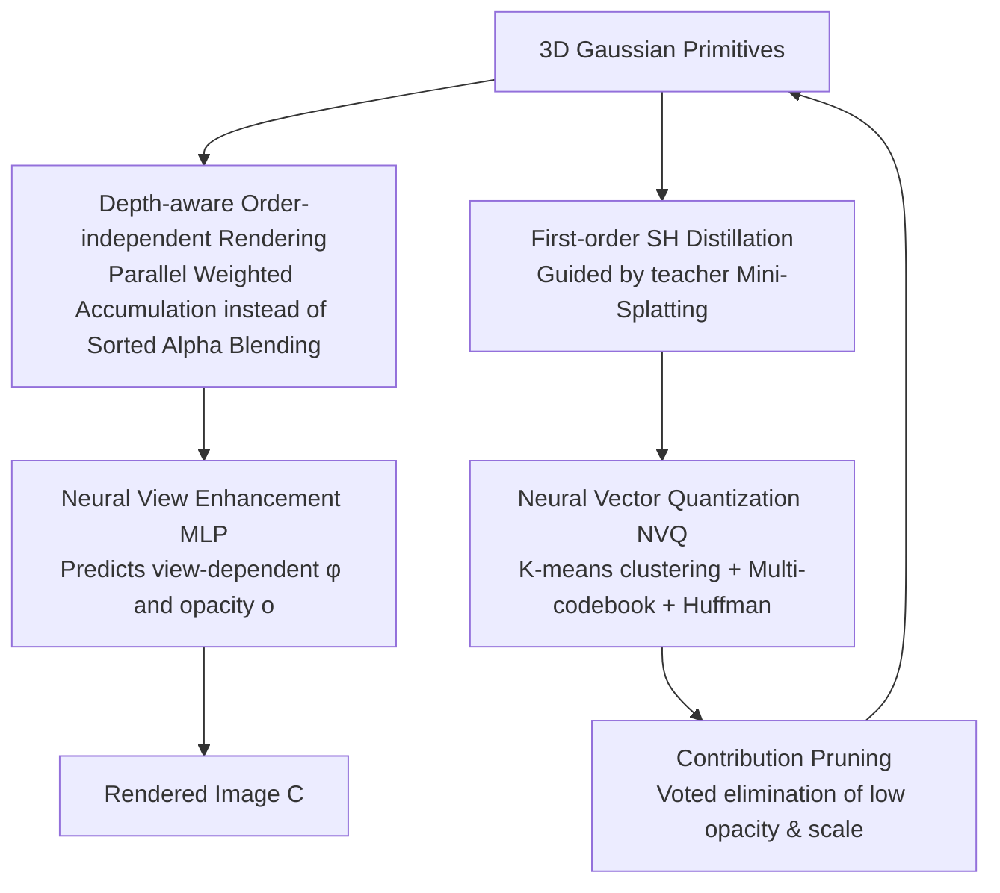

# Mobile-GS: Real-time Gaussian Splatting for Mobile Devices

**Conference**: ICLR 2026  
**OpenReview**: [https://openreview.net/forum?id=vRegY0pgvQ](https://openreview.net/forum?id=vRegY0pgvQ)  
**Code**: [https://xiaobiaodu.github.io/mobile-gs-project/](https://xiaobiaodu.github.io/mobile-gs-project/)  
**Area**: 3D Vision / Neural Rendering  
**Keywords**: 3D Gaussian Splatting, Real-time rendering, Mobile deployment, Order-independent rendering, Model compression  

## TL;DR
Mobile-GS incorporates a suite of five techniques—"depth-aware order-independent rendering, neural view enhancement, first-order SH distillation, neural vector quantization, and contribution pruning"—to compress 3DGS to 4.6 MB and achieve 1100+ FPS on desktop. It marks the first implementation of real-time Gaussian Splatting at 116 FPS on a Snapdragon 8 Gen 3 mobile device.

## Background & Motivation
**Background**: 3D Gaussian Splatting (3DGS) has become the mainstream for high-quality novel view synthesis due to its continuous differentiable anisotropic Gaussian primitives, seeing extensive use in autonomous driving and relighting. Lightweight variants such as Scaffold-GS, Mini-Splatting, and C3DGS have been proposed to improve efficiency via pruning and compact representations.

**Limitations of Prior Work**: Existing methods almost exclusively rely on traditional alpha blending, which requires sorting Gaussians from "near to far" before rendering. Runtime profiling (Fig. 2) reveals that **sorting is the true performance bottleneck**. In scenes like Counter/Bicycle, removing sorting scales the frame rate of 3DGS from 134/145 FPS to 857/871 FPS, a several-fold acceleration. Sorting is not only time-consuming but also introduces implementation complexity and popping artifacts.

**Key Challenge**: The computational power of mobile GPUs is insufficient to handle the sorting and rendering of hundreds of thousands of Gaussians (especially those with view-dependent effects). Since sorting is a prerequisite for correct alpha blending, its removal breaks occlusion relationships and causes transparency artifacts. The core tension lies in achieving speed by removing sorting without sacrificing image quality.

**Goal**: To develop a real-time Gaussian Splatting solution for mobile devices that simultaneously addresses three key factors: order-independent rendering, quantization compression, and reduction of Gaussian primitives.

**Core Idea**: **[Order-independent]** Replace sorted alpha blending with a learnable, view-dependent depth-aware weighting scheme, allowing Gaussian color contributions to be accumulated in parallel. **[Neural compensation]** Utilize a lightweight MLP to predict view-dependent opacity to recover quality loss from unsorted rendering. **[Extreme compression]** Apply a pipeline of distillation, quantization, and pruning to compress the model to a few megabytes.

## Method

### Overall Architecture
Mobile-GS discards tile-based rendering and sorting during the inference stage. It calculates and accumulates the color contribution of each Gaussian to relevant pixels in parallel, followed by a single-pass synthesis of foreground and background. On the training side, it integrates distillation, quantization, and pruning. The workflow is divided into "Rendering Pipeline Modification" and "Storage Compression."

### Key Designs

**1. Depth-aware Order-independent Rendering: Replacing sorting with learnable depth weighting for order-invariant contributions.** Traditional alpha blending is expressed as $C=\sum_i c_i\alpha_i T_i$, where transmittance $T_i$ depends on the cumulative product of preceding Gaussians, necessitating sorting. Mobile-GS modifies this to $C=(1-T)\frac{\sum_i c_i\alpha_i w_i}{\sum_i \alpha_i w_i}+Tc_{bg}$, where both numerator and denominator use commutative summation, making rendering order-independent. Here, $T=\prod_j(1-\alpha_j)$ is the global transmittance for foreground-background separation, and $\alpha_i=o_i\exp(-\frac12\Delta x_i^T\Sigma_i^{-1}\Delta x_i)$ is the standard Gaussian alpha. The core is the depth-aware weight $w_i=\phi_i^2+\frac{\phi_i}{d_i^2}+\exp(\frac{s_{max}}{d_i})$, which uses inverse depth $d_i$ to suppress distant Gaussians and favor nearer ones, while weighting larger scales $s_{max}$ more heavily.

**2. Neural View Enhancement: Compensating for occlusion cues lost due to lack of sorting using a lightweight MLP.** The cost of order-independence is the lack of strict depth synthesis, causing unwanted transparency in overlapping areas. An MLP encodes geometric and appearance features—normalized direction $P_i=\frac{\mu_i-t_v}{\lVert\mu_i-t_v\rVert}$, scale $s_i$, rotation $r_i\in SO(3)$, and SH coefficients $Y_i$—into view-dependent features: $F=\text{MLP}_f(P_i,s_i,r_i,Y_i)$, $\phi_i=\text{ReLU}(\text{MLP}_\phi(F))$, and $o_i=\sigma(\text{MLP}_o(F))$. $\phi$ acts as a depth attenuation factor, and the view-dependent opacity $o_i$ serves as a correction term to suppress transparency in occluded regions.

**3. First-order SH Distillation: Compressing 3rd-order SH to 1st-order with scale-invariant depth loss.** Original 3DGS uses 3rd-order SH (3×16 coefficients), which is storage-intensive. Mobile-GS aggressively distills this to 1st-order SH (3×4 coefficients) using a pre-trained teacher (Mini-Splatting) to supervise rendered pixels: $L_{distill}=\frac1{|P|}\sum_{p\in P}\lVert C_p^{tea}-C_p\rVert$. A scale-invariant depth distillation loss is also introduced: $L_{depth}(D,D^{tea})=\frac1{|P|}\sum_p(\log\hat D_p-\log\hat D_p^{tea})^2-\frac1{|P|^2}(\sum_p(\log\hat D_p-\log\hat D_p^{tea}))^2$, providing robustness against depth alignment offsets between teacher and student.

**4. Neural Vector Quantization + Contribution Pruning: MB-level compression via multi-codebook quantization and voting-based pruning.** Quantization utilizes a sub-vector decomposition strategy: attribute vectors $z\in\mathbb R^{KL}$ are split into $K$ segments of length $L$ via K-Means, each quantized with an independent codebook $C_k\in\mathbb R^{B\times L}$ to reduce memory and collisions. Huffman coding is applied to the bitstream at the end of training. SH features $Y$ are decomposed into diffuse $h_d$ and view-dependent $h_v$ components, decoded by 16-bit MLPs at inference. Pruning targets the intersection of low-opacity $C_{opacity}^{(t)}$ and low-scale $C_{scale}^{(t)}$ sets using a voting mechanism $V_g^{(t+1)}=V_g^{(t)}+\mathbb1[g\in C_{prune}^{(t)}]$, where primitives are removed only if they consistently contribute little over pruning intervals.

## Key Experimental Results

### Main Results
Comparison with SOTA on Mip-NeRF360, Tanks&Temples, and Deep Blending (FPS on RTX 3090):

| Method | Mip360 PSNR↑ | Mip360 Storage↓ | Mip360 FPS↑ | T&T PSNR↑ | T&T Storage↓ | T&T FPS↑ | DB PSNR↑ | DB Storage↓ | DB FPS↑ |
|------|------|------|------|------|------|------|------|------|------|
| 3DGS | 27.21 | 839.9 MB | 174 | 23.14 | 371.5 MB | 236 | 29.41 | 697.3 MB | 214 |
| LightGaussian | 27.08 | 60.4 MB | 227 | 22.61 | 29.9 MB | 392 | 28.74 | 48.2 MB | 271 |
| SortFreeGS | 27.02 | 851.4 MB | 731 | 22.81 | 471.5 MB | 848 | 28.69 | 724.2 MB | 793 |
| Speedy-Splat | 26.92 | 79.4 MB | 401 | 23.08 | 62.4 MB | 527 | 29.11 | 71.2 MB | 463 |
| C3DGS | 27.03 | 30.6 MB | 184 | 23.32 | 21.8 MB | 174 | 29.73 | 24.7 MB | 189 |
| LocoGS-S | 27.02 | 8.5 MB | 292 | 23.23 | 6.8 MB | 325 | 29.76 | 7.8 MB | 322 |
| **Mobile-GS** | **27.12** | **4.6 MB** | **1125** | 23.09 | **2.5 MB** | **1179** | **29.93** | **4.6 MB** | **1132** |

Mobile-GS achieves storage sizes of 2.5–4.6 MB (150–180x smaller than 3DGS) and 1100+ FPS, while maintaining image quality comparable to or exceeding 3DGS.

Mobile Performance (Snapdragon 8 Gen 3) (Table 2):

| Method | PSNR↑ | FPS*↑ | Storage↓ | Training↓ |
|------|------|------|------|------|
| 3DGS* | 27.01 | 8 | 61.8 MB | 0.5 h |
| Mini-Splatting* | 27.02 | 12 | 36.9 MB | 0.4 h |
| Speedy-Splat | 26.92 | 19 | 79.5 MB | 0.4 h |
| LocoGS-S | 27.02 | 17 | 8.5 MB | 0.8 h |
| SortFreeGS* | 26.74 | 24 | 64.3 MB | 1.3 h |
| **Mobile-GS** | **27.12** | **127** | **4.6 MB** | 1.5 h |

### Ablation Study
Ablations on Mip-NeRF360 (FPS on RTX 3090):

| Variant | PSNR↑ | FPS↑ | Storage↓ |
|------|------|------|------|
| **Mobile-GS (Full)** | 27.12 | 1125 | 4.6 MB |
| w/o OIT (Using Alpha Blending) | 27.26 | 684 | 4.5 MB |
| w/o View Enhancement | 26.68 | 1227 | 4.4 MB |
| w/o Neural Quantization | 27.33 | 841 | 121 MB |
| w/ 0-order SH Distillation | 27.04 | 1219 | 3.6 MB |
| w/ 2nd-order SH Distillation | 27.13 | 917 | 7.3 MB |
| w/o Eq.3 Depth Term | 27.03 | 1167 | 4.5 MB |

### Key Findings
- **Sorting is the bottleneck**: Removing it increases FPS from 684 to 1125, confirming its role as the primary throughput constraint.
- **View enhancement is critical for quality**: Removing it causes the largest PSNR drop (to 26.68), proving its efficacy in mitigating OIT artifacts.
- **Quantization is critical for storage**: Removing it increases storage by ~26x (121 MB), highlighting NVQ's necessity for mobile deployment.
- **1st-order SH is the "sweet spot"**: It offers the best balance between quality, speed, and storage.

## Highlights & Insights
- **Redefining Bottlenecks**: The work identifies that sorting, rather than rendering itself, is the hindrance to mobile real-time performance, shifting optimization focus from primitive reduction to OIT.
- **"Destruction-Compensation" Paradigm**: Removing sorting improves speed but harms quality; the use of lightweight neural enhancement to recover that quality is a robust trade-off.
- **Practical Engineering**: Implementation via custom CUDA kernels and Vulkan 2.0 ensures genuine 116/127 FPS performance on mobile hardware.
- **Compression Suite**: The combination of distillation, multi-codebook quantization, Huffman coding, and voting-based pruning effectively minimizes model size while maximizing FPS.

## Limitations & Future Work
- **High Training Cost**: The 1.5h training time is significantly higher than competitors due to multi-stage quantization and late-stage iterations.
- **Teacher Dependency**: Distillation requires a pre-trained Mini-Splatting model, adding a preprocessing step and limiting the student by the teacher's quality.
- **Approximation Bound**: Depth weighting is an approximation; its performance in extremely complex high-frequency occlusions remains to be tested.
- **Static Scene Focus**: The method is designed for static reconstruction, and expansion to dynamic or 4D scenes is not yet explored.

## Related Work & Insights
- **3DGS Compression**: Previous works like Scaffold-GS and LocoGS-S focused on pruning but missed the sorting bottleneck; Mobile-GS is orthogonal to these and incorporates their compression ideas.
- **Order-Independent Transparency (OIT)**: Leveraging graphics concepts like stochastic transparency and applying commutative accumulation to 3DGS is a key architectural contribution.

## Rating
- **Novelty**: ⭐⭐⭐⭐
- **Experimental Thoroughness**: ⭐⭐⭐⭐
- **Writing Quality**: ⭐⭐⭐⭐
- **Value**: ⭐⭐⭐⭐

<!-- RELATED:START -->

## Related Papers

- [\[CVPR 2026\] Seele: A Unified Acceleration Framework for Real-Time Gaussian Splatting on Mobile Devices](../../CVPR2026/3d_vision/seele_a_unified_acceleration_framework_for_real-time_gaussian_splatting_on_mobil.md)
- [\[ICLR 2026\] 3DGEER: 3D Gaussian Rendering Made Exact and Efficient for Generic Cameras](3dgeer_3d_gaussian_rendering_made_exact_and_efficient_for_generic_cameras.md)
- [\[ICLR 2026\] MoE-GS: Mixture of Experts for Dynamic Gaussian Splatting](moe-gs_mixture_of_experts_for_dynamic_gaussian_splatting.md)
- [\[ICLR 2026\] FastGHA: Generalized Few-Shot 3D Gaussian Head Avatars with Real-Time Animation](fastgha_generalized_few-shot_3d_gaussian_head_avatars_with_real-time_animation.md)
- [\[ICLR 2026\] PD²GS: Part-Level Decoupling and Continuous Deformation of Articulated Objects via Gaussian Splatting](pd2gs_part-level_decoupling_and_continuous_deformation_of_articulated_objects_vi.md)

<!-- RELATED:END -->
