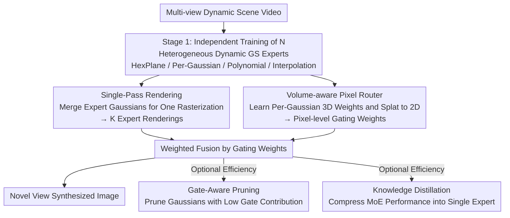

# MoE-GS: Mixture of Experts for Dynamic Gaussian Splatting

**Conference**: ICLR 2026  
**arXiv**: [2510.19210](https://arxiv.org/abs/2510.19210)  
**Code**: [https://cvsp-lab.github.io/MoE-GS](https://cvsp-lab.github.io/MoE-GS)  
**Area**: 3D Vision / Dynamic Scene Reconstruction  
**Keywords**: 3D Gaussian Splatting, dynamic scene, mixture of experts, novel view synthesis, knowledge distillation

## TL;DR
MoE-GS is the first framework to introduce the Mixture of Experts architecture into dynamic Gaussian Splatting. By employing a Volume-aware Pixel Router to adaptively fuse heterogenous deformation priors (HexPlane, per-Gaussian, polynomial, and interpolation), it consistently outperforms SOTA on N3V and Technicolor datasets while maintaining efficiency through single-pass rendering, gate-aware pruning, and knowledge distillation.

## Background & Motivation

**Background**: Novel view synthesis for dynamic scenes has expanded from NeRF to 3DGS, leading to various dynamic Gaussian methods: MLP deformation networks (4DGaussians, E-D3DGS), polynomial motion models (STG), and interpolation methods (Ex4DGS).

**Limitations of Prior Work**: Empirical analysis reveals three levels of inconsistency: (a) **Scene-level**—different methods perform inconsistently across various scenes with no single optimal solution; (b) **Spatial-level**—different regions within the same scene are best reconstructed by different methods; (c) **Temporal-level**—the optimal method changes dynamically over frames in the same video.

**Key Challenge**: Each deformation model possesses specific inductive biases—HexPlane is suitable for low-motion areas, per-Gaussian embeddings for fast consistent flow, polynomials for global smooth motion, and interpolation for local diverse motion. Real-world scenes typically contain mixed motion patterns that a single method cannot fully cover.

**Goal**: Adaptively fuse multiple heterogeneous dynamic Gaussian experts, enabling the model to automatically select the most appropriate deformation prior for different spatial and temporal regions.

**Key Insight**: Drawing from the MoE architecture, each dynamic GS method is treated as an expert, with a router designed for adaptive fusion at the pixel level. A critical challenge is that the router needs to perceive both 3D volumetric information and 2D pixel information simultaneously.

**Core Idea**:Project per-Gaussian 3D routing weights into pixel space via differentiable weight splatting to achieve volume-aware adaptive expert fusion.

## Method

### Overall Architecture
MoE-GS addresses the issue that no single dynamic Gaussian method is optimal across all scenes, regions, and time steps by treating heterogeneous deformation models as experts and employing a router for automatic selection and fusion at the pixel level. The process consists of two stages: first, $N$ dynamic Gaussian experts (HexPlane embedding, per-Gaussian embedding, polynomial, interpolation, etc.) are trained independently; then, the parameters of all experts are frozen, and a Volume-aware Pixel Router is trained separately. During inference, all expert Gaussians are merged for a single-pass rendering to obtain $K$ expert channels. The router generates gating weights for each pixel to merge these channels into a final image. For deployment, Gate-Aware Pruning or knowledge distillation can be selectively applied to enhance efficiency.

### Key Designs

**1. Volume-aware Pixel Router: Pixel-level Fusion with 3D-feature Decision Making**

The router is the core of the method, determining which expert to trust for each pixel. Naive approaches have flaws: a purely 2D Pixel Router using an MLP lacks volume awareness and produces over-smoothed results (PSNR only 31.12); a Volume Router directly adjusting Gaussian opacity in 3D space is difficult to optimize and unstable (32.05). This paper adopts a compromise of "learning 3D weights but optimizing in 2D": learning a set of per-Gaussian weights $\bm{w}_i^{per} = [w_i, w_i^{dir}, (t \cdot w_i^{time})]^T$ that encode base, view-dependent, and time-dependent components, respectively. These 3D weights are then projected via Gaussian splatting to 2D pixels to obtain $w_{2D}(u)$, which are refined by a lightweight MLP and normalized via softmax to produce gating weights $G'_k(u)$. This allows optimization in stable 2D space while decisions carry 3D volumetric context, improving PSNR to 33.23.

**2. Single-Pass Rendering: Rendering N Experts Once**

Rendering each expert separately and then fusing them would cause overhead to grow linearly with the number of experts. This method merges all expert Gaussians into a single batch for one projection and rasterization. A one-hot expert identity vector $e_j \in \mathbb{R}^K$ is attached to each Gaussian. During the alpha blending stage, color is diverted to the corresponding expert channel based on identity:

$$C_k(u) = \sum_j T_j(u) \alpha_j(u) c_j \cdot (e_j)_k$$

A single blending operation yields rendering results for all $K$ experts simultaneously for weighted fusion. This modification increases FPS from 40 to 68 (Table 5).

**3. Gate-Aware Pruning: Removing Non-contributing Gaussians**

Merging experts results in a large total number of Gaussians, but many exist in regions where gating weights are low, having negligible impact on the final image. This paper measures the importance of each Gaussian using the gradient of gating weights with respect to per-Gaussian weights, accumulated into an elimination score $\mathcal{E}_i = \frac{1}{|\mathcal{D}|} \sum_v \|\frac{\partial G'_k(v)}{\partial \bm{w}_i^{per}(v)}\|$. Gaussians with scores below a threshold are pruned. This criterion aligns with the MoE fusion objective; hence, pruning 55% of Gaussians results in only a 0.02 dB drop in PSNR, while FPS increases from 44 to 83 and memory usage drops from 878 MB to 351 MB.

**4. Knowledge Distillation: Compressing MoE Performance into a Single Expert**

When $N \ge 4$, the multi-expert inference overhead increases. Distillation aims to make a single expert $E_k$ approximate MoE quality by using gating weights to partition image supervision:

$$\mathcal{L}_k^{KD} = \lambda \cdot \mathcal{L}(G'_k \cdot I_{E_k}, G'_k \cdot I_{GT}) + (1-\lambda) \cdot \mathcal{L}((1-G'_k) \cdot I_{E_k}, (1-G'_k) \cdot I_{MoE})$$

Regions where the router deems the expert proficient (high weight) are supervised by GT; lower weight regions use the MoE fused output as pseudo-labels. Thus, the single expert learns ground truth for its strengths and "borrows" capabilities from other experts via the MoE for its weaknesses.

### Loss & Training
Reconstruction uses standard 3DGS losses ($L_1 + SSIM$). Training is conducted in two stages: Stage 1 involves independent training of experts, and Stage 2 freezes experts to train the router only. Notably, experts do not need to fully converge—even if each expert uses only 20% of the training budget, the fused MoE still outperforms any single expert trained with 100% budget.

## Key Experimental Results

### Main Results

| Method | N3V Avg. PSNR↑ | Technicolor Avg. PSNR↑ |
|------|---------------|---------------------|
| 4DGaussians | 31.43 | 30.79 |
| E-D3DGS | 32.33 | 33.06 |
| STG | 31.92 | 33.69 |
| Ex4DGS | 32.10 | 33.45 |
| **Ours (N=3)** | **33.23** | **34.55** |
| **Ours (N=4)** | **33.27** | - |

MoE-GS (N=3) improves upon the strongest single expert, E-D3DGS, by 0.9 dB PSNR.

### Ablation Study

| Router Variant | PSNR↑ | SSIM↑ |
|------------|------|------|
| Pixel Router | 31.12 | 0.952 |
| Volume Router | 32.05 | 0.951 |
| **Volume-aware Pixel Router** | **33.23** | **0.954** |

| Efficiency Strategy | PSNR | FPS | Memory (MB) |
|---------|------|-----|-------------|
| w/o both | 32.54 | 36 | 747 |
| Full MoE-GS (N=3) | 33.23 | 68 | 270 |

### Key Findings
- **Expert Diversity Matters**: Improvement from $N=2 \to 3$ is significant (+0.69 dB), whereas $N=3 \to 4$ is smaller (+0.04 dB).
- **Effectiveness with Low Training Budgets**: MoE-GS with 20% training budget (32.60) still outperforms any single expert with 100% budget.
- **Router Visualization**: Routing weights semantically correspond to motion patterns—high-motion regions tend to select per-Gaussian deformation experts.
- Distilled single experts can achieve performance close to the full MoE.

## Highlights & Insights
- **Splatting as Routing**: Cleverly reuses the 3DGS splatting mechanism for routing weight propagation—learning 3D weights but optimizing and fusing in 2D space gains both volume awareness and optimization stability.
- **Complementary Heterogeneous Experts**: Different deformation priors (embedding/polynomial/interpolation) have unique advantages in different motion regions; the MoE architecture is naturally suited for this complementarity.
- **Complete Efficiency Toolbox**: Provides a full deployment path from high quality to high efficiency, including single-pass rendering, gate-aware pruning, and full distillation.

## Limitations & Future Work
- The MoE framework increases parameter count and training costs ($N$ experts = $N$ times training time, though this can be mitigated to 20%).
- Two-stage training (experts then router) is not joint end-to-end optimization, which may not be strictly optimal.
- The expert combination is a manually selected fixed set; automatic expert selection/construction remains unexplored.
- Validated only on multi-view video datasets; not yet extended to monocular dynamic scenes.

## Related Work & Insights
- **vs 4DGaussians**: 4DGaussians uses HexPlane embeddings for deformation, performing well in low-motion but poorly in high-motion scenes; MoE-GS automatically selects the appropriate expert.
- **vs STG**: STG uses a polynomial model for trajectories, providing global smoothness but lacking local detail; it contributes its global prior as an MoE expert.
- **vs E-D3DGS**: E-D3DGS is the strongest single baseline (32.33), but MoE-GS reaches 33.23 after fusing multiple experts.

## Rating
- Novelty: ⭐⭐⭐⭐ First to introduce MoE to dynamic GS; Volume-aware Pixel Router is elegantly designed.
- Experimental Thoroughness: ⭐⭐⭐⭐⭐ Two standard benchmarks, multiple $N$ configurations, comprehensive ablations, efficiency analysis, and distillation evaluation.
- Writing Quality: ⭐⭐⭐⭐ Depth in motivation (three-level analysis) and clear method description.
- Value: ⭐⭐⭐⭐ MoE+GS is a promising direction, though generalizability requires further validation.

<!-- RELATED:START -->

## Related Papers

- [\[ICLR 2026\] Point-MoE: Large-Scale Multi-Dataset Training with Mixture-of-Experts for 3D Semantic Segmentation](point-moe_large-scale_multi-dataset_training_with_mixture-of-experts_for_3d_sema.md)
- [\[ICLR 2026\] ODE-GS: Latent ODEs for Dynamic Scene Extrapolation with 3D Gaussian Splatting](ode-gs_latent_odes_for_dynamic_scene_extrapolation_with_3d_gaussian_splatting.md)
- [\[ICLR 2026\] Mobile-GS: Real-time Gaussian Splatting for Mobile Devices](mobile-gs_real-time_gaussian_splatting_for_mobile_devices.md)
- [\[ICLR 2026\] Fracture-GS: Dynamic Fracture Simulation with Physics-Integrated Gaussian Splatting](fracture-gs_dynamic_fracture_simulation_with_physics-integrated_gaussian_splatti.md)
- [\[ICLR 2026\] SSD-GS: Scattering and Shadow Decomposition for Relightable 3D Gaussian Splatting](ssd-gs_scattering_and_shadow_decomposition_for_relightable_3d_gaussian_splatting.md)

<!-- RELATED:END -->
