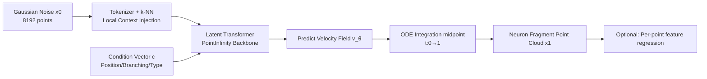

# MoGen: Detailed Neuronal Morphology Generation via Point Cloud Flow Matching

**Conference**: ICLR 2026  
**OpenReview**: [https://openreview.net/forum?id=HpIxllcNtb](https://openreview.net/forum?id=HpIxllcNtb)  
**Code**: [https://mogen-release.web.app/](https://mogen-release.web.app/)  
**Area**: 3D Point Cloud Generation / Computational Neuroscience / Connectomics  
**Keywords**: Flow matching, Point cloud generation, Neuronal morphology, Connectomics, Synthetic data augmentation  

## TL;DR
MoGen utilizes flow matching on high-resolution 3D point clouds to generate realistic mouse cortical axon/dendrite fragment morphologies. By feeding millions of synthetic samples into a shape plausibility classifier within a production-grade connectome reconstruction pipeline, it reduces residual reconstruction errors by 4.4%, equivalent to saving approximately 157 person-years of manual proofreading for whole-brain reconstruction.

## Background & Motivation
**Background**: Connectomics aims to reconstruct complete wiring diagrams of neurons from nanoscale electron microscopy (EM) volume data. While automated segmentation has progressed significantly, residual segmentation errors (split/merge errors) must be fixed via manual "proofreading." With PB-scale datasets, the cost of manual proofreading for a single mouse brain is estimated at billions of dollars, becoming a bottleneck for the field. One root cause is the lack of high-quality training data for algorithmic components responsible for judging local shape plausibility (such as the SHAPE classifier in the PATHFINDER pipeline).

**Limitations of Prior Work**: Generative modeling for neuronal morphology remains in its infancy. Existing data-driven methods rely on simplified representations: MorphGrower/MorphVAE generate sparse skeletons (topology without surface details), MorphOcc generates coarse occupancy maps, and PointNeuron approximates membrane surfaces with points assigned radii. These methods discard high-frequency surface details—such as dendritic spines and caliber variations—which are critical for reconstruction and simulation tasks.

**Key Challenge**: Neurons are topologically tree-like and span large volumes in space, yet they occupy extremely small physical volumes (somata are tens of microns, while axons can extend for millimeters). This geometry causes dense voxel-based generation methods to explode in computation and memory at high resolutions. To preserve detail, a more efficient representation must be adopted.

**Goal**: To develop the first generative model capable of producing high-resolution, biologically plausible 3D morphologies of neuron fragments and demonstrate its utility within a production-grade reconstruction pipeline.

**Core Idea**: ① **Point Clouds + Flow Matching** are used to efficiently encode sparse, high-frequency membrane surface geometry; ② **Local geometric context** (k-NN relative coordinates) is injected into a scalable Latent Transformer backbone to recover local information lost in cross-attention; ③ **Millions of synthetic samples are used to co-train** a downstream plausibility classifier, translating generation quality directly into a reduction of reconstruction errors.

## Method

### Overall Architecture
MoGen models neuronal morphology as a local point cloud of 8192 points (normalized within a 10 µm radius centered on a skeleton node). Generation occurs in two stages: first, a conditional flow matching model generates 3D point coordinates, followed by an optional regression model to predict per-point features. The generative backbone is a linear-complexity PointInfinity designed for large point clouds (cross-attention between point tokens and a fixed number of latent tokens). MoGen injects k-NN local geometric context at the input and uses controllable condition vectors to drive interpretable morphological manipulation.

### Key Designs
**1. Conditional Flow Matching on Point Clouds: Learning High-Resolution Geometry with Minimal Objectives.** The model trains a velocity field $v_\theta$ to transport a simple prior $P_0$ (standard Gaussian) to the true data distribution $P_1$. Linear interpolation $x_t=(1-t)x_0+tx_1$ is performed between a real sample $x_1\sim P_1$ and noise $x_0\sim P_0$. The objective is to predict the constant velocity vector $v=x_1-x_0$, resulting in a concise mean squared error loss $L=\mathbb{E}_{t,x_0,x_1,c}\|v-v_\theta(x_t,t,c)\|^2$. During generation, an ODE $\frac{dx_t}{dt}=v_\theta(x_t,t,c)$ is integrated from $t=0$ to $t=1$ using a midpoint solver. Compared to GANs, VAEs, or diffusion models, flow matching offers simpler training, higher inference efficiency, and scales to the 8192 points required for neuronal details—a resolution where many quadratic-complexity models fail.

**2. k-NN Relative Coordinate Injection: Recovering Local Communication Lost in Cross-Attention.** The authors identified a bottleneck in PointInfinity: global cross-attention makes the contribution of each point token to the latent tokens independent of its geometric neighbors, leading to artifacts like floating point clusters. The fix is lightweight—finding $k$ nearest neighbors for each input point and concatenating their relative 3D coordinates as extra features. This introduces mature local geometric inductive biases from point cloud literature, proved critical for high-fidelity morphology, while adding <15% training time. The trade-off is that the model becomes resolution-dependent, breaking the native resolution invariance of PointInfinity (though it shows some generalization to higher resolutions unseen during training).

**3. Controllable Conditional Generation: Linking Interpretable Morphological Attributes to the Latent Flow.** By concatenating projected condition vectors $c$ to the latent flow tokens (similar to PointInfinity's condition tokens), global morphological properties can be manipulated: position and distribution (9D: mean + 6 independent elements of the covariance matrix), branching complexity (1D: number of leaves in a Minimum Spanning Tree (MST) on 256 subsampled points, acting as a proxy for terminal branches), and neurite type (axon/dendrite, ±1). A binary mask indicates which dimensions of $c$ are active, supporting unconditional generation, subset conditioning, and smooth interpolation between axons and dendrites (where details like dendritic spines naturally emerge during interpolation). Classifier-Free Guidance (CFG) allows for tuning the balance between "fidelity to conditions" and "diversity."

**4. Interpretable Evaluation Suite for Neurons: Mapping Metrics to Quality.** Standard point cloud metrics (Chamfer distance, FID) are inadequate for neurons—biologically plausible changes in branching angles can result in large Chamfer distances. The authors instead compare the distributions of real and generated sets across 10 rotation-invariant interpretable features using Maximum Mean Discrepancy (MMD): global shape (4D: distance of centroid to origin + standard deviation along the first three principal components), local/global point density (4D: mean and std of nearest/farthest neighbor distances), and topology (2D: total weight of the full-point MST ≈ path length, longest edge ≈ sensitivity to fragmentation). The authors validated that MMD correlates with training loss and human perception in user studies, and a linear classifier on these 10 features can distinguish axons/dendrites with 99.3% accuracy.

## Key Experimental Results

### Main Results (Generation Quality, 500k steps)

| Configuration | MMD ↓ | Low-noise segment loss t∈[0.8,0.9] ↓ |
|------|-------|------|
| **Ours (Full MoGen)** | **3.54** | **0.709** |
| – w/o k-NN (Baseline) | 4.27 | 0.712 |
| – Half Width | 6.97 | 0.711 |
| – Half Depth | 9.94 | 0.711 |
| – w/ Linear schedule | 5.12 | - |

Full training for 1 million steps further reduced the final model MMD to **3.08**.

### Downstream Reconstruction Impact (PATHFINDER Pipeline)

| Training Data | Optimal Config Error Rate (errors/mm) ↓ |
|------|------|
| Real data only | 0.7947 |
| Real + MoGen Synthetic (10% negative sample replacement) | **0.7595** |

The error rate decreased by **4.4%**, simultaneously improving both split and merge errors and establishing a new Pareto frontier. Scaled to a whole brain, this saves approximately **157 person-years** of manual proofreading.

### Ablation Study / Key Findings
- **k-NN injection is the primary driver of quality**: Removing it increased MMD from 3.54 to 4.27 and worsened loss in the low-noise segment (the detail formation phase).
- **Model capacity is necessary**: Halving the width or depth caused MMD to deteriorate to 6.97 and 9.94, respectively.
- **Cosine schedule outperforms linear**: The linear schedule yielded an MMD of 5.12.
- **There is a "sweet spot" for synthetic data replacement**: 10% replacement is optimal; excessive ratios lead to performance drops, suggesting unique information in the real data distribution remains irreplaceable.
- **CFG Trade-off**: As guidance strength moved from -1.0 to 1.0, the fidelity rank improved from 5.90 to 1.20, while the diversity rank regressed from 3.70 to 4.10.

## Highlights & Insights
- **Generative models as engines for real-world scientific pipelines**: Rather than optimizing purely for generative metrics, the work provides an end-to-end proof that synthetic data reduces errors in production-grade connectome reconstruction, quantifying the impact in person-year costs. This "closed-loop application" is rare in generative AI papers.
- **A minimal modification solves a major architectural flaw**: Injecting k-NN relative coordinates adds <15% training time but resolves the local information bottleneck of global cross-attention—a textbook example of "accurate diagnosis + minimal intervention."
- **Tailored evaluation for the domain**: By identifying the unsuitability of Chamfer/FID for neurons and switching to rotation-invariant interpretable features + MMD, the authors cross-validated metric effectiveness through training loss correlation, 99.3% linear separability, and user studies.
- **Scientific value of controllable generation**: Smooth interpolation between axons and dendrites allows for counterfactual analysis (e.g., "what would this look like with higher spine density"), which is useful for generating neuroscience hypotheses.

## Limitations & Future Work
- **No guarantee of topological correctness**: The model occasionally generates fragments with unrealistic loops or disconnected components, as flow matching loss does not explicitly constrain topology. Currently, this requires post-processing/filtering via the longest MST edge.
- **k-NN breaks resolution invariance**: The model becomes resolution-dependent. While it generalizes to some higher resolutions, it loses the native invariance of PointInfinity.
- **Limited to local fragments**: The model generates fragments of ~10 µm radius and 8192 points. Scaling to full millimeter-scale neurons with millions of points would require hierarchical methods to maintain global consistency.
- **Unoptimized synthetic samples**: Downstream tasks currently use unconditional samples. Future work could focus on generating samples specifically "most helpful for co-training," conditioning on transcriptomic embeddings to generate full 3D morphologies, or generating synthetic EM images to augment segmentation models.

## Related Work & Insights
- **Automated Connectome Reconstruction**: The SHAPE classifier in PATHFINDER (Januszewski et al., 2025) judges the biological plausibility of aggregated segments in 3D point clouds. Its performance is limited by the volume of high-quality proofread data—the exact bottleneck MoGen addresses.
- **Neuronal Morphology Generation**: Progresses from rule-based/biophysical simulations to deep learning (MorphGrower, MorphVAE, PointNeuron, MorphOcc), but these remain stuck in coarse representations (skeletons/occupancy maps). MoGen is the first to generate high-resolution fragments with surface details like spines.
- **3D Point Cloud Generation**: While GANs/VAEs/Diffusion have been adapted for point clouds, flow matching is simpler to train and more efficient to infer. MoGen builds upon PointInfinity's point-latent token cross-attention for linear scaling.
- **Insights**: ① "Diagnosing architectural bottlenecks → injecting inductive bias via minimal modifications" is a robust methodology; ② Co-training with synthetic data has a sweet-spot ratio; ③ Evaluation metrics must be tailored to domain-specific invariants/topology and cross-validated against human perception.

## Rating
- **Novelty**: ⭐⭐⭐⭐ First high-resolution neuron fragment point cloud generation + real pipeline integration; architectural change (k-NN injection) is incremental but the problem definition is highly novel.
- **Experimental Thoroughness**: ⭐⭐⭐⭐ Includes architecture/capacity/schedule ablations, CFG trade-offs, synthetic ratio scans, user studies, and 99.3% separability checks. Quantifies production error rates and economic costs. Lacks comparison with general point cloud baselines at identical resolutions (justified by computational feasibility).
- **Writing Quality**: ⭐⭐⭐⭐ Clear narrative (Motivation—Conflict—Method—Deployment). Figures and interpretable features are well explained; some details are deferred to appendices.
- **Value**: ⭐⭐⭐⭐⭐ Directly translates a generative model into a reduction in connectome reconstruction error and a saving of hundreds of person-years, providing tangible value to neuroscience and science-oriented generative AI.

<!-- RELATED:START -->

## Related Papers

- [\[AAAI 2026\] Class-Partitioned VQ-VAE and Latent Flow Matching for Point Cloud Scene Generation](../../AAAI2026/3d_vision/class-partitioned_vq-vae_and_latent_flow_matching_for_point_cloud_scene_generati.md)
- [\[ICLR 2026\] Spiking Discrepancy Transformer for Point Cloud Analysis](spiking_discrepancy_transformer_for_point_cloud_analysis.md)
- [\[CVPR 2026\] UniPixie: Unified and Probabilistic 3D Physics Learning via Flow Matching](../../CVPR2026/3d_vision/unipixie_unified_and_probabilistic_3d_physics_learning_via_flow_matching.md)
- [\[ICLR 2026\] RayI2P: Learning Rays for Image-to-Point Cloud Registration](rayi2p_learning_rays_for_image-to-point_cloud_registration.md)
- [\[CVPR 2026\] Optical Flow Matching: Reframing Optical Flow as Continuous Transport Dynamics](../../CVPR2026/3d_vision/optical_flow_matching_reframing_optical_flow_as_continuous_transport_dynamics.md)

<!-- RELATED:END -->
