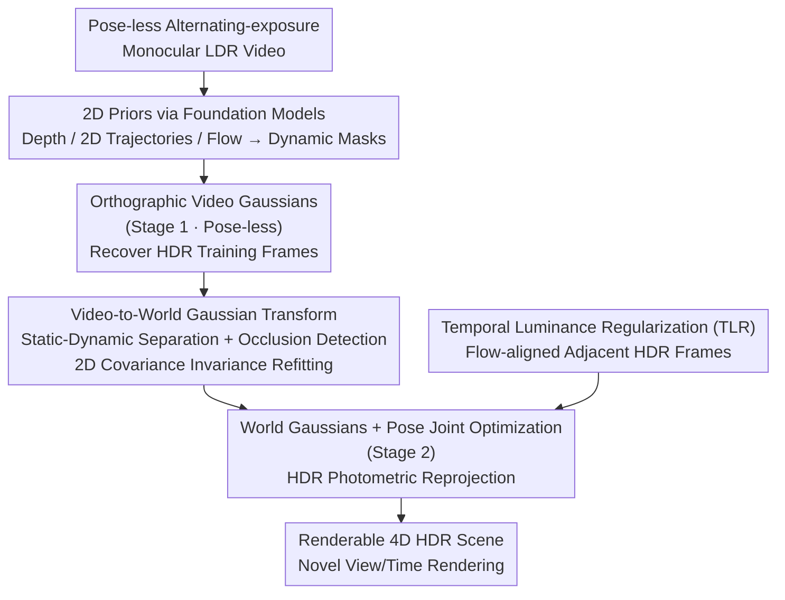

# Mono4DGS-HDR: High Dynamic Range 4D Gaussian Splatting from Alternating-exposure Monocular Videos

**Conference**: ICLR 2026  
**arXiv**: [2510.18489](https://arxiv.org/abs/2510.18489)  
**Code**: [https://liujf1226.github.io/Mono4DGS-HDR](https://liujf1226.github.io/Mono4DGS-HDR)  
**Area**: 3D Vision / HDR Reconstruction  
**Keywords**: 4D Gaussian Splatting, HDR, monocular video, alternating exposure, dynamic scene

## TL;DR
This work is the first to address the problem of reconstructing renderable 4D HDR scenes from pose-less alternating-exposure monocular videos. Through a two-stage optimization (orthographic video space → world space), a Video-to-World Gaussian transformation strategy, and temporal luminance regularization, it achieves 37.64 dB HDR PSNR and 161 FPS on synthetic data, significantly outperforming existing methods.

## Background & Motivation

**Background**: While 4D dynamic scene reconstruction (especially based on 3DGS) has progressed and HDR reconstruction methods (GaussHDR, HDR-HexPlane) exist, the combination—4D HDR reconstruction from monocular alternating-exposure videos—remains unsolved.

**Limitations of Prior Work**: (a) Alternating exposure causes inconsistent brightness in adjacent frames, leading to the failure of standard photometric reprojection for camera pose estimation. (b) 2D priors (tracking, depth, optical flow) are noisy between frames with varying brightness. (c) Existing dynamic methods (SplineGS, MoSca) are designed for constant-luminance videos; directly adding an HDR head yields poor results. (d) HDR methods (GaussHDR) require known poses and multi-view setups.

**Key Challenge**: Alternating brightness → difficult pose estimation → unstable geometry → inconsistent HDR appearance. This creates a vicious cycle.

**Key Insight**: Train "Video Gaussians" in an orthographic camera coordinate space first to bypass pose estimation and recover HDR training frames. These recovered HDR frames are then used for photometric reprojection to estimate poses, followed by a transformation into world space for joint optimization.

**Core Idea**: A two-stage decoupling—solving for HDR in orthographic space first, followed by solving for poses and 3D geometry in world space, bridged by a Video-to-World transformation.

## Method

### Overall Architecture
This paper aims to reconstruct a freely renderable 4D HDR dynamic scene from a monocular video without camera poses and with alternating exposure across frames. The core difficulty is that alternating exposure breaks conventional "brightness constancy" for pose estimation. The authors decompose the problem into two parts: Stage 1 bypasses poses by training "Video Gaussians" in an orthographic space (without intrinsic/extrinsic parameters) to recover the HDR appearance of each frame. Stage 2 uses the recovered HDR frames for photometric reprojection to estimate poses, moving the Gaussians to world space for joint optimization with the poses.

The pipeline is as follows: Input video undergoes preprocessing (DepthCrafter for depth, SpatialTracker for 2D trajectories, RAFT for optical flow and dynamic masks). Stage 1 trains Video Gaussians in orthographic space for 4K iterations to produce HDR training images. A Video-to-World transformation then moves the Gaussians into world space (including dynamic-static separation and shape refitting). Stage 2 jointly optimizes Gaussians and camera poses in world space for 11K iterations, constrained by temporal luminance regularization to ensure consistent HDR appearance, resulting in the final 4D HDR scene.

### Key Designs

**1. Orthographic Video Gaussians (Stage 1): Pose-Free HDR Recovery**

Pose estimation is unreliable under alternating exposure. Using perspective projection, which requires camera parameters, would distort geometry due to incorrect poses. Instead, the authors use orthographic projection: Gaussians are defined directly in the video coordinate system, where $(x^v, y^v) \in [-1,1]^2$ are normalized pixel coordinates and $z^v$ is depth. This projection does not depend on camera extrinsics. Stage 1 thus bypasses pose estimation to focus on recovering consistent dynamic geometry and HDR appearance, providing "clean" consistent-luminance frames for subsequent pose estimation.

**2. Video-to-World Gaussian Transformation: Lossless Migration to World Space**

Video Gaussians exist only in the orthographic video space. To optimize in world space, they must be transformed, with dynamic objects and static backgrounds processed separately using dynamic masks and occlusion detection. A major challenge is that if Video Gaussian scales $S^v$ are directly moved to world space, their 2D shapes warp when projected back. The authors propose **2D Covariance Invariance Scale Refitting**—instead of inheriting scales, they solve for a world-space scale $S^w$ that minimizes the difference between its projected 2D covariance and the original 2D shape from video space:

$$\min_{S^w} \sum_t \|\Sigma'^v_t - \Sigma'^w_t\|_2$$

This ensures that while coordinates change, the visual appearance of each Gaussian remains consistent, preventing distortion during migration.

**3. HDR Photometric Reprojection Loss (Stage 2): Leveraging Stage 1 for Poses**

In Stage 2, the authors use the HDR frames recovered in Stage 1 for photometric reprojection to jointly optimize camera poses and world-space Gaussians. Standard photometric reprojection fails on alternating-exposure LDR frames due to luminance inconsistency, but the recovered HDR frames are consistent, making this classic constraint viable again. This closes the loop of the two-stage design: the HDR solved in Stage 1 supports pose estimation in Stage 2. Combined with the initialization from Video Gaussians, Stage 2 convergence is significantly accelerated with higher quality.

**4. Temporal Luminance Regularization (TLR): Temporal Coherence in HDR**

Since frames have different latent exposures, supervising RGB frame-by-frame doesn't guarantee temporal consistency in the HDR irradiance domain, which can cause flickering. TLR aligns adjacent HDR frames using rendered optical flow and penalizes inconsistencies:

$$\mathcal{L}_{tlr} = \left|V \odot \frac{\tilde{H}_{t-1 \to t} - \tilde{H}_t}{\tilde{H}_{t-1 \to t} + \tilde{H}_t}\right| \dots$$

where $V$ is the valid area mask. The normalization in the denominator is key: HDR irradiance scales can be massive; dividing the difference by the sum cancels out the absolute scale and penalizes only relative change, making it effective across any dynamic range. Ablations confirm this specifically maintains temporal consistency rather than sharpness—removing TLR leaves PSNR nearly unchanged (-0.06) but degrades TAE from 0.057 to 0.071.

### Loss & Training
$\mathcal{L} = \lambda_{rgb}\mathcal{L}_{rgb} + \lambda_{ue}\mathcal{L}_{ue} + \lambda_{dep}\mathcal{L}_{dep} + \lambda_{track}\mathcal{L}_{track} + \lambda_{arap}\mathcal{L}_{arap} + \lambda_{vel}\mathcal{L}_{vel} + \lambda_{acc}\mathcal{L}_{acc} + \lambda_{tlr}\mathcal{L}_{tlr} + \lambda_{pr}\mathcal{L}_{pr}$

Dynamic representation: Cubic Hermite splines (position) + cubic polynomials (rotation). Total training time is approximately 1.5 hours.

## Key Experimental Results

### Main Results

| Method | Syn-Exp-3 HDR PSNR↑ | Syn-Exp-3 TAE↓ | FPS↑ |
|------|-------------------|---------------|------|
| GaussHDR† | 31.25 | 0.089 | 51 |
| HDR-HexPlane† | 29.60 | 0.155 | 1 |
| MoSca-HDR‡ | 36.89 | 0.059 | 82 |
| **Mono4DGS-HDR** | **37.64** | **0.057** | **161** |

| Method | Real-Exp-2 PSNR↑ | Real-Exp-2 TAE↓ | Real-Exp-3 PSNR↑ | Real-Exp-3 TAE↓ |
|------|-----------------|----------------|-----------------|----------------|
| MoSca-HDR‡ | 30.28 | 0.054 | 27.23 | 0.076 |
| **Mono4DGS-HDR** | **31.82** | **0.046** | **27.65** | **0.067** |

### Ablation Study

| Configuration | Syn-Exp-3 HDR PSNR | Syn-Exp-3 TAE |
|------|-------------------|---------------|
| w/o Video Gaussian Init | 36.07 (-1.57) | 0.057 |
| w/o Occlusion Handling | 37.22 (-0.42) | 0.059 |
| w/o 2D Covariance Invariance | 37.25 (-0.39) | 0.057 |
| w/o TLR | 37.58 (-0.06) | **0.071** (+0.014) |
| **Full Model** | **37.64** | **0.057** |

### Key Findings
- **Video Gaussian Init is the most critical**: Removing it drops HDR PSNR by 1.57 dB, proving the two-stage strategy is the cornerstone of the method.
- **TLR is vital for temporal consistency**: It has minimal impact on PSNR (-0.06) but improves TAE by 24.6%.
- **FPS Leadership**: At 161 FPS, it is twice as fast as MoSca-HDR (82 FPS).
- Constant-exposure methods (SplineGS/GFlow) with an added HDR head perform poorly (PSNR 17.59 or failure).

## Highlights & Insights
- **Wisdom of Two-stage Decoupling**: Decoupling HDR recovery from 3D reconstruction—solving HDR in a simplified space (orthographic/pose-less) then using the brightness consistency to aid world-space 3D reconstruction (pose estimation). This strategy breaks the vicious cycle of alternating exposure.
- **2D Covariance Invariance**: Maintaining the projected 2D shape during the transformation from video to world space is a simple yet crucial constraint to avoid geometric distortion.
- **Normalized Difference for Temporal Regularization**: Using $\frac{H_1 - H_2}{H_1 + H_2}$ eliminates the impact of absolute HDR scales, focusing only on relative changes, which is suitable for any dynamic range.

## Limitations & Future Work
- Complexity: Relies on multiple preprocessing models (DepthCrafter + SpatialTracker + RAFT), which might introduce accumulated errors.
- Limited Exposure Patterns: Currently supports 2-3 alternating exposure patterns; more complex or random exposure strategies remain unexplored.
- Training Time: 1.5 hours is still long for real-time application scenarios.
- Evaluation: While HDR GT is available for synthetic data, real-world evaluation relies on LDR metrics due to the lack of HDR GT.

## Related Work & Insights
- **vs GaussHDR**: GaussHDR requires known poses and multi-view for static scenes; Mono4DGS-HDR handles dynamic scenes, monocular input, and unknown poses.
- **vs MoSca-HDR**: MoSca is based on constant exposure; its HDR-augmented version lacks the specialized two-stage strategy of this work.
- **vs HDR-HexPlane**: A NeRF-based dynamic HDR method that renders at only 1 FPS, whereas this work achieves 161 FPS.

## Rating
- Novelty: ⭐⭐⭐⭐⭐ Pioneering solution for 4D HDR reconstruction from alternating-exposure monocular videos.
- Experimental Thoroughness: ⭐⭐⭐⭐⭐ 25 scenes (synthetic + real), various exposure modes, and detailed ablations.
- Writing Quality: ⭐⭐⭐⭐ Complex method but clearly described with rich visualizations.
- Value: ⭐⭐⭐⭐⭐ Solves a core problem in practical HDR video reconstruction with 161 FPS real-time rendering.

<!-- RELATED:START -->

## Related Papers

- [\[ICLR 2026\] HDR-NSFF: High Dynamic Range Neural Scene Flow Fields](hdr-nsff_high_dynamic_range_neural_scene_flow_fields.md)
- [\[ICLR 2026\] Dynamic Novel View Synthesis in High Dynamic Range](dynamic_novel_view_synthesis_in_high_dynamic_range.md)
- [\[ICLR 2026\] ShapeGen4D: Towards High Quality 4D Shape Generation from Videos](shapegen4d_towards_high_quality_4d_shape_generation_from_videos.md)
- [\[ICLR 2026\] Uncertainty Matters in Dynamic Gaussian Splatting for Monocular 4D Reconstruction](uncertainty_matters_in_dynamic_gaussian_splatting_for_monocular_4d_reconstructio.md)
- [\[ICLR 2026\] MoE-GS: Mixture of Experts for Dynamic Gaussian Splatting](moe-gs_mixture_of_experts_for_dynamic_gaussian_splatting.md)

<!-- RELATED:END -->
