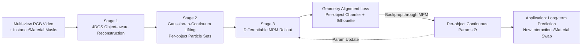

# MOSIV: Multi-Object System Identification from Video

**Conference**: ICLR 2026  
**OpenReview**: [https://openreview.net/forum?id=0ylAe3Orfy](https://openreview.net/forum?id=0ylAe3Orfy)  
**Code**: TBD (Code and datasets promised to be open-sourced)  
**Area**: 3D Vision / 4D Reconstruction / Differentiable Physical Simulation  
**Keywords**: System Identification, Differentiable MPM, 4D Gaussian Splatting, Continuous Constitutive Parameters, Multi-object Contact, Physical Simulation

## TL;DR
MOSIV formalizes "Multi-Object System Identification" as a task for the first time—simultaneously reconstructing the 4D geometry of each object from multi-view videos and **optimizing continuous constitutive material parameters per object** (stiffness, plasticity, friction). By driving a differentiable MPM simulator with geometry alignment losses, it moves beyond discrete modeling (selecting categories from a fixed material library) to replicate observations and predict long-term future dynamics in contact-heavy multi-object scenes.

## Background & Motivation
- **Background**: Identifying physical properties of objects from video (system identification) is fundamental for robotic manipulation and physically plausible scene editing. Prevailing methods (GIC, Spring-Gaus, PAC-NeRF, etc.) mostly assume **single-object, isolated motion** in controlled settings. The few works handling multiple materials, like OmniPhysGS, follow a "model selection" route—picking a category for each object from a **fixed library of expert constitutive models**.
- **Limitations of Prior Work**: The real world consists of "chaotic contact" scenes involving multi-object collisions, sliding, mutual occlusion, and coupled motions. Single-object methods fail directly, while discrete material classification only hits the "closest prototype," failing to provide the **continuous parameters** ($Young's modulus $E$, Poisson's ratio $\nu$, friction coefficient $\mu$) required for accurate physics. This leads to visually implausible simulations and long-term drift.
- **Key Challenge**: Object interaction is a "double-edged sword." Physical interaction provides rich signals to make hidden physical properties observable, yet it introduces occlusions and violent, complex motions. Moreover, **ambiguities such as stiffness versus friction cannot be distinguished by appearance alone**; one must analyze the evolution of geometry and motion over time. Multi-object scenarios also introduce "identity confusion at contact": when two objects are close in projection, losses may be incorrectly assigned across object boundaries.
- **Goal**: Given multi-view video, camera calibration, and instance masks, reconstruct the time-varying 4D geometry of all objects and identify their continuous physical parameters **per instance**. The result is a scene "digital twin" capable of replicating observations, predicting the future, and generalizing to new initial conditions or material combinations.
- **Core Idea**: **Replace "category selection" with "continuous parameter optimization" using a differentiable simulator.** Using geometry targets derived from video (per-object Chamfer + silhouette) as supervision, gradients are backpropagated through a differentiable MPM to directly fit continuous constitutive parameters per object rather than classifying from a discrete library.

## Method

### Overall Architecture
MOSIV is a three-stage pipeline: First, it reconstructs an **object-aware dynamic Gaussian field** from multi-view video (using instance and material masks to assign kernels to objects/materials). Second, it **lifts the Gaussian reconstruction into a simulatable set of continuum particles**. Finally, it rolls out a differentiable MPM from the initial particle state, using geometry alignment losses to align simulated surfaces/silhouettes with the reconstructed geometry, jointly optimizing the unknown physical parameters $\Theta$ for each object via backpropagation.

### Key Designs

**1. Object-aware Dynamic Gaussian Reconstruction: Decoupling material motion for each object.** The scene is represented by a set of canonical Gaussian kernels warped over time via low-rank temporal deformation: each kernel center evolves as $\boldsymbol{\mu}_t=\boldsymbol{\mu}+\sum_{b=1}^{B}\alpha_b(\boldsymbol{\mu})\,\boldsymbol{\psi}^{\mu}_b(t)$, where $\boldsymbol{\psi}_b$ and $\alpha_b$ are the time-varying basis and spatial gating produced by neural networks. The optimization target is multi-view photometric consistency $\mathcal{L}_1+\lambda_{\text{SSIM}}\mathcal{L}_{\text{SSIM}}+\lambda_r\|r_t\|_1$. Crucially, **kernels are partitioned by object using instance masks and by material type using material masks**. These labels are propagated to the simulator, explicitly decoupling which motion belongs to which object/material—a prerequisite for per-object identification.

**2. Multi-object Gaussian-to-Continuum Lifting: Ensuring physically usable contact interfaces.** Dynamic Gaussians are optimized for rendering and are spatially non-uniform, making them unsuitable as direct simulation particles. The method samples particles for each object from a thin occupancy field: points are randomly scattered within the Gaussian bounding box, filtered by multi-view rendered depth, and refined via an iterative density field (upsampling + mean filtering to blur boundaries + reassigning high density to voxels with particles to prevent erosion). Compared to single-object lifting, two constraints are added: **enforcing non-overlapping support between objects at initialization** (assigning overlapping voxels to the nearest surface and clearing residual intersections) and **maintaining material labels while aligning mesh resolutions** to ensure the contact interface fits—otherwise, objects might "stick" or interpenetrate, ruining contact mechanics.

**3. Multi-material Parameterization and Symmetric Friction Coupling: Per-instance, not per-category.** Each material $m$ is associated with a parameter vector $\theta_m$ controlling elastic, plastic, or viscous responses. To capture cross-material behavior while compressing degrees of freedom, Coulomb friction between materials $m$ and $m'$ is modeled as a symmetric combination $\mu_{m,m'}=g(\mu_m,\mu_{m'})$, where $g(a,b)=\tfrac12(a+b)$. The core stance is **assigning parameters per object**: each instance $k$ carries its own $\theta_k$. Even if two objects are the same material in reality, **parameter sharing is not enforced**—identifiability comes from the per-object geometry and silhouette constraints under interaction, allowing individual fitting even if deformation or contact responses differ.

**4. Per-object Geometry Alignment Loss: Solving "identity borrowing" at contact.** A core pitfall in multi-object scenarios is that simulation points on object $k$ can be "explained" by ground truth points of object $k'$ when calculating Chamfer/silhouette losses on a union set (especially during contact or projection overlap). This **masks parameter mis-identification** (e.g., making a soft object $k$ deform into $k'$) and yields overly optimistic rollouts. The solution is to decompose supervision to the object level: the geometry loss sums non-disjoint Chamfer distances for each object $\mathcal{L}^{\text{obj}}_{\text{CD}}(t)=\sum_{k=1}^{K}\big[d(P^{\text{sim}}_k,P^{\text{gt}}_k)+d(P^{\text{gt}}_k,P^{\text{sim}}_k)\big]$, and the silhouette loss aligns each object individually $\mathcal{L}^{\text{obj}}_{\alpha}(t,j)=\sum_{k=1}^{K}\|A^{\text{sim}}_{j,k}-\tilde{A}_{j,k}\|_1$. This prevents the optimizer from minimizing global loss by "exchanging mass/stiffness across objects in projection," providing sharper gradients during collisions and stick-slip transitions. The target is an average over time and viewpoints. Training employs a **curriculum of gradually increasing rollout horizons** and an update strategy that alternates parameter optimization with occasional particle state resynchronization to suppress drift.

## Key Experimental Results

### Main Results
Evaluated on the MOSIV Synthetic dataset (generated via Genesis engine, 45 multi-view videos of dual-object interactions, 10 geometries × 5 materials: Elastic E / Plastic P / Fluid F / Sand S, 11 views).

**Observable state simulation (reproducing observed frames) average metrics:**

| Method | PSNR↑ | SSIM↑ | CD↓ | EMD↓ |
|------|-------|-------|-----|------|
| OmniPhysGS-RGB (OPGS) | 25.93 | 0.945 | 11.79 | 0.095 |
| OPGS w/ Oracle (GT material categories) | 24.39 | 0.930 | 43.50 | 0.168 |
| **MOSIV (Ours)** | **30.51** | **0.977** | **1.256** | **0.049** |

**Future state simulation (long-term evolution beyond observed frames) average metrics:**

| Method | PSNR↑ | SSIM↑ | CD↓ | EMD↓ |
|------|-------|-------|-----|------|
| OmniPhysGS-RGB (OPGS) | 19.00 | 0.888 | 51.92 | 0.199 |
| OPGS w/ Oracle | 17.97 | 0.869 | 215.83 | 0.408 |
| **MOSIV (Ours)** | **28.26** | **0.963** | **3.710** | **0.071** |

MOSIV significantly outperforms all baselines across all metrics and material pairings; notably, it reduces CD from double-digit errors to single-digit or fractional levels.

### Ablation Study
Ablation on supervision granularity (6 scenes, one per inter-material type), comparing "scene-level vs. object-level" losses while toggling Chamfer $\mathcal{L}_{CD}$ and silhouette $\mathcal{L}_\alpha$ terms:

| Supervision Granularity | $\mathcal{L}_{CD}$ | $\mathcal{L}_\alpha$ | PSNR↑ | SSIM↑ | CD↓ | EMD↓ |
|----------|------|------|-------|-------|-----|------|
| Scene-level (naive) | ✗ | ✓ | 26.59 | 0.964 | 53.21 | 0.132 |
| Scene-level | ✓ | ✗ | 27.59 | 0.959 | 40.29 | 0.119 |
| Scene-level | ✓ | ✓ | 27.89 | 0.968 | 22.13 | 0.091 |
| **Object-level (ours)** | ✗ | ✓ | 30.18 | 0.975 | 0.985 | 0.045 |
| **Object-level** | ✓ | ✗ | 29.86 | 0.975 | 1.17 | 0.043 |
| **Object-level (full)** | ✓ | ✓ | **30.24** | **0.977** | **0.696** | **0.041** |

### Key Findings
- **Per-object supervision is the linchpin of stable optimization**: Under scene-level loss, CD remains high (22~53), reflecting unstable training due to "cross-object point borrowing" at contact. Switching to object-level loss drops CD below 1, proving it corrects contact handling and parameter mis-identification.
- **Discrete material selection drifts over time**: In long-term prediction, OPGS variants show fluids spreading excessively and sand diffusing unrealistically. Even the Oracle variant (with GT categories) performs worse over long horizons (leading to much larger CD) because the architecture only "selects categories," highlighting that the limitation lies in discrete modeling itself.
- **Single-source supervision is insufficient**: Using only Chamfer or only silhouette is inferior to combining both; geometry and silhouette provide complementary signals.
- **Generalizable to new interactions**: By fixing geometry/pose/velocity and swapping identified constitutive parameters, the MPM can produce physically plausible results consistent with the newly assigned stiffness/yield/friction.

## Highlights & Insights
- **Task-level Contribution**: Formalizes "Multi-Object System Identification" as a new task and releases a synthetic benchmark with ground-truth physical parameters—filling the gap left by prior work focused on single objects or discrete classification.
- **Paradigm Shift**: Transitions from "model selection within a fixed expert library" to "per-object continuous constitutive parameter optimization." This is a critical step toward physically credible and extrapolatable simulation. The fact that the Oracle variant still loses to MOSIV strongly demonstrates the ceiling of discrete modeling.
- **Precise Diagnosis of Contact Ambiguity**: Clearly identifies the failure mode where "projection interpenetration → cross-object point borrowing → masked mis-identification" occurs, and fixes it using per-object disjoint Chamfer/silhouette losses.
- **Complete Engineering Loop**: 4DGS Reconstruction → Occupancy lifting (with non-overlap constraints) → Differentiable MPM (contact + Coulomb friction) → Geometry alignment backpropagation. The entire pipeline is differentiable and stabilized with horizon curricula.

## Limitations & Future Work
- **Dependency on Predefined Constitutive Models**: Current parameters are optimized within known material families; results may be limited when encountering materials with unknown physics. The authors suggest moving toward **neural constitutive laws** to handle unknown materials.
- **High Optimization Cost and Sensitivity to Initial Geometry**: Differentiable MPM rollouts are computationally intensive and sensitive to the quality of the initial reconstruction, especially in cluttered or occluded scenes.
- **Verification on Synthetic Data Only**: Sim-to-real remains an open challenge; all experiments were conducted on Genesis synthetic data. Transitioning to real video (complex lighting, noise, real-world occlusions) is non-trivial.
- **Requirement for Instance and Material Masks**: Depends on masks extracted from video, which can be a bottleneck in scenarios where segmentation is difficult.

## Related Work & Insights
- **Comparison with OmniPhysGS**: Adapted as a video-driven SysID baseline (OmniPhysGS-RGB, replacing SDS with photometric loss). The "Oracle" upper bound design—where the baseline still fails even with ground truth categories—is a highly persuasive experimental setup.
- **Comparison with CoupNeRF**: Also targets multi-object SysID using implicit NeRF + differentiable MPM but is limited to free-fall. Qualitatively, CoupNeRF\* tends to turn plastic and sand into viscous fluids, losing material distinctiveness. This highlights the temporal consistency advantages of explicit Gaussian representations in contact-intensive scenarios.
- **Technical Lineage**: Dynamic Gaussian reconstruction follows the low-rank deformation 4DGS (Kratimenos et al.); lifting borrows from GIC (Cai et al. 2024); the differentiable MPM continues the lineage of Jiang/Hu/Du. MOSIV's novelty lies in integrating these into a "per-object continuous parameter identification + contact-aware" multi-object pipeline.
- **Inspiration**: The combination of differentiable simulation + explicit geometric representation is becoming an effective path for "video-to-physical digital twins." The idea of decomposing global loss to the instance level to eliminate identity ambiguity is valuable for any multi-target geometric supervision task.

## Rating
- **Novelty**: ⭐⭐⭐⭐ — First to formalize multi-object SysID and replace discrete selection with per-object continuous parameter optimization.
- **Experimental Thoroughness**: ⭐⭐⭐ — Covers synthetic benchmarks, dual tasks (observable/future), multi-material pairings, and ablation studies. Points deducted for **lacking real-world video validation**.
- **Writing Quality**: ⭐⭐⭐⭐ — Problem motivation, failure mode diagnosis, and methodology are all clear.
- **Value**: ⭐⭐⭐⭐ — Establishes a new task and strong baseline for physically plausible scene reconstruction/prediction; impact is slightly limited by the synthetic domain and computational cost.

<!-- RELATED:START -->

## Related Papers

- [\[NeurIPS 2025\] Gaussian-Augmented Physics Simulation and System Identification with Complex Colliders](../../NeurIPS2025/3d_vision/gaussian-augmented_physics_simulation_and_system_identification_with_complex_col.md)
- [\[AAAI 2026\] STMI: Segmentation-Guided Token Modulation with Cross-Modal Hypergraph Interaction for Multi-Modal Object Re-Identification](../../AAAI2026/3d_vision/stmi_segmentation-guided_token_modulation_with_cross-modal_hypergraph_interactio.md)
- [\[ICLR 2026\] ReconViaGen: Towards Accurate Multi-view 3D Object Reconstruction via Generation](reconviagen_towards_accurate_multi-view_3d_object_reconstruction_via_generation.md)
- [\[ICLR 2026\] Text-to-3D by Stitching a Multi-view Reconstruction Network to a Video Generator](text-to-3d_by_stitching_a_multi-view_reconstruction_network_to_a_video_generator.md)
- [\[ICLR 2026\] OmniWorld: A Multi-Domain and Multi-Modal Dataset for 4D World Modeling](omniworld_a_multi-domain_and_multi-modal_dataset_for_4d_world_modeling.md)

<!-- RELATED:END -->
