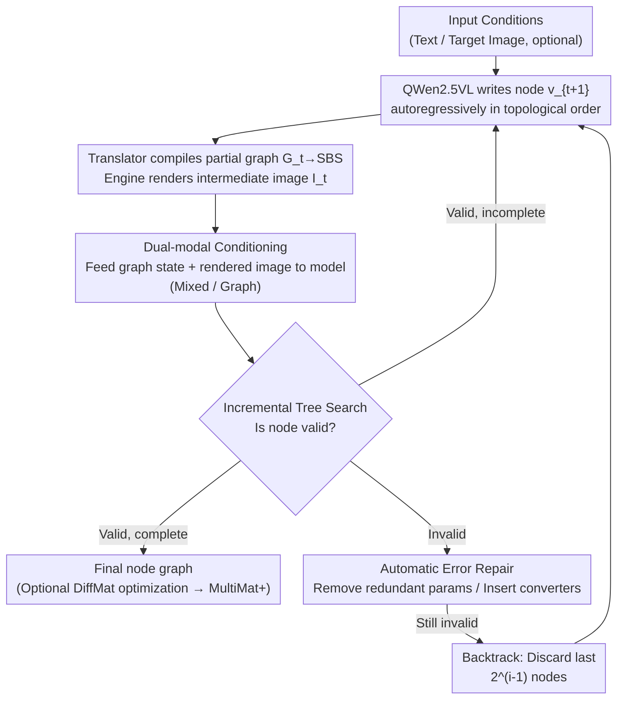

# MultiMat: Multimodal Program Synthesis for Procedural Materials using Large Multimodal Models

**Conference**: ICLR 2026  
**arXiv**: [2509.22151](https://arxiv.org/abs/2509.22151)  
**Code**: None  
**Area**: 3D Vision / Program Synthesis  
**Keywords**: Procedural Materials, Node Graphs, Multimodal Generation, Constrained Tree Search, Substance Designer

## TL;DR

MultiMat is proposed as the first framework to utilize Large Multimodal Models (LMMs) for synthesizing procedural material node graphs. By integrating visual rendering feedback from intermediate nodes during the autoregressive generation process (via Mixed and Graph conditioning modes) and employing incremental constrained tree search for real-time validation and backtracking, the model significantly outperforms text-only baselines after training on 6,878 production-grade Substance Designer materials.

## Background & Motivation

Procedural materials (e.g., Adobe Substance Designer) define PBR materials through Directed Acyclic Graphs (DAGs), offering advantages such as resolution independence, parameter control, and non-destructive editing. These are widely used in games, film, and VR/AR. However, manual graph construction requires professional training and poses a high entry barrier. Recent neural program synthesis methods (MatFormer, VLMaterial) attempt to automate this process but face three key issues:

1.  **Text-only modeling ignores visual essence**: Existing methods serialize node graphs into text programs, losing the visual-spatial intuition inherent to the graphs.
2.  **Difficulty in reasoning without visual feedback**: Models must reason about complex spatial relationships and visual effects solely from text, which becomes increasingly difficult as material complexity grows.
3.  **Lack of structural correctness guarantees**: Validation occurs only after a complete program is generated, leading to inefficient reasoning due to invalid outputs (e.g., invalid connections, type mismatches).

The **Core Idea** of MultiMat is to simulate the workflow of human material artists—rendering intermediate states immediately after generating each node and feeding them back into the model to form a visual-text multimodal loop, while using topological sorting for node-by-node incremental validation.

## Method

### Overall Architecture

MultiMat addresses the **Key Challenge** that node graphs are fundamentally visual-spatial programs forced into text-only formats by prior work. Using QWen2.5VL (7B) as the backbone, material graph generation is decomposed into an autoregressive process: whenever the model writes a new node $v_{t+1}$ in topological order, a translator compiles the partial graph $G_t = \{v_1, \ldots, v_t\}$ into SBS format. A material engine renders the intermediate image $I_t$, and through **dual-modal conditioning**, the graph state and rendered image are fed back into the model as multimodal context. Simultaneously, **incremental constrained tree search** validates each node; if a node is valid, it updates $G_{t+1}/I_{t+1}$ to continue; if invalid, **automatic error repair** is triggered, followed by exponential backtracking if repair fails. This allows the model to "see" its progress at every step, mimicking the human workflow of "render as you edit."

### Key Designs

**1. Dual-modal Conditioning Strategies: Feeding rendering feedback to the model**

Two complementary representations balance precision and overhead. **Mixed Conditioning** maintains complete text node definitions while interleaving a 140×140 rendering (split into 25 patches) at each node, omitting parameters to be implicitly encoded by the image, thus preserving structural information. **Graph Conditioning** visualizes the entire graph as a single image (up to 6,144 tokens) without explicit text definitions, which is closer to human visual editing. Experiments show that Graph mode achieves the best visual quality (lowest KID), while Mixed mode achieves the lowest structural error rate (NER).

| Conditioning | Input Format | Image Overhead | Features |
| :--- | :--- | :--- | :--- |
| Mixed Conditioning | Text definitions + interleaved 140x140 renders | 25 patches/node | Preserves text structure, implicit parameters |
| Graph Conditioning | Full graph visualization (visualized outputs) | 1 image (global) | Closer to human experience, no explicit text |

**2. Incremental Constrained Tree Search: Real-time validation + Backtracking**

Text-only methods only detect illegal connections or type mismatches after the entire program is written. MultiMat utilizes topological sorting to allow the translator and engine to verify each node immediately. The generation is organized as a search tree $\mathcal{T}$ with valid (✓) and invalid (✗) nodes. Upon detecting an error, adaptive backtracking occurs: the $i$-th backtrack discards the most recent $2^{(i-1)}$ nodes, balancing exploration efficiency and depth. Disabling this search in VLMaterial causes the NER to worsen from 14.8% to 34.0%.

**3. Automatic Error Repair: Fixing high-frequency mechanical errors**

Despite tree search, models make structural errors. MultiMat includes auto-correction for two patterns. **Parameter Removal** strips parameters not supported by a node type (MultiMat requires this for only ~1% of nodes). **Type Conversion Insertion** automatically adds "Grayscale Conversion" or "Gradient Map" nodes when color outputs connect to grayscale inputs (or vice versa), preventing graph failure due to channel mismatches.

### Loss & Training

Training follows standard token-wise cross-entropy, with conditions including graph states and intermediate renders:

$$\mathcal{L} = -\sum_{t=1}^{T}\sum_{s=1}^{S}\log p(v_{t,s} \mid v_{t,<s}, G_t, I_t, x; \theta)$$

where $v_{t,s}$ is the $s$-th token of node $v_t$ in the intermediate text format, and $x$ is the input condition. The model uses QWen2.5VL 7B as the base (baselines use QWen3 8B), with a sequence length of 8,192. Training lasts 5 epochs using AdamW, a learning rate of $5\times10^{-5}$, and batch size 128 on 8×A100 GPUs. The dataset consists of **6,878** production materials (MatFormer used 2,820). A bidirectional translator compresses SBS files into a **CompactSBS** YAML format (80%+ reduction), supporting pixel processors and function graphs up to 128 nodes. For conditional generation, a post-processing step using the DiffMat differentiable renderer optimizes the graph to match the input image (denoted as MultiMat+).

## Key Experimental Results

### Main Results (Unconditional Generation)

| Model | KID ↓ | ROUGE-L ↓ | NER ↓ |
| :--- | :--- | :--- | :--- |
| VLMaterial (SBS) | 14.155 | 3.641 | 14.846 |
| MultiMat (Mixed) | 6.752 | 2.195 | **8.923** |
| MultiMat (Graph) | **2.365** | **1.915** | 15.024 |

- MultiMat (Graph) achieves a KID **11.8 points** lower than VLMaterial, significantly outperforming text-only methods.
- Low ROUGE-L scores (< 4%) indicate no significant memorization of training data.

### Main Results (Reverse Material Synthesis)

| Model | DSim ↑ | CLIP ↑ | Style ↓ | KID ↓ |
| :--- | :--- | :--- | :--- | :--- |
| VLMaterial (SBS) | 31.344 | 65.678 | 3.211 | 14.976 |
| MultiMat (Mixed) | 34.922 | 66.737 | 3.199 | 3.675 |
| MultiMat (Graph) | **36.609** | **67.907** | **3.178** | **2.801** |
| MultiMat+ (Graph) | **40.367** | **70.114** | **3.046** | **14.886** |

- MultiMat+ provides a 6-8% gain via parameter optimization, whereas VLMaterial+ gains only 1% due to poor initial graph quality.

### Ablation Study (Auto-repair Analysis)

| Model | Param Removal ↓ | Type Conversion ↓ |
| :--- | :--- | :--- |
| VLMaterial (SBS) | 2.71% | 12.26% |
| MultiMat (Mixed) | **1.18%** | 3.51% |
| MultiMat (Graph) | 1.10% | 6.49% |

MultiMat variants require significantly fewer repairs, proving multimodal feedback improves understanding of graph structures.

## Highlights & Insights

- ⭐⭐⭐ **Multimodal Program Synthesis Paradigm**: First to introduce visual intermediate rendering feedback into procedural material generation, mimicking human workflows.
- ⭐⭐⭐ **Incremental Constrained Tree Search**: Uses topological sorting for node-by-node validation and adaptive backtracking.
- ⭐⭐ **Full Feature Support**: CompactSBS supports complex features like pixel processors and function graphs while reducing sequence length by 80%.
- ⭐⭐ **Largest Production Dataset**: 6,878 licensed production materials, 88% larger than previous datasets.

## Limitations & Future Work

1.  **Training Efficiency**: Adapting visual context for every node increases training time compared to text methods.
2.  **OCR Errors in Graph Conditioning**: Reading node names from visualized graphs is prone to OCR-style errors, leading to higher NER (~15%).
3.  **Data Scale**: Limited to 6,878 materials; future work could explore self-learning to generate synthetic training data.
4.  **Tool Binding**: Currently specific to Substance Designer; future goals include cross-system unified models.

## Related Work & Insights

The **Key Insight** of MultiMat is that procedural materials are visual-spatial programs and should be processed visually rather than just as text. This approach is globally applicable: any program synthesis task with a visual intermediate representation (e.g., UI layout, data visualization) can benefit from multimodal feedback. 

Incremental tree search is another elegant design—turning "post-hoc validation" into "real-time validation." The exponential backtracking strategy ($2^{(i-1)}$) provides a strong balance between exploration and computational cost. While training costs are higher due to rendering, future implementations could use lightweight intermediate representations (e.g., low-res thumbnails or feature summaries) to optimize performance.

## Related Papers

- [\[ICLR 2026\] Part-X-MLLM: Part-aware 3D Multimodal Large Language Model](part-x-mllm_part-aware_3d_multimodal_large_language_model.md)
- [\[CVPR 2026\] Towards Generalized Multimodal Homography Estimation](../../CVPR2026/3d_vision/towards_generalized_multimodal_homography_estimation.md)
- [\[CVPR 2025\] Perception Tokens Enhance Visual Reasoning in Multimodal Language Models](../../CVPR2025/3d_vision/perception_tokens_enhance_visual_reasoning_in_multimodal_language_models.md)
- [\[ICCV 2025\] RoboTron-Mani: All-in-One Multimodal Large Model for Robotic Manipulation](../../ICCV2025/3d_vision/robotron-mani_all-in-one_multimodal_large_model_for_robotic_manipulation.md)
- [\[AAAI 2026\] Point Cloud Quantization through Multimodal Prompting for 3D Understanding](../../AAAI2026/3d_vision/point_cloud_quantization_through_multimodal_prompting_for_3d_understanding.md)

<!-- RELATED:END -->

<!-- RELATED:START -->

## Related Papers

- [\[ICLR 2026\] Part-X-MLLM: Part-aware 3D Multimodal Large Language Model](part-x-mllm_part-aware_3d_multimodal_large_language_model.md)
- [\[ICLR 2026\] DiffTrans: Differentiable Geometry-Materials Decomposition for Reconstructing Transparent Objects](difftrans_differentiable_geometry-materials_decomposition_for_reconstructing_tra.md)
- [\[ICLR 2026\] Large Depth Completion Model from Sparse Observations](large_depth_completion_model_from_sparse_observations.md)
- [\[ICLR 2026\] Signal Structure-Aware Gaussian Splatting for Large-Scale Scene Reconstruction](signal_structure-aware_gaussian_splatting_for_large-scale_scene_reconstruction.md)
- [\[ICLR 2026\] Do 3D Large Language Models Really Understand 3D Spatial Relationships?](do_3d_large_language_models_really_understand_3d_spatial_relationships.md)

<!-- RELATED:END -->
