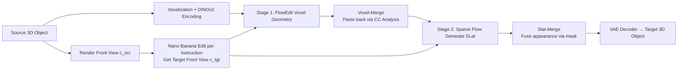

# Nano3D: A Training-Free Approach for Efficient 3D Editing Without Masks

**Conference**: ICLR 2026  
**OpenReview**: [https://openreview.net/forum?id=jov79sMFHn](https://openreview.net/forum?id=jov79sMFHn)  
**Code**: TBD  
**Area**: 3D Vision / 3D Editing  
**Keywords**: 3D Editing, Training-Free, TRELLIS, FlowEdit, Rectified Flow, Voxel Merge, Dataset Construction  

## TL;DR
This work adapts the training-free 2D editing method FlowEdit into the geometry-appearance decoupled generation pipeline of TRELLIS. By employing Voxel/Slat-Merge based on connected component analysis to fuse "edited regions" back onto the original object, it enables consistent local 3D editing (addition, removal, modification) without masks, training, or multi-view reconstruction, facilitating the construction of the first 3D editing dataset of 100k scale.

## Background & Motivation
**Background**: 2D image editing has matured through a three-stage path: training-free algorithms (e.g., Prompt-to-Prompt), automatic construction of large-scale paired datasets (e.g., InstructPix2Pix), and finally training real-time feed-forward models (e.g., GPT-4o, Flux.1 Kontext, Nano Banana). In contrast, 3D editing remains at the first "algorithm" step, lacking reliable training-free methods, data, and feed-forward models.

**Limitations of Prior Work**: Current 3D editing follows two main paths, both of which have significant drawbacks. First, Score Distillation Sampling (SDS) methods rely on gradients from pretrained 2D diffusion models, resulting in slow optimization and blurry results. Second, the "edit-then-reconstruct" paradigm modifies per-view renderings and fuses them with large reconstruction models, often leading to poor cross-view consistency, geometric collapse, and corruption of unedited regions. Both approaches typically require time-consuming optimization and manual masks.

**Key Challenge**: The fundamental difficulty in 3D editing is spatial consistency—aligning "edited regions" semantically with instructions while keeping "unedited regions" structurally and visually identical to the original. Re-generating from noise using generative models loses the original object's structure, and while rectified flow 3D models like TRELLIS produce high-quality objects, they cannot reliably reproduce the exact same geometry.

**Goal**: To achieve diverse, efficient, and consistent local 3D editing in a training-free manner using only pretrained generative models, without requiring masks. Solving this would enable a positive cycle of "data expansion $\rightarrow$ training feed-forward models" for 3D editing.

**Core Idea**: **[Training-Free Transfer]** Introduce the 2D inversion-free editing algorithm FlowEdit into the first stage of TRELLIS, establishing a rectified flow editing trajectory between the source and target objects using pretrained priors. **[Region-Aware Fusion]** Utilize Voxel/Slat-Merge through connected component analysis to automatically locate changed regions and paste them onto the original object, locking the geometric and appearance consistency of unedited areas.

## Method

### Overall Architecture
Nano3D is built upon TRELLIS's decoupled "geometry-appearance" pipeline. The source 3D object is voxelized, combined with DINOv2 features, and encoded into Structured Latents (SLat) via a VAE. For editing, a 2D model (Nano Banana) first modifies the rendered front view based on the instruction to obtain a target front view. Stage 1 then uses FlowEdit instead of standard flow sampling to edit voxel geometry guided by source/target front views, followed by Voxel-Merge correction. Stage 2 generates SLats guided by edited voxels and the target front view, with Slat-Merge correcting appearance. Finally, the VAE decodes the target 3D object.

### Key Designs
**1. FlowEdit in TRELLIS: Establishing editing trajectories between source and target objects.** Instead of letting TRELLIS generate the target from random noise, this approach uses FlowEdit to connect a rectified flow trajectory between source voxels $s_{src}$ and target voxels $s_{tgt}$. Specifically, Nano Banana modifies the source front view $c_{src}$ into $c_{tgt}$. The Flow Transformer in TRELLIS predicts velocity fields for two noise-voxel trajectories $p_t, q_t$ under these conditions, aligning them from the same sampling noise $\epsilon$:

$$s_t = s_{src} + q_t - p_t \approx s_{src} + \int\big(v^\theta_t(q_t, c_{tgt}) - v^\theta_t(p_t, c_{src})\big)\,dt$$

where $p_t=(1-t)s_{src}+t\epsilon$ and $q_t=(1-t)s_{tgt}+t\epsilon$. This trajectory starts at $s_{src}$ (preserving geometry) and approaches $s_0=s_{tgt}$ guided by the velocity field difference. This process is inversion-free and optimization-free.

**2. Voxel-Merge: Filtering "mis-edited areas" via XOR difference maps and connected component thresholds.** FlowEdit results $s_{fe}$ may occasionally change irrelevant parts (e.g., removing a dragon's wings might affect its body). Voxel-Merge computes an element-wise XOR between $s_{src}$ and $s_{fe}$ to generate a difference map $g(i)=s_{src}(i)\oplus s_{fe}(i)$. Elements marked 1 are grouped via connected component analysis. Components smaller than a volume threshold $\tau$ are discarded as noise. A binary mask $m$ is initialized from the surviving components, and the edited region is transferred via $s_{src}\oplus m \to s_{tgt}$, keeping the rest original. Ablations show $\tau=100$ provides the best fit.

**3. Slat-Merge: Reusing masks to lock appearance consistency.** After geometric alignment, the merged voxels $s_{tgt}$ and target front view $c_{tgt}$ are fed into TRELLIS Stage 2 to generate target SLat $z_{tgt}$. To maintain appearance in unedited areas, Slat-Merge reuses the mask $m$ to perform $z_{src}\oplus m \to z_{tgt}^{\cdot}$, stitching $z_{src}$ (unedited) and $z_{tgt}$ (edited). This step leverages TRELLIS's decoupled representation, where one region localization serves both structure and texture.

**4. Nano3D-Edit-100k Data Pipeline: Turning the editor into a data generator.** The authors encapsulate Nano3D into an automated production line: sample front views from 3D datasets $\rightarrow$ generate diverse instructions using Qwen2.5-VL $\rightarrow$ reconstruct source meshes using TRELLIS $\rightarrow$ edit target views with Nano Banana or Flux-Kontext $\rightarrow$ generate edited 3D assets via Nano3D $\rightarrow$ filter by instruction following using Qwen2.5-VL-7B. Each pair takes $\sim 5$ minutes on 32 A800 GPUs, resulting in 100k high-quality 3D editing pairs.

## Key Experimental Results

### Main Results
Evaluation across three dimensions: unedited area preservation (Chamfer Distance), target semantic alignment (DINO-I), and generation quality (FID).

| Method | CD↓ | DINO-I↑ | FID↓ |
|------|------|---------|------|
| Tailor3D | 0.037 | 0.759 | 140.93 |
| Vox-E | / | 0.782 | 117.12 |
| TRELLIS | 0.019 | 0.901 | 49.57 |
| Instant3DiT | 0.014 | 0.879 | 56.73 |
| **Nano3D** | **0.013** | **0.950** | **27.85** |

Nano3D leads in all metrics, with an FID of 27.85 significantly lower than TRELLIS's 49.57.

### User Study + Dataset Comparison

| Method | Prompt Alignment | Visual Quality | Shape Preservation |
|------|-----------|---------|---------|
| TRELLIS | 32% | 21% | 5% |
| **Nano3D** | **68%** | **79%** | **95%** |

Nano3D was overwhelmingly preferred, particularly in shape preservation (95%). For dataset quality, Nano3D-Edit-100k outperforms 3D-Alpaca in CLIPScore (39.71 vs 28.42) and ViLT R-Precision.

### Ablation Study

| Configuration | Effect |
|------|------|
| FlowEdit Only | Geometric distortion, blurred/missing/warped appearance, inconsistent with source |
| + Voxel-Merge | Restores geometry and cross-view consistency, but appearance issues remain |
| + Slat-Merge | Further improves local visual quality and appearance consistency |
| $\tau=100$ | Optimal mask fit (smaller $\tau$ includes irrelevant regions) |

### Key Findings
- Decoupled geometry-appearance is critical: Voxel-Merge handles geometry and Slat-Merge handles appearance, directly corresponding to TRELLIS's two-stage architecture.
- Failure cases almost exclusively stem from the 2D editing phase—as long as the image adheres to the instructions, Nano3D’s 3D editing success rate is high.

## Highlights & Insights
- **Convincing diagnosis**: Framing 3D editing as being "two stages behind 2D" and systematically addressing the algorithm and data gaps makes for a clear contribution.
- **Utility of training-free and mask-free**: Users only provide an object and text; no manual masking or fine-tuning is required, producing pairs in 5 minutes.
- **Architectural synergy**: Reusing a single mask across geometric and appearance layers fully exploits the benefits of TRELLIS's decoupled SLat representation.

## Limitations & Future Work
- **Upper bound defined by 2D models**: The pipeline's bottleneck is whether Nano Banana/Flux-Kontext correctly edits the front view.
- **Front-view guidance restriction**: Editing areas invisible from the front view (back/internal) may suffer from insufficient information.
- **Manual thresholding**: The constant $\tau=100$ may not be optimal for all object scales or topologies, suggesting a need for an adaptive mechanism.
- **Computational cost**: Converting SLats to explicit meshes via Flexicube takes about 4.5 minutes per pair, forcing large-scale storage to prioritize SLats over GLBs.
- **Third stage prelude**: While this work provides the "algorithm + data," the goal of a generalized feed-forward 3D editing model remains for future work.

## Related Work & Insights
- **2D Editing Path**: Prompt-to-Prompt (training-free) $\rightarrow$ InstructPix2Pix (data) $\rightarrow$ Feed-forward models. This work adopts this roadmap for 3D.
- **Rectified Flow & FlowEdit**: The inversion-free and model-agnostic nature of FlowEdit is what enables "zero-cost" transfer to the 3D domain.
- **Paradigm Transfer**: When a modality's editing capability lags, comparing it to a mature modality's states and "filling the gaps" is a powerful strategy.

## Rating
- **Novelty**: ⭐⭐⭐⭐ First introduction of FlowEdit to 3D priors with mask-free region fusion. Mostly clever integration of existing tools.
- **Experimental Thoroughness**: ⭐⭐⭐⭐ Solid metrics, user studies, and ablations, though verification on occluded areas is limited.
- **Writing Quality**: ⭐⭐⭐⭐ Clear multi-stage narrative with precise formulas and pipelines.
- **Value**: ⭐⭐⭐⭐⭐ High community value for providing both a practical training-free algorithm and a 100k scale dataset.

<!-- RELATED:START -->

## Related Papers

- [\[CVPR 2026\] AnchorFlow: Training-Free 3D Editing via Latent Anchor-Aligned Flows](../../CVPR2026/3d_vision/anchorflow_training-free_3d_editing_via_latent_anchor-aligned_flows.md)
- [\[ICLR 2026\] TINKER: Diffusion's Gift to 3D--Multi-View Consistent Editing From Sparse Inputs without Per-Scene Optimization](tinker_diffusions_gift_to_3d--multi-view_consistent_editing_from_sparse_inputs_w.md)
- [\[CVPR 2026\] Fast3Dcache: Training-free 3D Geometry Synthesis Acceleration](../../CVPR2026/3d_vision/fast3dcache_training-free_3d_geometry_synthesis_acceleration.md)
- [\[ICLR 2026\] Distractor-free Generalizable 3D Gaussian Splatting](distractor-free_generalizable_3d_gaussian_splatting.md)
- [\[ICCV 2025\] Easi3R: Estimating Disentangled Motion from DUSt3R Without Training](../../ICCV2025/3d_vision/easi3r_estimating_disentangled_motion_from_dust3r_without_training.md)

<!-- RELATED:END -->
