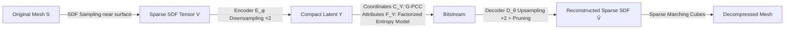

# Neural Compression of 3D Meshes using Sparse Implicit Representation

**Conference**: ICLR 2026  
**OpenReview**: [https://openreview.net/forum?id=AzsN1qdLwv](https://openreview.net/forum?id=AzsN1qdLwv)  
**Code**: [https://github.com/yydlmzyz1/SIR-SNC](https://github.com/yydlmzyz1/SIR-SNC)  
**Area**: 3D Vision / Geometry Compression  
**Keywords**: 3D Mesh Compression, Sparse Implicit Representation, Signed Distance Field, Sparse Convolutional Autoencoder, Rate-Distortion Optimization  

## TL;DR
The mesh is converted into a "Sparse Implicit Tensor" (SIR) that stores SDF solely near the surface. A 0.42 MB Sparse Convolutional Autoencoder (SNC) performs end-to-end rate-distortion compression, achieving 30%–90% bit rate savings over Draco / V-DMC / G-PCC / NeCGS at near real-time speeds.

## Background & Motivation
- **Background**: The demand for 3D meshes is surging (VR, robotics, autonomous driving), making efficient mesh compression urgent due to bandwidth constraints. Mainstream methods are categorized into three groups: Draco / V-DMC (direct compression of vertices + connectivity), G-PCC / SparsePCGC (conversion to point clouds), and conversion to implicit fields like SDF (e.g., NeCGS).
- **Limitations of Prior Work**: Direct compression of explicit meshes suffers from severe geometric distortion and topological breakage under low bit rates due to vertex quantization. Point cloud compression introduces significant distortion during conversion and Poisson reconstruction. Dense SDF representations expand cubically with resolution, leading to memory explosion and limiting resolution to $64^3$ or $128^3$, which restricts detail capture.
- **Key Challenge**: Implicit distance fields offer continuous geometric precision but suffer from massive data redundancy; explicit discrete points are efficient but lack continuity. **The inability to combine the advantages of both is the root cause of low compression efficiency.**
- **Goal**: Construct a mesh representation that possesses both the continuous precision of implicit fields and the data efficiency of sparse representations, accompanied by a lightweight, end-to-end rate-distortion optimized neural compressor.
- **Core Idea**: **Record SDF only in mesh cells near the surface.** Observing that Marching Cubes only concerns cubes intersecting the surface, while distant cells carry zero information, the dense SDF tensor is "emptied" into a Sparse SDF Tensor (SIR). This reduces data volume by an order of magnitude at the same resolution while maintaining identical precision. A Sparse Convolutional Autoencoder (SNC) then compresses this into a bitstream.

## Method

### Overall Architecture
SIR-SNC consists of two phases: **Geometric Representation** (SIR), which converts irregular meshes into regular Sparse SDF Tensors, and **Data Compression** (SNC), which uses a sparse convolutional autoencoder to embed the tensor into low-resolution compact latent features. After quantization, these are entropy-coded into a bitstream. The decoder symmetrically reconstructs the tensor and extracts the surface.

### Key Designs
**1. Sparse SDF Tensor (SIR): Storing the Distance Field Only Near the Surface.** Given a mesh $S$, dense grid points $V_{dense}\in\mathbb{R}^{K\times K\times K\times 3}$ are first sampled uniformly. Only points with a distance to the surface less than a threshold $\tau$ (defaulting to one voxel diagonal length) are retained. Their SDF values are calculated to form the sparse set $V=\{(v,s(v))\mid v\in V_{dense},\ d(v)<\tau\}$. The sign of the SDF (inside/outside) is determined by ray casting—casting a ray from $v$ where an odd number of intersections denotes $-1$ and an even number denotes $+1$. Thus, at high resolutions (e.g., $256$, $512$), the data volume remains proportional to the surface area, an order of magnitude smaller than dense representations. This essentially "carries additional surface distance information on top of discrete point positions," combining explicit efficiency with implicit continuity. A coarse-to-fine sampling strategy accelerates SDF computation for retained points at high $K$.

**2. Sparse Marching Cubes (SMC) and Support for Non-watertight Meshes.** Surface recovery avoids full-space scanning; standard Marching Cubes triangulation is performed only for cubes where all eight vertices exist in the sparse tensor $V$. Since extraction occurs only near the surface, it is significantly faster than traditional MC (0.02s in practice). Crucially, because SIR focuses on the surface neighborhood and explicitly stores spatial positions, this **localization** property allows robust representation of non-watertight meshes (open surfaces) without representation collapse. While open surfaces lack global inside/outside consistency, local signed distances still encode meaningful geometric relationships sufficient for MC to extract the zero-isolevel. This is unattainable for dense SDF or occupancy fields.

**3. Sparse Neural Compression (SNC): A Lightweight Autoencoder for E2E Rate-Distortion Optimization.** The encoder $\mathcal{E}_\varphi$ uses two downsampling blocks (each with 5 sparse convolutions (SConv) featuring residual connections + one strided convolution to halve resolution) to embed the sparse SDF tensor into low-resolution latent features $Y$. Attributes of $Y$ are quantized into integers and encoded via a factorized entropy model, while coordinates are encoded separately via G-PCC. The decoder $\mathcal{D}_\theta$ symmetrically performs upsampling via transposed SConv. An occupancy prediction layer estimates the voxel occupancy probability $p$ after each upsampling, **pruning redundant voxels below a threshold** to maintain sparsity throughout. Training utilizes an MAE reconstruction loss $L_{MAE}=\|V-\hat V\|_1$ combined with a binary cross-entropy loss $L_{BCE}$ for occupancy ($L_{Rec}=L_{MAE}+\alpha L_{BCE}$, where $\alpha=0.01$). Quantization is approximated by additive noise for differentiability. The bit rate term is $L_{Rate}=-\sum_i\log_2(p_i)$, and the total loss $L=L_{Rec}+\lambda L_{Rate}$ is controlled by $\lambda$ for rate-distortion trade-offs. The entire network uses only 16 channels with 8-bit quantized parameters, requiring approximately 0.42 MB of storage.

**4. Variable Bit Rate and Dynamic Sequence Extension.** During inference, the **resolution-independent** nature of the model is utilized. Different resolutions ($\{192,256,384,512\}$) are fed into the same trained model to obtain coarse-grained bit rate tiers, with fine-tuning achieved by selecting models with different $\lambda$ values, enabling variable bit rates without retraining. For dynamic mesh sequences, inspired by implicit neural representations, the decoder parameters are overfitted to the entire sequence and quantized into the bitstream alongside per-frame latent features. This implicitly exploits inter-frame correlation without complex mesh motion estimation.

## Key Experimental Results

### Main Results (BD-BR gains measured by CD; negative values = bit rate savings)

| Dataset | Verts/Faces | vs G-PCC | vs S.PCGC | vs Draco | vs V-DMC | vs NeCGS |
|---|---|---|---|---|---|---|
| Mixed | 11k/21k | -55.8% | -74.8% | -57.4% | - | -39.2% |
| ShapeNet | 82k/162k | -58.0% | -91.0% | -92.0% | - | -50.8% |
| MPEG | 24k/37k | -61.3% | -31.7% | -93.8% | -30.5% | -46.7% |

### Computational Complexity and Model Size

| Metric | G-PCC | S.PCGC | Draco | V-DMC | NeCGS | Ours |
|---|---|---|---|---|---|---|
| Pre-enc (s) | 0.53 | 0.53 | - | - | 20 | 0.40 |
| Enc (s) | 1.64 | 0.40 | 0.22 | 3.42 | 60 | **0.10** |
| Dec (s) | 0.26 | 0.68 | 0.19 | 0.42 | 0.11 | **0.10** |
| Post-dec (s) | 5.54 | 5.22 | - | - | 0.15 | **0.02** |
| Model Size (MB) | - | 6.63 | - | - | 0.77 | **0.42** |

### Ablation Study

| Ablation Item | Setting | Conclusion |
|---|---|---|
| Sparse Threshold $\tau$ | 0.75 / 1.0 / 1.25 voxels | Point count grows linearly with $\tau$; distortion minimizes after $\tau > 0.75$; default 1.0 provides a buffer. |
| Residual Blocks | 1/3/5/7 (100K–970K params) | BD-BR from anchor → -18%/-25%/-28%; 5 blocks selected for trade-off. |
| Feature Channels | 16 → 32 | Complexity surges without significant gain; kept at 16. |
| Occupancy Loss $L_{BCE}$ | With/Without | Without, all voxels are kept, causing artifacts; with $L_{BCE}$, quality improves by ~47%. |

### Key Findings
- **Compression gains correlate positively with mesh complexity**: The largest gains over Draco occur on high-fidelity, high-vertex-count MPEG/ShapeNet (up to -92% to -93.8%), as explicit methods suffer more distortion on complex structures.
- Core encoding/decoding takes ~0.1s each; the entire pipeline (decoding + reconstruction) is only 0.12s, reaching near real-time performance. Mesh-to-SDF conversion takes 0.4s (currently CPU-based, can be GPU-accelerated).
- The dynamic mode "Ours (dynamic)" saves >28% more bit rate than the feed-forward autoencoder.

## Highlights & Insights
- **"Emptying out dense SDF" is a simple yet powerful observation**: Since Marching Cubes only looks at surface-adjacent cubes, distant regions are wasteful. This representation-level sparsification simultaneously solves memory explosion and resolution constraints.
- **Bridging explicit and implicit advantages**: Sparse SDF = Discrete point positions + surface distance. It achieves both efficiency and continuous precision while naturally supporting non-watertight meshes, a feat dense SDF/occupancy fields cannot achieve.
- **Lightweight enough for deployment**: A 0.42 MB model, 8-bit quantization, and 0.1s codec performance shift neural geometry compression from "heavy network optimization" (NeCGS takes 1 minute to encode) into the realm of practical engineering.
- **Zero-cost variable bit rate**: Leverages resolution independence to achieve multiple bit rate tiers without retraining, which is highly desirable for engineering applications.

## Limitations & Future Work
- **Preprocessing remains on CPU**: Mesh-to-SDF conversion (~0.4s) is the primary source of total encoding time; GPU migration is needed for true real-time performance.
- **Open surface boundary artifacts**: Reconstructions of non-watertight meshes are generally good, but slight artifacts exist at open boundaries. The authors suggest using UDF for further refinement.
- **Slow dynamic sequence encoding**: The overfitting process for the decoder requires training, resulting in long encoding times, making it suitable only for offline scenarios.
- **Texture and massive meshes**: Current work focuses solely on geometry. Future plans include texture compression and handling high-fidelity, large-scale meshes.

## Related Work & Insights
- **Implicit Geometry Representation**: BOF/SDF (watertight only), UDF (general meshes but hard to extract surfaces)—this work bypasses watertight constraints via "sparsification + explicit position storage."
- **Mesh Compression**: Draco (Morton codes + EdgeBreaker), V-DMC (base mesh + displacement), Geometry Images (conversion to 2D for video codecs)—all suffer from explicit topological quantization distortion.
- **Point Cloud Compression**: G-PCC (Octree), SparsePCGC (learned sparse voxels)—conversion and Poisson reconstruction introduce distortion.
- **Implicit Field Compression**: Tang et al. (patch-based TSDF), NeCGS (learned deformation fields)—dense representations are trapped in low resolution. This work breaks through to 512 resolution using sparse representations.
- **Inspiration**: The idea of "sparsifying representation based on information density" can be extended to other geometry or scientific data compression tasks that are inherently sparse but require regular tensors.

## Rating
- **Novelty**: ⭐⭐⭐⭐ — The Sparse SDF Tensor design is concise and addresses the fundamental pain point of dense SDFs. The combination of E2E rate-distortion and sparse convolution for mesh compression is a clear incremental innovation.
- **Experimental Thoroughness**: ⭐⭐⭐⭐ — Covers multi-source data (Mixed/ShapeNet/MPEG/ScanNet/MGN), compares against 5 representative methods, and includes BD-BR, complexity, visualization, dynamic sequences, non-watertight support, and multiple ablations. Very solid.
- **Writing Quality**: ⭐⭐⭐⭐ — Clear motivational progression, effective diagrams (pipeline and SMC are intuitive), and coherent narrative between methods and experiments.
- **Value**: ⭐⭐⭐⭐ — A 0.42 MB model + near real-time performance + 30%–90% bit rate savings offers direct utility for bandwidth-sensitive scenarios like VR and robotics. Open-sourced.

<!-- RELATED:START -->

## Related Papers

- [\[ICCV 2025\] SL2A-INR: Single-Layer Learnable Activation for Implicit Neural Representation](../../ICCV2025/3d_vision/sl2a-inr_single-layer_learnable_activation_for_implicit_neural_representation.md)
- [\[AAAI 2026\] Split-Layer: Enhancing Implicit Neural Representation by Maximizing the Dimensionality of Feature Space](../../AAAI2026/3d_vision/split-layer_enhancing_implicit_neural_representation_by_maximizing_the_dimension.md)
- [\[ICLR 2026\] Path Matters: Unveiling Geometric Implicit Bias via Curvature-Aware Sparse View Optimization](path_matters_unveiling_geometric_implicit_bias_via_curvature-aware_sparse_view_o.md)
- [\[ICCV 2025\] LINR-PCGC: Lossless Implicit Neural Representations for Point Cloud Geometry Compression](../../ICCV2025/3d_vision/linr-pcgc_lossless_implicit_neural_representations_for_point_cloud_geometry_comp.md)
- [\[CVPR 2026\] NTK-Guided Implicit Neural Teaching](../../CVPR2026/3d_vision/ntk-guided_implicit_neural_teaching.md)

<!-- RELATED:END -->
