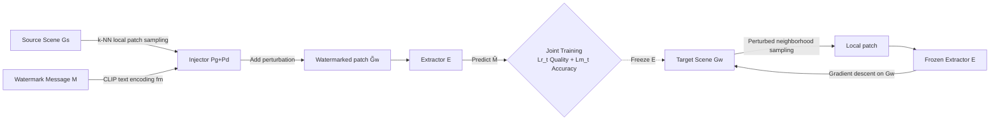

# NGS-Marker: Robust Native Watermarking for 3D Gaussian Splatting

**Conference**: ICLR 2026  
**OpenReview**: [https://openreview.net/forum?id=yli4zJhJB0](https://openreview.net/forum?id=yli4zJhJB0)  
**Code**: To be confirmed  
**Area**: 3D Vision / Digital Watermarking / Copyright Protection  
**Keywords**: 3D Gaussian Splatting, Native Watermarking, Partial Infringement, Progressive Embedding, Copyright Verification  

## TL;DR
NGS-Marker embeds watermarks directly into the 3D Gaussian primitives themselves rather than rendered images. Consequently, even if an attacker extracts a small subset of Gaussians to integrate into a new scene, attribution information can be decoded from any local region, specifically addressing "partial infringement" where existing methods fail.

## Background & Motivation
**Background**: 3DGS has become a mainstream 3D representation in fields like virtual reality, digital content creation, and robotics due to its real-time rendering and photorealistic quality, making copyright protection a high priority. Existing 3DGS watermarking methods (e.g., 3D-GSW, GaussianMarker, GuardSplat) mostly follow the paradigm of 2D image watermarking—relying on pre-trained decoders to extract watermarks from **rendered images**, which this paper terms "indirect watermarking."

**Limitations of Prior Work**: Indirect watermarking uses rendered images as an intermediate carrier, leading to two structural problems. First, the extraction process itself introduces visible image quality degradation. Second, watermark extraction depends on rendered images, making it extremely vulnerable to appearance distribution shifts, such as changes in viewpoints or scene content. Crucially, because 3DGS uses tile-based rasterization and independent Gaussian primitives, it is inherently "modular"—attackers can easily extract a subset of Gaussians corresponding to a specific object or character and recombine them into a new scene.

**Key Challenge**: The authors name this overlooked abuse scenario **Partial Infringement**. Experiments in Section 3 demonstrate that when a portion of protected assets is transplanted into a new scene and the rendering distribution shifts significantly, the detection accuracy of 3D-GSW, GaussianMarker, and GuardSplat drops to $\sim 50\%$ (equivalent to random guessing), and reducing the number of embedded bits does not help—indicating that the indirect watermark signal is completely destroyed.

**Goal**: To develop a **native watermarking** framework that completely abandons rendered images as an intermediary and embeds/extracts watermarks directly on Gaussian primitives, ensuring that "attribution information can be reliably decoded from any local region of the scene."

**Core Idea**: The authors first performed a feasibility study—replacing the image input of HiDDeN with random noise—and found that the neural network could extract watermarks from pure noise with $96.7\%$ bit accuracy. Since Gaussian primitives, while unstructured, possess spatial distribution patterns, they are more learnable than pure noise. Based on this, **this paper proposes "joint training of a local Gaussian watermark injector + extractor + progressive embedding using a frozen extractor for gradient guidance"** to ensure uniform watermark coverage across the scene without sacrificing rendering quality.

## Method

### Overall Architecture
NGS-Marker consists of two stages: **first, joint training** of a local Gaussian watermark injector ($P_g + P_d$) and a message extractor $E$; once training is complete, the **extractor is frozen** and used as a guidance signal to directly optimize the target scene's Gaussian parameters via gradient descent, "engraving" the watermark progressively. Finally, users can verify copyright by running the extractor on any suspicious local part of the native 3D data without needing to render.

### Key Designs
**1. Joint Training of Injector and Extractor: Making perturbations learnable yet invisible.** The injector applies subtle perturbations to a local patch $\tilde{G}_s$ ($k$ nearest Gaussians selected via k-NN from the source scene) to hide the watermark. It comprises a perturbation feature generator $P_g$ (stacked PointTransformer layers) that tokenizes the patch as a query and encodes the message $M$ via a CLIP text encoder as key/value to generate latent features $f_d = P_g(\text{tokenizer}(\tilde{G}_s); \text{CLIP}(M))$. A perturbation decoder $P_d$ (cross-attention) then uses each primitive $\tilde{G}_s^i$ as a query and $f_d$ as key/value to predict individual perturbations in parallel, resulting in $\tilde{G}_w = \tilde{G}_s + P_d(\tilde{G}_s; f_d)$. The extractor $E$, mirroring $P_g$, decodes $\hat{M}$ from $\tilde{G}_w$. Both are optimized using a composite loss: $L_t = \text{MSE}(R(\tilde{G}_s,\theta), R(\tilde{G}_w,\theta)) + \lambda_t \cdot \text{BCE}(M,\hat{M})$, where the former ensures rendering consistency (stealthiness) and the latter ensures decoding accuracy. Using CLIP encoding also enables multimodal watermark extensions.

**2. Progressive Watermark Embedding: Replacing one-shot block injection with extractor-guided gradient optimization.** Directly using the trained injector for "block-by-block injection" leads to boundary inconsistencies and uneven coverage; "repeated random sampling and iterative injection" conflicts with the injector's one-shot design, causing cumulative distortion (as verified by WI-Naive and WI-Iterative experiments). The solution is to **discard the injector** and use only the frozen extractor as a "judge": randomly sample a patch $\tilde{G}_w$ of $\delta$ neighboring Gaussians from the target scene $G_w$ (**deliberately adding distortion** to enhance robustness), pass it through $E$ to get $\hat{M}$, and perform gradient descent on $G_w$ parameters. The goal is to ensure **any** randomly sampled local patch decodes to the preset ID $M_{id}$. The loss is: $L_w = \text{MSE}(R(G_s,\theta), R(G_w,\theta)) + \lambda_w \cdot \text{BCE}(M_{id}, \hat{M})$. This "soft optimization" ensures uniform coverage while minimizing the impact on rendering quality.

**3. Attribution Verification and Visual Localization: Decoding and colorizing from suspicious regions.** When theft is suspected, users select a suspicious area and feed it to extractor $E$ to retrieve the watermark, comparing it with the private ID. To mitigate noise from single primitive group decoding, a visualization method is designed: multiple primitive groups are sampled, the most likely owner is determined for each, and the corresponding color is applied to the spherical harmonic coefficients of those primitives to visually "circle" areas originating from the private asset.

**4. Hybrid Protection and Multimodal Extension: Native watermarks do not conflict with indirect ones and can hide images.** Since NGS-Marker extracts from native Gaussians and barely alters rendered images, it can coexist with indirect protection via joint optimization: $L_{cooperate} = L_w + \lambda_{indirect} \cdot L_{indirect}$. Furthermore, by replacing the CLIP text encoder with an image encoder and the extractor's MLP with a transposed convolutional decoder, a **private image** can be embedded as a watermark.

## Key Experimental Results
The dataset uses standard public 3D datasets (24 scenes for training / 4 for testing). Partial infringement test sets were constructed by embedding watermarks into test scenes and then inserting subsets into non-watermarked scenes. Injector/extractor training was done on 2×A100 (150 epochs, $k=8192$, $\lambda_t=5$), and embedding on a single A100 ($\delta=8192$, $\lambda_w=5$), defaulting to 16 bits. `*` denotes extraction from rendered images; `§` from Gaussian primitives.

### Main Results (Partial Infringement, Multi-scene Average)

| Method | 8bit Bit-Acc | 8bit 3D-Acc | 16bit Bit-Acc | 16bit 3D-Acc | 16bit PSNR/SSIM↑ | 16bit LPIPS↓ |
|------|------|------|------|------|------|------|
| 3D-GSW | 50.35* | N/A | 49.17* | N/A | 30.37 / 0.960 | 0.051 |
| GaussianMarker | 50.10* | N/A | 50.00* | N/A | 30.75 / 0.961 | 0.046 |
| GuardSplat | 51.08* | N/A | 50.83* | N/A | 39.22 / 0.994 | 0.013 |
| WI-Naive | 65.32§ | 68.50 | 57.54§ | 55.90 | 27.07 / 0.962 | 0.060 |
| WI-Iterative | 77.93§ | 80.70 | 69.25§ | 72.30 | 25.54 / 0.886 | 0.105 |
| **Ours** | **99.14§** | **95.20** | **97.94§** | **96.60** | **40.17 / 0.995** | **0.007** |

All three indirect methods were at $\sim 50\%$ (random). NGS-Marker achieved 97.94% Bit-Acc and 96.60% 3D-Acc at 16 bits, with the best rendering quality (PSNR 40.17).

### Ablation Study (Robustness)

| Attack Type | None | Gaussian Noise(σ=0.015) | Rotation(±π) | Scale | Densification(0-50%) | Dropout(0-50%) | Translation | Combined |
|------|------|------|------|------|------|------|------|------|
| Bit-Acc↑ | 98.35 | 97.06 | 98.31 | 98.35 | 97.93 | 97.41 | 98.35 | 96.28 |
| 3D-Acc↑ | 97.90 | 96.80 | 97.80 | 97.90 | 97.40 | 97.50 | 97.90 | 96.30 |

$\delta$ Ablation: Reducing $\delta$ from 8192 to 2048 slowed convergence and slightly reduced accuracy, but $\delta \ge 2048$ remained reliable, indicating small-scale infringement can be detected. Embedding time scales with primitive count (e.g., Garden scene with 588,946 primitives takes 35.2min).

### Key Findings
- **3D-Acc does not degrade with bit count**: Longer watermarks improve robustness by reducing false positives from "accidental matches."
- **Progressive optimization is essential for quality**: Direct local injection (WI-Naive/Iterative) significantly degraded image quality (PSNR dropped to 25-27).
- **Hybrid protection is feasible**: Joint use with 3D-GSW/GuardSplat ($\lambda=0.1$) showed virtually no conflict between native and indirect watermarks.
- **Image watermarks are viable**: Using a CLIP image encoder allowed embedding and decoding a private image in the 3D scene with PSNR 38.75.

## Highlights & Insights
- **Insights into problem definition**: Identified the "explicit, modular" nature of 3DGS as a security risk, introducing the "partial infringement" scenario and demonstrating that existing methods fail in this context.
- **Paradigm Shift**: Shifted from "protecting rendered images" to "protecting native Gaussian primitives," avoiding the vulnerabilities of appearance distribution shifts.
- **Solving One-Shot Conflicts**: Cleverly used the injector for training but relied on the extractor for gradient-guided embedding, resolving the issue of cumulative distortion.
- **Natural Compatibility**: Since it does not rely on rendering modifications, the native watermark can coexist with indirect watermarks, providing a dual-layer "native+rendering" defense.

## Limitations & Future Work
- **Per-scene gradient optimization**: Embedding requires a separate optimization pass for each scene (35min for Garden), which is not an instantaneous feed-forward process.
- **Dependence on segmentation assumptions**: The threat model assumes attackers can cleanly extract subsets; robustness against complex editing or distillation-based theft requires further study.
- **Limited training data**: Trained on only 24 scenes; cross-domain generalization (e.g., large outdoor scenes, dynamic/4D Gaussians) needs validation.
- **Image watermark as a demo**: The image watermark experiment was qualitative; systematic evaluation of capacity and robustness is missing.

## Related Work & Insights
- **2D Neural Watermarking**: HiDDeN first used end-to-end networks for image watermarking; this paper adapts those injector ideas for unstructured data.
- **3D Asset Watermarking**: Point clouds use coordinate perturbations/density; meshes use vertex displacement or spectral bases; NeRF methods modify images or radiance regularization.
- **Previous 3DGS Watermarking**: 3D-GSW, GaussianMarker, and GuardSplat follow the "pseudo-3D" indirect paradigm. **Native protection for local 3DGS was previously a gap**, which this paper fills.
- **Insight**: For any "explicit, decomposable" representation (Gaussians, point clouds, voxels), copyright protection must consider modular attacks; embedding watermarks into the representation itself rather than its projections is a more fundamental defense.

## Rating
- **Novelty**: ⭐⭐⭐⭐⭐ First to propose partial infringement and provide a native local 3DGS watermarking framework.
- **Experimental Thoroughness**: ⭐⭐⭐⭐ Comprehensive main experiments and robustness tests, though image watermarking is only a demo.
- **Writing Quality**: ⭐⭐⭐⭐ Clearly motivated with logical progression and complete visualizations.
- **Value**: ⭐⭐⭐⭐⭐ Directly addresses a real copyright pain point for 3DGS commercialization with a practical, stackable solution.

<!-- RELATED:START -->

## Related Papers

- [\[CVPR 2026\] Robust3DGSW: Toward Robust Watermarking for Quantization-Aware 3D Gaussian Splatting](../../CVPR2026/3d_vision/robust3dgsw_toward_robust_watermarking_for_quantization-aware_3d_gaussian_splatt.md)
- [\[CVPR 2025\] 3D-GSW: 3D Gaussian Splatting for Robust Watermarking](../../CVPR2025/3d_vision/3d-gsw_3d_gaussian_splatting_for_robust_watermarking.md)
- [\[AAAI 2026\] Can Protective Watermarking Safeguard the Copyright of 3D Gaussian Splatting?](../../AAAI2026/3d_vision/can_protective_watermarking_safeguard_the_copyright_of_3d_gaussian_splatting.md)
- [\[CVPR 2025\] GuardSplat: Efficient and Robust Watermarking for 3D Gaussian Splatting](../../CVPR2025/3d_vision/guardsplat_efficient_and_robust_watermarking_for_3d_gaussian_splatting.md)
- [\[ICLR 2026\] Gradient-Direction-Aware Density Control for 3D Gaussian Splatting](gradient-direction-aware_density_control_for_3d_gaussian_splatting.md)

<!-- RELATED:END -->
