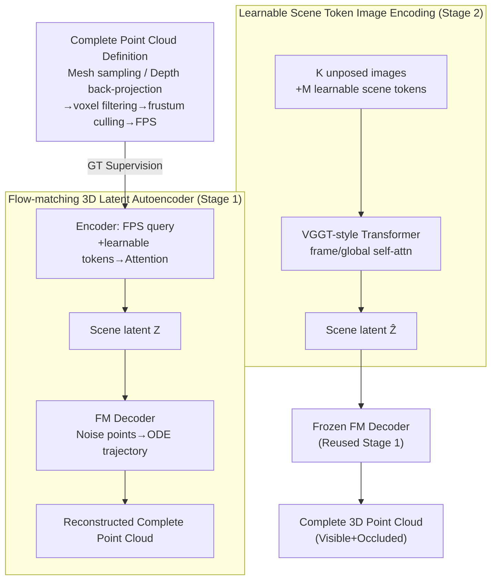

# NOVA3R: Non-pixel-aligned Visual Transformer for Amodal 3D Reconstruction

**Conference**: ICLR 2026  
**arXiv**: [2603.04179](https://arxiv.org/abs/2603.04179)  
**Code**: [Project Page](https://wrchen530.github.io/nova3r)  
**Area**: 3D Vision/Reconstruction  
**Keywords**: Non-pixel-aligned, amodal 3D reconstruction, scene tokens, flow-matching, complete point clouds

## TL;DR
NOVA3R is proposed for non-pixel-aligned complete 3D reconstruction from unposed images. It employs learnable scene tokens to aggregate global information across views and a flow-matching-based diffusion 3D decoder to generate complete point clouds (including occluded areas). This addresses two fundamental limitations of pixel-aligned methods—only reconstructing visible surfaces and creating redundant geometry in overlapping regions—outperforming SOTA in both scene-level and object-level reconstruction on SCRREAM and GSO datasets.

## Background & Motivation

**Background**: DUSt3R pioneered the pixel-aligned feed-forward 3D reconstruction paradigm, where each pixel predicts a 3D point along its ray. Subsequent methods (MASt3R, CUT3R, VGGT) extended this to multi-view settings but remain pixel-aligned. Another direction involves latent 3D generation (TripoSR/TRELLIS), which is primarily limited to object-level reconstruction and requires high-quality mesh supervision.

**Limitations of Prior Work**: Pixel-aligned methods suffer from two fundamental flaws: (1) They can only reconstruct visible surfaces, leaving holes where geometry is occluded; (2) In overlapping multi-view regions, the same physical 3D point is predicted by multiple rays, leading to redundant layers of points, which is physically inconsistent.

**Key Challenge**: In the real world, a scene consists of a fixed number of physical points regardless of the number of observation views. If a 3D point is observed by multiple images, the correct representation should contain only one point rather than one per observation. The pixel-aligned paradigm fundamentally violates this physical reality.

**Goal**: (a) How to learn a global, viewpoint-agnostic scene representation from unposed images? (b) How to decode this into a complete (visible + occluded) non-pixel-aligned point cloud? (c) How to handle supervision for unordered point sets, as L2 loss cannot be directly applied?

**Key Insight**: The problem is decomposed into two stages: first, training a 3D point cloud autoencoder to learn to compress complete point clouds into latent tokens and decode them back using flow-matching; second, training an image encoder to map images into this same latent space. This decoupled training avoids the instability of end-to-end learning.

**Core Idea**: Using learnable scene tokens instead of pixel-aligned per-ray predictions, combined with a flow-matching decoder to achieve feed-forward reconstruction of complete non-pixel-aligned 3D point clouds from unposed images.

## Method

### Overall Architecture
The input consists of $K$ unposed images, and the output is a complete 3D point cloud $P \in \mathbb{R}^{N \times 3}$ defined in the first view's coordinate system, encompassing both visible and occluded regions. To learn a "global, viewpoint-agnostic scene representation," this work avoids an end-to-end approach and instead uses a two-stage decoupled training strategy.

Stage 1 focuses on 3D data by training a point cloud autoencoder: it compresses a complete point cloud into $M$ latent scene tokens $Z$ and reconstructs it from noise using a flow-matching decoder. This establishes a latent space capable of compressing and restoring complete geometry. In Stage 2, the decoder is frozen, and an image encoder is trained to map $K$ images to the same latent space as $\hat{Z}$. During inference, only Stage 2 is required. Both stages utilize a specially constructed "complete point cloud" as the ground truth supervision.

### Key Designs

**1. Complete Point Cloud Definition: Finding Supervision for Non-pixel-aligned Methods**

Non-pixel-aligned reconstruction must predict "complete point clouds" including occluded areas, but where can such GT be found? This work proposes a construction scheme: when GT meshes are available, uniform sampling is used. Without meshes, point clouds are aggregated from dense view depth back-projections, filtered via voxel-grids to remove overlap, culled to the input view frustums, and finally FPS-sampled to $N$ points. This bypasses the strict requirement for watertight meshes, allowing scene-level training using only depth maps. All points are defined in the first view's coordinate system to ensure viewpoint-agnostic representations.

**2. Flow-matching-based 3D Latent Autoencoder (Stage 1): Bypassing Unordered Point Matching via ODE Trajectories**

This stage establishes the latent space for compressing and decoding complete point clouds. The encoder uses FPS to sample $M$ query points from $P$, concatenates them with learnable tokens, and uses cross-attention and self-attention to generate latent $Z \in \mathbb{R}^{M \times C}$. The decoder is a diffusion-style model: given $N$ noise points $x_t$, latent $Z$, and time step $t$, it predicts a velocity field. The training objective is:

$$\mathcal{L}_{flow}^{AE} = \mathbb{E}\big[\|\Phi_{dec}(x_t, Z, t) - (\epsilon - x_0)\|_2^2\big]$$

Flow-matching is preferred over traditional 3D VAEs (which require canonical spaces and meshes for grid-based decoding) or direct coordinate regression (which struggles with unordered points). Flow-matching models decoding as a deterministic ODE trajectory from noise to the target distribution, naturally resolving the unordered matching problem. A "joint decoder" structure is used, inserting self-attention between cross-attention layers to exchange spatial information between points.

**3. Learnable Scene Token Image Encoding (Stage 2): Decoupled Global Tokens**

Stage 2 trains an image encoder to map $K$ unposed images to the same latent space $\hat{Z} \in \mathbb{R}^{M \times C}$. In addition to standard image tokens, $M$ learnable scene tokens $t_S$ are introduced. These tokens pass through a Transformer with alternating frame-level and global-level self-attention. These scene tokens serve as a global representation in the first view's coordinate system. Unlike pixel-aligned methods where token counts scale with $K \times H \times W$ and are bound to specific pixels, these scene tokens are fixed at $M$ and agnostic to the number of input views, naturally avoiding redundancy.

### Loss & Training
- Stage 1: End-to-end autoencoder training with flow-matching loss for 50 epochs.
- Stage 2: Frozen decoder; training image Transformer and scene tokens with flow-matching loss for 50 epochs.
- No KL loss or other regularizations used. AdamW, lr=3e-4. 4xA40 GPUs, batch=32.
- Image encoder initialized with VGGT pre-trained weights (16 layers instead of 24).

## Key Experimental Results

### Main Results: Scene Completion (SCRREAM Dataset)

| Method | Type | Complete K=1 CD | FS@0.1 | FS@0.05 | Complete K=2 CD | FS@0.1 |
|------|------|-----------------|--------|---------|-----------------|--------|
| DUSt3R | Multi-view | 0.086 | 0.757 | 0.565 | 0.061 | 0.833 |
| CUT3R | Multi-view | 0.091 | 0.753 | 0.543 | 0.092 | 0.739 |
| VGGT | Multi-view | 0.070 | 0.810 | 0.657 | 0.065 | 0.821 |
| LaRI | Single-view | 0.059 | 0.825 | 0.590 | - | - |
| **Ours** | **Multi-view** | **0.048** | **0.882** | **0.687** | **0.053** | **0.862** |

### Ablation Study (SCRREAM Complete K=1)

| Configuration | CD | FS@0.05 | FS@0.02 | Description |
|------|-----|---------|---------|------|
| Point query only | 0.011 | 0.991 | 0.894 | FPS points as queries |
| Learnable only | 0.013 | 0.981 | 0.841 | Learnable tokens as queries |
| **Hybrid (Default)** | **0.011** | **0.993** | **0.904** | Hybrid points + learnable tokens |
| 256 tokens | 0.014 | 0.975 | 0.811 | Insufficient token count |
| **768 tokens (Default)** | **0.011** | **0.993** | **0.904** | Better performance with more tokens |
| FM loss | 0.011 | 0.993 | 0.904 | High reconstruction quality |
| CD loss | 0.024 | 0.907 | 0.575 | Significantly worse results with Chamfer Loss |

### Key Findings
- **FM vs CD loss**: FM improves FS@0.02 from 0.575 to 0.904, proving FM's superiority in matching unordered point sets.
- **Hole Ratio**: Ours (0.088) vs VGGT (0.307) vs DUSt3R (0.317); non-pixel-aligned methods significantly reduce holes.
- **Density Variance**: Ours (5.127) vs lowest baseline (7.105), indicating more uniform point distribution.
- **Object-level Generalization**: On GSO dataset, Ours (CD 0.020) vs TripoSR (0.025), showing the method is not limited to scene-level data.

## Highlights & Insights
- **Paradigm Shift**: Transitioning from "predicting one point per ray" to "learning a global scene representation and decoding." This represents a conceptual breakthrough in 3D reconstruction.
- **Decoupled Two-Stage Training**: Establishing the 3D latent space using point clouds alone before mapping images to it ensures stable training and clear objectives for each stage.
- **Flow-matching for Unordered Sets**: By modeling decoding as a continuous ODE, FM naturally handles unordered points and could be transferred to other set-generation tasks.
- **Variable Resolution Inference**: Since it models point distributions rather than per-pixel maps, the output density can be controlled at inference time by adjusting the number of queries.

## Limitations & Future Work
- Generalization to large-scale scenes (many views) remains to be verified due to compute limits (currently $K \leq 2$).
- Fixed $M=768$ scene tokens might be insufficient for highly complex scenes; adaptive token selection is a potential future direction.
- Currently supports static scenes only; the authors discuss potential extensions to 4D for dynamic objects.
- The FM decoder requires multiple denoising steps (0.04 step size), resulting in a decoding time of 2.985s compared to 0.557s for direct regression.

## Related Work & Insights
- **vs DUSt3R/VGGT**: These are pixel-aligned representatives—simple and efficient but unable to complete occlusions and prone to redundancy. NOVA3R breaks this via scene tokens.
- **vs TripoSR/TRELLIS**: These use latent 3D generation but are limited to object-level and often require canonical spaces. NOVA3R handles unposed scene-level data.
- **vs LaRI**: LaRI performs amodal reconstruction but remains ray-conditional and requires explicit visibility masks. NOVA3R generates points globally without such distinctions.

## Rating
- Novelty: ⭐⭐⭐⭐⭐ Conceptually new paradigm for feed-forward 3D reconstruction.
- Experimental Thoroughness: ⭐⭐⭐⭐ Extensive validation across scene-level and object-level datasets.
- Writing Quality: ⭐⭐⭐⭐ Clear problem definitions and intuitive comparisons.
- Value: ⭐⭐⭐⭐⭐ Significant push for the non-pixel-aligned reconstruction direction in 3D vision.

<!-- RELATED:START -->

## Related Papers

- [\[ICLR 2026\] Streaming Visual Geometry Transformer](streaming_visual_geometry_transformer.md)
- [\[ICLR 2026\] Quantized Visual Geometry Grounded Transformer](quantized_visual_geometry_grounded_transformer.md)
- [\[ICLR 2026\] FastVGGT: Fast Visual Geometry Transformer](fastvggt_fast_visual_geometry_transformer.md)
- [\[ICLR 2026\] HoloPart: Generative 3D Part Amodal Segmentation](holopart_generative_3d_part_amodal_segmentation.md)
- [\[ICLR 2026\] STream3R: Scalable Sequential 3D Reconstruction with Causal Transformer](stream3r_scalable_sequential_3d_reconstruction_with_causal_transformer.md)

<!-- RELATED:END -->
