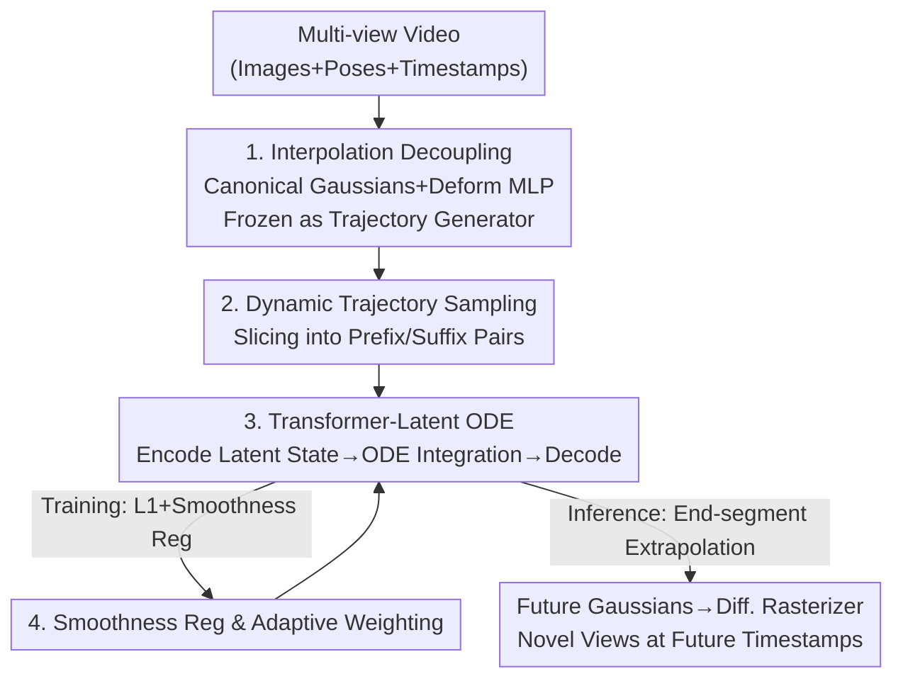

# ODE-GS: Latent ODEs for Dynamic Scene Extrapolation with 3D Gaussian Splatting

**Conference**: ICLR 2026  
**OpenReview**: [https://openreview.net/forum?id=XlRbpFj3lJ](https://openreview.net/forum?id=XlRbpFj3lJ)  
**Code**: https://github.com/preacherwhite/ODE-GS (Available)  
**Area**: 3D Vision  
**Keywords**: 3D Gaussian Splatting, Dynamic Scene Extrapolation, Neural ODE, Latent ODE, Sequence Prediction

## TL;DR
ODE-GS decouples "reconstruction" and "future prediction" for dynamic 3D Gaussian Splatting: it first trains a temporal deformation model to generate Gaussian parameter trajectories within the observation window, then utilizes a Transformer + Neural ODE to extrapolate past trajectories into future timestamps in a continuous latent space. This approach avoids out-of-distribution (OOD) failures caused by "timestamp conditioning," improving extrapolation metrics on D-NeRF, NVFi, and HyperNeRF by an average of approximately 19.8%.

## Background & Motivation

**Background**: 3D Gaussian Splatting (3DGS) has become a mainstream solution for dynamic scene reconstruction. The prevailing paradigm (e.g., Deformable-GS, 4D-GS, TiNeuVox) adopts a "canonical Gaussians + time-conditional deformation network" framework—learning a set of static canonical Gaussians $G$ and using a deformation network $D_\omega(t,G)$ with timestamp $t$ as input to predict position/rotation/scale offsets at any moment, enabling realistic novel-view rendering within the observed time window.

**Limitations of Prior Work**: These methods are essentially **temporal interpolators**—they excel at "filling the gaps between observed timestamps." Once the time is pushed beyond the observation window ($t > t_{\max}$), the timestamp falls outside the training distribution, leading to out-of-distribution (OOD) failure. Consequently, the predicted motion either collapses or jitters erratically. However, "predicting future dynamics from the past" (termed **dynamic scene extrapolation** by the authors) is the actual capability required for autonomous driving, robotics, and AR, yet it remains under-researched.

**Key Challenge**: Extrapolation tasks are inherently **under-constrained**—given past observations, there are infinite possible future dynamics. Directly feeding timestamps into the network forces the model to "blindly guess" in an unconstrained extrapolation region. To narrow the solution space, physical priors must be injected, such as spatiotemporal smoothness of motion.

**Goal**: To build a predictor that maintains high-fidelity 3DGS rendering while remaining stable when extrapolating to any future moment, ensuring the predicted motion is physically plausible (smooth and continuous).

**Key Insight**: Differential equations are natural tools for describing the evolution of physical systems, and Ordinary Differential Equations (ODEs) are particularly suited for characterizing continuous and smooth motion trajectories. Based on this, the authors reformulate "future prediction" as a **sequence-to-sequence** problem rather than a "query-by-timestamp" problem—which aligns perfectly with the characteristic of 3DGS explicitly representing a scene as a set of Gaussian parameters.

**Core Idea**: Replace "timestamp $\to$ deformation" with "past Gaussian trajectory $\to$ latent state $\to$ Neural ODE evolution $\to$ decode back to future Gaussians." This encodes smooth motion priors directly into continuous-time latent space dynamics, ensuring that future timestamps are no longer out-of-distribution.

## Method

### Overall Architecture

The core idea of ODE-GS is to **completely decouple scene reconstruction from temporal prediction**, training them serially in two stages.

The first stage is a standard **interpolation model**: a canonical Gaussian set $G$ plus a time-conditional deformation MLP $D_\omega$ is used to fit the scene within the observation window, and is **frozen** after training. The frozen interpolation model is no longer used for final rendering but acts as a "data generator"—given any time $t$ within the window, it outputs Gaussian parameters $G_k(t)$, providing a large batch of dense, clean Gaussian parameter trajectories.

The second stage is the actual predictor $E_\phi$, a **Transformer + Latent ODE** architecture: a segment of past trajectory (prefix) is encoded by a Transformer into a latent initial state $z(t_0)$, which is then integrated forward in time by a Neural ODE parameterized by an MLP. Finally, a decoder maps the evolved latent states back to Gaussian parameters. During training, **dynamic trajectory sampling** is used to slice each trajectory into multiple "observation prefix + future suffix" pairs of varying lengths, forcing the model to learn different prediction spans. This is combined with **latent space/trajectory smoothness regularization** (with adaptive weights) to narrow the under-constrained solution space to physically plausible ones.

During inference, a Gaussian trajectory segment of length $N_c$ from the end of the observation window is taken, encoded, integrated forward via ODE to $t > t_{\max}$, and decoded into future Gaussians. Finally, a differentiable rasterizer renders new views of the future.

### Key Designs

**1. Decoupling Reconstruction and Prediction: Frozen Interpolation Model as Trajectory Generator**

Training a model that "both reconstructs and extrapolates" end-to-end on raw images forces the timestamp signal to carry dual responsibilities, making it prone to overfitting noisy timestamps during extrapolation. ODE-GS splits these tasks: first, high-quality interpolation is achieved using canonical Gaussians $G$ and a time-conditional MLP $D_\omega$ with a photometric reconstruction loss $L_{\text{render}}=(1-\lambda)\lVert\hat I_i - I_i\rVert_1 + \lambda(1-\text{SSIM}(\hat I_i,I_i))$. Once optimized, **$G$ and $D_\omega$ are frozen**. Post-freezing, the model's sole duty is generating Gaussian parameters $G_k(t)$ for any $t$ within the window, effectively solidifying "hard-to-learn high-fidelity reconstruction" into a stable data generator. The downstream predictor can then learn motion patterns in a clean Gaussian parameter trajectory space without touching image pixels or relying on timestamp conditioning, fundamentally avoiding OOD failure. Note that for each Gaussian, only position $\mu_k$, rotation $q_k$, and scale $s_k$ vary over time, while opacity $\alpha_k$ and spherical harmonic coefficients $c_k$ remain consistent, reducing the prediction dimensionality.

**2. Transformer-Latent ODE: Sequence Prediction in Continuous Latent Space**

The fundamental flaw of timestamp conditioning is treating "time" as a query input, where extrapolation regions naturally fall outside the training distribution. This design shifts to pure sequence-to-sequence: given past trajectories $\gamma_k=\{G_k(t_j)\}_{j=1}^{N_c}$ uniformly sampled from a context window of length $N_c$, they are stepwise embedded with sinusoidal positional encodings. A Transformer encoder $F_\phi:\mathbb{R}^{N_c\times 10}\to\mathbb{R}^d$ then compresses them into a latent state $z(t_0)$ summarizing past dynamics. This state serves as the initial value for a Neural ODE, whose evolution is determined by an MLP-parameterized velocity field:

$$\dot z = \frac{dz}{dt} = f_\theta(z(t)).$$

Numerical integration for any $t > t_{\max}$ yields a continuous latent trajectory $z(t)$, which the decoder $\delta_\psi:\mathbb{R}^d\to\mathbb{R}^{10}$ maps back to Gaussian parameters $\hat G_k(t)=\delta_\psi(z(t))$. Thus, future time points are not queried as "timestamps" but are naturally generated by "how far to integrate"—the continuous ODE formulation inherently carries a smoothness prior, ensuring the predicted motion is continuous and differentiable, avoiding the erratic oscillations typical of discrete autoregression.

**3. Dynamic Trajectory Sampling: Exposing the Model to Various Prediction Spans**

If trajectories sampled during training always occupy the same fixed time span, the model only learns one prediction length, leading to poor generalization. ODE-GS designs dynamic sampling: an "observation prefix" and a "future suffix" are extracted from continuous trajectories provided by the frozen interpolation model. The prefix is sampled at fixed intervals to ensure consistent input dimensions, while **the suffix time span varies with the start time**. The training set is the union of all Gaussians, all start times, and all possible prefix-suffix splits. Consequently, the model sees both short-term and long-term prediction instances in a unified training process, making it more robust to various extrapolation spans.

**4. Smoothness Regularization and Adaptive Weighting: Selecting the Physically Plausible Path**

Under-constrained extrapolation means infinite trajectories could fit the past; physical priors must select the smooth one. Besides the L1 extrapolation loss $L_e=\frac{1}{N_e}\sum_j\lVert\hat G_k(t_j)-G_k(t_j)\rVert_1$ on predicted Gaussian parameters, two smoothness regularizations are added: **Latent Space Regularization** $R_{\text{latent}}$ approximates latent acceleration via finite differences $\lVert (f_\theta(z(t_{j+1}))-f_\theta(z(t_j)))/\Delta t_j\rVert_2^2$ to penalize high-frequency oscillations in the ODE velocity field; **Trajectory Regularization** $R_{\text{traj}}$ directly penalizes acceleration of Gaussian positions $\mu_k(t)$ in 3D space. However, strong regularization early in training might suppress dynamic learning. Thus, an **adaptive weighting** $s_t$ is introduced: using the Exponential Moving Average (EMA) of the prediction loss to estimate convergence, the regularization weight is gradually increased as the extrapolation loss decreases. The final loss is:

$$L = L_e + s_t(\lambda_{\text{latent}}R_{\text{latent}} + \lambda_{\text{traj}}R_{\text{traj}}).$$

This allows the model to freely learn motion trends initially before being "pulled" towards smooth solutions, balancing fitting capacity and stability.

### Loss & Training

The overall training is divided into two phases: ① The interpolation model is trained using photometric reconstruction loss $L_{\text{render}}$ (L1 + SSIM) and then frozen. ② The predictor is trained using extrapolation L1 loss $L_e$ plus two smoothness regularizations ($R_{\text{latent}}$ and $R_{\text{traj}}$), with regularization weights dynamically scheduled by an EMA-based adaptive term $s_t$. Notably, the authors found that adding image reprojection loss to the predictor yielded negligible gains since the interpolation model was already accurate enough, making trajectory losses sufficient for supervision.

## Key Experimental Results

### Main Results

Future extrapolation was performed on three benchmarks: D-NeRF, NVFi, and HyperNeRF, comparing against temporal interpolation methods (Deformable-GS, 4D-GS, 4D-Rotor-Gaussians, TiNeuVox) and extrapolation methods (GaussianPrediction, NVFi).

| Dataset | Metric | ODE-GS | Prev. Best | Gain |
|--------|------|--------|----------|------|
| D-NeRF (8-scene avg) | PSNR↑ | 27.30 | GaussianPredict | +18.6% (Overall) |
| NVFi (10-scene avg) | PSNR↑ | 33.43 | NVFi | +20% (Overall) |
| NVFi | LPIPS↓ | 0.0603 | — | >40% drop in factory/darkroom |
| HyperNeRF (Real) | PSNR/SSIM/LPIPS | Leading in most scenes | Deformable-GS / GaussianPredict | Consistent improvement |

On D-NeRF, scenes with smooth motion and simple trajectories showed the greatest advantage: Mutant (+10 dB PSNR), Standup (+7 dB). Across the three datasets, gains averaged 21.4% in PSNR, 7.4% in SSIM, and 30.5% in LPIPS.

### Ablation Study

Average results on the NVFi dataset:

| Configuration | PSNR↑ | SSIM↑ | LPIPS↓ | Description |
|------|-------|-------|--------|------|
| Full model | 33.43 | .947 | .060 | Complete model |
| w/o ODE | 23.71 | .879 | .113 | Replaced with pure autoregressive Transformer; LPIPS nearly doubled |
| w/o Regularization | 32.90 | .943 | .066 | Removed both smoothness regularizations |
| w/o Adaptive reg. | 32.19 | .938 | .068 | Fixed regularization weight without EMA adaptation |
| w/o Dynamic sampling | 31.35 | .935 | .069 | Fixed span sampling |

### Key Findings

- **Neural ODE is vital**: Removing the ODE and using a discrete autoregressive Transformer caused PSNR to plummet from 33.43 to 23.71, while LPIPS nearly doubled. Discrete autoregression lacks the inherent smoothness prior of an ODE and is prone to oscillations, validating the motivation of using continuous dynamics for smoothness.
- **Dynamic Sampling is the second biggest contributor**: Removing it dropped PSNR to 31.35, showing that exposing the model to various prediction spans is critical for extrapolation generalization.
- **Smoothness regularization shines in complex motion**: In scenes like "dining" or "hell-warrior" with diverse motions, regularization provided the most prominent visual improvements. Adaptive weighting further boosted results from 32.19 to 33.43.
- **Reprojection loss is redundant**: Since the interpolation model provides sufficiently accurate trajectories, trajectory L1 loss is sufficient supervision; additional reprojection loss does not bring significant gains.

## Highlights & Insights
- **"Decoupling" is the core strength**: Solidifying high-fidelity reconstruction into a frozen data generator allows the predictor to learn motion patterns in a clean Gaussian parameter trajectory space. This avoids pixel-level noise and completely cuts dependency on timestamps—a transferable strategy for any dynamic representation task where reconstruction is mature but prediction is weak.
- **Reformulating "query-by-timestamp" as "seq-to-seq prediction"** is key to avoiding OOD: Future timestamps are no longer OOD query inputs, but natural extensions of ODE integration.
- **Continuous ODE formulations carry smoothness priors** more elegantly than manual constraints; the nearly doubled LPIPS of the autoregressive baseline is strong empirical evidence for this.
- **Adaptive Regularization Scheduling (EMA-driven)** is a practical trick: It allows initial free learning and subsequent tightening of smoothness, preventing strong regularization from stifling dynamics early on.

## Limitations & Future Work
- **Dependency on Interpolation Quality**: The predictor's training trajectories are solely generated by the frozen interpolation model. If the interpolation model is biased (e.g., in scenes like Lego where poses might be inaccurate), the predictor can only learn from biased trajectories.
- **Smoothness Priors on Abrupt Motion**: The method excels in scenes with "smooth motion and simple trajectories." For abrupt motions or collisions, the smoothness assumption might suppress realistic dynamics (e.g., in NVFi's "fallingball").
- **Parameter Subset Prediction**: Only predicting $\mu, q, s$ and fixing opacity and spherical harmonics means the model cannot extrapolate changes in lighting or appearance over time, making it susceptible to appearance drift over long spans.
- **Future Directions**: Introducing uncertainty modeling (e.g., Latent ODE with VAE) to quantify extrapolation confidence, or introducing piecewise/event-triggered ODEs for non-smooth motions.

## Related Work & Insights
- **vs Deformable-GS / 4D-GS / TiNeuVox**: These use timestamp-conditional deformation networks for interpolation. Ours borrows this for interpolation but downgrades it to a frozen generator, leaving extrapolation to an independent Latent ODE. The difference is that Ours does not condition on timestamps during extrapolation, avoiding the OOD collapse.
- **vs NVFi**: NVFi also studies extrapolation and adds geometric priors, but still relies on explicit timestamps during training. Ours removes timestamp conditioning via seq-to-seq + ODE, achieving a ~20% overall improvement on NVFi's own dataset.
- **vs GaussianPrediction**: Both replace "timestamp-dependency" with "past-motion-dependency," but GaussianPrediction uses superpoints + GCN, limiting extrapolation to discrete steps. Ours uses continuous ODEs for rendering at any future time point, with ablation showing continuous formulations significantly outperform discrete autoregression in smoothness.
- **vs GaussianVideo**: Also uses Neural ODEs, but GaussianVideo focuses on smooth camera trajectories, whereas Ours focuses on scene motion itself.

## Rating
- Novelty: ⭐⭐⭐⭐⭐ First to combine Latent ODE with 3DGS for dynamic scene extrapolation; the "decoupling reconstruction-prediction + removing timestamp conditioning" shift is very clean.
- Experimental Thoroughness: ⭐⭐⭐⭐ Solid results across three benchmarks and four ablations; however, it lacks long-term extrapolation decay curves and uncertainty analysis.
- Writing Quality: ⭐⭐⭐⭐⭐ Clear motivation, phased methodology, complete formulas, and ablations that directly address the initial motivation.
- Value: ⭐⭐⭐⭐ Provides a feasible paradigm for future 3D state prediction in autonomous driving/robotics/AR; the decoupling strategy is highly transferable.

<!-- RELATED:START -->

## Related Papers

- [\[ICLR 2026\] MoE-GS: Mixture of Experts for Dynamic Gaussian Splatting](moe-gs_mixture_of_experts_for_dynamic_gaussian_splatting.md)
- [\[ICLR 2026\] Fracture-GS: Dynamic Fracture Simulation with Physics-Integrated Gaussian Splatting](fracture-gs_dynamic_fracture_simulation_with_physics-integrated_gaussian_splatti.md)
- [\[ICLR 2026\] SSD-GS: Scattering and Shadow Decomposition for Relightable 3D Gaussian Splatting](ssd-gs_scattering_and_shadow_decomposition_for_relightable_3d_gaussian_splatting.md)
- [\[ICLR 2026\] CLoD-GS: Continuous Level-of-Detail via 3D Gaussian Splatting](clod-gs_continuous_level-of-detail_via_3d_gaussian_splatting.md)
- [\[CVPR 2026\] VAD-GS: Visibility-Aware Densification for 3D Gaussian Splatting in Dynamic Urban Scenes](../../CVPR2026/3d_vision/vad-gs_visibility-aware_densification_for_3d_gaussian_splatting_in_dynamic_urban.md)

<!-- RELATED:END -->
