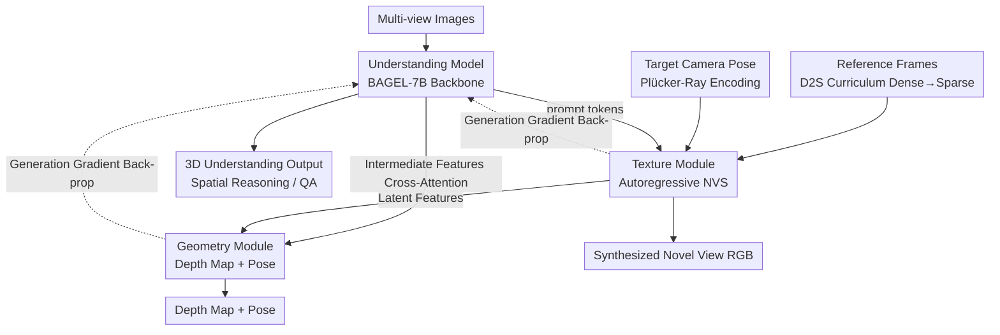

# Omni-View: Unlocking How Generation Facilitates Understanding in Unified 3D Model based on Multiview images

**Conference**: ICLR 2026  
**arXiv**: [2511.07222](https://arxiv.org/abs/2511.07222)  
**Code**: [https://github.com/AIDC-AI/Omni-View](https://github.com/AIDC-AI/Omni-View)  
**Area**: 3D Vision / Multi-view Understanding  
**Keywords**: Unified Understanding and Generation, 3D Scene Understanding, Novel View Synthesis, Spatial Reasoning, Multi-view  

## TL;DR
Omni-View is a unified 3D scene understanding and generation model that enhances understanding performance through the generative capabilities of a texture module (novel view synthesis) and a geometry module (depth/pose estimation), achieving a score of 55.4 on VSI-Bench and surpassing all existing specialized 3D understanding models.

## Background & Motivation

**Background**: Unified Multimodal Understanding and Generation (UMM) has made significant progress in the 2D domain (BAGEL, Janus, etc.), but unified models for 3D scenes remain a blank. Existing 3D understanding methods (LLaVA-3D, GPT4Scene, etc.) rely on explicit 3D inputs (voxels, BEV), which limits practical applications.

**Limitations of Prior Work**: (a) 2D UMM has only explored "understanding facilitates generation"; the reverse "generation facilitates understanding" has not been fully validated. (b) 3D understanding tasks require geometric measurement and spatio-temporal modeling capabilities, which existing models lack mechanisms to acquire. (c) Methods relying on 3D inputs are difficult to deploy in real-world scenarios.

**Key Challenge**: 3D scene understanding (judgment of distance, directional reasoning, appearance order) inherently requires geometric and spatio-temporal modeling capabilities. However, pure understanding models learn only from a semantic perspective and fail to acquire these abilities.

**Goal**: To empower understanding models with geometric and spatio-temporal modeling capabilities through 3D generation tasks (geometric estimation + novel view synthesis), constructing the first unified understanding and generation model for general 3D scenes.

**Key Insight**: Drawing on neuroscientific evidence, human understanding of 3D environments relies on the ability to "generate and imagine" future sensory and geometric data. This directly justifies the applicability of the "generation facilitates understanding" paradigm in 3D scenes.

**Core Idea**: Utilize novel view synthesis for learning spatio-temporal modeling and depth/pose estimation for learning geometric measurements. These two generative capabilities synergistically enhance 3D understanding.

## Method

### Overall Architecture
Omni-View aims to answer an inverse question: in 3D scenes, can teaching a model to "generate" (synthesize novel views, estimate depth and pose) in turn improve "understanding"? The system is built upon BAGEL-7B and is decoupled into an understanding model and a generation model. The generation model is further divided into a texture module (novel view synthesis via flow matching) for appearance and a geometry module (estimating depth maps and camera poses) for geometry. The data flow is as follows: the understanding model reads multi-view images and produces prompt tokens and intermediate features for the generation side; the texture module autoregressively synthesizes target views based on these inputs; the latent features, combined with intermediate features from the understanding model, are passed to the geometry module to estimate depth and pose. Gradients from both generation tasks are back-propagated to the understanding model, internalizing spatio-temporal and geometric measurement capabilities. Training consists of two stages: Stage 1 involves joint training of the understanding, texture, and geometry components, using a Dense-to-Sparse (D2S) curriculum to gradually remove reference frames; Stage 2 freezes the understanding model and fine-tunes the generation modules to refine generation quality.

### Key Designs

**1. Texture Module: Injecting Spatio-temporal Modeling via Autoregressive Novel View Synthesis**

Tasks like "appearance order" in 3D understanding require the model to grasp temporal relationships across multiple frames, which pure understanding training fails to capture. Given reference images and target camera poses, the texture module synthesizes the image at that viewpoint. Specifically, it uses FLUX-VAE to encode reference images and Plücker-Ray to encode camera poses as positional embeddings, generating target frames via flow matching denoising. Crucially, it is autoregressive—the model sees the previous $n-1$ frames while generating the $n$-th frame, forcing it to model temporal dependencies. Back-propagated gradients then bestow spatio-temporal modeling capabilities upon the understanding engine.

**2. Geometry Module: Back-filling Geometric Measurement via Depth/Pose Estimation**

Tasks involving relative distance and direction require geometric concepts that cannot be learned solely from semantics. The geometry module receives latent features from the final layer of the texture module, concatenates depth noise and a set of learnable pose queries, and fuses intermediate features from the understanding model via cross-attention. Depth estimation follows flow matching, while camera poses are predicted using a VGGT decoder with Huber loss. By explicitly predicting depth, the model is guided to understand relative spatial relationships, and these gradients internalize geometric priors within the understanding model.

**3. Dense-to-Sparse (D2S) Training Strategy: Curriculum Learning by Gradually Removing Reference Frames**

If reference images remain abundant, the generation task is too simple for the model to learn complex scene structures. D2S transitions the reference set from dense to sparse: early in training, the reference set includes all input frames; as training progresses, frames are removed until only the first remains. As information decreases and generation difficulty increases, the model must establish a deeper understanding of scene structure to succeed, thereby embedding this structural understanding into the model.

### Loss & Training

The total loss for Stage 1 is $L_{s1} = \lambda_{und} L_{und} + \lambda_{tex} L_{tex} + \lambda_{geo} L_{geo}$, with default weights of 1:1:0.1. The understanding loss $L_{und}$ utilizes next-token prediction, the texture loss $L_{tex}$ follows MSE (difference between predicted and actual noise), and the geometry loss $L_{geo}$ comprises depth MSE plus pose Huber loss. Diffusion forcing is introduced to optimize 3D consistency across multiple views. Stage 2 freezes the understanding model and performs joint learning on RGBDP to specifically enhance generative quality.

## Key Experimental Results

### Main Results

VSI-Bench Spatial Reasoning (without 3D input):

| Method | Obj. Counting | Abs. Dist. | Rel. Dist. | App. Order | Avg. |
|------|---------|---------|---------|---------|------|
| SpatialMLLM-4B | 65.3 | 34.8 | 41.3 | 46.3 | 48.4 |
| VG-LLM-4B | 66.4 | 36.6 | 40.8 | 39.5 | 46.1 |
| BAGEL-7B-FT | 62.8 | 36.3 | 46.1 | 43.1 | 46.3 |
| **Omni-View-7B (Ours)** | **70.3** | **46.4** | **65.9** | **49.0** | **55.4** |

Novel View Synthesis (Re10k): PSNR=23.22 (surpassing Voyager-13B's 23.12), LPIPS=0.114 (significant lead).

### Ablation Study

| Configuration | VSI-Bench Avg. | Description |
|------|--------------|------|
| Understanding only (BAGEL-FT) | 46.3 | Baseline |
| +Texture Module | ~50 | Spatio-temporal → App. Order +4.1 |
| +Geometry Module | ~49 | Geometry → Rel. Dist. significant gain |
| +Tex + Geo (Unified Arch) | ~52 | Inferior to decoupled architecture |
| **+Tex + Geo (Decoupled Arch)** | **55.4** | Optimal decoupled design |
| w/o D2S Strategy | Decrease | Curriculum learning is effective |
| w/o Autoregressive Gen. | Decrease | Forced temporal understanding is effective |

### Key Findings
- Generation significantly facilitates understanding: Relative Distance increased from 46.1→65.9 (+19.8), Absolute Distance from 36.3→46.4 (+10.1), and Appearance Order from 43.1→49.0 (+5.9).
- Texture and geometry modules contribute distinct capabilities: Texture → Spatio-temporal modeling, Geometry → Spatial measurement.
- Decoupled dual-module architecture outperforms a unified one by avoiding gradient conflicts between different generation targets.
- Performance exceeds most methods requiring 3D inputs, despite using only multi-view images.
- Understanding and generation training data are non-overlapping, ruling out data memorization effects.

## Highlights & Insights
- **Systematic Validation of "Generation Facilitates Understanding"**: First large-scale validation of this intuition in 3D scenes, with ablations decoupling spatio-temporal (texture) and metric (geometry) contributions.
- **Decoupled Dual-Module Design**: Separate handling of texture and geometry is superior to a unified architecture as it sidesteps multi-task gradient conflicts—this provides a useful precedent for other unified model designs.
- **D2S Curriculum Learning**: Gradually reducing reference images is a simple yet effective strategy; the core logic is that less information forces a deeper structural understanding.
- **Dramactic Gain in Relative Distance (+19.8)**: This is the most striking result in the ablation study, clearly illustrating the critical role of geometric estimation in spatial reasoning.

## Limitations & Future Work
- Precision in camera pose control is insufficient—novel view synthesis pixel fidelity only slightly exceeds specialized models.
- Gains in absolute metrics (e.g., room size, absolute distance) are limited due to a lack of absolute scale in synthesized depth maps.
- Validated only at 7B model scale; yet to be tested on larger scales.
- Data constraints: ScanNet/Re10k cover limited scene types; outdoor large-scale scenes are not yet verified.
- Stage 2 geometry modules no longer rely on understanding model features, potentially leading to inconsistencies in generative capabilities between stages.

## Related Work & Insights
- **vs LLaVA-3D / GPT4Scene**: While they require 3D inputs (voxels/BEV), Omni-View approaches or surpasses their performance using only multi-view images (ScanQA CIDEr: 103.0 vs 102.1).
- **vs SpatialMLLM / VG-LLM**: These models use VGGT features to embed 3D priors; Omni-View internalizes these priors via generative tasks, leading to better results.
- **vs BAGEL**: Direct fine-tuning of the BAGEL baseline yields only 46.3, whereas adding the generative module reaches 55.4 (+9.1), proving the gain stems from generation rather than data.
- **Insights for Unified Models**: Generation and understanding are not just two independent tasks—capabilities acquired during generation (spatio-temporal, geometric) can directly augment understanding.

## Rating
- Novelty: ⭐⭐⭐⭐⭐ First unified understanding/generation model for general 3D scenes; systematic validation of the "generation boosts understanding" paradigm.
- Experimental Thoroughness: ⭐⭐⭐⭐⭐ Multiple benchmarks (VSI-Bench/SQA3D/ScanQA/ScanRefer/Re10k) and detailed ablations.
- Writing Quality: ⭐⭐⭐⭐ Clear structure, though some phrasing could be more concise.
- Value: ⭐⭐⭐⭐⭐ Pioneering contribution to unified 3D understanding and generation; SOTA performance.

<!-- RELATED:START -->

## Related Papers

- [\[ICLR 2026\] UniUGG: Unified 3D Understanding and Generation via Geometric-Semantic Encoding](uniugg_unified_3d_understanding_and_generation_via_geometric-semantic_encoding.md)
- [\[CVPR 2026\] Masking Matters: Unlocking the Spatial Reasoning Capabilities of LLMs for 3D Scene-Language Understanding](../../CVPR2026/3d_vision/masking_matters_unlocking_the_spatial_reasoning_capabilities_of_llms_for_3d_scen.md)
- [\[CVPR 2026\] Uni3R: Unified 3D Reconstruction and Semantic Understanding via Generalizable Gaussian Splatting from Unposed Multi-View Images](../../CVPR2026/3d_vision/uni3r_unified_3d_reconstruction_and_semantic_understanding_via_generalizable_gau.md)
- [\[ICLR 2026\] EgoNight: Towards Egocentric Vision Understanding at Night with a Challenging Benchmark](egonight_towards_egocentric_vision_understanding_at_night_with_a_challenging_ben.md)
- [\[ICLR 2026\] ReconViaGen: Towards Accurate Multi-view 3D Object Reconstruction via Generation](reconviagen_towards_accurate_multi-view_3d_object_reconstruction_via_generation.md)

<!-- RELATED:END -->
