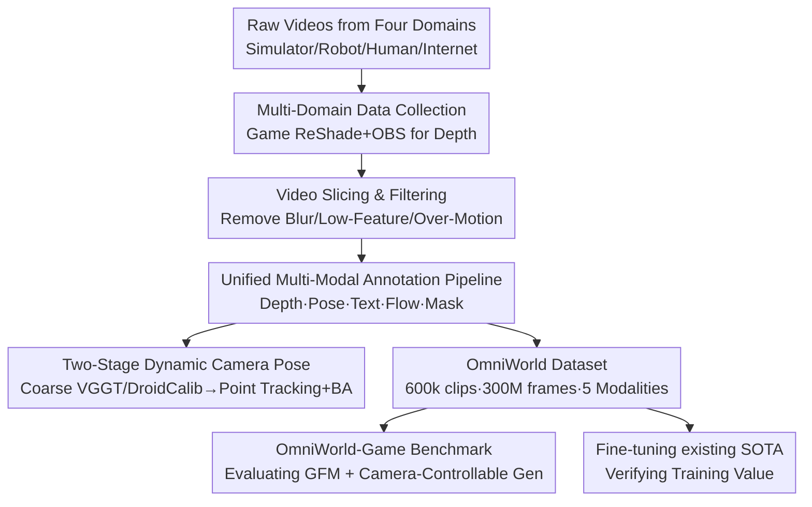

# OmniWorld: A Multi-Domain and Multi-Modal Dataset for 4D World Modeling

**Conference**: ICLR 2026  
**OpenReview**: [https://openreview.net/forum?id=1y1YFKb9pp](https://openreview.net/forum?id=1y1YFKb9pp)  
**Code**: https://yangzhou24.github.io/OmniWorld/ (Project Page)  
**Area**: 3D Vision / Datasets & Benchmarks  
**Keywords**: 4D world modeling, multi-domain dataset, multi-modal annotation, geometric foundation models, camera-controllable video generation

## TL;DR
The authors construct OmniWorld, a 4D world modeling dataset spanning four domains (simulator, robot, human, and internet) with over 300 million frames, featuring five modalities: depth, camera pose, text, optical flow, and foreground masks. By combining self-collected game engine data with 12 public datasets and an automated annotation pipeline, they demonstrate that fine-tuning existing SOTA models on OmniWorld leads to significant gains in 3D geometric reconstruction and camera-controllable video generation.

## Background & Motivation
**Background**: 4D world modeling, which characterizes both spatial geometry and temporal dynamics, has advanced rapidly through large-scale generative models and multi-modal learning. It centers on two core tasks reflecting "world understanding": Geometric Foundation Models (GFM, recovering 3D geometry from 2D images, e.g., DUSt3R, VGGT) and camera-controllable video generation (producing dynamic videos following precise spatio-temporal instructions). Both tasks rely heavily on large-scale, high-quality data with rich modalities such as RGB, depth, and camera poses.

**Limitations of Prior Work**: Regarding evaluation, existing benchmarks have sequences that are too short (Sintel averages only 50 frames), feature small motion scales, or contain limited action types (Bonn focuses only on indoor human motion; KITTI on outdoor street scenes), making it difficult to assess long-term robustness and complex dynamics. For camera-controllable video generation, the mainstream dataset RealEstate10K consists almost entirely of static scenes with smooth camera trajectories, diverging significantly from the real world. Regarding training, while video-text data is abundant, it generally lacks critical geometric modalities like depth, camera poses, and optical flow. Large-scale, multi-domain data with precise geometric annotations remains extremely scarce.

**Key Challenge**: Truly universal 4D world models are constrained by the lack of high-quality data that simultaneously satisfies "complex dynamics," "multi-domain diversity," and "complete spatio-temporal annotations." Existing datasets either have semantics without geometry or geometry within narrow, small-scale scenes.

**Goal**: To create a dataset with dynamic complexity, multi-domain diversity, and dense spatio-temporal annotations to serve as both a training resource and a challenging benchmark that exposes the weaknesses of current SOTA models.

**Key Insight**: Collecting synchronized, precise, and dense multi-modal ground truth in the real world is exceptionally difficult. However, modern game engines render with sufficient realism and allow for the direct extraction of precise depth during the rendering process. Thus, game environments serve as the primary source for self-collected data, supplemented by public data to provide real-world diversity.

**Core Idea**: The core idea is to center the dataset on self-collected OmniWorld-Game synthetic data, integrated with public data from four major domains and supported by a unified multi-modal automated annotation pipeline to achieve "scale + multi-domain + multi-modal geometric annotations" simultaneously.

## Method

### Overall Architecture
OmniWorld consists of a data collection framework, an automated annotation pipeline, and a benchmark. The input consists of raw videos from four domains (simulator, robot, human, and internet). These are first processed via video slicing to filter out segments with motion blur, insufficient features, or excessive motion, resulting in high-quality RGB sequences. These sequences are then fed into a set of specialized annotation pipelines that uniformly provide five modalities: depth, camera pose, text descriptions, optical flow, and foreground masks. Finally, the framework produces a trainable dataset and a challenging benchmark derived from the OmniWorld-Game subset, used to evaluate and fine-tune existing SOTA models. The total scale exceeds 600,000 video segments and 300 million frames, with the OmniWorld-Game subset alone contributing 96,000 segments (18.51 million frames, 214 hours).

### Key Designs

**1. Game Engine Self-Collection (OmniWorld-Game): Obtaining Precise Dense GT Unavailable in Reality**

The data bottleneck stems from the inability to collect synchronized, precise, and dense multi-modal ground truth in reality—depth sensors are sparse and noisy, and camera poses in dynamic scenes are difficult to label. The authors turn to game environments: following previous practices, they use ReShade to intercept depth information within the rendering pipeline while using OBS to capture RGB images from the screen, thereby obtaining precisely controlled dense depth and 720P RGB. This offers two advantages: first, the precision of modalities like depth is high and nearly impossible to obtain in reality; second, modern game graphics are realistic and diverse (ranging from wilderness to cities, ancient to futuristic), minimizing the sim-to-real gap. Consequently, OmniWorld-Game surpasses existing synthetic datasets in both modal diversity and scale—it contains 18.51 million frames with all five modalities, whereas SeKai-Game, while having 4.32 million frames, lacks depth, optical flow, and foreground masks.

**2. Multi-Domain Integration Strategy: Trading Multi-Domain Coverage for Real-World Complexity**

Relying solely on synthetic data leads to a distribution shift. Therefore, the authors combine self-collected simulator data with three types of public real-world domains: the Robot domain (AgiBot, DROID, RH20T for robot-environment interaction and navigation), the Human domain (RH20T-Human, HOI4D, Epic-Kitchens, Ego-Exo4D, HoloAssist, Assembly101, EgoDex, covering first/third-person activities), and the Internet domain (CityWalk for large-scale urban street scenes). Statistically, the human domain is the largest, emphasizing real-world activities, while OmniWorld-Game is highly diverse internally across scene types, camera views, and historical eras. This combination ensures the dataset possesses both "precise annotations from the synthetic domain" and "distributional diversity from the real world."

**3. Unified Multi-Modal Annotation Pipeline: Tailored Modal Completion Based on Data Source**

Raw data from different sources lacks various modalities. The authors designed source-adaptive automated annotation schemes to provide five modalities:
- **Depth**: For self-collected game data, rendering depth is used via ReShade. For public sets with sparse/noisy depth (e.g., AgiBot, HOI4D), Prior Depth Anything is used for optimization. For stereo sets (e.g., DROID), FoundationStereo is utilized for stereo depth estimation.
- **Foreground Masks**: For the robot domain, RoboEngine generates initial masks for keyframes, followed by temporal tracking with SAM 2. In the game domain (e.g., third-person player characters), Grounding DINO detects initial boxes in predefined areas as prompts for SAM. These masks also assist in camera pose estimation.
- **Text**: Qwen2-VL-72B-Instruct semi-automatically generates descriptions for every 81-frame segment using domain-specific prompts (covering perspectives, actions, background details, and camera movement). Captions typically range from 150–250 tokens, exceeding the density of OpenVid-1M or Panda-70M.
- **Optical Flow**: DPFlow is used to generate dense pixel-level motion, capable of handling original resolutions without downsampling.

**4. Two-Stage Dynamic Camera Pose Annotation: Rescuing SfM in Weak Texture and Sudden Motion**

Traditional Structure-from-Motion (SfM) often fails in dynamic videos due to scene transitions, weak textures, or abrupt motion. The authors designed a robust two-stage pipeline, utilizing the previously calculated foreground masks to focus on static background regions (shielding dynamic foreground interference):
- **Stage 1: Coarse Estimation**: Initial poses are provided by VGGT (for depth-less videos) or DroidCalib (when depth constraints are available).
- **Stage 2: Refinement**: Dense point tracking is performed on static regions using SIFT/SuperPoint with CoTracker3, followed by Bundle Adjustment (BA) to minimize reprojection error, optionally incorporating depth for enhanced forward-backward reprojection. This "mask-focused static background → coarse estimation → point tracking + BA refinement" design is key to stabilizing dynamic camera poses across diverse data types.

## Key Experimental Results

The experiments consist of two parts: using OmniWorld-Game as a benchmark to expose SOTA limitations and using OmniWorld to fine-tune SOTA models to verify training value.

### Main Results: GFM Evaluation on OmniWorld-Game Benchmark

Evaluating various geometric foundation models on monocular and video depth estimation shows that no single model excels in all tasks, and overall errors remain high, validating the challenge of the benchmark.

| Task | Best Method | Abs Rel ↓ | $\delta < 1.25$ ↑ | Remarks |
| :--- | :--- | :--- | :--- | :--- |
| Mono Depth (scale) | MoGe-2 | 0.401 | 0.589 | Sharpest depth maps |
| Video Depth (scale&shift) | VGGT | 0.194 | 0.755 | Best balance of accuracy + efficiency (18.75 FPS) |
| Video Depth (scale&shift) | DUSt3R | 0.379 | 0.560 | Significantly lagging |

Point cloud visualizations further reveal that even the best-performing VGGT exhibits noticeable artifacts in highly dynamic scenes, indicating that current SOTA models still struggle with long-sequence consistency and complex dynamics.

Camera-controllable video generation benchmarks also expose issues: among I2V models, CamCtrl has the best camera control accuracy (CamMC 1.3856) but often generates blurry characters; T2V’s AC3D shows weak dynamics and fails to follow camera trajectories (CamMC 6.6965, FVD 1745.8).

### Ablation Study / Finetuning Validation: Performance Gain After Training on OmniWorld

| Model | Task/Benchmark | Metric | Original | Fine-tuned (*) |
| :--- | :--- | :--- | :--- | :--- |
| DUSt3R | Mono Depth / Sintel | Abs Rel ↓ | 0.488 | 0.370 |
| DUSt3R | Mono Depth / Bonn | Abs Rel ↓ | 0.139 | 0.067 |
| CUT3R | Video Depth / Sintel | Abs Rel ↓ | 0.417 → 0.537* | 0.396 / 0.314 |
| AC3D | Camera Gen / OmniWorld-Game | CamMC ↓ | 6.6965 | 4.4854 |
| AC3D | Camera Gen / RealEstate10K | CamMC ↓ | 3.6615 | 3.0518 |

### Key Findings
- **Fine-tuned DUSt3R not only surpasses its baseline but also outperforms MonST3R**, which was fine-tuned on multiple dynamic datasets (Sintel Mono Depth Abs Rel 0.370 vs 0.402), suggesting the scale and diversity of OmniWorld provide benefits beyond existing dynamic datasets.
- The improvement in video depth is particularly significant (CUT3R's Abs Rel on Sintel under scale&shift dropped from 0.537 to 0.314), confirming OmniWorld's role in improving temporal consistency.
- Camera-controllable generation improved on both the challenging internal benchmark and RealEstate10K **simultaneously**, supporting the prior that dynamic data is crucial for camera control—models trained only on static scenes cannot follow complex camera trajectories.

## Highlights & Insights
- **"Free" Dense Depth via Game Engines**: Using ReShade for rendered depth and OBS for synchronized RGB bypasses the hard constraints of real-world dense depth collection. This strategy is reusable for any synthetic data work requiring precise geometric ground truth.
- **Foreground Masks Aiding Camera Pose**: Masks are not just an output modality; they are used to shield dynamic foregrounds so pose estimation can focus on static backgrounds. This coupling of modality outputs into other annotation stages is an elegant pipeline design.
- **Dual Identity as "Hard Benchmark + Training Resource"**: The same dataset exposes SOTA flaws and enables performance gains through fine-tuning, unifying evaluation and training within a single resource.
- **Source-Adaptive Annotation**: Applying different depth estimation tools (ReShade/Prior Depth Anything/FoundationStereo) based on the source demonstrates a "unified goal, heterogeneous processing" engineering trade-off.

## Limitations & Future Work
- **Sim-to-Real Residual**: Despite realistic rendering, a distributional gap exists between game data and real-world physics; the paper does not quantify how this residual affects downstream transfer.
- **Dependency on External Models**: Depth, poses, masks, and text are generated by existing models (e.g., SAM, Qwen2-VL), meaning errors from these models propagate into the training data, and truth reliability varies across sources.
- **Copyright and Compliance**: Game data is strictly limited to non-commercial academic use and requires the removal of UI and sensitive content, limiting commercialization and fully open access.
- **Benchmark Scope**: Currently focused on 3D geometric prediction and camera-controllable video generation; it has not yet covered tasks like future prediction or causal reasoning, which also belong to 4D world modeling.

## Related Work & Insights
- **vs. Static 3D Datasets (e.g., ScanNet)**: These provide precise geometry but are static; OmniWorld adds the temporal dimension through dynamic video and sequential annotations.
- **vs. Video-Text Datasets (e.g., Panda-70M, OpenVid-1M)**: These have rich semantics but lack geometric modalities like depth/pose; OmniWorld provides both, with higher caption density.
- **vs. Existing Synthetic Datasets (e.g., Sintel, TartanAir, SeKai-Game)**: OmniWorld is superior in scale, diversity, and modal richness. Specifically, SeKai-Game lacks depth, optical flow, and foreground masks, while OmniWorld-Game is more frame-dense by an order of magnitude.

## Rating
- Novelty: ⭐⭐⭐⭐ While an empirical resource rather than a new method, the combination of game-engine collection, multi-domain integration, and five-modality unified annotation is the first to aggregate all elements for 4D world modeling.
- Experimental Thoroughness: ⭐⭐⭐⭐ Includes multi-model benchmark evaluations and fine-tuning gains across different baselines, creating a complete loop.
- Writing Quality: ⭐⭐⭐⭐ Logical flow from motivation to data, annotation, benchmark, and validation; information-dense tables.
- Value: ⭐⭐⭐⭐⭐ Directly addresses the data bottleneck in 4D world modeling with scale and modal completeness.

<!-- RELATED:START -->

<!-- RELATED:END -->

## Related Papers

- [\[ICLR 2026\] RoRE: Rotary Ray Embedding for Generalised Multi-Modal Scene Understanding](rore_rotary_ray_embedding_for_generalised_multi-modal_scene_understanding.md)
- [\[AAAI 2026\] Multi-Modal Assistance for Unsupervised Domain Adaptation on Point Cloud 3D Object Detection](../../AAAI2026/3d_vision/multi-modal_assistance_for_unsupervised_domain_adaptation_on_point_cloud_3d_obje.md)
- [\[ICLR 2026\] Point-MoE: Large-Scale Multi-Dataset Training with Mixture-of-Experts for 3D Semantic Segmentation](point-moe_large-scale_multi-dataset_training_with_mixture-of-experts_for_3d_sema.md)
- [\[CVPR 2026\] WonderZoom: Multi-Scale 3D World Generation](../../CVPR2026/3d_vision/wonderzoom_multi-scale_3d_world_generation.md)
- [\[CVPR 2026\] Multi-modal Frequency Decomposition Network for Semantic Scene Completion](../../CVPR2026/3d_vision/multi-modal_frequency_decomposition_network_for_semantic_scene_completion.md)

<!-- RELATED:END -->
