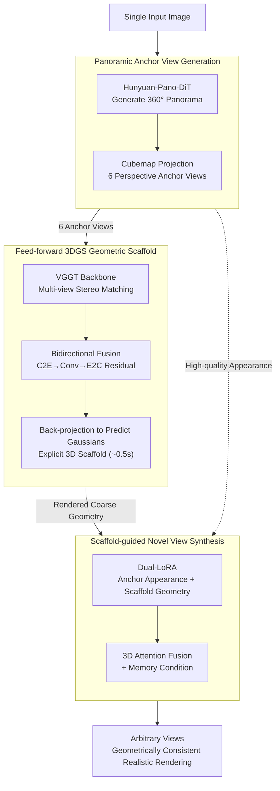

# One2Scene: Geometric Consistent Explorable 3D Scene Generation from a Single Image

**Conference**: ICLR 2026  
**arXiv**: [2602.19766](https://arxiv.org/abs/2602.19766)  
**Code**: [Project Page](https://one2scene5406.github.io/)  
**Area**: 3D Vision/Scene Generation  
**Keywords**: Single-image 3D scene generation, panoramic depth estimation, 3D Gaussian Splatting, geometric scaffold, novel view synthesis

## TL;DR
One2Scene is proposed to decompose the ill-posed problem of single-image to explorable 3D scene generation into three sub-tasks: (1) panoramic image generation to extend visual coverage, (2) a feed-forward 3DGS network to construct an explicit 3D geometric scaffold from sparse anchor views, and (3) scaffold-guided novel view synthesis. By fusing high-quality anchor views and geometric priors via Dual-LoRA, the method achieves geometrically consistent and realistic scene generation under large viewpoint changes, significantly outperforming SOTA.

## Background & Motivation

**Background**: Generating explorable 3D scenes from a single image is a core challenge in 3D vision. Traditional reconstruction methods (NeRF/3DGS) require numerous images, while sparse-view methods fail to extrapolate. Generative approaches include video diffusion models (ReconX/ViewCrafter), panoramic pipelines (DreamScene360/DreamCube), and navigation + inpainting (WonderJourney/Pano2Room).

**Limitations of Prior Work**: (1) Video diffusion methods lack persistent 3D representations, leading to collapse due to geometric error accumulation in long sequences; (2) Panoramic methods observe from only a single point, lacking explicit 3D information and resulting in severe distortion under large viewpoint changes; (3) Iterative navigation methods suffer from global semantic drift and stretched geometry due to cumulative errors.

**Key Challenge**: The extreme scarcity of information in a single image versus the need for a globally consistent 3D scene. Existing methods either lack global coverage (single-view methods), lack geometric constraints (generative methods), or suffer from accumulated errors (iterative methods).

**Goal**: (a) How to obtain global visual coverage from a single image? (b) How to establish explicit 3D geometric constraints? (c) How to maintain geometric consistency and visual quality under large viewpoint changes?

**Key Insight**: The problem is decomposed into three simpler sub-problems: first using panoramic generation to expand 2D coverage, then employing multi-view stereo matching to establish a 3D scaffold, and finally using the scaffold prior to constrain novel view synthesis. A key insight is reformulating monocular panoramic depth estimation as a multi-view stereo matching problem to leverage strong geometric priors learned from large-scale multi-view datasets.

**Core Idea**: Providing stable global geometric and appearance priors for single-image scene generation via an explicit 3D geometric scaffold fundamentally avoids accumulated errors and scale ambiguities.

## Method

### Overall Architecture
Generating an explorable 3D scene from a single image is a severely underdetermined problem: one image covers only a tiny fraction of the scene, lacking both global visual information and 3D geometric constraints. Direct generation often leads to collapse, such as cumulative drift or scale-related wall-clipping. One2Scene addresses this by decomposing the problem into three sequential stages: first expanding visual coverage from a single frustum to 360 degrees via panorama generation, then constructing an explicit 3D geometric scaffold (Gaussian point cloud) from the panorama, and finally rendering arbitrary views constrained by both scaffold geometry and high-quality anchor appearance. Each stage provides increasingly stronger constraints for the next, preventing drift from the root.

### Key Designs

**1. Panoramic Anchor View Generation: Expanding Single Frustum to 360-degree Multi-view Inputs**

Since a single image only captures one side of a scene, visual coverage must be completed for globally consistent exploration. Hunyuan-Pano-DiT is used to extend the single image into a 360-degree panorama, which is then projected into 6 perspective anchor views via cubemap (FoV=95°, with 2.5° overlap). Cubemap projection is preferred over direct equirectangular processing because it yields standard perspective views, allowing the use of stereo matching models trained on massive perspective datasets, thus aligning data formats with downstream priors.

**2. Feed-forward 3DGS Geometric Scaffold: Reformulating Panoramic Depth as Multi-view Stereo**

Given 6 anchor views, the authors reformulate the data-scarce monocular panoramic depth estimation problem as multi-view stereo matching. By utilizing backbones like VGGT, which learn strong geometric priors from large-scale multi-view data, Gaussian parameters can be predicted in a feed-forward manner. However, direct application fails because the 2.5° overlap between cubemaps is too sparse for standard multi-view models.

To solve this, a **Bidirectional Fusion** module is introduced: features $F_i$ from 6 views are projected into a unified equirectangular space via Cube-to-Equirectangular (C2E), where convolutions enforce cross-view consistency. They are then projected back via E2C and added to the original features as residuals:

$$F_i' = F_i + E2C\big(H_c(C2E(\{F_i\}))\big)$$

The intermediate equirectangular representation allows global context exchange and scale alignment across sparsely overlapping views, while residual connections preserve high-frequency details. Gaussian centers are obtained by back-projecting predicted depths: $\mu = K^{-1}ud + \Delta$, where $d$ is depth and $\Delta$ is residual offset. The scaffold generation takes approximately 0.5 seconds.

**3. Scaffold-guided Novel View Synthesis: Dual-LoRA for Handling Heterogeneous Conditions**

During rendering, two heterogeneous conditional signals are available: scaffold-rendered views (rich geometry but with holes/artifacts) and anchor views (high quality but lacking target geometry). Direct concatenation in the channel dimension makes it difficult for the model to distinguish between geometric and appearance reliability.

A **Dual-LoRA** strategy is employed: two independent LoRA modules encode anchor views and scaffold-rendered views separately. The model learns to "extract texture from high-quality appearance" and "extract structure from coarse geometry," fusing both into the noisy latent via 3D attention. A memory condition—sampling recently generated frames from a memory bank—is added to ensure temporal consistency. This explicit geometric constraint prevents scale ambiguities (e.g., camera clipping through walls) seen in methods like SEVA.

### Loss & Training
- **Stage 2 (3DGS Scaffold)**: Combined loss = MSE rendering loss + LPIPS perceptual loss + SILog depth loss. Trained for 80K iterations on Structured3D, Deep360, Matterport3D, and Stanford2D3D.
- **Stage 3 (Synthesis)**: Based on SEVA, using Adam optimizer, lr=1.25e-5, batch=16, 40K iterations. Training data is constructed using MVSplat on DL3DV and RealEstate10K to deliberately simulate artifacts from sparse inputs, making the model robust to degraded conditions during inference.

## Key Experimental Results

### Main Results: Explorable 3D Scene Generation (WorldScore Benchmark Variant)

| Method | NIQE↓ | Q-Align↑ | CLIP-I↑ | CamMC↓ | RotErr↓ |
| :--- | :--- | :--- | :--- | :--- | :--- |
| DreamScene360 | 8.40 | 1.91 | 74.24 | - | - |
| WonderJourney | 4.97 | 3.02 | 77.92 | - | - |
| SEVA | 4.53 | 3.20 | 87.82 | 0.558 | 0.165 |
| VMem | 6.86 | 2.95 | 75.80 | 0.998 | 0.569 |
| **Ours** | **4.43** | **4.13** | **89.95** | **0.389** | **0.107** |

### Ablation Study: Impact of Scaffold Quality on Final Generation

| Configuration | NIQE↓ | Q-Align↑ | CLIP-I↑ | CamMC↓ |
| :--- | :--- | :--- | :--- | :--- |
| Replace with AnySplat | 4.96 | 3.61 | 81.96 | 0.616 |
| **Ours (Full)** | **4.43** | **4.13** | **89.95** | **0.389** |

### Key Findings
- **Scaffold Quality is Decisive**: Replacing the proposed scaffold with AnySplat caused CLIP-I to drop from 89.95 to 81.96 and CamMC to rise from 0.389 to 0.616, proving the scaffold is the core component.
- **Superior Depth Estimation**: Finetuned AbsRel on Matterport3D reached 0.0391 vs. previous SOTA 0.0850 (>50% improvement); zero-shot AbsRel on Stanford2D3D (0.0675) outperformed all prior methods.
- **Efficiency Advantage**: Reconstructing the scaffold from 6 sparse views takes only 0.5s (H20), 5.6x faster than AnySplat (2.8s for 20 views).
- **Resolving Scale Ambiguity**: Unlike SEVA, which suffers from cameras passing through walls due to lack of 3D constraints, One2Scene’s scaffold provides stable global scale constraints.

## Highlights & Insights
- **Reformulating Panoramic Depth as Multi-view Stereo** is ingenious: projecting panoramas to cubemaps allows the use of models trained on massive multi-view datasets, bypassing the scarcity of panoramic depth data. This logic is transferable to other panoramic understanding tasks.
- **Bidirectional Fusion (C2E-E2C)**: Performing global fusion in equirectangular space and projecting back elegantly solves cross-view consistency under extremely sparse overlap.
- **Dual-LoRA for Heterogeneous Conditions**: For inputs with contrasting strengths (good geometry/poor artifacts vs. poor geometry/good texture), independent LoRA encoding is significantly more effective than concatenation.
- **Systematic Three-stage Decomposition**: Breaking an unsolvable problem into three solvable ones, where each output strengthens the constraints for the next, represents a robust architectural philosophy.

## Limitations & Future Work
- Subtle inconsistencies may still exist between generated views (could be further optimized via post-reconstruction).
- The quality of the panorama generation model directly impacts all subsequent stages; failures in the panorama are irrecoverable.
- Training data construction relies on the sparse reconstruction quality of MVSplat to simulate artifacts, which may not cover all real-world degredations.
- Currently limited to static scenes; dynamic scene support is a future direction.

## Related Work & Insights
- **vs. SEVA**: SEVA performs novel view synthesis directly from a single image with camera control but lacks persistent 3D representation, leading to scale ambiguity. One2Scene provides global constraints via an explicit scaffold.
- **vs. VMem**: VMem maintains consistency through online reconstruction with CUT3R, but low-quality generated frames can degrade the reconstruction in a vicious cycle. One2Scene avoids this by pre-establishing the scaffold.
- **vs. Pano2Room**: Pano2Room builds scenes via iterative navigation and inpainting, which is limited by strong indoor priors. One2Scene is feed-forward and agnostic to scene type.

## Rating
- Novelty: ⭐⭐⭐⭐ The three-stage decomposition and multi-view reformulation are innovative, though individual components build on existing methods.
- Experimental Thoroughness: ⭐⭐⭐⭐ Comprehensive evaluation across multiple dimensions and strong depth benchmark results.
- Writing Quality: ⭐⭐⭐⭐⭐ Clear problem decomposition and logical motivation.
- Value: ⭐⭐⭐⭐ Significant advancement for single-image 3D scene generation; the three-stage paradigm may become a standard pipeline.

<!-- RELATED:START -->

## Related Papers

- [\[ICLR 2026\] Sat3DGen: Comprehensive Street-level 3D Scene Generation from Single Satellite Image](sat3dgen_comprehensive_street-level_3d_scene_generation_from_single_satellite_im.md)
- [\[ICLR 2026\] SceneTransporter: Optimal Transport-Guided Compositional Latent Diffusion for Single-Image Structured 3D Scene Generation](scenetransporter_optimal_transport-guided_compositional_latent_diffusion_for_sin.md)
- [\[CVPR 2026\] Pano3DComposer: Feed-Forward Compositional 3D Scene Generation from Single Panoramic Image](../../CVPR2026/3d_vision/pano3dcomposer_feed-forward_compositional_3d_scene_generation_from_single_panora.md)
- [\[ICLR 2026\] FlashWorld: High-quality 3D Scene Generation within Seconds](flashworld_high-quality_3d_scene_generation_within_seconds.md)
- [\[ICLR 2026\] UniUGG: Unified 3D Understanding and Generation via Geometric-Semantic Encoding](uniugg_unified_3d_understanding_and_generation_via_geometric-semantic_encoding.md)

<!-- RELATED:END -->
