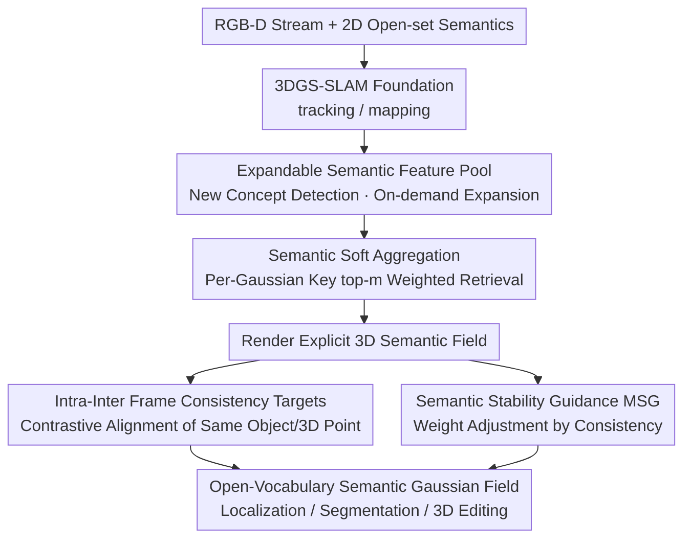

# Open-Set Semantic Gaussian Splatting SLAM with Expandable Representation

**Conference**: ICLR 2026  
**OpenReview**: [https://openreview.net/forum?id=E68dgQUzrC](https://openreview.net/forum?id=E68dgQUzrC)  
**Code**: To be confirmed (Authors state it will be released on the Project Page)  
**Area**: 3D Vision / Gaussian Splatting SLAM / Open-Vocabulary Semantics  
**Keywords**: Gaussian Splatting, SLAM, Open-set Semantics, Expandable Feature Pool, Cross-view Consistency

## TL;DR
This work integrates a **dynamically expandable semantic feature pool** into 3DGS-SLAM. Each 3D Gaussian stores only a low-dimensional index key to soft-aggregate semantics from the shared pool on demand. This enables online reconstruction of 3D scenes with open-vocabulary semantics using minimal memory. Consistency targets and semantic stability guidance are employed to resolve cross-view semantic inconsistencies, improving rendering, trajectory, and segmentation quality in both Replica and handheld captured scenes.

## Background & Motivation
**Background**: To enable common devices (like mobile phones) to reconstruct "metric-semantic" 3D worlds that capture both appearance and open-set queries during movement, the mainstream approach involves distilling open-set semantics from 2D foundation models (e.g., CLIP, SAM) into 3DGS representations within an online SLAM optimization framework. Existing methods follow two paths: (i) directly embedding semantic feature vectors alongside color into each Gaussian; (ii) rendering the scene into 2D maps first and then assigning semantics per-pixel, bypassing explicit 3D semantics.

**Limitations of Prior Work**: Both approaches struggle under "expanding scene" SLAM settings. ① They typically fit pre-extracted features on **fixed scenes** and cannot absorb new concepts online. ② Path (i) suffers from memory explosion as the number of Gaussians × feature dimensions grows; to save memory, 512-dim CLIP features are often compressed to 3 dimensions, sacrificing expressiveness. ③ Path (ii) maintains semantics only in 2D, whereas 3D localization, embodied navigation, and scene editing require true 3D-aware semantics. ④ 2D foundation models produce inconsistent semantic embeddings for the same object across different views, leading to noisy 3D semantic fields.

**Key Challenge**: A fundamental tension exists between "semantic expressiveness/online scalability" and "controllable memory/cross-view consistency." Binding high-dimensional semantics to every Gaussian is expensive and rigid, while dimensionality reduction loses expressiveness, and 2D-sourced semantics inherently conflict across frames.

**Goal**: (1) Enable semantic representations to dynamically absorb new concepts while reducing memory by orders of magnitude; (2) Establish an explicit semantic field directly on 3D Gaussians; (3) Ensure cross-frame semantic consistency within sequential SLAM data streams.

**Key Insight**: Local Gaussians of the same object **should share similar semantics**. Therefore, it is unnecessary to store high-dimensional features for each Gaussian separately. By decoupling "scene-level condensed semantics" from "individual Gaussians," semantics can be stored centrally in a small pool, with Gaussians holding only a lightweight index key for retrieval.

**Core Idea**: Replace "per-Gaussian semantic storage" with an "expandable semantic feature pool + per-Gaussian index key soft aggregation," paired with cross-frame consistency constraints to solve scalability, memory efficiency, 3D explicitness, and cross-view consistency simultaneously.

## Method

### Overall Architecture
The system takes an online RGB-D stream as input. The backbone is an existing 3DGS-SLAM (implemented on SplaTAM and LoopSplat). The output is a 3D metric-semantic Gaussian field searchable by arbitrary text, supporting localization, editing, and AR/VR applications. Beyond standard attributes (position, covariance, opacity, color), a $D_k$-dimensional index key $k_i$ is added to each Gaussian. The scene maintains two learnable shared pools: a key pool $K_P$ and a semantic feature pool $F_P$ (both of length $L$, where $D_k < D_s$). For each frame, new semantics are checked to determine if they represent an "existing concept." If so, they are absorbed by existing pool entries; otherwise, they are inserted into empty slots. If slots are insufficient, the pool expands—this is the **expandable semantic representation**. During semantic rendering, each Gaussian uses its key to retrieve $m$ neighbors from the pool and aggregates its semantics via soft-weighting based on similarity. Semantics are rendered like color using $\alpha$-blending—this is the **semantic soft aggregation**. During optimization, in addition to tracking/mapping losses, **intra-inter frame semantic consistency targets** (aligning semantics of the same object/3D point via contrastive learning) and **semantic stability guidance** (adjusting per-pixel learning signals based on consistency) are applied to suppress cross-view jitter from 2D semantics.

### Key Designs

**1. Expandable Semantic Feature Pool: Decoupling Semantics from Gaussians**

To address the high cost and lack of scalability of direct semantic storage, this work centralizes scene-level semantics into a randomly initialized, learnable feature pool $F_P \in \mathbb{R}^{L \times D_s}$, paired with a key pool $K_P \in \mathbb{R}^{L \times D_k}$. Each Gaussian carries only a $D_k$-dimensional key $k_i$ to reference semantics: $G_S := \{(\mu_i, \Sigma_i, o_i, c_i, k_i), K_P, F_P\}$. The pool is orders of magnitude smaller than the number of Gaussians (e.g., $L=25$ vs. $\sim 5\times10^6$ Gaussians). Crucially, it **grows online**: for each frame, unique semantics are extracted and compared via cosine similarity with all pool entries. If the top-$m$ similarity exceeds a threshold, it is considered a "known concept"; otherwise, it is marked as a new concept for insertion. Instead of an explicit counter, an "empty slot criterion" is used by comparing current pool entries with an initial pool copy $F_P^{(0)}$: entries close to the initial random state are considered empty and writable. When slots are full, $F_P$ and $K_P$ are expanded by a factor $n$.

**2. Key-based Soft Aggregation: Shared Semantics with Explicit 3D Rendering**

Each Gaussian $G_{S_i}$ uses its key $k_i$ to find $m$ nearest neighbors in $K_P$ via cosine similarity: $\mathrm{NN}_m(k_i, K_P) = \arg\max_m(\cos(k_i, K_P))$. Weights $w_i = \mathrm{softmax}(\mathrm{NN}_m(k_i \cdot K_P))$ are computed to perform a weighted sum of the $m$ corresponding semantic features: $s_i = w_i \cdot F_P'$. This "soft indexing" generalizes better to rare/new objects than hard indexing and allows nearby Gaussians to aggregate similar semantics, reducing local redundancy. The semantic frame is rendered using standard $\alpha$-blending: $S(p) = \sum_{j=1}^N s_j \alpha_j \prod_{k=1}^{j-1}(1-\alpha_k)$. Unlike codebook methods that map pixels to semantics after rendering, this approach assigns semantics to Gaussians before rendering, maintaining a true explicit 3D semantic field.

**3. Intra-inter Frame Semantic Consistency Targets: Contrastive Learning against Jitter**

2D models produce inconsistent embeddings across frames. Pixel-level contrastive learning is used to constrain two types of positive samples: **Intra-frame**—$Q$ neighboring pixels $\{p_i^+\}$ of the same object in frame $S$; **Inter-frame**—pixels $\{p_{i,r}^+\}$ found by projecting pixel $p$ to 3D and back-projecting to a history frame $S_r$. The contrastive loss for a single positive sample is $L(p_i^+) = -\log \frac{\exp(S(p)\cdot S(p_i^+))}{\sum_{S(p^-)\in N^-}\exp(S(p)\cdot S(p^-))}$. The final target $L_{CO} = 1 - \frac{\lambda_r}{Q}\sum_i L(p_i^+) + \frac{\lambda_r}{R}\sum_i L_r(p_{i,r}^+)$ explicitly brings in inter-frame consistency, which is vital for SLAM data.

**4. Semantic Stability Guidance (MSG): Adaptive Learning Signals**

To handle noise in $S_{GT}$ from foundation models, Semantic Stability Guidance ($\mathrm{MSG}$) acts as a per-pixel reliability weight. For pixel $p$, the cosine similarity between $S(p)$ and the **average feature** of its corresponding history regions is calculated as $\mathrm{MSG}(p)$. If an object is new, $\mathrm{MSG}(p)=1$. It weights the mapping loss: $L_{M,S} = \lambda_S \|S(p)-S_{GT}(p)\| \cdot \mathrm{MSG}(p) + (1-\lambda_S)L_{CO}$, suppressing influence from inconsistent regions.

### Loss & Training
The framework distills features from RGB using pretrained models for supervision. **Tracking**: fix Gaussians, optimize pose using $L_{tracking} = \sum_p(\lambda_{T,C}L_{T,C} + \lambda_{T,D}L_{T,D} + \lambda_{T,S}L_{T,S})$, where semantic loss $L_{T,S}=\|S(p)-S_{GT}(p)\|$. **Mapping**: fix pose, optimize $K_P, F_P$, and Gaussian parameters using $L_{mapping}$ including MSG and $L_{CO}$.

## Key Experimental Results

### Main Results
Evaluated on 8 Replica scenes using SplaTAM and LoopSplat backbones.

| Metric | Baseline | +Ours | Gain |
|------|------|-------|------|
| PSNR↑ (SplaTAM) | 34.11 | 37.61 | +3.50 |
| PSNR↑ (LoopSplat) | 36.63 | 37.95 | +1.32 |
| ATE RMSE↓ cm (SplaTAM) | 0.36 | 0.29 | −0.07 |
| ATE RMSE↓ cm (LoopSplat) | 0.26 | 0.23 | −0.03 |
| Depth L1↓ cm (SplaTAM) | 0.72 | 0.34 | −0.38 |

In semantic segmentation, the method achieves a closed-set mIoU of 96.76, surpassing SGS-SLAM (92.72) and GS3LAM (96.63). Open-set 2D mIoU reaches 66.5.

| Open-set Tasks (Replica) | LERF | LEGaussians | GOI | +Ours |
|------|------|------|------|------|
| 2D mIoU↑ | 28.2 | 39.4 | 61.7 | **66.5** |
| 3D Loc. acc@0.5↑ | 20.6 | 32.1 | 49.5 | **45.1** |

### Ablation Study
On Replica Room 0 with SplaTAM backbone (Table 4):

| Configuration | PSNR↑ | ATE RMSE↓ | mIoU↑ |
|------|-------|-----------|-------|
| w/o All (Direct storage) | 32.88 | 0.30 | 72.56 |
| + $F_P$ | 33.40 | 0.26 | 80.15 |
| + $L_{CO}$ | 33.67 | 0.25 | 84.23 |
| + MSG | 33.81 | 0.24 | 87.29 |

### Key Findings
- The **feature pool** is the most significant single component (mIoU 72.56→80.15), serving as the key to memory efficiency and open-set feasibility.
- The "expandable" nature is a qualitative leap over fixed/compressed pools, providing the best trade-off between accuracy, memory, and training time.
- Adding semantics **improves geometry and trajectory**, as richer scene details lead to more accurate pose estimation and lower Depth L1.

## Highlights & Insights
- **Decoupling via "Index Key + Shared Pool"** is the core innovation, allowing memory to scale near-constantly relative to scene size.
- **Slot management via similarity to initial random states** is an elegant engineering solution that avoids explicit counters.
- **Assigning semantics before rendering** (unlike pixel-mapping routes) allows for a true text-interactable 3D semantic field.
- **MSG weight** provides a reusable quantitative trick for handling noisy supervision in semantic distilling.

## Limitations & Future Work
- Evaluation is primarily on synthetic Replica; performance in complex outdoor or dynamic scenes requires further validation.
- Semantic quality is capped by the 2D foundation models; consistency constraints cannot fix systemic errors in the underlying models.
- Numerous hyperparameters (expansion factors, similarity thresholds) might require tuning for different scenarios.

## Related Work & Insights
- **vs. Direct Storage (LangSplat)**: Decoupling via the shared pool reduces memory by orders of magnitude while allowing higher-dimensional semantics.
- **vs. Hard Indexing (LEGaussians)**: Learnable soft aggregation generalizes better to rare/new objects.
- **vs. Contrastive Semantics (GarField)**: This work explicitly incorporates inter-frame consistency, leveraging the 3D-aware nature of SLAM.

## Rating
- Novelty: ⭐⭐⭐⭐⭐ 
- Experimental Thoroughness: ⭐⭐⭐⭐ 
- Writing Quality: ⭐⭐⭐⭐ 
- Value: ⭐⭐⭐⭐⭐ 

<!-- RELATED:START -->

## Related Papers

- [\[ECCV 2024\] SGS-SLAM: Semantic Gaussian Splatting for Neural Dense SLAM](../../ECCV2024/3d_vision/sgs-slam_semantic_gaussian_splatting_for_neural_dense_slam.md)
- [\[ICLR 2026\] GOOD: Geometry-guided Out-of-Distribution Modeling for Open-set Test-time Adaptation in Point Cloud Semantic Segmentation](good_geometry-guided_out-of-distribution_modeling_for_open-set_test-time_adaptat.md)
- [\[CVPR 2026\] ODGS-SLAM: Omnidirectional Gaussian Splatting SLAM](../../CVPR2026/3d_vision/odgs-slam_omnidirectional_gaussian_splatting_slam.md)
- [\[ICLR 2026\] Learning Unified Representation of 3D Gaussian Splatting](learning_unified_representation_of_3d_gaussian_splatting.md)
- [\[ICCV 2025\] 3D Gaussian Map with Open-Set Semantic Grouping for Vision-Language Navigation](../../ICCV2025/3d_vision/3d_gaussian_map_with_openset_semantic_grouping_for_visionlan.md)

<!-- RELATED:END -->
