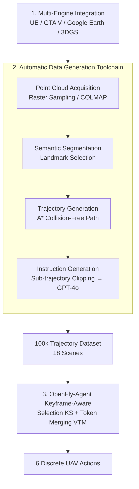

# OpenFly: A Comprehensive Platform for Aerial Vision-Language Navigation

**Conference**: ICLR 2026  
**arXiv**: [2502.18041](https://arxiv.org/abs/2502.18041)  
**Code**: Yes (Open Source)  
**Area**: 3D Vision  
**Keywords**: Aerial VLN, UAV Navigation, Multi-Engine Rendering, Automatic Data Generation, Keyframe-Aware, 3D Gaussian Splatting

## TL;DR

Constructs OpenFly, a comprehensive platform for Aerial Vision-Language Navigation (VLN): integrates 4 rendering engines (UE/GTA V/Google Earth/3DGS); develops a fully automatic data generation toolchain (point cloud acquisition → semantic segmentation → trajectory generation → GPT-4o instructions); builds a large-scale dataset of 100,000 trajectories across 18 scenes; proposes a keyframe-aware VLN model, OpenFly-Agent (Keyframe Selection + Visual Token Merging), which outperforms existing methods by 14.0% and 7.9% in Success Rate (SR) for seen and unseen scenes, respectively.

## Background & Motivation

**VLN Development**: VLN is a core task in Embodied AI, requiring agents to navigate to targets based on linguistic instructions and visual observations. Extensive indoor/ground datasets (R2R, RxR, TouchDown, VLN-CE, etc.) have driven methodological progress. However, research into Unmanned Aerial Vehicles (UAVs)—critical for aerial photography, rescue, and logistics—remains insufficient.

**Limitations of Prior Work**: Pioneer works like AerialVLN and OpenUAV established initial aerial VLN datasets using AirSim + UE simulators but face three major challenges: limited data diversity, high collection costs, and small data scale.

**Data Diversity Bottleneck**: Prior methods rely on AirSim and Unreal Engine for UAV control, restricting them to assets compatible with these platforms. This limits environmental diversity and realism, hindering the inclusion of high-fidelity data sources.

**High Manual Annotation Cost**: Trajectory generation traditionally depends on pilots operating UAVs in simulators, followed by manual instruction writing. This workflow is labor-intensive, time-consuming, and difficult to scale.

**Insufficient Data Scale**: Current aerial VLN datasets contain only about 10,000 trajectories, lagging far behind robot manipulation fields—where Open X-Embodiment and EO-1 have collected over 1 million episodes. This data scarcity severely limits model capabilities.

**Core Idea**: (1) Multi-engine integration → Solve diversity; (2) Fully automatic toolchain → Solve cost; (3) 100k-scale dataset → Solve scale; (4) Keyframe-aware model → Solve visual redundancy in long sequences.

## Method

### Overall Architecture

OpenFly is not merely a single model but a complete closed-loop platform from scene acquisition to model deployment. First, diverse virtual and real scenes are built using four rendering engines. Next, an automatic toolchain batch "translates" each scene into navigation trajectories with linguistic instructions. Finally, the keyframe-aware OpenFly-Agent is trained on 100,000 trajectories. The data generation toolchain serves as the central hub—controlling agent movement and reading sensors via three unified interfaces to link "point cloud acquisition → semantic segmentation → trajectory generation → instruction generation," automating steps previously reliant on manual pilot operation and annotation. The platform and data nourish the model, while the model validates the data's utility.

### Key Designs

**1. Multi-Engine Integration: Breaking the diversity ceiling with heterogeneous data sources**

Previous aerial VLN relied solely on AirSim+UE, tying assets and realism to a single platform. OpenFly accesses four sources in parallel to complement scale, style, and realism: Unreal Engine provides 8 urban scenes with assets covering over $100 \text{km}^2$; GTA V contributes highly realistic urban landscapes modeled after Los Angeles; Google Earth covers $53.60 \text{km}^2$ across Berkeley, Osaka, Washington D.C., and St. Louis; 3D Gaussian Splatting (3DGS) uses hierarchical 3DGS to reconstruct 5 campus scenes covering over $7 \text{km}^2$ from real UAV footage, bringing real-world imagery into a renderable simulation (real-to-sim). This mix provides inherent cross-domain diversity, laying the foundation for bridging the sim-to-real gap.

**2. Automatic Data Generation Toolchain: Scaling up via pipelines**

The toolchain controls agent movement and sensor reading through three unified interfaces. Point cloud acquisition varies by scene: UE/GTA V use rasterized sampling at specific resolutions, while 3DGS uses COLMAP for sparse reconstruction. Semantic segmentation offers three paths: extracting 3D Semantic Instances via Octree-Graphs from top-down views, projecting voxelized clouds for GPT-4o annotation, or manual annotation as a fallback. Trajectory generation builds a global voxel map $M_{global}$, selects landmarks as targets, sets starting points at a distance, and uses A* search for collision-free paths. Instruction generation avoids feeding entire sequences to the model; instead, it segments trajectories by action transition points, sends key actions and the final 3 frames of each segment to GPT-4o, and uses an LLM to consolidate these into complete instructions. Human verification of 3K random samples showed a 91% qualification rate.

**3. OpenFly-Agent Keyframe Awareness: Compressing visual redundancy**

Aerial trajectories are long; uniform sampling risks missing landmarks, while feeding all tokens into a VLM dilutes linguistic attention with background noise. OpenFly-Agent utilizes two steps: Keyframe Selection (KS) heuristically identifies motion change points and their adjacent frames, then uses a 3-layer cross-attention landmark localization module to predict bounding boxes $\mathbf{b} \in \mathcal{R}^4$. Only frames with box areas exceeding threshold $\theta$ are retained. Visual Token Merging (VTM) selects the frame with the largest bounding box as a reference and calculates cosine similarity between its visual tokens and those of other frames. High-similarity tokens are merged, while non-merged tokens from comparison frames are discarded. Merged results are stored in a FIFO memory of capacity $K$. Grid pooling further compresses internal keyframes, while the current frame remains uncompressed. Actions are mapped to 256 special tokens for $\{$Forward, Turn Left, Turn Right, Move Up, Move Down, Stop$\}$.

## Key Experimental Results

### Table 1: VLN Dataset Comparison

| Dataset | Trajectories | Vocab Size | Path Length (m) | Instr. Length | Action Space | Environment |
|---------|--------------|------------|-----------------|---------------|--------------|-------------|
| R2R | 7189 | 3.1K | 10.0 | 29 | graph | Matterport3D |
| RxR | 13992 | 7.0K | 14.9 | 129 | graph | Matterport3D |
| AerialVLN | 8446 | 4.5K | 661.8 | 83 | 4 DoF | AirSim+UE |
| CityNav | 32637 | 6.6K | 545 | 26 | 4 DoF | SensatUrban |
| OpenUAV | 12149 | 10.8K | 255 | 104 | 6 DoF | AirSim+UE |
| **Ours** | **100K** | **15.6K** | **99.1** | **59** | **4 DoF** | **Multi-Engine** |

### Table 2: Main Results (Navigation Performance)

| Method | NE↓(seen) | SR↑(seen) | OSR↑(seen) | SPL↑(seen) | NE↓(unseen) | SR↑(unseen) | OSR↑(unseen) | SPL↑(unseen) |
|--------|-----------|-----------|------------|------------|-------------|-------------|--------------|--------------|
| Random | 242m | 0.7% | 0.8% | 0% | 301m | 0.1% | 0.1% | 0% |
| Seq2Seq | 205m | 2.9% | 24.3% | 2.6% | 229m | 2.1% | 20.6% | 1.1% |
| CMA | 161m | 5.4% | 28.1% | 4.8% | 217m | 4.6% | 24.4% | 2.1% |
| AerialVLN| 139m | 7.5% | 30.0% | 6.8% | 214m | 7.3% | 28.1% | 4.4% |
| Navid | 153m | 13.0% | 38.2% | 11.6% | 210m | 10.8% | 27.2% | 5.0% |
| NaVila | 132m | 20.3% | 53.5% | 17.8% | 202m | 14.7% | 42.1% | 9.6% |
| **Ours** | **93m** | **34.3%** | **64.3%** | **24.9%** | **154m** | **22.6%** | **56.2%** | **19.1%** |

### Table 3: Ablation Study (test-seen)

| Method | NE↓ | SR↑ | OSR↑ | SPL↑ |
|--------|-----|-----|------|------|
| OpenVLA (baseline) | 231m | 2.3% | 10.8% | 2.2% |
| History (Uniform) | 223m | 6.9% | 23.3% | 5.6% |
| Random KS | 264m | 8.7% | 26.6% | 5.8% |
| KS Only | 275m | 9.2% | 28.1% | 6.1% |
| History + VTM | 215m | 16.6% | 40.5% | 9.1% |
| **KS + VTM (Ours)** | **93m** | **34.3%** | **64.3%** | **24.9%** |

## Key Findings

1.  **Synergistic effect of KS and VTM**: Individual use of KS (SR 9.2%) or History+VTM (SR 16.6%) shows limited gain, whereas combined use (SR 34.3%) yields super-linear improvement by balancing text-image tokens and filtering noise.
2.  **Generalization through Multi-Engine Data**: Experiments in 23 real-world scenes show that models trained on OpenFly data significantly outperform those on AerialVLN data, successfully bridging the sim-to-real gap.
3.  **VLM Potential**: VLM-based methods (Navid/NaVila) markedly outperform traditional Seq2Seq/CMA, particularly in Oracle SR, indicating the importance of VLM reasoning in navigation.
4.  **Practicality of Short-to-Medium Instructions**: OpenFly's average trajectory (99.1m) and instruction length (59 words) are argued to be more representative of natural human use than prior extreme cases.
5.  **Reliable Automatic Instructions**: GPT-4o-based segmentation and consolidation achieve 91% manual verification accuracy while supporting high-concurrency production.

## Highlights & Insights

-   **System-Level Innovation**: The primary contribution is the holistic platform (4 engines + automatic pipeline + 100k dataset + model) rather than a single component.
-   **3DGS Real-to-Sim**: Demonstrates a paradigm where real UAV imagery is used for 3DGS reconstruction to generate training data for real-world deployment.
-   **Engineering Value**: Enables users to generate custom data for their own scenes, providing infrastructure-level utility.
-   **Scale-Driven Transformation**: The 100k trajectory scale (vs. previous ~10k) first makes aerial VLN comparable to ground-based datasets, facilitating the transfer of models like OpenVLA.

## Limitations & Future Work

1.  **Absolute Success Rate**: Even with OpenFly-Agent, SR remains at 34.3% (seen) and 22.6% (unseen), highlighting the extreme challenge of aerial VLN.
2.  **Generalization Gap**: Performance drops significantly in unseen scenes (34.3% → 22.6%).
3.  **GPT-4o Dependency**: Reliance on proprietary VLMs increases costs and limits reproducibility.
4.  **Simplified Action Space**: The use of discrete steps (3/6/9m) deviates from real continuous UAV control.
5.  **Google Earth View Height**: Visual quality constraints limited Google Earth data largely to high-altitude perspectives (4.46%).

## Related Work & Insights

### vs AerialVLN (ICCV 2023)
AerialVLN was the first aerial VLN dataset (8.4k trajectories) but used a single engine and manual annotation. OpenFly exceeds it in diversity (4 vs 1 engines), scale (100k vs 8.4k), and automation. NE improved by 33%.

### vs OpenUAV (2024)
OpenUAV used AirSim+UE for 12k trajectories with RLHF. It remained restricted by manual diversity bottlenecks. OpenFly implements a fully automatic pipeline and introduces real-to-sim capabilities via 3DGS.

### vs CityNav (2024)
CityNav relies on pre-existing 2D maps for landmark localization. OpenFly requires no external maps, navigating end-to-end from a first-person perspective, closer to the reality of UAV applications.

## Rating

-   **Novelty**: ⭐⭐⭐⭐ System-level innovation (pipeline + platform); algorithmic innovation is moderate.
-   **Experimental Thoroughness**: ⭐⭐⭐⭐⭐ Comprehensive comparisons, ablations, and real-world UAV deployment.
-   **Writing Quality**: ⭐⭐⭐⭐ Clear system descriptions and rich visualizations.
-   **Value**: ⭐⭐⭐⭐⭐ Infrastructure-level contribution with toolchain, dataset, and benchmark integrated.

<!-- RELATED:START -->

## Related Papers

- [\[ICCV 2025\] 3D Gaussian Map with Open-Set Semantic Grouping for Vision-Language Navigation](../../ICCV2025/3d_vision/3d_gaussian_map_with_openset_semantic_grouping_for_visionlan.md)
- [\[ICLR 2026\] Towards Physically Executable 3D Gaussian for Embodied Navigation](towards_physically_executable_3d_gaussian_for_embodied_navigation.md)
- [\[ICLR 2026\] Scenethesis: A Language and Vision Agentic Framework for 3D Scene Generation](scenethesis_a_language_and_vision_agentic_framework_for_3d_scene_generation.md)
- [\[ICLR 2026\] DepthLM: Metric Depth from Vision Language Models](depthlm_metric_depth_from_vision_language_models.md)
- [\[CVPR 2026\] Multi-Scale Gaussian-Language Map for Zero-shot Embodied Navigation and Reasoning](../../CVPR2026/3d_vision/multi-scale_gaussian-language_map_for_zero-shot_embodied_navigation_and_reasonin.md)

<!-- RELATED:END -->
