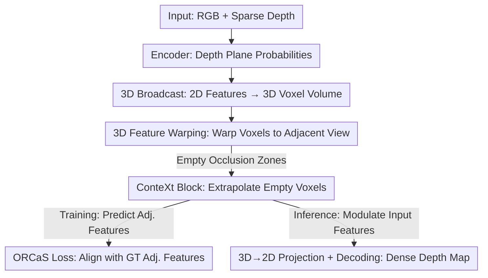

# ORCaS: Unsupervised Depth Completion via Occluded Region Completion as Supervision

**Conference**: ICLR 2026  
**OpenReview**: [https://openreview.net/forum?id=v2skNLbrfF](https://openreview.net/forum?id=v2skNLbrfF)  
**Code**: To be confirmed  
**Area**: 3D Vision  
**Keywords**: Depth completion, unsupervised learning, occluded region completion, inductive bias, Structure-from-Motion

## TL;DR
ORCaS enables unsupervised depth completion models to predict features of occluded regions—areas invisible to the input view but visible to adjacent views—during training. This forces the model to learn an inductive bias regarding 3D object shapes, outperforming previous state-of-the-art methods on VOID1500 / NYUv2 by an average of 8.91%, with significant leads in cross-dataset generalization and sparse inputs.

## Background & Motivation

**Background**: The task of depth completion is to output a dense depth map given an RGB image and a set of sparse points. The authors point out two interpretations: (1) viewing it as **interpolation**—using sparse points as anchors and image color/texture/edges for regularization to diffuse depth to dense pixels; (2) viewing it as **induction**—reconstructing a 3D scene from a single image with unknown scale and then using sparse points to calibrate that scale. While seemingly symmetric, they are fundamentally different: the former relies on hand-crafted rules and saturates quickly in new scenes, while the latter is an ill-posed problem requiring an **inductive bias** to infer 3D structure from a single view.

**Limitations of Prior Work**: To avoid dependence on expensive ground truth, unsupervised methods use Structure-from-Motion (SfM) reconstruction error as a training signal—warping pixels from adjacent views back to the input view to minimize photometric error. However, these methods typically use **generic regularization** (e.g., local smoothness). The problem is that these are the same tools used in "interpolation," meaning the model only learns "image-guided depth diffusion" without truly grasping high-level 3D abstractions (object shapes).

**Key Challenge**: Traditional unsupervised methods use "inverse warping" which only projects points **visible** in adjacent views back to the input view; **occluded regions are discarded**. Consequently, the training signal naturally avoids the "unseen parts," which are precisely what would force a model to understand 3D objects rather than just surface textures.

**Goal**: Find a supervision signal that cannot be modeled by generic regularization, forcing the model to learn a stronger inductive bias about 3D scenes beyond 2D images, thereby improving the fidelity of depth prediction for the input view.

**Key Insight**: The authors take the opposite approach—if depth completion only requires estimating visible surfaces, why predict occluded regions? Because predicting occlusions forces the model to represent observations in 3D (rather than conventional 2D feature maps). This offers two benefits: once the 3D shape of an object is known, assigning it a metric scale requires only a single sparse point, making the model insensitive to point cloud density; simultaneously, predicting unseen parts fosters higher-level abstractions of "objects," improving generalization.

**Core Idea**: Treat "occluded region completion" as the supervision signal (Occluded Region Completion as Supervision, ORCaS). During training, 3D features from the input view are warped to an adjacent view; voxels left "empty" due to occlusion are completed by a context extrapolation module and supervised by actual features from the adjacent view. During inference, this learned bias enhances the input view features.

## Method

### Overall Architecture

The input for ORCaS is identical to standard depth completion: an RGB image $I$ and a set of sparse depths $z$ projected onto the image plane, outputting dense depth $\hat{d}=f(I,z)$. The difference lies entirely in training: beyond reconstructing the input view from adjacent views, it **reciprocally** uses the input view to predict features of adjacent views, obtaining supervision signals in both latent and output spaces.

The pipeline works as follows: First, the image and sparse depth are encoded into 2D feature maps, predicting a probability distribution across $D$ depth planes for each pixel to "broadcast" 2D features into a 3D voxel volume (**3D Broadcast**). Next, a relative pose $g_{\tau\leftarrow t}$ from input view $t$ to adjacent view $\tau$ is used to rigidly warp this 3D volume (**3D Feature Warping**). Since this only covers co-visible regions, locations occluded in view $t$ but visible in $\tau$ appear as "holes." These empty voxels are extrapolated by the **ConteXt Block** based on surrounding visible features to obtain predicted adjacent features $\hat{F}_\tau$. Finally, ground truth features $F_\tau$ encoded directly from the adjacent view supervise this prediction (**ORCaS Loss**). During inference, the input view is used with an identity pose (warping becomes identity), and the learned bias from ConteXt is used to "modulate" the input view features, which are then decoded into a depth map via 3D→2D projection.

### Key Designs

**1. 3D Broadcast: Spreading 2D Features into 3D Voxel Volumes with Depth Planes**

Traditional unsupervised methods stay in 2D, failing to represent the true 3D structure of occluded regions. ORCaS first estimates a discrete probability distribution across $D$ depth planes for each pixel $x$: apply a learnable transform $\Phi(\cdot)$ to the fused feature vector $h[x]\in\mathbb{R}^C$ followed by a softmax, $\tilde{d}[x]=\sigma(\Phi(h[x]))$. Unlike standard 2D back-projection which yields sparse 3D samples, this "broadcasts" the same 2D feature to all voxels corresponding to depth planes at that position according to the probabilities, resulting in a **fully populated** 3D scene representation from a single view. Depth planes are uniformly sampled as $\bar{d}$ between bounds. This "spread into 3D" allows the definition of which regions are occluded or empty.

**2. 3D Feature Warping: Exposing Occlusions as Supervisable Holes**

With the 3D volume, assuming a static scene, the 3D features $F_t$ of input view $t$ can be rigidly moved to adjacent view $\tau$ using relative pose:

$$F_{\tau\leftarrow t}(x)=F_t(\pi' g_{t\leftarrow\tau}\bar{X}),$$

where $\bar{X}$ are homogeneous coordinates of 3D voxels and $\pi'$ is the projection assigning features to the nearest voxel. Crucially, the warped voxels only fill the **co-visible regions** of the two views. Positions "occluded in $t$ but visible in $\tau$" become empty voxels. Consequently, "reconstructing these empty areas from co-visible regions" naturally becomes an **additional self-supervised objective**—the exact signal generic smoothing cannot provide.

**3. ConteXt Block: Extrapolating Empty Voxels via Contextual Pooling + Positional Encoding**

To "imagine" the empty voxels, the authors design the Contextual eXtrapolation (ConteXt) block. It first performs **contextual pooling** $CP(\cdot)$: within each $k_u\times k_v\times k_w$ pooling region, masked average pooling is applied to **non-empty** voxels and upsampled back to original resolution,

$$CP(F_{\tau\leftarrow t})(u,v,w)=U\!\left(\frac{\sum_{(u,v,w)\in R} M\odot F_{\tau\leftarrow t}(u,v,w)}{M(u,v,w)+\epsilon}\right),$$

where the mask $M(x)=\mathbb{1}\{F_{\tau\leftarrow t}(x)\neq 0\}$ marks non-empty voxels. The context descriptors are added back only to **originally empty** areas: $F'_{\tau\leftarrow t}=F_{\tau\leftarrow t}+\bar{M}\odot CP(F_{\tau\leftarrow t})$ ($\bar M$ is the complement of $M$). To make completion dependent on local position, a 3D sinusoidal positional encoding $\phi(u,v,w)=\mathrm{concat}(PE_u,PE_v,PE_w)$ is added. Finally, a linear projection $g(\cdot)$ fuses "non-empty context + positional info + empty mask" to estimate adjacent features $\hat{F}_\tau=g(F'_{\tau\leftarrow t},\phi,\bar{M})$. This learned bias $\phi$ is reused during inference: since $F'_{t\leftarrow t}$ equals $F_t$ for the input view, ConteXt modulates the input features to enhance fidelity.

**4. ORCaS Loss & Alternating Training: Supervising Inductive Bias with GT Features**

Under the unsupervised framework, signals derived from input data are either sparse or noisy due to pose/prediction error. ORCaS instead uses the **full features** $F_\tau$ encoded from the adjacent view itself as supervision, forcing the predicted features $\hat{F}_\tau$ to be consistent:

$$\ell_{\text{ORCaS-}p}=\sum_X\sum_x\|\hat{F}_\tau[x]-\mathrm{sg}(F_\tau[x])\|_p,$$

where $\mathrm{sg}(\cdot)$ is the stop-gradient. The authors emphasize: the goal of learning occlusion completion is **not** to make adjacent view predictions look perfect, but to extract an inductive bias that enhances input view prediction. The network is trained end-to-end in an **alternating** fashion—one round optimizing the entire network, and another round optimizing only the ConteXt (ORCaS) parameters—linking "2D→3D broadcast" and "posed 3D warping" via the ORCaS loss to achieve "learning from occlusion."

### Loss & Training

The total training objective adds the ORCaS loss to traditional unsupervised depth completion losses, including the photometric reconstruction term $\mathcal P$ (L1 + SSIM), sparse depth consistency $\psi$, and edge-aligned smoothness $\mathcal R$:

$$\arg\min_\theta \sum_{\tau\in T}\sum_{x\in\Omega}\lambda_I\mathcal P(\hat{I}_{t\leftarrow\tau}(x),I_t(x))+\sum_{x\in\Omega_z}\lambda_z\psi(\hat{d}_t(x),z_t(x))+\lambda_r\mathcal R(I_t,\hat{d}_t).$$

To decode depth from 3D features, 3D features at each pixel are vectorized by depth plane $r[x]=\mathrm{vec}(\hat{F}_\tau[x])\in\mathbb{R}^{C\cdot D}$, then a 3D→2D projection $P$ uses softmax to weight depth plane contributions, resulting in 2D features $\hat{F}_t$, which pass through output layer $o(\cdot)$ to yield depth $\hat{d}_t=o(\hat{F}_t)$. During training, the input view, forward/backward adjacent views, and relative poses are provided; at inference, only the input is required as the pose is set to identity.

## Key Experimental Results

### Main Results

On VOID1500 and NYUv2, ORCaS outperforms all baselines across all 4 metrics (MAE / RMSE / iMAE / iRMSE), achieving an average 8.91% improvement over the current state-of-the-art, AugUndo.

| Dataset | Metric | ORCaS | AugUndo (Prev. SOTA) | Gain |
|--------|------|-------|------------------|------|
| VOID1500 | MAE | 30.90 | 33.32 | -7.3% |
| VOID1500 | RMSE | 80.12 | 85.67 | -6.5% |
| NYUv2 | MAE | 86.50 | 96.73 | -10.6% |
| NYUv2 | RMSE | 158.10 | 188.70 | -16.2% |

Improvements over earlier methods are even more significant: 62.34% over VOICED, 45.87% over ScaffNet, 22.87% over KBNet, and 17.68% over DesNet on VOID1500.

### Ablation Study

Component-wise ablation on VOID1500 (Base model is KBNet with bottleneck Transformer blocks):

| Configuration | MAE | RMSE | Note |
|------|-----|------|------|
| Base model | 35.31 | 91.32 | Baseline network |
| + 2D→3D Broadcast | 33.56 | 86.72 | 3D Broadcast alone improves ~2.79% |
| Warping only | 52.60 | 125.88 | 3D warping without ORCaS loss is harmful |
| Broadcast + Warping | 40.52 | 98.87 | Still worse than base without loss link |
| Full (with ℓ_ORCaS) | **30.90** | **80.12** | ORCaS loss contributes ~21.6% |

### Key Findings

- **ORCaS loss is the glue**: 3D warping alone (without loss) degrades performance (MAE 35.31→52.60), but adding the ORCaS loss instead provides a ~21.6% gain. This shows that "3D broadcast + posed warping" components are insufficient without the ORCaS loss forcing them to "learn from occlusion."
- **More depth planes are better**: $D=2$ already exceeds AugUndo, and MAE drops further to 30.90 at $D=8$, indicating that finer depth discretization is beneficial.
- **Moderate ConteXt pooling receptive field is optimal**: $(k_u,k_v)=(2,2)$ has insufficient field (5.67% gain), $(4,4)$ is best, while $(8,8)$ is too coarse and over-smooths representations.
- **Generalization and sparsity robustness are major highlights**: Zero-shot transfer from VOID1500 to NYUv2 / ScanNet improved by an average of 12.1% / 19.2%; on VOID150 (10× sparser, only 150 points or ~0.05% of pixels), ORCaS improved by 31.2% over AugUndo, supporting the hypothesis that "learning object shapes allows scaling with minimal points."

## Highlights & Insights
- **Turning "Ill-posedness" into a Signal**: While traditional methods avoid occlusions as "unsolvable," ORCaS intentionally predicts unseen regions. This "doing the impossible" objective forces out a 3D inductive bias that 2D regularization can never achieve—this is the most impressive "Aha!" design philosophy.
- **Occlusion = Free Natural Supervision**: After 3D warping, the "holes" in occluded zones provide a self-supervised target that requires no manual labeling and cannot be matched by generic smoothness priors.
- **Two Views for Training, One for Inference**: The positional bias learned by ConteXt modulates input features during inference even when warping is identity. Consequently, deployment requirements are identical to standard depth completion, adding no inference burden.
- **Stop-gradient Prevents Collapse**: When using features from adjacent views as targets, stopping gradients prevents the encoder from simply collapsing both views' features to match each other to satisfy the consistency loss.

## Limitations & Future Work
- **Static Scene Assumption**: 3D warping explicitly assumes a static scene. In the presence of dynamic objects or non-rigid motion, geometric correspondence fails, potentially introducing noise into occlusion supervision.
- **Dependence on Relative Pose**: Training requires relative poses (estimated by a pose network). Pose error directly contaminates warping and consistency; the paper used poses fine-tuned on the test set for some evaluations.
- **Granularity Limit of Depth Planes**: Performance grows with $D$, but more planes increase memory and computation for the voxel volume. The paper only tested up to $D=8$; the cost-benefit ratio for higher resolutions is unclear.
- **Future Improvements**: Exploring occlusion completion for dynamic scenes (e.g., layered or motion-compensated warping) or using learnable non-uniform depth planes instead of uniform discretization to balance accuracy and overhead.

## Related Work & Insights
- **vs. AugUndo (Wu et al., 2024)**: AugUndo improves unsupervised depth completion by enabling previously infeasible photometric/geometric augmentations; ORCaS takes a different path via "occluded region completion," outperforming it by 8.91% on average and up to 31.2% in sparse settings.
- **vs. KBNet / Sparse-2-Depth (Wong & Soatto, 2021)**: Both back-project 2D features to 3D with inductive biases, but KBNet uses approximate depth and only serves visible regions; ORCaS uses depth plane probabilities to broadcast features into a full 3D volume and explicitly predicts **occluded** regions.
- **vs. MPI-based methods (Tucker & Snavely, 2020 etc.)**: MPI similarly broadcasts/warps 2D features to discrete 3D planes, but for image synthesis; ORCaS uses this representation as a "regularization via occlusion prediction" to learn an inductive bias for depth completion.
- **vs. Occlusion/Layer Reconstruction (Tulsiani et al., 2018; Dhamo et al., 2019 etc.)**: These works infer layered structures or depth to reconstruct 3D scenes with occlusions. ORCaS does not aim for perfect adjacent view prediction; it uses it as an **auxiliary regularizer**, focusing strictly on depth fidelity for the input view.

## Rating
- Novelty: ⭐⭐⭐⭐⭐ The first work to use "occluded regions of the input view" as a supervision signal for unsupervised depth completion. The logic is novel and self-consistent.
- Experimental Thoroughness: ⭐⭐⭐⭐ Strong main results + ablation of components/depth planes/pooling fields + zero-shot and sparsity robustness. Slightly lacks systematic analysis of dynamic scenes and pose error.
- Writing Quality: ⭐⭐⭐⭐ Motivation flows logically, formulas are complete. Some notation (e.g., $F'_{t\leftarrow t}$ vs. inference modulation) is best understood in conjunction with the figures.
- Value: ⭐⭐⭐⭐⭐ Simultaneously refreshes SOTA in accuracy, cross-domain generalization, and sparsity robustness; highly practical for robotics/AR scenarios relying on cheap sparse depth.

<!-- RELATED:START -->

## Related Papers

- [\[ICLR 2026\] Large Depth Completion Model from Sparse Observations](large_depth_completion_model_from_sparse_observations.md)
- [\[CVPR 2025\] ProtoDepth: Unsupervised Continual Depth Completion with Prototypes](../../CVPR2025/3d_vision/protodepth_unsupervised_continual_depth_completion_with_prototypes.md)
- [\[CVPR 2026\] Zero-Shot Depth Completion with Vision-Language Model](../../CVPR2026/3d_vision/zero-shot_depth_completion_with_vision-language_model.md)
- [\[CVPR 2026\] Dense Metric Depth Completion from Sparse Direct Time-of-Flight Sensors](../../CVPR2026/3d_vision/dense_metric_depth_completion_from_sparse_direct_time-of-flight_sensors.md)
- [\[ICLR 2026\] CloDS: Visual-Only Unsupervised Cloth Dynamics Learning in Unknown Conditions](clods_visual-only_unsupervised_cloth_dynamics_learning_in_unknown_conditions.md)

<!-- RELATED:END -->
