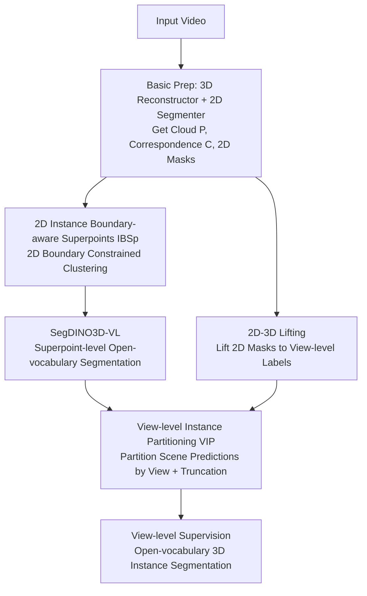

# OVSeg3R: Learn Open-vocabulary Instance Segmentation from 2D via 3D Reconstruction

**Conference**: ICLR 2026  
**OpenReview**: [https://openreview.net/forum?id=rIMOXvaLAe](https://openreview.net/forum?id=rIMOXvaLAe)  
**Code**: To be confirmed  
**Area**: 3D Vision / Open-vocabulary Segmentation  
**Keywords**: Open-vocabulary 3D Instance Segmentation, 3D Reconstruction, 2D-to-3D Lifting, View-level Supervision, Superpoints

## TL;DR
OVSeg3R is a training scheme: it treats point clouds obtained from 3D reconstruction of 2D videos as input, lifts open-vocabulary 2D instance segmentation results to 3D as annotations using reconstructed 2D-3D correspondences, and stabilizes training with "View-level Instance Partitioning" (VIP) and "2D Instance Boundary-aware Superpoints" (IBSp). It extends a closed-set SOTA 3D segmenter into an open-vocabulary model, achieving +2.3 mAP overall and +7.7 mAP on novel classes on ScanNet200.

## Background & Motivation

**Background**: Downstream tasks such as robot manipulation, navigation, and AR require 3D perception with instance-level identity and location. Consequently, 3D instance segmentation and its open-vocabulary generalization have gained increasing attention. While open-vocabulary capabilities in 2D segmentation are mature, 3D counterparts lag significantly behind.

**Limitations of Prior Work**: The root cause is the high cost of 3D annotation. Although modern 3D reconstruction techniques have lowered the cost of "3D scene acquisition," "3D mask annotation" remains expensive. Two mainstream approaches to bypass annotation are suboptimal: (1) Methods like OpenMask3D use 3D models to generate class-agnostic masks and project them back to 2D for classification via foundation models—only the "classification" capability is open-vocabulary. Due to the scarcity of 3D data, they often miss objects not seen during training. (2) Methods like SAM3D lift 2D segmentation per frame to 3D and merge them using heuristic rules—these rules are brittle and fail in corner cases.

**Key Challenge**: Both approaches "overly rely on 2D outputs," treating 3D as a tool for transporting/stitching 2D results. Native 3D perception capabilities are never truly trained, while training 3D perception is hindered by the lack of 3D labels. Some distillation methods require training 3D Gaussians for 2D-3D correspondences, needing per-scene optimization or high-quality point cloud initialization, which is redundant and impractical.

**Goal**: To train a 3D instance segmentation model with true 3D perception capabilities end-to-end, without introducing additional model capacity or relying entirely on 2D outputs during inference.

**Key Insight**: 3D reconstruction naturally provides mapping between 2D pixels and 3D points. By using reconstructed point clouds as input (which introduces realistic acquisition noise) and lifting open-vocabulary 2D masks as 3D labels, both expensive steps (scene acquisition and mask annotation) are replaced by free off-the-shelf models.

**Core Idea**: Use "3D reconstruction + off-the-shelf open-vocabulary 2D segmenter" to automatically generate training data and supervision to train a standard 3D segmenter instead of stitching 2D results during inference. To address the side effects of "sparse 2D-to-3D lifting" and "over-smoothed reconstruction," VIP and IBSp are designed to stabilize training.

## Method

### Overall Architecture
OVSeg3R uses the latest closed-set SOTA model SegDINO3D as the backbone, replacing its fixed-class head with a similarity matching head ("object features vs. text features") to obtain SegDINO3D-VL. OVSeg3R provides the training pipeline. The pipeline consists of four steps: **Basic Data Preparation**—feeding a video into a 3D reconstructor (default: MASt3R-SLAM) and an open-vocabulary 2D segmenter (default: DINO-X) to obtain point cloud $P$, 2D-3D correspondences $C$, 2D instance masks $M^{2D}$, and text labels $s$. Second, **Input and View-level Annotation Construction**—sampling 2D features for 3D points via $C$, clustering points into superpoints using IBSp, and lifting 2D masks via $C$ to get view-level partial labels. Third, SegDINO3D-VL produces **scene-level instance predictions** at the superpoint level. Finally, **VIP partitions scene-level predictions by view**, utilizing each view's partial labels for supervision. The innovations focus on ensuring that "noisy labels/over-smoothed geometry from 2D" do not destabilize training.

### Key Designs

**1. Automated Data and Supervision Generation via 3D Reconstruction + 2D Segmentation**

This addresses the bottleneck of high 3D annotation costs. OVSeg3R no longer requires high-quality point clouds or manual 3D masks. A standard video $I \in \mathbb{R}^{V\times H\times W\times 3}$ is fed to a reconstructor to obtain point cloud $P \in \mathbb{R}^{N\times 3}$ and bidirectional 2D-3D correspondences $C: i \leftrightarrow (v,x,y)$. On the annotation side, 2D masks $M^{2D}$ are generated per frame and "lifted" to corresponding 3D points via $C$ to create view-level 3D instance masks $m^{3D}$. To leverage SegDINO3D's representations, 2D image-level features $F^{2D}_i \Leftarrow \mathrm{Bilinear}(X_{v_i}, (x_i,y_i))$ are sampled for each point via $C$. This replaces the high overhead of re-projecting points to all views. This approach reduces costs from "depth cameras + manual labeling" to "automated model pipelines" while aligning training with low-quality, noisy real-world inputs.

**2. View-level Instance Partitioning (VIP): Splitting Scene Predictions to Eliminate False Positive Penalties**

Lifting 2D masks to 3D results in independent per-view labels with no cross-view association. Directly merging them into scene-level labels produces redundant annotations. Since each view only covers part of the point cloud, using partial labels to supervise scene-level predictions would treat correct predictions outside that view as false positives, destabilizing training. VIP observes that object queries in the decoder effectively perform iterative soft clustering. VIP explicitly assigns a query to the view its superpoint belongs to and **truncates** its scene-level mask to only include areas visible in that view. Formally, view assignment $V^q_v$ is derived from point-to-view mapping $V^p_v$ via superpoint masks $M^{sp}$, and the view-level prediction $\tilde m^{3D}_v \Leftarrow \tilde M^{3D}[V^q_v, V^{sp}_v]$ is extracted. This minimizes false positive risk and is compatible with scene-level supervision for datasets with full annotations.

**3. 2D Instance Boundary-aware Superpoints (IBSp): Constraining Superpoints with 2D Masks**

Standard 3D segmentation clusters point clouds into superpoints using graph-based algorithms like Felzenszwalb based on geometric continuity. However, reconstructions are often over-smoothed, leading to poor geometric distinction at instance boundaries. For **geometrically indistinct** objects (e.g., paintings, rugs, sockets), isotropic KNN often connects points across instance boundaries. IBSp projects the endpoints of each KNN edge back to 2D via $C$ and reads their instance labels $o_i, o_j$ from $M^{2D}$. **Edges are preserved only if $o_i = o_j$**; otherwise, they are cut. This prevents points from different instances from merging into the same superpoint, allowing geometrically indistinct objects to be segmented.

### Loss & Training
The model performs matching and supervision at the superpoint level. Point features $F^{3D}$ are pooled into superpoint features $S^{3D} \Leftarrow M^{sp}F^{3D}/\mathrm{Sum}(M^{sp},1)$. $q$ superpoints are selected as queries for a multi-layer Transformer decoder. The final masks $\tilde M^{3D} \Leftarrow QS^{3D\top} > \tau$ and classes $\tilde C \Leftarrow \arg\max(QT^\top,1)$ are derived via similarity matching. Text labels $s$ are augmented with negative samples and encoded via CLIP. For scene-level supervision, sparse matching is used where queries must fall within a GT mask. Experiments utilize reconstruction data from both MASt3R-SLAM and VGGT.

## Key Experimental Results

### Main Results
The dataset is ScanNetv2 / ScanNet200. "ScanNet3R-MSLAM" and "ScanNet3R-VGGT" are reconstructed versions with automated open-vocabulary labels from DINO-X.

ScanNet200 open setting (mAP):

| Method | All | Head | Tail | Type |
|------|-----|------|------|------|
| SegDINO3D | 39.8 | 46.0 | 36.2 | Closed-set SOTA |
| SegDINO3D-VL (ScanNet200 only) | 38.4 | 45.3 | 34.0 | With VL head |
| SAM3D | 9.8 | 9.2 | 12.3 | Open-vocabulary |
| Open3DIS | 23.7 | 27.8 | 21.8 | Open-vocabulary |
| Any3DIS | 25.8 | 27.4 | 26.4 | Open-vocabulary |
| **OVSeg3R (Ours)** | **40.7** | 44.6 | **42.7** | Open-vocabulary |

OVSeg3R achieves +2.3 mAP overall and +8.7 mAP for tail classes compared to the baseline, narrowing the head-tail gap from -11.3 to -1.9 mAP, and outperforming closed-set methods.

Standard setting (Train on 20 classes, test on 200):

| Method | mAP | mAP_novel | mAP_base |
|------|-----|-----------|----------|
| OpenMask3D | 12.6 | 11.9 | 14.3 |
| Open3DIS | 19.0 | 16.5 | 25.8 |
| **OVSeg3R (Ours)** | **24.6** | **24.2** | 25.8 |

The gains primarily come from novel class generalization (+7.7 mAP).

### Ablation Study

| Config | mAP | mAP_novel | Note |
|------|-----|-----------|------|
| Full (VIP+IBSp, S.3R-M 100%) | 23.9 | 23.0 | Full model |
| w/o VIP | 18.4 | 16.2 | False positives increase, -5.5 drop |
| w/o IBSp | 23.6 | 22.0 | Novel -1.0 |
| Reconstructed Data 10% | 16.8 | 14.8 | Significant drop |
| Reconstructed Data 0% | 5.0 | 0.0 | Novel classes nearly zero |

### Key Findings
- VIP is essential: Removing it leads to a 5.5 mAP drop due to false positive proliferation.
- Open-vocabulary supervision volume determines novel class performance: With 0% reconstructed data, novel mAP is close to zero.
- Mixing different reconstructors (MASt3R-SLAM + VGGT) acts as data augmentation, further improving results (24.6 vs 23.9).

## Highlights & Insights
- Maximum utilization of 2D-3D correspondence: It is used for label generation, feature sampling, and superpoint edge cutting, avoiding the need for per-scene optimization.
- VIP's truncated view supervision is an effective paradigm for handling partial or weak annotations.
- IBSp injects 2D semantic boundaries into geometric superpoints at near-zero cost, addressing the blind spot of geometric-only superpoints on over-smoothed data.

## Limitations & Future Work
- VIP's view assignment lacks a formal mathematical guarantee, although it is empirically reliable.
- Heavy dependence on the quality of the 2D segmenter (DINO-X): Errors in 2D masks propagate to 3D.
- Experiments are restricted to indoor ScanNet scenes; large-scale or dynamic scenes remain untested.
- The gain is primarily in "coverage" (novel classes) rather than "precision" of known classes.

## Related Work & Insights
- **vs. OpenMask3D**: They rely on 3D data for class-agnostic masks, leading to missed detections of unseen objects. OVSeg3R trains the 3D segmenter itself to detect and segment novel objects.
- **vs. SAM3D**: They use heuristic merging rules; OVSeg3R uses an end-to-end native 3D model, avoiding online merging corner cases.
- **vs. SegDINO3D (baseline)**: OVSeg3R provides the open-vocabulary supervision pipeline. Without the OVSeg3R data, simply adding a VL head to SegDINO3D slightly degrades performance.

## Rating
- Novelty: ⭐⭐⭐⭐ Re-purposing 3D reconstruction as a core hub for supervision and superpoint construction is clever.
- Experimental Thoroughness: ⭐⭐⭐⭐ Solid dual-setting evaluations and ablation ladder; lacks large-scale outdoor data.
- Writing Quality: ⭐⭐⭐⭐ Clear motivation and mechanism explanations.
- Value: ⭐⭐⭐⭐ Provides a practical paradigm for low-cost training of open-vocabulary 3D segmentation.

<!-- RELATED:START -->

## Related Papers

- [\[AAAI 2026\] Retrieving Objects from 3D Scenes with Box-Guided Open-Vocabulary Instance Segmentation](../../AAAI2026/3d_vision/retrieving_objects_from_3d_scenes_with_box-guided_open-vocabulary_instance_segme.md)
- [\[ICLR 2026\] GeoPurify: A Data-Efficient Geometric Distillation Framework for Open-Vocabulary 3D Segmentation](geopurify_a_data-efficient_geometric_distillation_framework_for_open-vocabulary_.md)
- [\[CVPR 2026\] OVI-MAP: Open-Vocabulary Instance-Semantic Mapping](../../CVPR2026/3d_vision/ovi-map_open-vocabulary_instance-semantic_mapping.md)
- [\[CVPR 2026\] Ov3R: Open-Vocabulary Semantic 3D Reconstruction from RGB Videos](../../CVPR2026/3d_vision/ov3r_open-vocabulary_semantic_3d_reconstruction_from_rgb_videos.md)
- [\[ICLR 2026\] Progressive Gaussian Transformer with Anisotropy-aware Sampling for Open Vocabulary Occupancy Prediction](progressive_gaussian_transformer_with_anisotropy-aware_sampling_for_open_vocabul.md)

<!-- RELATED:END -->
