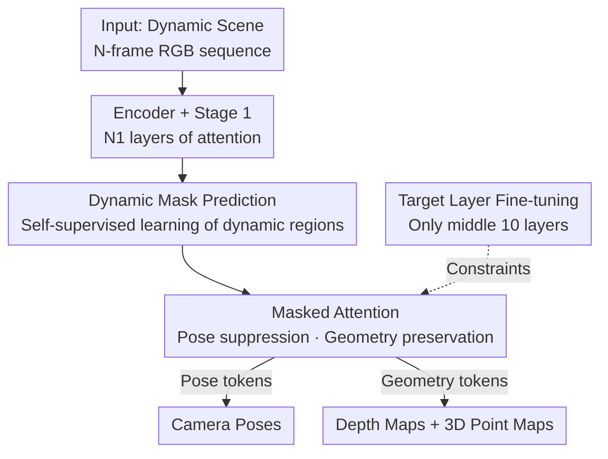

# PAGE-4D: VGGT-4D Perception via Disentangled Pose and Geometry Estimation

**Conference**: ICLR 2026  
**OpenReview**: [https://openreview.net/forum?id=Nfmzp5PBzr](https://openreview.net/forum?id=Nfmzp5PBzr)  
**Code**: To be confirmed (Paper claims to provide necessary code and demo)  
**Area**: 3D Vision / 4D Perception  
**Keywords**: Dynamic scene reconstruction, VGGT, Camera pose estimation, Dynamics-aware mask, Feed-forward 3D model

## TL;DR
PAGE-4D attaches a "Dynamics-Aware Aggregator" to the feed-forward 3D foundation model VGGT. It utilizes a self-supervised dynamic mask to decouple motion information based on the specific task—masking it during pose estimation and amplifying it during geometry reconstruction. Fine-tuning only the middle 10 layers enables VGGT to outperform the original version in pose, depth, and point cloud reconstruction for dynamic scenes.

## Background & Motivation
**Background**: Feed-forward inference of 3D attributes (depth, point cloud, camera pose) from a set of images has progressed rapidly. DUSt3R uses a Transformer to map 2D pixels directly to a 3D coordinate field, while VGGT introduces a unified architecture alternating between "intra-frame attention + cross-frame global attention" to jointly output camera poses, depth maps, and point correspondences in a single forward pass. However, these models assume a time-invariant "static scene."

**Limitations of Prior Work**: The real world is filled with moving people, deforming umbrellas, and driving cars. Once the scene becomes dynamic, the accuracy of VGGT drops sharply. Evaluations on the Odyssey dataset reveal that the absolute depth error in dynamic areas is 94% higher than in static areas. Visualizing attention maps (layers 5/12/18/24) of VGGT confirms that the network tends to **ignore** dynamic content, with significantly weaker activation in dynamic regions.

**Key Challenge**: There is a fundamental tension in processing dynamic scenes. On one hand, motion destroys static epipolar constraints and introduces noise into camera pose estimation, as essential matrix fitting assumes a rigid scene. On the other hand, motion cues are essential for reconstructing the geometry of dynamic objects. In other words, **the same signals are beneficial for geometry but harmful for pose**. An ablation study shows that explicitly suppressing attention between dynamic tokens improves pose accuracy but severely degrades geometry, confirming this trade-off.

**Goal**: To enable a pre-trained static 3D foundation model to excel in pose, depth, and point cloud tasks for dynamic scenes simultaneously, without major architectural changes or dependence on large-scale dynamic datasets with ground-truth geometry.

**Key Insight**: Instead of treating "dynamics" as uniformly harmful or beneficial, its role should be **decoupled by task**.

**Core Idea**: Introduce a dynamics-aware aggregator that first predicts a dynamic mask to identify moving regions, then uses an attention mechanism to filter dynamic content for pose tokens while retaining it for geometry tokens. By fine-tuning only the middle layers most sensitive to dynamics, VGGT is smoothly adapted to dynamic scenes.

## Method

### Overall Architecture
PAGE-4D retains the four main components of VGGT—a DINO-style image encoder, a lightweight depth/point cloud decoder, and a larger camera pose head—but extends the "aggregator" from an alternating structure to a **three-stage, dynamics-aware aggregator**. The input is an $N$-frame RGB sequence $\{I_i\}_{i=1}^N$ from a dynamic scene, and the output consists of camera parameters $g_i \in \mathbb{R}^9$, depth maps $D_i$, and 3D point maps $P_i$ per frame. The process is entirely feed-forward with no post-processing.

The sequence follows three stages: The first stage ($N_1$ layers) fuses spatio-temporal information normally; the output is sent to the **Dynamic Mask Prediction Module** to generate a dynamics-aware mask $\tilde M$; the second stage ($N_2$ layers) replaces standard global attention with **Dynamics-Aware Global Attention** using the mask to decouple pose and geometry; the third stage ($N_3$ layers) shares the structure of the first stage. Only these middle layers (approx. 10 layers, 30% of parameters) are fine-tuned, while the rest are frozen.

### Key Designs

**1. Dynamic Mask Prediction: Self-supervised identification of motion**

The core difficulty in dynamic scenes is identifying moving regions without motion labels to suppress them for pose tasks and retain them for geometry tasks. PAGE-4D designs a dynamic mask prediction module that learns this in a **self-supervised** manner. This is feasible because intermediate layers of PAGE-4D already represent static and dynamic content differently; the mask module simply makes this distinction explicit. Specifically, it takes patch tokens $z_p$ from the aggregator output $z \in \mathbb{R}^{B\times S\times P\times d}$, projects them to a lower dimension, and uses a depth-wise separable convolution head to generate mask logits $m = \mathrm{Conv}(z_p)$. The mask is fully differentiable, allowing the model to adapt to motion patterns in training data without heuristic rules.

**2. Masked Attention: Asymmetric use of the same mask**

The dynamic mask $\tilde M$ is integrated into the attention logits:

$$\mathrm{Attn}(Q,K,V) = \mathrm{softmax}\!\left(\frac{QK^\top}{\sqrt{d}} + \tilde M\right)V$$

The key is the **asymmetric application** based on the task. For camera and register tokens (pose-related queries), $\tilde M$ actively **suppresses** attention to dynamic regions, forcing pose estimation to rely on epipolar geometry and static scene constraints. For depth and point cloud patches, the mask is **not applied**, allowing the network to utilize dynamic motion cues to improve reconstruction and 2D-3D tracking. This design, where the same physical quantity acts oppositely in two tasks, is the key to breaking the trade-off. The geometric motivation is solid: in static scenes, pixel correspondence is determined by $x_t = K(R_{t\leftarrow r}D_r(x_r)K^{-1}x_r + t_{t\leftarrow r})$; in dynamic scenes, a displacement term $KM_{t\leftarrow r}$ is added, making the essential matrix constraint $\tilde x_t^\top E \tilde x_r = 0$ hold only for static pixels.

**3. Memory-efficient implementation using two vectors**

Generating the full matrix $\tilde M$ of size $(S\cdot P)^2$ requires $O(N^2)$ memory and breaks fused Scaled Dot-Product Attention (SDPA). PAGE-4D bypasses this with an equivalent **additive mask**: the mask head predicts two vectors $r\in\mathbb{R}^N$ and $c\in\mathbb{R}^N$, which are concatenated to the feature dimension—$q'_i = [q_i\sqrt{d'/d},\, r_i\sqrt{d'}]$, $k'_j = [k_j,\, c_j]$, and $v'_j = [v_j,\, 0]$, where $d'=d+1$. Thus, $\frac{q'_i k'^\top_j}{\sqrt{d'}} = \frac{q_i^\top k_j}{\sqrt{d}} + r_i c_j$. This achieves the equivalent mask with $O(N)$ memory and maintains compatibility with fused SDPA, allowing it to be inserted into VGGT at near-zero cost.

**4. Target Layer Fine-tuning: Updating the most sensitive layers**

Transferring to dynamic scenes does not require full fine-tuning. Based on Transformer representation research—where low layers capture local structure, middle layers model regional relationships, and high layers encode global semantics—and the observation that VGGT's middle layers suppress dynamic content, only the middle ~10 layers (30% of parameters) are updated. This strategy re-injects dynamic information into the feed-forward process while maintaining efficiency and mitigating the scarcity of dynamic labeled data.

### Loss & Training
A multi-task loss is used: $L = \lambda_c L_{\text{camera}} + L_{\text{depth}} + L_{\text{pmap}}$. Following VGGT's empirical weights to balance gradients, $\lambda_c = 5$. Huber loss is used for camera poses, while uncertainty-weighted losses with gradient regularization are used for depth and point maps. The model does not include a point tracking head, as VGGT's tracking head is primarily designed for view registration and is unsuitable for dynamic scenes.

## Key Experimental Results

Evaluations were conducted on monocular video sequences across five tasks: video depth, monocular depth, camera pose, multi-view point cloud reconstruction, and 4D novel view synthesis. Baselines include DUSt3R, MASt3R, MonST3R, CUT3R, Fast3R, FLARE, and VGGT. The backbone and parameter count match VGGT (1.26B), and FPS is maintained (43.2 on A800/KITTI).

### Main Results

Video Depth Estimation (Sintel / Bonn / DyCheck, scale & shift aligned, compared against VGGT):

| Dataset | Metric | VGGT | PAGE-4D | Gain |
|--------|------|------|---------|------|
| Sintel | Abs Rel ↓ | 0.261 | 0.212 | −18.8% |
| Sintel | δ<1.25 ↑ | 0.639 | 0.763 | +19.4% |
| Bonn | Abs Rel ↓ | 0.102 | 0.090 | Better |
| DyCheck | δ<1.25 ↑ | 0.792 | 0.854 | Better |

Camera Pose Estimation (Sintel / Tum) and Point Cloud Reconstruction (DyCheck):

| Task/Dataset | Metric | VGGT | PAGE-4D |
|--------|------|------|---------|
| Pose Sintel | ATE ↓ | 0.214 | 0.178 |
| Pose Sintel | RPErot ↓ | 0.643 | 0.547 |
| Pose Tum | ATE ↓ | 0.028 | 0.016 |
| Point Cloud DyCheck | Acc Mean ↓ | 1.051 | 0.403 |
| Point Cloud DyCheck | Acc Median ↓ | 1.016 | 0.284 |

Point cloud reconstruction shows the most significant improvement: compared to VGGT, the Mean Accuracy error is reduced by over 60%, and Median error by over 70%.

### Ablation Study

| Variant | Sintel Abs Rel ↓ | Sintel δ<1.25 ↑ |
|------|------|------|
| VGGT* (Full fine-tuning) | 0.405 | 0.593 |
| VGGT* (Middle layers only) | 0.409 | 0.590 |
| Ours (Middle layers + Mask Attention) | 0.357 | 0.699 |

Conclusions: ① Fine-tuning only the middle layers is as effective as full fine-tuning. ② Adding the dynamics-aware aggregator provides a significant jump, proving that explicitly decoupling pose/geometry is what unlocks the backbone's potential.

## Highlights & Insights
- Quantifying the tension (harmful for pose, beneficial for geometry) using epipolar residual $\delta(x_r)$ provides a first-principles geometric basis for decoupling.
- Using the same self-supervised mask in opposite ways for different tasks is a concise and elegant decoupling method that avoids the need for motion segmentation labels.
- The $O(N)$ additive mask implementation maintains "plug-and-play" zero overhead while remaining compatible with hardware-accelerated SDPA.
- Achieving SOTA by tuning only 30% of parameters proves that identifying and migrating sensitive layers is more efficient than global fine-tuning.

## Limitations & Future Work
- Lack of a point tracking head: PAGE-4D does not output correspondences for tracking because the original VGGT head is not adapted for dynamic scenes.
- Backbone dependence: Performance is inherited from VGGT; it cannot help in scenarios where the base VGGT model fundamentally fails.
- Mask robustness: As the mask is self-supervised, further research is needed on how pose/geometry degrades under extreme, out-of-distribution motion.
- Indirect 4D rendering: 4D synthesis is evaluated by using point clouds to initialize 4D-GS. End-to-end dynamic rendering remains an open problem.

## Related Work & Insights
This work sits on the evolutionary path from "3D feed-forward" to "4D feed-forward" models. While DUSt3R and VGGT assume time-invariance, 4D approaches like MonST3R or StreamVGGT either struggle with pairwise processing constraints or use task-specific architectures that sacrifice generality. PAGE-4D demonstrates that a static foundation model can be bridged to the dynamic domain by **precisely locating and fine-tuning key attention components**, providing a lightweight paradigm for model adaptation.

<!-- RELATED:START -->

## Related Papers

- [\[CVPR 2026\] VGGT-360: Geometry-Consistent Zero-Shot Panoramic Depth Estimation](../../CVPR2026/3d_vision/vggt-360_geometry-consistent_zero-shot_panoramic_depth_estimation.md)
- [\[ICLR 2026\] UFO-4D: Unposed Feedforward 4D Reconstruction from Two Images](ufo-4d_unposed_feedforward_4d_reconstruction_from_two_images.md)
- [\[CVPR 2026\] ConsisVLA-4D: Advancing Spatiotemporal Consistency in Efficient 3D-Perception and 4D-Reasoning for Robotic Manipulation](../../CVPR2026/3d_vision/consisvla-4d_advancing_spatiotemporal_consistency_in_efficient_3d-perception_and.md)
- [\[ICLR 2026\] Implicit 4D Gaussian Splatting for Fast Motion with Large Inter-Frame Displacements](implicit_4d_gaussian_splatting_for_fast_motion_with_large_inter-frame_displaceme.md)
- [\[CVPR 2026\] Velox: Learning Representations of 4D Geometry and Appearance](../../CVPR2026/3d_vision/velox_learning_representations_of_4d_geometry_and_appearance.md)

<!-- RELATED:END -->
