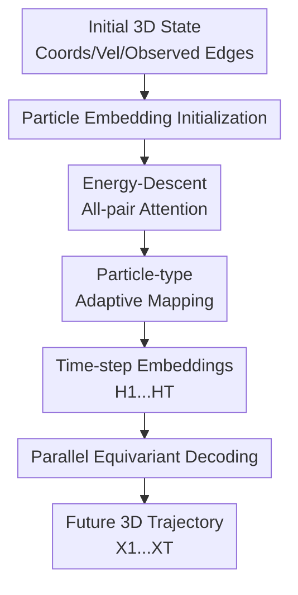

# PAINET: A Principled Efficient Transformer for 3D Dynamics Modeling

**Conference**: ICLR 2026  
**OpenReview**: [https://openreview.net/forum?id=haQ0QIor4J](https://openreview.net/forum?id=haQ0QIor4J)  
**Code**: https://github.com/Icarus1411/PAINET  
**Area**: 3D Vision / 3D Dynamics Modeling  
**Keywords**: 3D Dynamics, SE(3) Equivariance, All-to-all Interaction, Physics-inspired Attention, Multi-body Systems

## TL;DR
PAINET formulates unobserved long-range all-to-all interactions in 3D multi-body systems as an energy minimization problem. From this, it derives an equivariant Transformer encoder with particle-type adaptive mapping, followed by a parallel EGNN to decode future trajectories. It achieves lower prediction errors at nearly identical computational costs across human motion, small/large molecules, and protein dynamics.

## Background & Motivation
**Background**: 3D dynamics modeling aims to predict the future spatial positions of a set of particles, joints, or atoms. Typical inputs include initial coordinates $X^{(0)}$, velocities $V^{(0)}$, node features, and observable edges. Recent mainstream deep learning methods represent systems as graphs: particles are nodes, and observed bonds, adjacencies, or geometric cutoffs are edges. Information is then propagated using equivariant GNNs such as EGNN, EGNO, HEGNN, or GF-NODE. This approach provides clear structure and ensures SE(3) equivariance—making the model insensitive to rotation, translation, and permutation, which aligns with physical systems.

**Limitations of Prior Work**: The issue is that edges on a graph usually represent only "observed structures" or manually constructed neighborhood structures, which do not equate to the total interactions in real dynamics. In molecular systems, short-range covalent bonds are strong, but long-range forces like van der Waals and electrostatic charges also affect long-term trajectories. In protein folding or crystal formation, the current structure is just a snapshot; new implicit structures form spontaneously. In human motion, the geometric skeleton cannot fully explain the coordination between distant joints. If a model only passes messages along existing edges, it ignores these unobserved all-pair relationships, leading to small initial errors that accumulate into significant trajectory drift over long durations.

**Key Challenge**: The most direct solution is to allow all particle pairs to interact. However, two difficulties arise. First, the search space for potential structures of arbitrary particle pairs expands rapidly with the number of particles; without physical or mathematical constraints, attention mechanisms easily learn spurious correlations. Second, 3D dynamics prediction must preserve SE(3) equivariance; one cannot simply feed coordinate-dependent features into a standard Transformer for global attention.

**Goal**: The authors aim to solve three sub-problems simultaneously: providing an interpretable formal objective for "unobserved all-pair interactions" rather than relying on empirical attention stacking; capturing long-range, particle-type-dependent pairwise dependencies within the model; and maintaining equivariance and inference efficiency when predicting multiple future time steps.

**Key Insight**: A critical observation of PAINET is that instead of directly enumerating potential edges, particle embeddings can be made "internally consistent" under an energy function. If two particles should be related in the latent space, their embedding distance is minimized by an energy term; if they are vastly different, a concave pairwise penalty prevents over-smoothing. This approach transforms implicit structure learning into an energy descent trajectory, naturally deriving a form of attention update.

**Core Idea**: Use energy minimization to derive all-pair attention, combined with particle-type adaptive mapping and a parallel equivariant decoder. This integrates unobserved long-range interactions into 3D dynamics prediction while maintaining SE(3) equivariance and inference efficiency.

## Method

### Overall Architecture
The input to PAINET consists of initial 3D multi-body states, including particle coordinates, velocities, node features, and observed edge attributes; the output is the coordinate trajectory for $T$ future time steps. The model first encodes the initial state into particle embeddings $H^{(0)}$. Subsequently, at each time step, it updates the embeddings using "energy-descent all-pair attention" to obtain $H^{(1)}, \ldots, H^{(T)}$. Finally, the embeddings for each time step are passed to the same equivariant GNN decoder, which combines the initial coordinates, velocities, and observed graph structure to generate the corresponding predicted positions $\hat X^{(t)}$ in parallel.

The division of labor is clear: the attention encoder supplements the potential all-pair interactions not explicitly provided by the observed graph, while the decoder transforms these latent space relationships back into 3D coordinates, maintaining rotation, translation, and permutation equivariance via the EGNN format.

As shown in the diagram, the core contributions are the "Energy-Descent All-pair Attention," "Particle-type Adaptive Mapping," and "Parallel Equivariant Decoding."

### Key Designs
**1. Energy-Descent All-pair Attention: Converting implicit interactions from empirical attention to interpretable optimization trajectories**

Instead of just stating that "all particles look at each other," PAINET defines a latent space energy:

$$
E(H,t;\{\rho_{ij}\})=\sum_i \|h_i-h_i^{(t)}\|_2^2+\lambda\sum_{i,j}\rho_{ij}(\|h_i-h_j\|_2^2).
$$

The first term constrains the new embedding from deviating abruptly from the current embedding, preserving temporal continuity. The second term imposes a smoothness constraint across all particle pairs, with $\rho_{ij}$ representing the potential interaction strength between different pairs. The key is not to make all embeddings identical, but to use a non-linear, non-decreasing, and concave $\rho_{ij}$ to maintain consistency for related particles while preventing over-smoothing for distant ones. Thus, unobserved interactions are manifested via latent space consistency.

The authors further prove that for some $0 < \eta < 1$, the following update represents an energy descent step:

$$
h_i^{(t+1)}=(1-\eta)h_i^{(t)}+\eta\sum_j\frac{\omega_{ij}^{(t)}}{\sum_m\omega_{im}^{(t)}}h_j^{(t)},\quad
\omega_{ij}^{(t)}=\frac{\partial \rho_{ij}(h^2)}{\partial h^2}\bigg|_{h^2=\|h_i^{(t)}-h_j^{(t)}\|_2^2}.
$$

This step directly results in an attention mechanism: weights are not arbitrary scoring functions but are the gradients of the pairwise penalty with respect to distance. The physical intuition is that the system evolves from high-energy to low-energy states; in representation learning, each attention layer updates embeddings in the direction of reducing latent energy.

**2. Particle-type Adaptive Mapping: Allowing different rules for different particle pairs**

In real physical systems, interaction coefficients differ by particle type (e.g., C-C vs. C-H). PAINET avoids a globally shared attention bias, instead using two sets of learnable pairwise matrices $\Phi=[\phi_{ij}]$ and $\Psi=[\psi_{ij}]$ to characterize particle-specific mappings. The function $\rho_{ij}$ is instantiated in a Landau-Ginzburg-like quadratic potential: $\rho_{ij}(h^2)=a_{ij}h^2-b_{ij}h^4$. After normalizing embeddings, the update becomes attention with dot-product similarity:

$$
h_i^{(t+1)}=(1-\eta)h_i^{(t)}+\eta\sum_j
\frac{\phi_{ij}+\psi_{ij}(\tilde h_i^{(t)})^\top\tilde h_j^{(t)}}
{\sum_m\phi_{im}+\psi_{im}(\tilde h_i^{(t)})^\top\tilde h_m^{(t)}}h_j^{(t)}.
$$

Implementation-wise, PAINET uses the $Q, K, V$ matrix format but injects $\Phi$ and $\Psi$ as adaptive mappings. If the particle type one-hot is $Z$, then $\Phi=s_1\sigma(ZE_\phi Z^\top)$ and $\Psi=s_2\sigma(ZE_\psi Z^\top)$. This means attention scores are determined by both current latent states and particle types.

**3. Parallel Equivariant Decoding: Transforming latent interactions into trajectories without inefficient autoregression**

The all-pair attention updates scalar latent embeddings, which cannot be directly output as coordinates. Using MLPs for coordinate prediction would break geometric equivariance. Therefore, PAINET’s decoder employs EGNN: for each future time step $t$, it takes the corresponding $H^{(t)}$ along with initial coordinates $X^{(0)}$, velocities $V^{(0)}$, and observed structure $A$. Through message passing based on relative positions and distances, it generates $\hat X^{(t)}$. Since EGNN uses equivariant vectors like $x_i-x_j$ and invariants like distance, it maintains correct transformations under rotation and translation.

The key efficiency factor is "parallelism." While some models feed $\hat X^{(t)}$ back into the model to predict $\hat X^{(t+1)}$ (which is slow and amplifies early errors), PAINET computes all latent states $H^{(1:T)}$ and then calls the decoder in parallel for all $t$ to output $\hat X^{(t)}$.

### Mechanism Example
Consider the "Walk" sequence in human motion prediction: inputs are 31 joints with initial 3D coordinates and velocities, and edges are the skeletal connections. Traditional EGNNs propagate information mainly along the skeleton (e.g., knee affects ankle). However, in a real gait, there are long-range coordinations between left/right legs and torso/arms.

PAINET first encodes each joint as an embedding. The all-pair attention allows all joints to participate in updates, with weights determined by energy descent: if an arm joint and a contralateral leg joint are coordinated in the current phase, their latent relationship is enhanced. After obtaining $H^{(1)}$, the equivariant decoder converts latent interactions into coordinates for $T=1$. For $T=5$, the model continues updating to obtain $H^{(2:5)}$ and decodes them in parallel.

### Loss & Training
PAINET uses a supervised trajectory prediction objective. Given ground-truth positions $X^{(1:T)}$ and predictions $\hat X^{(1:T)}$, the loss is the Mean Squared Error (MSE) across all particles and time steps:

$$
\mathcal{L}_{traj}=\sum_{t=1}^{T}\sum_{i=1}^{N}\|\hat x_i^{(t)}-x_i^{(t)}\|_2^2.
$$

Tasks include State-to-State (S2S), reporting Final MSE (F-MSE), and State-to-Trajectory (S2T), reporting Average MSE (A-MSE). The model is trained with Adam.

## Key Experimental Results

### Main Results
The paper evaluates PAINET on 11 datasets, covering human motion capture, MD17 small molecules, MD22 large molecules, and Adk protein dynamics.

| Dataset / Task | Metric | PAINET | Prev. Best/Strong Baseline | Gain |
|--------|------|------|----------|------|
| Motion Capture Walk S2S | F-MSE $\times 10^{-2}$ | 8.45 | ClofNet 12.6 | ~32.9% Lower |
| Motion Capture Run S2S | F-MSE $\times 10^{-1}$ | 3.50 | GF-NODE 3.87 | ~9.6% Lower |
| Motion Capture Walk S2T | A-MSE $\times 10^{-1}$ | 0.86 | GF-NODE 1.25 | ~31.2% Lower |
| Motion Capture Run S2T | A-MSE $\times 10^{-1}$ | 3.33 | EGNO 5.70 | ~41.5% Lower |
| MD22 Stachyose S2T | A-MSE $\times 10^{-1}$ | 2.40 | GF-NODE 2.54 | ~5.5% Lower |
| Adk Protein S2T | A-MSE | 1.654 | HEGNN 1.735 | ~4.7% Lower |

### Ablation Study
| Configuration | Key Metrics | Description |
|------|---------|------|
| Full PAINET | Lowest A-MSE | Includes energy-descent attention, learnable $\Phi/\Psi$, and parallel EGNN. |
| Fixed $\Phi/\Psi$ | Higher A-MSE | Pairwise mapping no longer learned by type; distinction in long-range interaction drops. |
| w/o attention | Significantly worse | Removing all-pair attention limits the model to observed structures. |
| local attention | Higher A-MSE | Restricting attention to local neighborhoods re-imposes the "explicit structure dependency." |
| MLP decoder | Faster but higher error | Decoding with MLP fails to utilize observed graphs and lacks geometric constraints. |
| EGNN-recurrent | Slower and higher error | Autoregressive decoding in coordinate space amplifies intermediate errors. |

### Key Findings
- **Principled Attention**: The energy-derived all-pair attention is a primary source of performance. Removing it or making it local hurts results significantly.
- **Parallel Equivariant Decoding**: This is crucial for balancing accuracy and efficiency. MLP decoders lack geometric modeling, while recurrent EGNNs increase costs and error drift.
- **Long-term Stability**: PAINET is more stable in long-term predictions ($T=5, 10, 15, 20$). It avoids the error explosion seen in some baselines.
- **Scalability**: Computational costs grow approximately linearly with the number of particles. On Adk proteins, PAINET's inference time (13.59s) is faster than EGNO (14.22s) and GF-NODE (27.71s).

## Highlights & Insights
- PAINET's greatest value lies in formulating attention as energy descent rather than merely applying a Transformer to a physical task.
- The particle-type adaptive mapping is a practical design. While many geometric models share scoring rules globally, physical systems vary by pair type; adding type dependency makes attention more realistic.
- The parallel decoding strategy is transferable to other geometric sequence tasks like point cloud motion or fluid simulation.
- A key insight is the distinction between "observed structure" and "true interaction structure." Fixed adjacencies should be treated as priors, not the sole communication paths.

## Limitations & Future Work
- **Large-scale Scenarios**: While scalability is linear, all-pair relations still create pressure on memory/bandwidth for massive systems (e.g., full-atom protein complexes). Sparse or hierarchical attention could be explored.
- **Mapping Complexity**: Current mappings rely on one-hot lookups. For systems with continuously varying particle types, incorporating environment context or bond scales would be beneficial.
- **Physical Indicators**: The evaluation focuses on geometric errors (MSE/RMSD). Future work should systematically assess physical consistency like energy/momentum conservation.
- **Non-recurrent Limitations**: While avoiding error accumulation, parallel decoding is not a true step-by-step simulator, which may be needed for online control tasks where new observations arrive frequently.

## Related Work & Insights
- **vs EGNN**: EGNN is the foundation of the decoder, but it usually propagates along observed edges. PAINET supplements this with all-pair implicit interactions in the encoding stage.
- **vs EGNO**: EGNO focuses on equivariant graph operators and temporal modeling. PAINET outperforms it by using principled all-pair attention and parallel decoding, particularly in long-term trajectories.
- **vs HEGNN**: HEGNN uses high-order representations for geometric expressiveness. PAINET addresses the missing interaction gap rather than geometric order, suggesting these could be complementary.
- **vs Transformer**: While standard Transformers perform all-pair attention, they lack SE(3) equivariance and physical constraints. PAINET derives attention from energy minimization and maintains coordinates via equivariant GNNs.

## Rating
- Novelty: ⭐⭐⭐⭐⭐ 
- Experimental Thoroughness: ⭐⭐⭐⭐ 
- Writing Quality: ⭐⭐⭐⭐ 
- Value: ⭐⭐⭐⭐⭐ 

<!-- RELATED:START -->

- **EGNN**: En equivariant graph neural networks, ICML 2021.
- **EGNO**: Equivariant Graph Neural Operator for Modeling Multi-body Dynamics, NeurIPS 2023.
- **GF-NODE**: Graph Fourier Neural Ordinary Differential Equations for Dynamics Modeling, 2024.

<!-- RELATED:END -->

## Related Papers

- [\[ICLR 2026\] DiffWind: Physics-Informed Differentiable Modeling of Wind-Driven Object Dynamics](diffwind_physics-informed_differentiable_modeling_of_wind-driven_object_dynamics.md)
- [\[CVPR 2026\] RnG: A Unified Transformer for Complete 3D Modeling from Partial Observations](../../CVPR2026/3d_vision/rng_a_unified_transformer_for_complete_3d_modeling_from_partial_observations.md)
- [\[CVPR 2026\] Modeling Spatiotemporal Neural Frames for High Resolution Brain Dynamics](../../CVPR2026/3d_vision/modeling_spatiotemporal_neural_frames_for_high_resolution_brain_dynamic.md)
- [\[ICLR 2026\] STream3R: Scalable Sequential 3D Reconstruction with Causal Transformer](stream3r_scalable_sequential_3d_reconstruction_with_causal_transformer.md)
- [\[ICLR 2026\] Streaming Visual Geometry Transformer](streaming_visual_geometry_transformer.md)

<!-- RELATED:END -->
