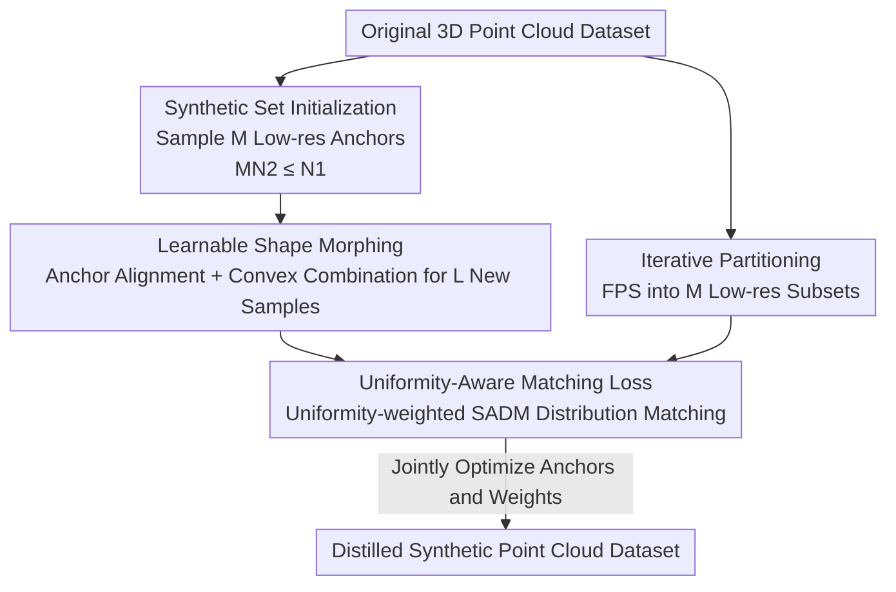

# Parameterization-Based Dataset Distillation of 3D Point Clouds through Learnable Shape Morphing

**Conference**: ICLR 2026  
**OpenReview**: [https://openreview.net/forum?id=Qe7dKZOtWM](https://openreview.net/forum?id=Qe7dKZOtWM)  
**Code**: https://github.com/yimjae0/3DDP  
**Area**: 3D Vision  
**Keywords**: Dataset Distillation, 3D Point Clouds, Parameterization, Shape Morphing, Distribution Matching

## TL;DR
This paper introduces the concept of "Distilled Dataset Parameterization" (DDP) to 3D point cloud distillation for the first time. By representing the synthetic set as a convex combination of low-resolution anchors with learnable weights via shape morphing, the method generates a larger and more diverse set of synthetic samples within the same storage budget. Combined with a uniformity-aware matching loss, it significantly outperforms existing distillation methods across five standard 3D benchmarks.

## Background & Motivation
**Background**: Dataset Distillation (DD) compresses large-scale training sets into a small number of synthetic samples, allowing models trained on the synthetic set to approximate the performance of those trained on the original data, thereby saving memory and computation. In the image domain, Distilled Dataset Parameterization (DDP) has emerged as a storage-efficient paradigm, using compact formats like downsampling, frequency-domain cropping, or neural fields to fit more diverse samples into a fixed budget.

**Limitations of Prior Work**: While DDP is effective for images, it is virtually unexplored for 3D point clouds. Point clouds are unordered and irregular sets, lacking the structured grid of images, which prevents the direct application of "spatial redundancy reduction" or "high-frequency component removal." Existing 3D distillation works (e.g., PCC using gradient matching, SADM using distribution matching) follow traditional DD settings, optimizing only one **full-resolution** synthetic sample per class, which limits diversity.

**Key Challenge**: Under a fixed storage budget, there is a trade-off between "high resolution for single samples" and "diversity across multiple samples." Traditional methods spend the entire budget on one full-resolution sample, leading to low sample counts, while the unordered nature of point clouds makes standard parameterization difficult.

**Goal**: Without exceeding the original memory budget: (1) increase the number of synthetic samples, (2) improve geometric diversity, and (3) address the matching bias caused by resolution inconsistency between synthetic and original samples.

**Key Insight**: The authors draw inspiration from 3D shape morphing, where convex combinations of aligned shapes interpolate new shapes. By using "a few low-resolution anchors + learnable mixing weights" as the parameterized representation, a large number of new samples can be generated with near-zero additional storage overhead.

**Core Idea**: Replace "one full-resolution sample" with "M low-resolution anchors + L groups of learnable convex combination weights." This exchanges the saved resolution space for more diverse samples and uses a uniformity-aware loss to compensate for resolution mismatch.

## Method

### Overall Architecture
The objective is to distill a superior 3D point cloud synthetic set under the same storage budget. The architecture consists of two collaborative tracks: **Adaptive Shape Morphing** generates diverse synthetic samples within the budget, and **Uniformity-Aware Matching** ensures fair distribution alignment between low-resolution synthetic samples and high-resolution original samples.

The workflow begins by sampling $M$ low-resolution anchors ($N_2$ points each) from the original set such that $MN_2 \le N_1$ (the original resolution), forming the initial synthetic set $D_{init}$. Points across anchors are aligned via KNN and linear assignment. Learnable weights are then used to perform convex combinations of these aligned anchors to interpolate $L$ new samples, which, combined with the anchors, form the full synthetic set $D_s$. Simultaneously, original samples are partitioned into $M$ non-overlapping low-resolution subsets using iterative Farthest Point Sampling (FPS). These subsets are weighted by a uniformity score to calculate the SADM distribution matching loss against the synthetic set. Finally, the anchors and mixing weights are jointly optimized.

### Key Designs

**1. Anchor Parameterization: Replacing Single Full-res Samples with Multiple Low-res Anchors**

Traditional DD fixes the storage budget on one synthetic sample of $N_1$ points, locking the sample count and limiting diversity. This work splits the budget for each class into $M$ distinct **anchors** with $N_2$ points each. The initial synthetic set is $D_{init}=\{\{a_{i,m}\}_{m=1}^{M}\}_{i=1}^{S}$, where $a_{i,m}\in\mathbb{R}^{N_2\times3}$. As long as $MN_2\le N_1$, these anchors consume no more memory than a single full-resolution sample but provide $M$ times more "seeds" for different shapes. This serves as the foundation for parameterization.

**2. Adaptive Shape Morphing: Learnable Convex Combinations**

To further increase diversity, anchors are "morphed" to create additional samples. Point-level alignment is performed within each group by aligning $M-1$ anchors to the first anchor $a_{i,1}$ using linear assignment on the Euclidean distance matrix. The $l$-th new sample is generated via a convex combination of aligned anchors $\tilde a_{i,m}$:

$$b_i^l=\sum_{m=1}^{M} w_{i,m}^l\cdot\tilde a_{i,m},\quad \sum_{m=1}^{M}w_{i,m}^l=1,\ w_{i,m}^l\ge0.$$

The weight vector $w_i^l$ is **learnable**. Since point cloud rotations make perfect alignment impossible, fixed average weights would produce noisy samples. Adaptive weights compensate for these misalignments, resulting in structurally consistent yet distinct new shapes. This step requires **negligible extra storage**, adding only $32L(M-1)KC$ bits for weights.

**3. Uniformity-Aware Matching Loss: Compensating for Resolution and Distribution Mismatch**

Synthetic samples are low-resolution ($N_2$), while original samples are full-resolution ($N_1$). The SADM distribution matching loss $L_{SADM}=\tilde K_{D_o,D_o}+\tilde K_{D_s,D_s}-2\tilde K_{D_o,D_s}$ assumes consistent resolution. To address this, original samples are partitioned into $M$ non-overlapping $N_2$-point subsets $C_1,\dots,C_M$ via iterative FPS. To handle potential distribution artifacts from FPS, a **uniformity score** $\nu(D)$ is introduced based on the Coefficient of Variation (CV) of distances to $k$-nearest neighbors:

$$\nu(D)=\frac{1}{N(D)\cdot O}\sum_{i=1}^{O}\sum_{j=1}^{N(D)}\frac{\sigma_j^i}{\mu_j^i+\epsilon},$$

A penalty coefficient $\eta_m=\exp(-\lambda(\nu(D_o)-\nu(C_m))^2)$ is assigned to each subset $C_m$. Subsets whose uniformity deviates significantly from the original set are downweighted. The final loss is:

$$L_{Distill}(D_o,D_s)=\sum_{m=1}^{M}\eta_m\cdot L_{SADM}(C_m,D_s).$$

### Loss & Training
The objective is to jointly optimize initial anchors and weights: $\{D_{init}^{*},W^{*}\}=\arg\min_{\{D_{init},W\}}L_{Distill}(D_o,D_s)$. Storage constraints are maintained as $96MN_2KC+32L(M-1)KC\le96N_1KC$. $D_{init}$ and $W$ are optimized using SGD with a learning rate of 10 for 2,000 steps. Evaluation involves training for 500 epochs with a batch size of 8 and step decay. Typical hyperparameters for ModelNet10: $N_2=252, M=4, L=16$.

## Key Experimental Results

### Main Results
Evaluated using PointNet on five benchmarks under identical memory budgets, Ours outperforms coreset selection and existing distillation methods across all settings, especially at PPC=1 (Points Per Class equivalent):

| Dataset | PPC | DM | PCC | SADM | Ours | Whole |
|--------|-----|------|------|------|------|-------|
| ModelNet10 | 1 | 25.8 | 33.0 | 35.9 | **87.7** | 92.18 |
| ModelNet40 | 1 | 31.1 | 55.3 | 54.8 | **73.2** | 88.78 |
| ShapeNet | 1 | 26.3 | 50.9 | 51.1 | **60.5** | 82.49 |
| ScanObjectNN | 1 | 13.7 | 16.0 | 17.6 | **32.6** | 63.43 |
| OmniObject3D | 1 | 15.1 | 35.8 | 33.2 | **41.9** | 74.98 |

In the cross-architecture generalization test (PPC=1), Ours improves SADM performance on ModelNet10 for PointMamba from 28.4% to 69.4%. For part segmentation (ShapeNetPart, PPC=1), the mean IoU increases from 40.6% to 56.4%.

### Ablation Study

| Configuration | Metric (ScanObjectNN, PPC=1) | Description |
|------|------|------|
| Static Morphing (L=16) | 31.7 | Average weight interpolation; contains more structural noise |
| Adaptive Morphing (L=16) | **35.1** | Learnable weights compensate for alignment errors |
| w/o Uniformity Penalty $\eta$ | 30.7 | Standard distribution matching |
| w/ Uniformity Penalty $\eta$ | **32.6** | Final proposed loss |

### Key Findings
- **Learnable weights are critical**: Adaptive weights consistently outperform static ones (e.g., 35.1 vs 31.7 at L=16), as they allow the model to refine interpolated shapes despite imperfect point alignment.
- **Uniformity penalty $\eta$ shines in noisy/large-scale scenarios**: Gains are consistent on ScanObjectNN and higher PPC settings in ModelNet10, where distribution reliability varies more.
- **Anchor resolution $N_2$ depends on backbone**: PointNet manages well with low $N_2$ due to global feature focus, while PointNet++ requires $N_2 \approx 256$ to preserve local structures.
- **PPC=1 benefits most**: The performance jump is highest under extreme compression, suggesting that diversity from multiple anchors is most valuable when total point count is limited.

## Highlights & Insights
- **Parameterization as "diversity exchange"**: By making the storage format compact (anchors + weights), the method converts resolution redundancy into sample count and geometric diversity.
- **Efficient Morphing**: New samples do not store coordinates; they reuse existing anchors via minimal weight storage ($M-1$ dimensions due to the convex sum constraint).
- **Reusable Uniformity Scoring**: The CV of local $k$-NN distances is a robust metric for spatial uniformity that can be applied to other low-res vs. high-res matching tasks.

## Limitations & Future Work
- **Dependency on Base Loss**: The method relies on the SADM distribution matching loss; performance is somewhat tied to the quality of this underlying loss (e.g., weaker gains on ScanObjectNN with PointNet++).
- **Alignment Bottleneck**: Linear assignment for anchor alignment is not perfect for samples with large rotations or deformations.
- **Task Scope**: Evaluation is limited to classification and part segmentation; extension to 3D detection or registration remains future work.

## Related Work & Insights
- **vs SADM**: This work uses SADM as a base but replaces the "one full-res sample" setup with parameterized diverse anchors and adds uniformity-aware weighting.
- **vs Image DDP**: Unlike IDC (downsampling) or FreD (frequency), which require grids, this method proposes anchors and morphing as a point-cloud-specific DDP solution.

## Rating
- Novelty: ⭐⭐⭐⭐⭐ 
- Experimental Thoroughness: ⭐⭐⭐⭐⭐ 
- Writing Quality: ⭐⭐⭐⭐ 
- Value: ⭐⭐⭐⭐⭐ 

<!-- RELATED:START -->

## Related Papers

- [\[CVPR 2026\] PaNDaS: Learnable Shape Interpolation Modeling with Localized Control](../../CVPR2026/3d_vision/pandas_learnable_shape_interpolation_modeling_with_localized_control.md)
- [\[ICLR 2026\] Interp3D: Correspondence-aware Interpolation for Generative Textured 3D Morphing](interp3d_correspondence-aware_interpolation_for_generative_textured_3d_morphing.md)
- [\[ICLR 2026\] Point-MoE: Large-Scale Multi-Dataset Training with Mixture-of-Experts for 3D Semantic Segmentation](point-moe_large-scale_multi-dataset_training_with_mixture-of-experts_for_3d_sema.md)
- [\[CVPR 2026\] Wave-Former: Through-Occlusion 3D Reconstruction via Wireless Shape Completion](../../CVPR2026/3d_vision/wave-former_through-occlusion_3d_reconstruction_via_wireless_shape_completion.md)
- [\[AAAI 2026\] TOSC: Task-Oriented Shape Completion for Open-World Dexterous Grasp Generation from Partial Point Clouds](../../AAAI2026/3d_vision/tosc_task-oriented_shape_completion_for_open-world_dexterous_grasp_generation_fr.md)

<!-- RELATED:END -->
