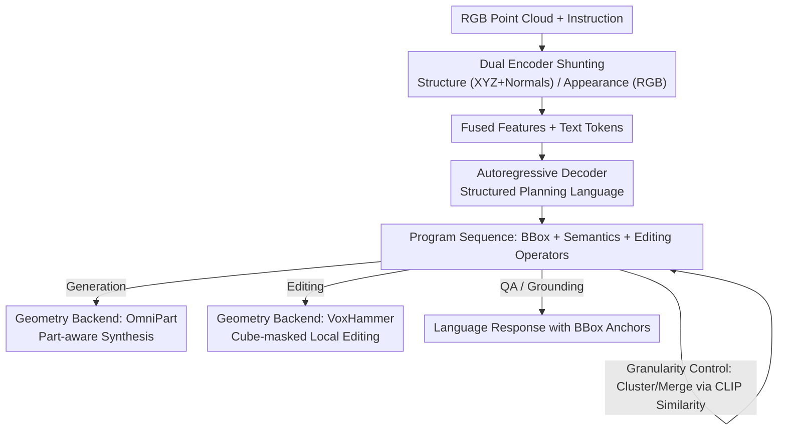

# Part-X-MLLM: Part-aware 3D Multimodal Large Language Model

**Conference**: ICLR 2026  
**OpenReview**: [https://openreview.net/forum?id=WffiETiSeU](https://openreview.net/forum?id=WffiETiSeU)  
**Project Page**: [https://chunshi.wang/Part-X-MLLM/](https://chunshi.wang/Part-X-MLLM/)  
**Code**: To be confirmed  
**Area**: 3D Vision / Multimodal VLM  
**Keywords**: 3D MLLM, Part-level understanding, Structured planning language, Dual encoder, Part generation and editing

## TL;DR
Part-X-MLLM is a native 3D, part-aware multimodal large model that unifies heterogeneous 3D tasks—such as generation, editing, and QA—into "writing programs with a part-based grammar." Given an RGB point cloud and natural language, it autoregressively outputs a token sequence encoding part bounding boxes, semantic descriptions, and editing instructions. This sequence is then executed by off-the-shelf geometry engines, driving diverse 3D asset operations via a language-native frontend and achieving SOTA on 11 task types.

## Background & Motivation
**Background**: Current 3D generation and understanding methods are largely divided into two camps. One consists of scene-level 3D MLLMs (e.g., PointLLM, 3D-LLM, ShapeLLM) that align point clouds with language for captioning and QA. The other consists of geometry-oriented generative models (e.g., TRELLIS, Hunyuan3D, ShapeLLM-Omni) that synthesize high-fidelity assets using structured 3D latents or discrete tokens. Part-level generation either lifts 2D segmentation to 3D (e.g., Part123, SAMPart3D, HoloPart) or generates parts directly in 3D (e.g., AutoPartGen, BANG, OmniPart).

**Limitations of Prior Work**: None of these systems can truly manipulate 3D objects "by part and by language." The authors define this fundamental flaw as **structural opaqueness**—models treat a 3D object as an indivisible geometric lump, preventing downstream applications from locating or operating on specific parts (e.g., "edit only the left leg of the chair"). Scene-level MLLMs lack persistent part identifiers and locatable references; geometry generators lack semantic addressability; and 3D editing methods are often "tool-side" rather than language-native frontends capable of reasoning about parts and issuing executable programs with spatial grounding.

**Key Challenge**: Real-world objects are assemblies of meaningful parts, but existing methods fail to decouple high-level language control from low-level geometric synthesis. There is a lack of a single model that can simultaneously: (i) understand and name parts, (ii) anchor references to persistent bounding boxes, and (iii) compile executable add/delete/modify programs for geometry engines with controllable semantic granularity.

**Core Idea**: The authors reformulate 3D interaction as a **language modeling problem**. Tasks like generation, editing, and QA are unified under a "geometry-aware part grammar." The model translates user instructions and 3D visual inputs into a structured program (part bounding boxes + persistent references + semantic descriptions + editing operators). This discrete, language-native output serves as a universal control interface for any downstream geometry module.

## Method

### Overall Architecture
The core of Part-X-MLLM is the decoupling of "symbolic planning" from "geometric synthesis." The model understands 3D inputs and generates a programmatic token sequence (the plan), while high-fidelity geometric synthesis or editing is delegated to existing geometry engines. The pipeline is as follows: given an RGB point cloud and an instruction, a **dual encoder** extracts structural features and appearance features separately. These are fused with text tokens and fed into an **autoregressive decoder**. The decoder outputs a program (bounding boxes, semantic text, editing operators) according to a **structured planning language**. Finally, a **geometry execution backend** (e.g., OmniPart for generation, VoxHammer for editing) translates the plan into meshes, 3DGS, or NeRFs. Since the output program is model-agnostic, any compatible geometry engine can be driven by this token interface.

### Key Designs

**1. Structured Planning Language: Unifying Heterogeneous Tasks as "Programming"**
This is the central hub of the paper, directly addressing the pain point of disconnected interfaces for generation, editing, and QA. The authors designed a geometry-aware part grammar: special tokens like `<boxs>` / `<boxe>` wrap a bounding box (consisting of 6 quantized coordinate tokens representing $[x_{min}, y_{min}, z_{min}]$ and $[x_{max}, y_{max}, z_{max}]$, discretized into 128 bins); tokens like `<adds>`/`<dels>`/`<mods>` represent editing operators. The decoder's goal is always to "generate the correct token sequence to represent the plan." This unifies part-aware generation, grounded QA, and auto-localized editing into a single instruction-following problem. This representation offers three benefits: **stable and anchorable part identities** (tokens carry persistent references via BBox symbols across tasks); **controllable semantic granularity** (the same program can expose coarse labels or fine descriptions); and **separation of structure and semantics** (mitigating representation conflicts in the dual encoder).

**2. Dual Encoder Architecture: Decoupling Geometric Structure and Visual Appearance**
To solve the issue where a single encoder fails to balance geometry and color, the model uses two parallel paths. The **structure encoder** processes raw point cloud geometry (XYZ + surface normals) and outputs structural tokens. The **semantic encoder** processes only RGB color information and outputs appearance tokens. This allows the model to distinguish parts that are "structurally similar but visually distinct" (e.g., chair legs of the same shape but different colors). Ablation studies show that forcing a single encoder to handle both leads to conflicts, while decoupling them is more robust—improving IoU by $+7.06$ in pure geometry tasks (box listing) and boosting performance in language-intensive tasks like Part QA.

**3. Semantic Granularity Control: Automated Part Merging via Text Clustering**
Users often require different levels of detail, from coarse components to fine-grained parts. Instead of fixing the number of parts (like PartPacker) or manually merging masks (like OmniPart), this method uses the "box + text" representation. It performs post-processing clustering on bounding boxes based on the semantic similarity of their text descriptions (using CLIP embeddings). This allows fine-grained parts to be merged into coarser semantic groups automatically. For example, the number of parts can be adjusted from 22 down to 2 ($22 \rightarrow 18 \rightarrow 10 \rightarrow 6 \rightarrow 2$) without human intervention.

**4. Two-stage Curriculum Instruction Tuning: Embedding Geometry and Aligning LLMs**
Direct end-to-end training is difficult for LLMs to master both 3D geometry and program generation. The authors use a two-stage curriculum. **Stage 1: Pure Geometric BBox Pre-training**: The structure encoder is initialized with a Hunyuan 2.1 3D Shape VAE Encoder. Each sample is a fixed-size point cloud $(40960, 6)$ (XYZ + normals), downsampled 20x to a latent of length 2048. To embed "bounding box knowledge" into the encoder, a lightweight autoregressive decoder is trained to predict part-level BBoxes (without text) on 3.6 million objects over 10 epochs. After this, the structure encoder is retained, and the lightweight decoder is discarded. **Stage 2: Full Dual-Encoder Instruction Tuning**: A Qwen 2.5 VL model is introduced. An appearance (RGB) encoder (isomorphic to the structure encoder) processes point clouds of $(10240, 6)$ (XYZ + RGB). Task-specific tokens (`<boxs>`, `<adds>`, etc.) are added to the vocabulary. During training, the Stage 1 structure encoder and original Qwen word embeddings are **frozen**; only the semantic encoder, the Qwen decoder's AR transformer layers, and the new special token embeddings are trained. This efficiently aligns "geometry + appearance" dual-stream conditions with executable syntax while preserving LLM knowledge.

### Loss & Training
The objective is autoregressive next-token prediction—whether coordinate tokens, semantic descriptions, or operators. A part-centric dataset was constructed: 85,771 objects, averaging 23 parts each, with axis-aligned bounding boxes (AABB) and two levels of text (coarse labels Q1 / fine descriptions Q2). The data was converted into instruction-following samples using 11 task templates (Types 0–10), covering box listing, multi-part grounding, box-to-text captioning, part QA, and editing programs.

## Key Experimental Results

### Main Results
Evaluated on the self-built **UniPart-Bench** (400 held-out objects), focusing on the quality of the structured plan (BBox layout accuracy).

**Bounding Box Generation** (compared to PartField and OmniPart):

| Method | Voxel recall ↑ | Voxel IoU ↑ | BBox IoU ↑ |
|------|------|------|------|
| PartField | 69.65 | 46.04 | 37.33 |
| OmniPart | 72.32 | 47.62 | 39.78 |
| **Part-X-MLLM (Ours)** | **74.11** | **48.74** | **42.55** |

**Part Understanding & QA** (UniPart-Bench):

| Model | SBERT | SimCSE | BLEU-1 | ROUGE-L | METEOR |
|------|------|------|------|------|------|
| PointLLM-7B | 61.30 | 58.48 | 21.78 | 29.26 | 22.45 |
| ShapeLLM-13B | 61.19 | 57.26 | 23.32 | 32.56 | 24.45 |
| **Part-X-MLLM (Ours)** | **78.98** | **84.25** | **40.54** | **42.26** | **34.24** |

Part-X-MLLM significantly outperforms the strongest baselines in QA metrics (e.g., $+17.7$ SBERT, $+17.2$ BLEU-1). Significant gains are also observed in object-level captioning ($+18.3$ BLEU-1, $+19.1$ ROUGE-L).

### Ablation Study
Dual Encoder vs. Single Encoder (Single Encoder fuses XYZ and RGB into one point cloud):

| Task | Config | IoU ↑ | SBERT ↑ | BLEU-1 ↑ |
|------|------|------|------|------|
| Pure Box Listing | Dual (Ours) | 75.53 | - | - |
| Pure Box Listing | Single | 68.47 | - | - |
| Multi-Part Grounding | Dual (Ours) | 72.82 | 55.60 | 35.55 |
| Multi-Part Grounding | Single | 69.78 | 54.18 | 33.95 |

### Key Findings
- The dual encoder provides the largest IoU boost ($+7.06$) in pure geometry tasks, confirming that mixing geometry and semantics in one encoder causes representation interference.
- Unifying tasks into a "structured program" leads to substantial improvements in QA metrics, suggesting that the box grammar enhances part-level grounding and reasoning.
- Semantic granularity control enables automatic part merging from level 22 to 2, a unique capability for adjusting detail levels continuously.

## Highlights & Insights
- **3D Interaction as Language Modeling**: Unifying generation, editing, and QA into a "part grammar" is a powerful paradigm. Decoupling high-level symbolic planning from low-level synthesis allows geometry engines to be hot-swappable.
- **Persistent BBox Tokens as Auditable Identity**: Using bounding box symbols to carry persistent references across steps provides stable anchors for multi-turn editing and reasoning, a concept applicable to embodied agents.
- **Dual Encoder Decoupling**: Providing empirical evidence that a single encoder suffers from representation conflicts gives a clear design guideline for 3D backbones: structure and appearance should be processed separately.
- **Granularity Control via Semantic Clustering**: Clustering bounding boxes based on CLIP text similarity rather than geometry is a lightweight yet effective trick to achieve variable levels of detail.

## Limitations & Future Work
- The model itself does not perform geometric synthesis; high-fidelity results depend entirely on the external backends (OmniPart/VoxHammer).
- Evaluation is primarily on the internal UniPart-Bench (400 objects), which is relatively small. Comparison against more standard benchmarks is needed.
- $128$-bin coordinate quantization could introduce errors for precision editing tasks.
- Reliability of semantic clustering depends on the quality of CLIP embeddings and text descriptions.
- Robustness to real-world scanning noise and occlusions remains to be fully explored.

## Related Work & Insights
- **vs. Scene-level 3D MLLMs**: These treat objects as wholes. Part-X-MLLM introduces native part grammar and persistent BBox anchors for executable outputs.
- **vs. Geometry Generators**: These have weak semantic addressability. Part-X-MLLM provides the language-native control interface to drive them.
- **vs. Part Generation**: Unlike OmniPart, which requires manual mask merging, Part-X-MLLM unifies understanding, generation, and editing with automated granularity control.

## Rating
- Novelty: ⭐⭐⭐⭐⭐ Unifying tasks into "part-aware programming" is a clean and universal paradigm.
- Experimental Thoroughness: ⭐⭐⭐⭐ Solid ablations, but the benchmark is relatively small and self-built.
- Writing Quality: ⭐⭐⭐⭐⭐ Clear motivation regarding "structural opaqueness" and well-defined architecture.
- Value: ⭐⭐⭐⭐⭐ A model-agnostic control interface for part-level 3D intelligence has strong potential.

<!-- RELATED:START -->

## Related Papers

- [\[ICLR 2026\] PartSAM: A Scalable Promptable Part Segmentation Model Trained on Native 3D Data](partsam_a_scalable_promptable_part_segmentation_model_trained_on_native_3d_data.md)
- [\[ICLR 2026\] HoloPart: Generative 3D Part Amodal Segmentation](holopart_generative_3d_part_amodal_segmentation.md)
- [\[CVPR 2026\] Part$^{2}$GS: Part-aware Modeling of Articulated Objects using 3D Gaussian Splatting](../../CVPR2026/3d_vision/part2gs_part-aware_modeling_of_articulated_objects_using_3d_gaussian_splatting.md)
- [\[CVPR 2026\] Learning Hierarchical Hyperbolic Mixture Model for Part-aware 3D Generation](../../CVPR2026/3d_vision/learning_hierarchical_hyperbolic_mixture_model_for_part-aware_3d_generation.md)
- [\[ICLR 2026\] FullPart: Generating Each 3D Part at Full Resolution](fullpart_generating_each_3d_part_at_full_resolution.md)

<!-- RELATED:END -->
