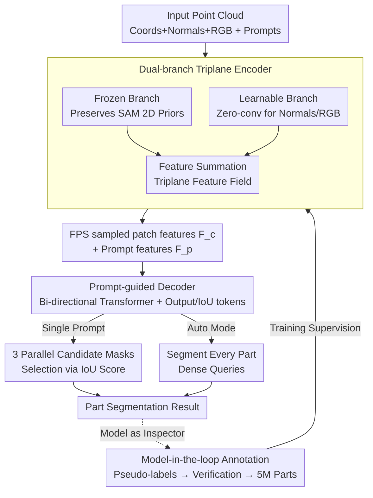

# PartSAM: A Scalable Promptable Part Segmentation Model Trained on Native 3D Data

**Conference**: ICLR 2026  
**arXiv**: [2509.21965](https://arxiv.org/abs/2509.21965)  
**Code**: [https://czvvd.github.io/PartSAMPage/](https://czvvd.github.io/PartSAMPage/)  
**Area**: 3D Vision  
**Keywords**: 3D part segmentation, SAM, prompt-based, native 3D data, open-world

## TL;DR
The study proposes PartSAM, the first promptable part segmentation model trained on large-scale native 3D data. It employs a dual-branch triplane encoder (combining a frozen SAM prior with a learnable 3D branch) and a SAM-style decoder. Through a model-in-the-loop annotation pipeline, the authors constructed over 5 million shape-part pairs, achieving performance that outperforms Point-SAM by over 90% in single-click IoU under open-world settings.

## Background & Motivation

**Background**: 3D part segmentation is a classical computer vision problem. Early methods were trained on closed-set datasets like ShapeNet-Part or PartNet, failing to generalize to the open world. Recent works (e.g., SAMPart3D, PartField) utilize 2D priors from SAM for multi-view lifting.

**Limitations of Prior Work**: (1) 2D→3D lifting loses internal structural information, limiting understanding to surfaces; (2) clustering-based methods (PartField) lack interactive controllability; (3) training data bottleneck—lack of large-scale 3D part annotations; (4) high dependence on mesh connectivity, leading to performance collapse on AI-generated shapes.

**Key Challenge**: How to train a model that provides flexible interaction and internal 3D structural understanding despite the lack of large-scale 3D part annotations?

**Goal**: Construct a large-scale native 3D part dataset (5 million+ pairs) and design a novel architecture that simultaneously leverages 2D priors and 3D knowledge for SAM-style interaction and automatic segmentation.

**Key Insight**: A dual-channel design where a frozen SAM channel preserves 2D knowledge while a learnable channel adapts to native 3D annotations.

**Core Idea**: Utilize a dual-branch triplane encoder with a SAM decoder trained on millions of native 3D part samples to achieve promptable part segmentation that truly understands internal 3D structures for the first time.

## Method

### Overall Architecture
PartSAM migrates the "click-to-segment" interaction paradigm directly to native 3D, avoiding the limitations of multi-view 2D lifting. The pipeline takes an input point cloud $P_{in} \in \mathbb{R}^{N \times 9}$ (coordinates, normals, and RGB) and prompt points $P_{prompt}$. A dual-branch triplane encoder first encodes the point cloud into a dense triplane feature field. Patch embeddings $F_c$ are sampled at the prompt locations. The decoder then processes $F_c$ and prompt embeddings $F_p$ via a bi-directional Transformer to generate segmentation masks. The model supports both interactive mode (point-by-point clicking and iterative refinement) and automatic mode (Segment Every Part via dense query sampling). This is enabled by a model-in-the-loop annotation process that generated over 5 million shape-part pairs for supervision.

### Key Designs

**1. Dual-branch Triplane Encoder: Balancing 2D Priors and Native 3D Supervision**

Training an encoder from scratch on 3D part data risks losing the boundary priors learned by SAM/PartField on massive 2D datasets. Conversely, using only frozen 2D priors cannot adapt to the internal structural signals in native 3D annotations. PartSAM resolves this with two parallel branches: both utilize PVCNN+Transformer to build triplane feature fields. The frozen branch retains contrastive learning features from PartField to preserve 2D boundary knowledge. The learnable branch introduces normals and RGB inputs via zero-convolutions (zero-conv) and is trained on native 3D labels. Zero-convolutions ensure the learnable branch does not perturb existing priors at the start of training. Features are summed to combine "where the boundaries are" (frozen branch) with "how to segment 3D interiors" (learnable branch).

**2. SAM-inspired Prompt-guided Decoder: Handling Ambiguity via Parallel Candidates**

A single click is inherently ambiguous—a click on a car door could refer to the door, the whole side, or the handle. PartSAM adopts the SAM approach by introducing output tokens $T_{out}$ and IoU tokens $T_{iou}$ in the decoder. These perform bi-directional cross-attention with prompts and features:

$$F_c' = \text{CrossAttn}\big(F_c \leftrightarrow [F_p; T_{out}; T_{iou}]\big)$$

Feature tokens and prompt/output tokens are updated iteratively. For a single prompt, the model predicts 3 candidate masks at different granularities. The IoU token predicts the quality of each candidate, automatically selecting the optimal one. This minimizes the need for iterative clicking to reach the desired granularity.

**3. Model-in-the-loop Data Annotation: Bootstrapping 5 Million Parts**

The main bottleneck for 3D part segmentation is the lack of large-scale high-quality labels. PartSAM employs a two-stage model-in-the-loop process to "bootstrap" training data from fragmented assets like Objaverse:
1. **Seed Extraction**: Extract natural parts from scene graphs or connected components, yielding ~180k shapes and 22M parts.
2. **Interactive Verification**: PartSAM serves as its own quality inspector. PartField generates candidate pseudo-labels ($K=10/20/30$ clustering). PartSAM then performs 10 rounds of interactive verification on each candidate. Parts are accepted if: $\text{IoU@1}>60\%$ (accurate segmentation with one click) or $\text{IoU@10}>90\%$ (refinable via interaction). This filtering expanded the dataset to 500k shapes and 55M parts, creating a positive feedback loop.

### Loss & Training
$$\mathcal{L} = \mathcal{L}_{focal} + \alpha \mathcal{L}_{dice} + \mathcal{L}_{IoU} + \lambda \mathcal{L}_{triplet}$$

Where focal and dice losses supervise mask quality, $\mathcal{L}_{IoU}$ trains the IoU token for candidate selection, and $\mathcal{L}_{triplet}$ constrains the triplane features' contrastive structure to align with SAM priors.

## Key Experimental Results

### Main Results (Interactive Segmentation)

| Dataset | Method | IoU@1 | IoU@5 | IoU@10 |
|--------|------|-------|-------|--------|
| PartObjaverse-Tiny | Point-SAM | 29.4 | 68.7 | 73.9 |
| | **PartSAM** | **56.1** | **84.1** | **87.6** |
| PartNetE | Point-SAM | 35.9 | 75.1 | 79.2 |
| | **PartSAM** | **59.5** | **86.5** | **89.9** |

### Main Results (Automatic Segmentation)

| Method | PartObjaverse-Tiny | PartNetE |
|------|-------------------|----------|
| PartField | 51.5 | 59.1 |
| **PartSAM** | **69.5** | **72.4** |

### Key Findings
- **91% Increase in IoU@1**: Achieves accurate segmentation with a single click, whereas Point-SAM relies heavily on iterative refinement.
- **Internal Structure Understanding**: Capable of segmenting occluded items inside bags or seats inside cars, which SAMesh fails to handle.
- **Generalization to AI-generated Shapes**: Maintains strong performance on irregular meshes generated by models like Hunyuan3D.

## Highlights & Insights
- **Paradigm Shift**: Moves from "2D lift → clustering" to "native 3D + interactive decoding," enabling true understanding of internal 3D structures.
- **Bootstrapping Labels**: Solves the chicken-and-egg problem of data via a two-layer filter (Pseudo-labels + PartSAM verification).
- **Elegant Dual-branch Design**: Effectively merges 2D boundary priors with coarse 3D signals through simple summation and zero-convolutions.

## Limitations & Future Work
- Interactive inference cost is higher than pure clustering methods.
- The 500k shape dataset is still small compared to the billion-scale datasets used for 2D foundation models.
- Performance drops on extremely small parts (button-level) due to point sampling resolution limits.

## Related Work & Insights
- **vs PartField**: Clustering-based post-processing is a bottleneck; promptable decoding bypasses this and does not depend on mesh connectivity.
- **vs Point-SAM**: Represents a leap in scale (5x data) and architectural capacity (dual-branch encoding).
- **Insight**: 3D foundation models require massive, truly native 3D data for structural understanding.

## Rating
- Novelty: ⭐⭐⭐⭐⭐ First native 3D-trained promptable part segmentation model.
- Experimental Thoroughness: ⭐⭐⭐⭐ Extensive benchmarking across multiple baselines.
- Writing Quality: ⭐⭐⭐⭐⭐ Systematic methodology and excellent visualization.
- Value: ⭐⭐⭐⭐⭐ Establishes a new direction for "3D SAM."

<!-- RELATED:START -->

## Related Papers

- [\[ICLR 2026\] Part-X-MLLM: Part-aware 3D Multimodal Large Language Model](part-x-mllm_part-aware_3d_multimodal_large_language_model.md)
- [\[ICLR 2026\] HoloPart: Generative 3D Part Amodal Segmentation](holopart_generative_3d_part_amodal_segmentation.md)
- [\[ECCV 2024\] 3×2: 3D Object Part Segmentation by 2D Semantic Correspondences](../../ECCV2024/3d_vision/3x2_3d_object_part_segmentation_by_2d_semantic_correspondenc.md)
- [\[ICLR 2026\] GeoPurify: A Data-Efficient Geometric Distillation Framework for Open-Vocabulary 3D Segmentation](geopurify_a_data-efficient_geometric_distillation_framework_for_open-vocabulary_.md)
- [\[CVPR 2026\] GeoSAM2: Unleashing the Power of SAM2 for 3D Part Segmentation](../../CVPR2026/3d_vision/geosam2_unleashing_the_power_of_sam2_for_3d_part_segmentation.md)

<!-- RELATED:END -->
