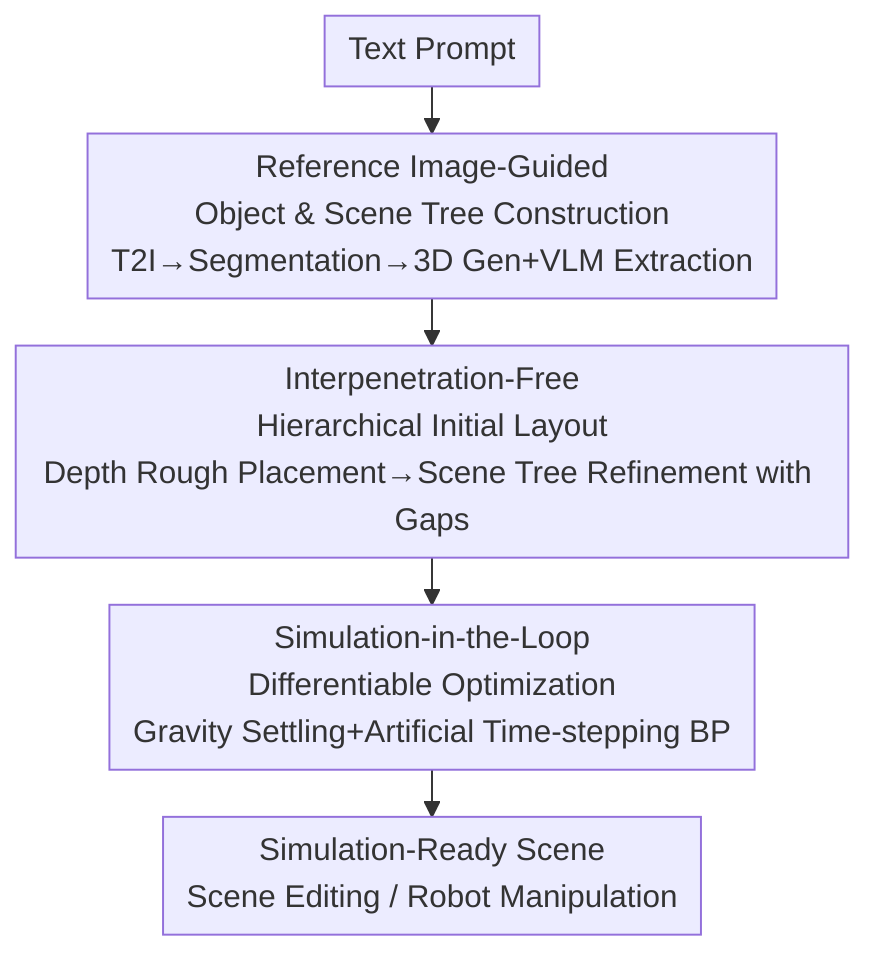

# PAT3D: Physics-Augmented Text-to-3D Scene Generation

**Conference**: ICLR 2026  
**OpenReview**: [https://openreview.net/forum?id=iIRxFkeCuY](https://openreview.net/forum?id=iIRxFkeCuY)  
**Code**: https://github.com/Simulation-Intelligence/PAT3D  
**Area**: 3D Vision  
**Keywords**: Text-to-3D scene generation, physical simulation, differentiable rigid-body simulation, scene tree, layout optimization

## TL;DR
PAT3D integrates vision-language model (VLM) reasoning and differentiable rigid-body contact simulation into the text-to-3D scene generation pipeline. By extracting support dependencies from a reference image to build a scene tree and generating an interpenetration-free initial layout, the method utilizes "simulation-in-the-loop" differentiable optimization. This allows the scene to converge under gravity to a static equilibrium that is stable, non-interpenetrating, and semantically aligned, making it the first "simulation-ready" scene generation method suitable for editing and robotic manipulation.

## Background & Motivation
**Background**: Diffusion and autoregressive models have advanced text-to-3D generation to the point of synthesizing high-quality geometry and appearance. Recent works (such as GraphDreamer, MIDI, and Blender-MCP) have begun using LLM/VLM reasoning for spatial relationships to compose multiple objects into scenes.

**Limitations of Prior Work**: Almost all existing methods treat "layout" as a pure geometric problem—either ignoring physical reasoning entirely or using simple heuristics (like bounding box non-overlap) to avoid interpenetration. Consequently, generated scenes often suffer from floating objects, unstable stacking, or incorrect support relationships, causing them to collapse when placed in a simulator, which renders them unusable for downstream tasks requiring interaction or real-world correspondence.

**Key Challenge**: Making a scene "physically plausible" requires integrating physical simulation into the generation process. However, simulation imposes three conflicting constraints: ① objects must be separate meshes (multi-body interaction cannot be simulated with a single mesh); ② simulation requires a "well-posed" initial configuration, typically free of interpenetration to prevent numerical instability; ③ even if a physically plausible result is achieved, the existence of infinite static equilibrium solutions means the final scene might deviate from the intended text semantics.

**Goal**: To ensure that generated scenes concurrently satisfy physical stability, non-interpenetration, and semantic consistency while maintaining object-level meshes and interpenetration-free initialization.

**Key Insight**: Support dependencies along the direction of gravity are crucial for organizing scenes. By first clarifying who supports whom (a scene tree), both interpenetration-free initialization and subsequent optimization can be structured around this tree, while the simulation naturally closes small gaps left during initialization.

**Core Idea**: A three-stage pipeline consisting of "VLM support dependency extraction → Scene tree-driven interpenetration-free initialization → Differentiable simulation-in-the-loop optimization" to explicitly incorporate physical constraints into text-to-3D scene generation.

## Method

### Overall Architecture
PAT3D takes a text prompt as input and outputs a simulation-ready, non-interpenetrating, and semantically consistent 3D scene. The pipeline operates in three sequential stages. First, a text-to-image model generates a reference image to anchor spatial relationships; then, vision foundation models generate independent objects while a VLM organizes pairwise support relationships into a "scene tree." Second, objects are coarsely placed based on monocular depth priors and refined into an interpenetration-free initial configuration along the scene tree (intentionally leaving small gaps along the gravity axis). Third, forward simulation allows objects to settle under gravity, while "simulation-in-the-loop" differentiable optimization fine-tunes the initial layout to a static equilibrium that is both physically stable and semantically consistent.

### Key Designs

**1. Reference Image-Guided Object & Scene Tree Construction: Explicitly extracting spatial relations into a support dependency tree**

Directly producing objects and layouts simultaneously from text-to-3D models or LLMs often fails to capture complex spatial relationships. The authors use a text-to-image reference as an intermediary. Specifically, a VLM identifies object categories from the reference image, Grounded-SAM segments them, and the VLM generates detailed descriptions (semantics, material, color, orientation) for each region to feed into a text-to-3D pipeline (Hunyuan3D) for high-quality textured mesh generation—this per-object generation yields higher quality than MIDI's whole-scene approach. Crucially, for each pair of objects with similar horizontal positions and adjacent vertical positions, the VLM infers dependency relations (e.g., *on*, *contain*, *support*). These are organized into a hierarchical scene tree rooted at the ground, where nodes are inserted recursively based on physical dependencies. This tree encodes "who supports whom under gravity," guiding the subsequent stages.

**2. Interpenetration-Free Hierarchical Initial Layout: Positioning via depth priors and eliminating interpenetration via scene tree gaps**

Simulation requires an initial configuration that is interpenetration-free and semantically reasonable. The process starts with a "preliminary layout" where the 2D reference image is back-projected using depth estimation to get 3D point clouds, calculating translation and scale by aligning object centers. Since occlusion makes direct scale estimation difficult, a VLM identifies the least-occluded object as an anchor for global scaling, then inpaints occluded regions to estimate relative scales from bounding boxes. The second step, "hierarchical refinement," performs a BFS traversal of the scene tree. For each node, it enforces "parent-child constraints" (child projection must stay within the parent's projection) and "sibling constraints" (non-overlapping projections for objects with the same parent). Vertically, children are lifted above the parent's bounding box along the gravity axis. By intentionally leaving small gaps, interpenetration is easily eliminated while preserving inferred spatial relationships; these gaps are subsequently closed by gravity during simulation.

**3. Simulation-in-the-Loop Differentiable Optimization: Using artificial time-stepping for differentiable static equilibrium**

While simulation lets objects settle, complex interactions might cause the scene to deviate from text semantics (e.g., irregular blocks collapsing due to off-center mass). This is formulated as a constrained optimization: $\min_{q_0} L(q_{n+1}(q_0))\ \ \text{s.t.}\ f(q_{n+1})=0$, where $q_0$ is the initial configuration, $q_{n+1}$ is the final equilibrium, $f$ represents the net force, and $L$ measures semantic inconsistency. Semantic loss is defined on projected bounding boxes: for object $i$ in container $t$, the deviation is $l_i=d(p^i_{\min},\text{BBox}_t)^2+d(p^i_{\max},\text{BBox}_t)^2$ (where $d$ is Euclidean distance to the box boundary), with total loss $L=\sum_{i=1}^N l_i$. To compute gradients of $q_{n+1}$ with respect to $q_{n}$ through the non-linear solver, the authors adopt "artificial time-stepping," treating the quasi-static system as evolving through intermediate states and using implicit differentiation to backpropagate from $q_{n+1}$ to $q_0$. This enables a gradient link from "adjusting initial layout" to "final equilibrium state," a core technical contribution.

### Loss & Training
PAT3D does not train neural network weights; it optimizes the scene's initial layout variables $q_0$. The objective is the semantic inconsistency loss $L$ subject to the static force equilibrium constraint $f(q_{n+1})=0$. A local optimizer is used, employing implicit differentiation via the artificial time-stepping formula to obtain gradients.

## Key Experimental Results

### Main Results
The test set includes 18 text prompts (3 from MIDI, 2 from GraphDreamer, 13 new) emphasizing physical interactions. Comparisons are made against GraphDreamer, MIDI, and Blender-MCP using five metrics: CLIP and VQA Scores for semantics; Simulated Scene Displacement and Penetrating Triangle Pairs Ratio for physics; and Physical Plausibility Score for overall credibility.

| Method | CLIP↑ | VQA↑ | Displacement↓ | Penetration Ratio↓ | Physical Score↑ |
|------|-------|------|---------|---------|---------|
| GraphDreamer | 27.53 | 0.46 | 0.25 | 61.72 | 40.0 |
| Blender-MCP | 28.93 | 0.56 | 1.03 | 14.78 | 47.7 |
| MIDI | 29.68 | 0.63 | 0.69 | 110.80 | 62.7 |
| **PAT3D (Ours)** | **31.79** | 0.68 | **0** | **0** | **88.5** |

PAT3D leads across all metrics, achieving perfect scores in stability (zero displacement) and non-interpenetration (zero penetration ratio). While MIDI's VQA score (0.63) is close to the ours (0.68), its penetration ratio is extremely high (110.80), rendering the scene unusable upon simulation.

### Ablation Study

| Configuration | CLIP↑ | VQA↑ | Displacement↓ | Penetration Ratio↓ | Physical Score↑ | Description |
|------|-------|------|---------|---------|---------|------|
| Raw layout | 29.88 | 0.64 | 0.81 | 14.11 | 65.5 | Depth alignment only |
| Scene Init. | 30.77 | 0.70 | 2.91 | 0 | 34.2 | No penetration but unstable |
| Full (Ours) | 31.79 | 0.68 | 0 | 0 | 88.5 | Complete pipeline |

### Key Findings
- "Initialization" alone trades stability for non-interpenetration: Scene Init. reduces penetration to zero but increases displacement to 2.91, as the gaps left during initialization are inherently unstable. Its value lies in providing a well-posed, penetration-free starting point for differentiable optimization to resolve all metrics simultaneously.
- Semantic improvements (CLIP/VQA) are relatively smaller, likely because these metrics are more sensitive to geometry/texture than layout.
- Qualitative ablations show that depth-only layouts result in books intersecting or pens clipping through holders. Adding the scene tree ensures objects respect gravity-based dependencies, while the final optimization prevents irregular objects from collapsing.

## Highlights & Insights
- **Scene tree as a structural bridge**: Abstracting chaotic object relationships into a gravity-rooted tree allows complex initialization rules (projection containment, non-overlap) to be solved via simple traversal, avoiding complex global optimization.
- **The "deliberate gaps" strategy**: Directly solving for a non-interpenetrating, tightly-packed layout is hard. Leaving gaps makes non-interpenetration trivial, effectively outsourcing the "tight packing" problem to the physics engine's natural gravity simulation.
- **Artificial time-stepping for gradients**: Since $q_0$ is not explicitly in the equilibrium constraint, the quasi-static evolution with implicit differentiation provides the necessary gradient link. This technical core can be applied to other differentiable physics tasks.
- **Simulation-ready output**: Unlike purely geometric methods, PAT3D produces scenes that can be directly imported for editing (preserving equilibrium after additions/deletions) or robotic manipulation evaluation.

## Limitations & Future Work
- The current method only covers common physical dependencies; "suspension" relations (e.g., a swing on a tree) requiring specific attachment points may be misinterpreted.
- The use of local optimizers does not guarantee global semantic alignment in extremely crowded scenes (e.g., many toys on a sofa), where some objects might remain displaced.
- The test set is small and focused on tabletop-scale interactions. Generalization to large-scale indoor scenes, articulated objects, or non-gravity dependencies remains unverified.
- Dependency on VLM quality for relationship inference and occlusion inpainting means errors at the VLM stage propagate through the scene tree.

## Related Work & Insights
- **vs GraphDreamer**: Both use scene graphs, but GraphDreamer optimizes geometry and layout jointly via SDS, which is computationally expensive and struggles with spatial constraints. PAT3D's decoupled approach with explicit simulation yields far higher physical plausibility (88.5 vs 40.0).
- **vs MIDI**: MIDI generates the entire scene in one step, resulting in inferior object quality and severe interpenetration. PAT3D ensures quality via per-object generation and stability via simulation (0 vs 110.80 penetration ratio).
- **vs Blender-MCP**: Blender-MCP uses LLMs with graphics tools but lacks physical realism (floating or clipping objects). PAT3D explicitly models contacts and stability.
- **vs Single-object Physics Gen**: Unlike works focusing on single-body stability or dynamics, PAT3D is the first to extend differentiable simulation to multi-object scenes with complex spatial dependencies and contacts.

## Rating
- Novelty: ⭐⭐⭐⭐⭐ First to integrate differentiable rigid-body contact simulation into text-to-3D scene generation.
- Experimental Thoroughness: ⭐⭐⭐⭐ Strong improvements across all metrics, though the test set size and scene scale are limited.
- Writing Quality: ⭐⭐⭐⭐⭐ Clear explanation of the three-stage logic and technical derivations.
- Value: ⭐⭐⭐⭐⭐ High downstream utility for robotics and interactive environment generation.

<!-- RELATED:START -->

## Related Papers

- [\[AAAI 2026\] Open-World 3D Scene Graph Generation for Retrieval-Augmented Reasoning](../../AAAI2026/3d_vision/open-world_3d_scene_graph_generation_for_retrieval-augmented_reasoning.md)
- [\[ICLR 2026\] Augmented Radiance Field: A General Framework for Enhanced Gaussian Splatting](augmented_radiance_field_a_general_framework_for_enhanced_gaussian_splatting.md)
- [\[ICLR 2026\] One2Scene: Geometric Consistent Explorable 3D Scene Generation from a Single Image](one2scene_geometric_consistent_explorable_3d_scene_generation_from_a_single_imag.md)
- [\[NeurIPS 2025\] Gaussian-Augmented Physics Simulation and System Identification with Complex Colliders](../../NeurIPS2025/3d_vision/gaussian-augmented_physics_simulation_and_system_identification_with_complex_col.md)
- [\[CVPR 2026\] Text–Image Conditioned 3D Generation](../../CVPR2026/3d_vision/text-image_conditioned_3d_generation.md)

<!-- RELATED:END -->
