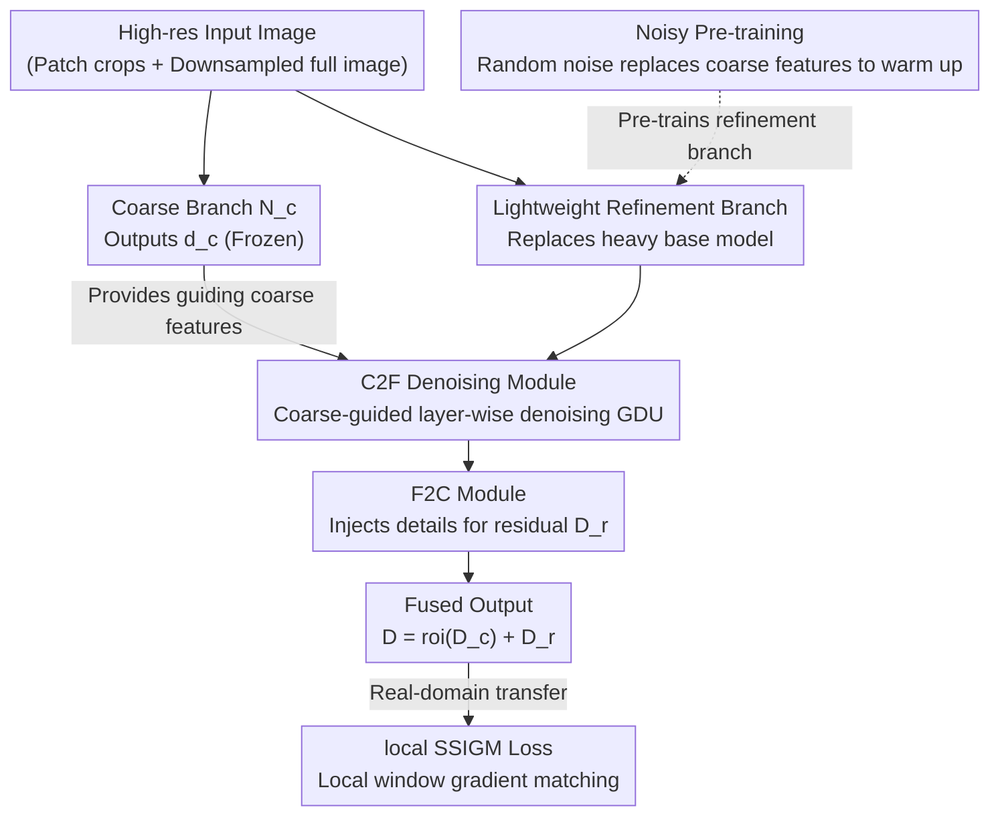

# PatchRefiner V2: Fast and Lightweight Real-Domain High-Resolution Metric Depth Estimation

**Conference**: ICLR 2026  
**OpenReview**: [https://openreview.net/forum?id=AAqeYdGdn2](https://openreview.net/forum?id=AAqeYdGdn2)  
**Code**: To be confirmed  
**Area**: 3D Vision / Monocular Depth Estimation  
**Keywords**: High-Resolution Depth Estimation, Metric Depth, Lightweight, Feature Denoising, Synthetic-to-Real Transfer

## TL;DR
PatchRefiner V2 replaces the "large and slow" refinement branch in the tile-based high-resolution metric depth framework with a lightweight encoder. It recovers the resulting accuracy loss through a Coarse-to-Fine denoising module + Noisy Pre-training, and enhances boundary quality using a local window gradient matching loss during the synthetic-to-real transfer stage—achieving higher accuracy than the previous SOTA on UnrealStereo4K with 9.2x fewer parameters and 10.7x faster inference.

## Background & Motivation
**Background**: Mainstream SOTA monocular depth estimation models (ZoeDepth, Depth Anything, Marigold, etc.) are built on heavy backbones and can only handle low-resolution inputs at the 0.3 megapixel level. To support 4K (2160×3840) native resolution, memory overhead would explode. To bypass this, recent high-resolution solutions (PatchFusion, PatchRefiner—denoted as PRV1 hereafter) adopt a tile-based strategy: the high-resolution image is cropped into several patches to predict detailed depth, which is then fused with the coarse depth of the downsampled full image to form a consistent high-resolution depth map.

**Limitations of Prior Work**: Frameworks like PRV1 use the **same heavy base depth model** for both the coarse and refinement branches. The issue is that the refinement branch must perform a forward pass for every patch; in default mode, a single high-resolution image requires at least 16 forward passes. A large base model leads to two fatal problems: (1) Single-image inference time exceeds 1 second; (2) Memory requirements are so high that end-to-end training is impossible—PRV1 is forced to use **sequential stage-wise training** for global and local branches, which is time-consuming and prone to local optima, leading to sub-optimal results.

**Key Challenge**: The refinement branch is the efficiency bottleneck (due to multiple passes), yet it must provide "depth-aligned" high-quality features. Continuing to use a heavy base model ensures feature quality but sacrifices speed and trainability; replacing it with a lightweight encoder solves speed and enables end-to-end training but makes features "noisy." Even with ImageNet initialization and end-to-end training, lightweight encoder features remain noisy and difficult to interpret (Fig. 2), making it impossible for the original Fine-to-Coarse (F2C) module to inject useful high-resolution information.

**Goal**: While maintaining the advantages of tile-based high-resolution estimation, replace the refinement branch with a lightweight encoder to increase speed, reduce parameters, and unlock end-to-end training, while recovering the feature quality and depth pre-training lost due to the model change.

**Core Idea**: Replace the heavy refinement branch with a "lightweight encoder + coarse feature-guided denoising (C2F) + Noisy Pre-training" trio, and strengthen boundaries during real-domain transfer using a local window gradient matching loss (local SSIGM)—addressing efficiency and accuracy through architectural and loss-based improvements, respectively.

## Method

### Overall Architecture
PRV2 follows the dual-branch tile-based skeleton of PRV1: the **coarse branch** $N_c$ processes the downsampled full image to output global coarse depth $D_c$, capturing overall scene structure and scale, and is frozen after training. The **refinement branch** outputs residual depth $D_r$ for each cropped patch, with the final patch depth being $D = \text{roi}(D_c) + D_r$. The core modification of PRV2 lies entirely in the refinement branch: the original heavy base model is replaced by MobileNetV4-Small / EfficientNet-B5 / ConvNeXt-Large (corresponding to PRV2M/E/C variants).

However, since lightweight encoder features are noisy, a **bidirectional fusion path** is constructed in the refinement branch: first, the new Coarse-to-Fine (C2F) module uses coarse branch features to denoise and enhance refinement features layer-by-layer; then, the original F2C module re-injects the denoised fine-grained information into the coarse depth for residual prediction. To enable this zero-initialized path to learn effectively, Noisy Pre-training (NP) is used to warm up the entire refinement branch. During the real-domain transfer stage, the pseudo-label supervision in the DSD loss is upgraded to local window gradient matching (local SSIGM).

### Key Designs

**1. Lightweight Refinement Branch: Removing the Efficiency Bottleneck**

The root cause of PRV1's slowness and training difficulty is the refinement branch's reuse of the heavy base depth model, which runs 16 times per image. The authors' solution is straightforward: since the coarse branch already provides a reliable base depth $D_c$, the refinement branch does not need another heavy model. It is replaced with lightweight encoders like MobileNetV4-Small, EfficientNet-B5, or ConvNeXt-Large. This change is immediate—taking PRV2M as an example, the extra parameters for the refinement branch drop from 369.0M in PRV1 to 47.0M, single-image refinement inference time drops from 1.45s to 0.32s, and memory usage is low enough to allow **joint end-to-end training** of coarse and refinement branches. The trade-off is reduced model capacity and loss of base-model depth-aligned features; the following designs address these issues.

**2. Coarse-to-Fine Module and Guided Denoising Unit: Using Coarse Features as "Gating" for Denoising**

Features from lightweight encoders are noisy and lack depth alignment (Fig. 2c), preventing F2C from injecting effective high-frequency information. The C2F idea is: since the coarse branch provides clean, depth-aligned global features, use them to **guide and select** truly useful details in the refinement branch. C2F mirrors F2C with a bottom-to-top $N$-layer structure, where each layer consists of a residual convolution unit and a Guided Denoising Unit (GDU). The GDU mechanism concatenates coarse features $f_c$ at the corresponding resolution with refinement shortcut features $f_s$, passes them through a convolution block and a sigmoid to obtain a weight map $M_w$ (values 0~1), and performs element-wise multiplication to suppress noise:

$$M_w = \sigma(\text{CB}(\text{Cat}(f_c, f_s))), \qquad f_d = M_w \otimes f_s$$

Here $f_d$ is the denoised feature. Essentially, $M_w$ acts as a spatial gating mask generated from coarse features, iteratively filtering depth-irrelevant noise while preserving high-frequency details. These features are then passed to F2C. Ablations show RMSE drops by 12.2% with C2F. Notably, if the GDU is removed and C2F degrades to standard bottom-to-top aggregation, gains diminish; if GDU is replaced with the F2C fusion module, performance falls back to baseline—the authors attribute this to coarse features dominating and suppressing high-frequency information.

**3. Noisy Pre-training: Learning Depth Features in Zero-Initialized Branches**

In PRV1, about 94% of refinement branch parameters come from the pre-trained base model, with only F2C trained from scratch. With a lightweight encoder, this "dividend" vanishes—even with a pre-trained encoder, it only accounts for ~2% of the refinement branch (1.3M vs 47.0M for PRV2M), while the remaining 98% (including C2F, F2C) must be learned from scratch. NP provides a pre-training warmup for the entire refinement branch (encoder + C2F + F2C). The difficulty is that C2F/F2C depend on coarse features, which are inconvenient to introduce during pre-training. The solution is clever: **directly replace coarse features with $\mathcal{N}(0,1)$ random noise** during GDU input, forcing the refinement branch to learn depth-related feature extraction from high-res input alone without coarse guidance. This requires no structural changes and allows seamless transition to formal training. Ablations show that loading only encoder parameters after NP (discarding C2F/F2C weights) leads to significant performance drops, proving that C2F/F2C pre-training is crucial.

**4. Local Scale-and-Shift Invariant Gradient Matching (local SSIGM): Focusing on Boundaries during Real-domain Transfer**

During synthetic-to-real transfer, PRV1 uses Scale-and-Shift Invariant (SSI) loss in the DSD loss for pseudo-label supervision, but it aligns over the full image, allowing global scale bias to contaminate the transfer of high-frequency details. local SSIGM upgrades supervision to the **gradient domain** and **local windows**. For each training patch, $N$ square windows $\{\Omega_k\}$ of side length $\ell$ are randomly sampled. For each window, a pair of local scale-and-shift parameters $(s_k, t_k)$ is estimated via least squares to align predicted depth $d$ with teacher pseudo-label $\hat d$. The L1 loss is then computed only on the gradients of the aligned residuals $r_k(p) = s_k d(p) + t_k - \hat d(p)$:

$$L_{\text{local-SSIGM}} = \frac{1}{N}\sum_{k=1}^{N}\frac{1}{|\Omega_k|}\sum_{p\in\Omega_k}\big(|\nabla_x r_k(p)| + |\nabla_y r_k(p)|\big)$$

Aligning within local windows before matching gradients weakens the impact of global scale bias and pushes the model to focus on fine-grained structures like boundaries and thin objects. It improves boundary F1 on Cityscapes by 25.1% relative to PRV1 while maintaining comparable scale RMSE.

### Loss & Training
The $L_{\text{silog}}$ loss is used on synthetic data. The pipeline is: coarse network $N_c$ initialized with NYU-v2 weights and trained for 24 epochs; refinement branch undergoes 96 epochs of Noisy Pre-training; finally, end-to-end fine-tuning for 48 epochs. For real-domain stages, PRV2E is first trained with synthetic settings, then fine-tuned for 3 epochs using DSD loss (including ranking, SSI, and local SSIGM) with a DSD weight of 0.8.

## Key Experimental Results

### Main Results (UnrealStereo4K, P=16 mode)
† denotes versions with aligned pre-training settings (removing non-public MiDaS weights used in PRV1/PF for fair comparison); #param and T refer to additional parameters and single-image inference time introduced for high-res estimation.

| Method | δ1(%)↑ | REL↓ | RMSE↓ | SiLog↓ | SEE↓ | #param↓ | T↓ |
|------|--------|------|-------|--------|------|---------|-----|
| ZoeDepth (Coarse baseline) | 97.717 | 0.046 | 1.289 | 7.448 | 0.914 | - | - |
| ZoeDepth+PF† | 98.369 | 0.039 | 1.064 | 6.342 | 0.855 | 432.7M | 3.44s |
| ZoeDepth+PRV1† | 98.680 | 0.034 | 0.941 | 5.614 | 0.771 | 369.0M | 1.45s |
| **PRV2M** | 98.610 | 0.034 | 1.003 | 5.760 | 0.832 | **47.0M** | **0.32s** |
| **PRV2E** | 98.728 | 0.034 | 0.948 | 5.579 | 0.816 | 72.1M | 0.57s |
| **PRV2C** | **98.863** | **0.032** | **0.884** | **5.281** | 0.787 | 245.8M | 0.62s |

- PRV2M improves RMSE by 22.2% compared to the coarse baseline, with 9.2× fewer parameters and 10.7× faster inference than PatchFusion.
- PRV2E achieves comparable RMSE to PRV1 (0.948 vs 0.941) but is 2.5× faster and 5.1× smaller.
- PRV2C sets a new SOTA with ConvNeXt (RMSE 0.884), remaining ~2.3× faster than PRV1.

### Ablation Study (Architectural Design, UnrealStereo4K)

| Configuration | RMSE | #param | T(s) | Notes |
|------|------|--------|------|------|
| Coarse baseline | 1.289 | - | - | Coarse branch only |
| ① F2C only (Lightweight encoder) | 1.201 | 27.5M | 0.08s | Speed up but quality drops |
| ② F2C with expanded params | 1.214 | 70.2M | 0.38s | Adding params alone ineffective |
| ③ ① + End-to-end training | 1.184 | 27.5M | 0.08s | E2E helps |
| ④ ③ + C2F | 1.041 | 47.0M | 0.32s | C2F reduces RMSE by 12.2% |
| ★ ④ + NP (Full) | **1.003** | 47.0M | 0.32s | Optimal |
| ⑥ C2F without GDU | 1.137 | 34.5M | 0.19s | Standard aggregation, clear drop |
| ⑦ GDU replaced by F2C fusion | 1.202 | 47.0M | 0.32s | Coarse-dominated, falls to ① |
| ⑧ Load only encoder after NP | 1.029 | 47.0M | 0.32s | C2F/F2C pre-training also key |
| ⑨ No ImageNet pre-training | 1.059 | 47.0M | 0.32s | Encoder pre-training also matters |

### Key Findings
- **GDU is the soul of C2F**: Removing GDU (⑥, 1.137) or replacing it with F2C-style fusion (⑦, 1.202) causes significant performance drops, proving that "coarse features as gating for denoising" rather than "coarse features dominating fusion" is the effective path.
- **NP is more than encoder pre-training**: Comparing ⑧ (encoder only, 1.029) vs ★ (1.003) shows that pre-training weights for C2F/F2C cannot be discarded, validating the NP design.
- **local SSIGM primarily gains boundaries**: On Cityscapes, it pushes boundary F1 from 27.98 to 36.54 (+25.1% relative to PRV1), while scale RMSE remains almost unchanged (~8.5), indicating gains are concentrated in high-frequency boundaries.
- **Window hyperparameters have a sweet spot**: Window width $\ell=23$ is optimal (F1 36.54); larger widths weaken locality, while smaller ones lack context. Performance saturates beyond 100 windows.

## Highlights & Insights
- **Decoupling "efficiency" and "accuracy" into independent improvement lines**: The architecture side (lightweight encoder + C2F + NP) solves speed and trainability, while the loss side (local SSIGM) solves boundary quality.
- **The random noise trick for Noisy Pre-training** is counter-intuitive yet elegant: it bypasses the difficulty of introducing coarse branches during pre-training and forces the model to self-learn depth features, a technique transferable to other "branch-dependent but needs separate pre-training" scenarios.
- **GDU is essentially a spatial gating mask generated by guiding signals**; this denoising paradigm of "using clean modalities to gate noisy ones" can be adapted to multi-modal/multi-branch feature fusion.
- The paper reveals a frequently overlooked point: when switching to a lightweight backbone, one loses not just the encoder's pre-training but the depth-alignment priors of the entire refinement path, which must be explicitly recovered.

## Limitations & Future Work
- Evaluation is mainly on UnrealStereo4K (synthetic) + Cityscapes (real); real-domain validation is limited to boundary F1 and lacks metric accuracy verification in diverse real-world scenes (indoor, night, multi-sensor).
- The coarse branch remains frozen and relies on external pre-training weights (NYU-v2), meaning the upper performance limit is still constrained by it; the possibility of a lightweight coarse branch was not explored.
- local SSIGM introduces hyperparameters like window size, number of windows, and loss weights, which may require per-dataset tuning.
- Replacing coarse features with standard normal noise in NP is an empirical choice; the impact of the gap between noise distribution and actual coarse feature statistics requires deeper analysis.

## Related Work & Insights
- **vs PatchRefiner (PRV1)**: Both use tile-based dual branches and DSD for transfer, but PRV1's heavy refinement branch is slow and difficult to train end-to-end. PRV2 uses lightweight encoders with C2F+NP and local SSIGM to achieve faster and more accurate end-to-end training.
- **vs PatchFusion**: PatchFusion also uses heavy models (432.7M params, 3.44s inference); PRV2M (47.0M params, 0.32s) represents a 9.2× parameter reduction and 10.7× speedup.
- **vs Kwon & Kim (2025)**: Their work focuses on grouped patch consistency and bias-free masking to solve inter-patch consistency, which is orthogonal and complementary to PRV2's focus on efficient high-resolution estimation.
- **vs Heavy SOTAs (Depth Anything V2, Marigold)**: These provide strong accuracy but are limited by low-res inputs (ViT-L runs ~0.75MP on V100, Marigold defaults to ~0.33MP) and cannot support 4K natively; PRV2 bypasses this via the tile-based approach.

## Rating
- Novelty: ⭐⭐⭐⭐ C2F/GDU denoising + Noisy Pre-training + local gradient matching are clever, specific solutions to lightweighting costs; though built on PRV1, the improvements are substantial.
- Experimental Thoroughness: ⭐⭐⭐⭐ Main results cover three model scales; ablations for architecture/NP/loss are detailed; window hyperparameters were swept. Real-domain testing is limited to Cityscapes.
- Writing Quality: ⭐⭐⭐⭐ Clear motivation-challenge-solution chain, appropriate table comparisons, and clear formulas.
- Value: ⭐⭐⭐⭐ Compressing 4K metric depth inference from seconds to the 0.3s range while improving accuracy is highly significant for AR, autonomous driving, and 3D reconstruction.

<!-- RELATED:START -->

## Related Papers

- [\[CVPR 2026\] LiteSense: Lifting Lightweight ToF with RGB for High-Resolution Metric Depth Estimation](../../CVPR2026/3d_vision/litesense_lifting_lightweight_tof_with_rgb_for_high-resolution_metric_depth_esti.md)
- [\[ICLR 2026\] DepthLM: Metric Depth from Vision Language Models](depthlm_metric_depth_from_vision_language_models.md)
- [\[CVPR 2026\] Radar-Guided Polynomial Fitting for Metric Depth Estimation](../../CVPR2026/3d_vision/radar-guided_polynomial_fitting_for_metric_depth_estimation.md)
- [\[ICLR 2026\] FlashWorld: High-quality 3D Scene Generation within Seconds](flashworld_high-quality_3d_scene_generation_within_seconds.md)
- [\[ICLR 2026\] Fast Estimation of Wasserstein Distances via Regression on Sliced Wasserstein Distances](fast_estimation_of_wasserstein_distances_via_regression_on_sliced_wasserstein_di.md)

<!-- RELATED:END -->
