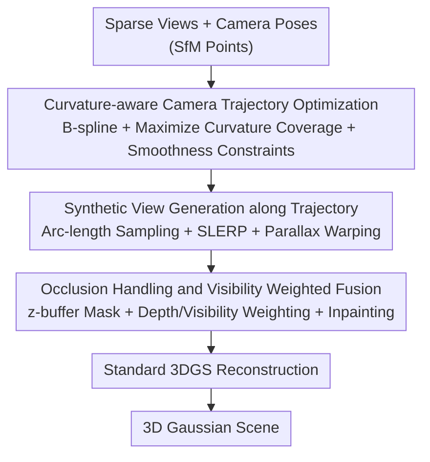

# Path Matters: Unveiling Geometric Implicit Bias via Curvature-Aware Sparse View Optimization

**Conference**: ICLR 2026  
**OpenReview**: [https://openreview.net/forum?id=egE7czf8qg](https://openreview.net/forum?id=egE7czf8qg)  
**Code**: To be confirmed  
**Area**: 3D Vision  
**Keywords**: Sparse view reconstruction, 3D Gaussian Splatting, Camera trajectory optimization, Curvature coverage, Implicit bias

## TL;DR
This paper reveals two types of geometric implicit biases in 3DGS under sparse views—stronger supervision requirements for high-curvature regions and sensitivity to the smoothness of input view trajectories. Accordingly, it proposes a "Curvature-aware Camera Trajectory Optimization + Synthetic View Generation" framework. This approach ensures that pseudo-label views cover more surface details while maintaining smoothness, pushing rendering quality and geometric accuracy to SOTA on datasets such as DTU, Mip-NeRF 360, and Tanks & Temples.

## Background & Motivation
**Background**: 3D Gaussian Splatting (3DGS) models scenes using a set of anisotropic Gaussian ellipsoids and performs direct rasterization to the screen via depth sorting and alpha blending. Its near real-time rendering has made it a mainstream representation for novel view synthesis. It performs exceptionally well under dense view inputs.

**Limitations of Prior Work**: Realistic acquisition often provides only sparse views (dense sampling is expensive, noisy, or infeasible). Under sparse views, 3DGS suffers from geometric inaccuracies, cross-view inconsistencies, and spatial/photometric attribute distortions. Existing methods primarily rely on multi-view consistency—reprojecting or warping 3D points from known views to unobserved views to create pseudo-labels for enhanced supervision.

**Key Challenge**: These "supervision padding" methods do not address the deeper root cause—the 3DGS algorithm itself possesses inherent inductive biases regarding **data distribution and sampling methods**. The interaction between how the scene representation is reconstructed and how views are arranged has been overlooked. In other words, "where the pseudo-label views are placed and how they are connected" systematically affects reconstruction quality, rather than simply adding a few arbitrary frames.

**Key Insight**: The authors conducted exploratory experiments (using 9 images on the Blender LEGO scene, comparing four different camera trajectories: red, blue, orange, and green). Two clear patterns were observed: (1) **Geometric detail priority bias**—increased sampling in high-curvature regions (edges, corners, etc.) significantly reduces reconstruction error; (2) **Trajectory smoothness bias**—smoother camera trajectories (smaller second-order derivatives) lead to more stable reconstruction, while jerky or sudden-turn trajectories introduce larger errors. The green smooth trajectory achieved the highest PSNR (24.22), while the orange jerky trajectory was the worst (19.63).

**Core Idea**: Since "curvature coverage" and "trajectory smoothness" of pseudo-label views jointly determine sparse reconstruction quality, the camera trajectory for generating pseudo-labels should be treated as an optimization target—**maximizing coverage of scene surface curvature while maintaining smoothness constraints**, and then synthesizing high-quality novel views along this optimized trajectory to feed into 3DGS.

## Method

### Overall Architecture
The method addresses "what kind of pseudo-label views to supplement for 3DGS under sparse views." The pipeline consists of two serial components: first, starting from sparse camera poses, it generates an **optimal camera trajectory that maximizes curvature coverage while remaining smooth**; second, it samples a batch of synthetic camera poses along this trajectory, using parallax-based warping to interpolate pixels from known views into these new poses while handling occlusions to obtain high-information synthetic views; finally, the "original sparse views + synthetic views" are fed together into standard 3DGS for reconstruction. The framework is plug-and-play—it does not modify the 3DGS core but optimizes the input data, allowing it to be applied to various backbones such as 3DGS, SCGaussian, and MVPGS.

### Key Designs

**1. Curvature-aware Camera Trajectory Optimization: Balancing Detail Coverage and Smoothness**

This step directly corresponds to the two biases discovered earlier. Given a sparse image sequence $\{(V_i, I_i, t_i)\}_{i=1}^N$, the camera positions are first linearly connected by timestamps to form an initial trajectory $\gamma_0(t)$, which is then parameterized using B-splines as $\gamma(t)=\sum_j N_j(t)Q_j$, where $Q_j$ are optimizable control points and $N_j(t)$ are basis functions—this allows the trajectory shape to be continuously adjusted by the control points. To "see details clearly," the authors compute curvature on the object surface: using principal curvatures $\kappa_1, \kappa_2$ to define the mean curvature $H(x)=\frac{\kappa_1(x)+\kappa_2(x)}{2}$, and the curvature at a trajectory point is defined as the mean curvature of its corresponding surface point $\kappa(\gamma(t))=H(x(\gamma(t)))$ (mean curvature responds strongly to high geometric complexity regions like edges and corners).

The optimization is formulated as a constrained functional problem: the goal is to maximize the curvature-weighted arc length along the trajectory $\max_Q \int w(\gamma(t))\,\|\gamma'(t)\|\,dt$, where the weight $w(\gamma(t))=\alpha\cdot\kappa(\gamma(t))+\beta$ encourages the camera to "travel more and stay longer" at high-curvature areas. Constraints address both biases: a smoothness constraint $\int \|\gamma''(t)\|^2 dt \le \epsilon$ suppresses the second derivative (inhibiting sharp turns); $\gamma(t_i)=V_i$ forces the trajectory through original camera positions; $\|\gamma'(t)\|\ge v_{\min}$ prevents the camera from stagnating; $\kappa(\gamma(t))\ge \kappa_{\min}$ enforces minimum curvature coverage in complex regions; and an additional term $\int(\|\gamma'(t)\|-\|\gamma_0'(t)\|)^2 dt\le\delta$ limits how far the optimized trajectory deviates from the initial one. The problem is solved using L-BFGS. Compared to previous methods of "random reprojection for pseudo-labels," this explicitly models "where to place pseudo-labels" as an optimizable geometric problem.

**2. Synthetic View Generation: Interpolating Pixels to New Poses via Parallax**

With the optimal trajectory $\gamma^*(t)$, synthetic images must be "captured" along it as pseudo-labels. The authors use **arc-length parameterization** to sample $M$ timestamps, ensuring approximately uniform baselines between adjacent synthetic views (avoiding new sampling biases from uneven density). Each synthetic camera pose $V_j^*=(P_j^*, R_j^*, K_j)$ takes its position as $P_j^*=\gamma^*(t_j)$, while the orientation is determined via Spherical Linear Interpolation (SLERP) of adjacent real view orientations $R_j^*=\mathrm{SLERP}(R_a,R_b;\lambda_j)$, and the intrinsic $K_j$ is inherited from the nearest real view in time.

The synthetic image itself is generated via parallax-based warping: for each real source view $I_i$, its depth map $D_i$ (refined in two stages) is used to unproject pixels into 3D points $x_i(u_i)=D_i(u_i)K_i^{-1}\bar u_i$. These are then transformed to target camera $j$ using relative pose $(R_{ij},t_{ij})$ and projected to target pixel coordinates, where colors $\tilde I_i(u_j)$ are obtained via bicubic interpolation. This upgrades "view creation" from pure geometric reprojection to image synthesis with depth and parallax, providing more photorealistic supervision for 3DGS.

**3. Occlusion Handling and Visibility Weighted Fusion: The Critical Component**

Simply warping multiple source views leads to ghosting and misaligned occlusion boundaries. The authors formulate the final synthetic image as a **depth + visibility weighted blend** of all warped sources:

$$I_j^*(u)=\frac{\sum_{i=1}^N w_{ij}(u)\,\tilde I_i(u)}{\sum_{i=1}^N w_{ij}(u)},\quad w_{ij}(u)=M_{ij}(u)\,e^{-\lambda_d|D_i(u)-z_{ij}(u)|}\max(0,\langle v_i,v_j\rangle)$$

The three terms in the weight serve specific functions: $M_{ij}$ is a z-buffer visibility mask with a small tolerance to suppress ghosting from occluded pixels; $e^{-\lambda_d|D_i-z_{ij}|}$ weights by depth consistency, where warped depth matching target depth increases trust; and $\max(0,\langle v_i,v_j\rangle)$ weights by the cosine of the viewing angle, where sources closer to the target orientation contribute more. Remaining small holes after blending are filled using edge-aware, depth-guided inpainting. Ablations show that removing occlusion handling causes PSNR to drop by ~2.5 and CD to increase by ~0.5, making it the most sensitive component—indicating that "cleanliness" of pseudo-labels is vital for sparse 3DGS.

### Loss & Training
Trajectory optimization uses L-BFGS to solve the constrained spline optimization. The 3DGS component is trained using Adam (learning rate $1\times10^{-4}$) for 150k iterations with a batch size of 2048 on an NVIDIA A100. Gaussian parameters $\{p,c,\alpha\}$ are initialized from sparse view estimates. Overall training overhead is minimal compared to MVS-initialized 3DGS.

## Key Experimental Results

### Main Results
On Mip-NeRF 360 (12 views) and Tanks & Temples (3 views), the proposed method and its plug-and-play variants outperform several sparse-view SOTA methods:

| Dataset | Metric | Ours (3DGS+Ours / MVPGS+Ours) | Prev. SOTA | Description |
|--------|------|------|----------|------|
| Mip-NeRF 360 (12 views) | PSNR ↑ | 20.15 | 19.85 (MVPGS) | Highest when applied to MVPGS |
| Mip-NeRF 360 (12 views) | LPIPS ↓ | 0.41 | 0.43 (SCGaussian) | Better perceptual quality |
| Tanks & Temples (3 views) | PSNR ↑ | 26.41 | 25.57 (MVPGS) | 3DGS+Ours provides +0.84 dB gain |

Evaluated on DTU with training ratio $\alpha$ (percentage of images used), geometric accuracy (Chamfer Distance) and image quality lead simultaneously:

| Configuration | PSNR ↑ | CD ↓ | LPIPS ↓ |
|------|--------|------|---------|
| NexusGS (CVPR'25), α=0.4 | 27.10 | 3.18 | 0.20 |
| **Ours, α=0.4** | **27.89** | **3.01** | **0.18** |
| **Ours, α=0.2** | **27.05** | **3.49** | **0.21** |

Under extreme sparsity (3 views), the method achieves the highest PSNR 20.65 / SSIM 0.891 on DTU and PSNR 20.93 on LLFF. As a plugin for SCGaussian, it improves Tanks & Temples by ~0.85 dB, validating its model-agnostic plug-and-play nature.

### Ablation Study
Removing components one by one on DTU (PSNR / CD, α=0.2):

| Configuration | PSNR ↑ | CD ↓ | Description |
|------|--------|------|------|
| Ours (Full) | 27.05 | 3.49 | — |
| w/o Optimal Trajectory Generation | 24.20 | 5.12 | -2.85 dB drop; curvature + smoothness are critical |
| w/o Synthetic View Construction | 24.38 | 4.98 | Lacks pseudo-label density; worse at higher ratios |
| w/o Smoothness Constraint | 25.84 | 3.98 | Validates trajectory smoothness bias |
| w/o Occlusion Handling | 24.58 | 5.10 | PSNR drops ~2.5, CD increases ~0.5 |

### Key Findings
- **Trajectory optimization provides the greatest contribution**: Removing "Optimal Trajectory Generation" at α=0.2 results in a 2.85 dB drop, confirming that "curvature coverage + smoothness" is the core lever for sparse reconstruction.
- **Occlusion handling is the most sensitive point**: Its removal alone causes PSNR to drop by ~2.5 and CD to increase by ~0.5, suggesting that "clean" pseudo-labels are more important than "many" pseudo-labels.
- **Efficiency-friendly**: Compared to MVS-initialized 3DGS, this method achieves higher quality with significantly lower training overhead—outperforming the SfM-initialized baseline by +3.11 dB in outdoor scenes while maintaining real-time rendering.

## Highlights & Insights
- **Turning Analysis into Optimization Objectives**: The paper first quantifies two implicit biases of 3DGS via controlled experiments (high curvature needs more supervision, trajectories need to be smooth), and then directly reformulates these as the objective and constraints for trajectory optimization.
- **Optimizing "Data" rather than "Models"**: The method does not alter the 3DGS core; it only optimizes the pseudo-labels provided to it. This makes it inherently plug-and-play, allowing for immediate performance gains on existing backbones like SCGaussian or MVPGS.
- **Clever Curvature-Weighted Arc Length Objective**: $\int w(\gamma(t))\|\gamma'(t)\|dt$ naturally encodes "increased sampling at high curvature" as a weighted distance along the trajectory. Combined with minimum velocity/curvature constraints, it ensures efficient sampling—neither wasting views on flat areas nor undersampling details.

## Limitations & Future Work
- **Dependence on Depth Map Quality**: Parallax warping requires per-pixel depth for every source view (using two-stage refinement). Poor depth estimation leads to erroneous supervision; the paper places depth refinement details in the appendix without fully discussing failure modes.
- **Acquisition of Curvature/Geometric Features**: Trajectory optimization requires calculating curvature on the object surface, implying the need for an initial geometric proxy. In extremely sparse or textureless scenes, curvature estimation itself might be inaccurate, posing a "chicken-and-egg" risk.
- **High Number of Hyperparameters**: There are many constraints/weights ($\alpha,\beta,\epsilon,\delta,v_{\min},\kappa_{\min},\lambda_d$). A systematic analysis of cross-dataset robustness and tuning costs is not provided.
- **Future Directions**: Jointly optimizing depth and trajectories or using learned visibility/confidence instead of manual z-buffer tolerances could further reduce reliance on depth priors.

## Related Work & Insights
- **vs. Reprojection/Warping Methods (e.g., SparseNeRF, SCGaussian)**: These generate pseudo-labels without considering "where they are placed or how they are connected." This paper points out that these factors determine reconstruction quality and explicitly optimizes the trajectory for "high curvature coverage + smoothness."
- **vs. Depth-prior Sparse Methods (DNGaussian, SparseGS)**: These rely on pre-trained depth for regularization. This paper uses depth for parallax warping to synthesize novel views and adds curvature-aware trajectory planning. The two are complementary, and this method acts as a plugin for such backbones.
- **vs. Active View Selection / NeRF Active Learning**: Shared logic (deciding where to look next), but this paper applies it to pseudo-label generation for sparse 3DGS, providing quantifiable geometric criteria for curvature coverage and trajectory smoothness.

## Rating
- Novelty: ⭐⭐⭐⭐⭐ First to quantify two geometric implicit biases of sparse 3DGS and convert them into a trajectory optimization objective; the perspective is novel and self-consistent.
- Experimental Thoroughness: ⭐⭐⭐⭐ Covers 5 datasets, multiple training ratios, plug-and-play validation, and ablations, though depth failure modes and hyperparameter robustness are less analyzed.
- Writing Quality: ⭐⭐⭐⭐ Logical flow from controlled experiments to method derivation is clear; formulas are complete; some implementation details are relegated to the appendix.
- Value: ⭐⭐⭐⭐⭐ A model-agnostic plug-and-play module that provides direct gains for 3DGS in high-frequency practical sparse-view scenarios.

<!-- RELATED:START -->

## Related Papers

- [\[ICLR 2026\] Neural Compression of 3D Meshes using Sparse Implicit Representation](neural_compression_of_3d_meshes_using_sparse_implicit_representation.md)
- [\[CVPR 2026\] Intrinsic Geometry-Appearance Consistency Optimization for Sparse-View Gaussian Splatting](../../CVPR2026/3d_vision/intrinsic_geometry-appearance_consistency_optimization_for_sparse-view_gaussian_.md)
- [\[AAAI 2026\] Opt3DGS: Optimizing 3D Gaussian Splatting with Adaptive Exploration and Curvature-Aware Exploitation](../../AAAI2026/3d_vision/opt3dgs_optimizing_3d_gaussian_splatting_with_adaptive_exploration_and_curvature.md)
- [\[ICLR 2026\] Test-Time Optimization of 3D Point Cloud LLM via Manifold-Aware In-Context Guidance and Refinement](test-time_optimization_of_3d_point_cloud_llm_via_manifold-aware_in-context_guida.md)
- [\[CVPR 2026\] SMVRT: Implicit Human 3D Modeling Using Sparse Multi-View Volumetric Reconstruction with Transformer Fusion](../../CVPR2026/3d_vision/smvrt_implicit_human_3d_modeling.md)

<!-- RELATED:END -->
