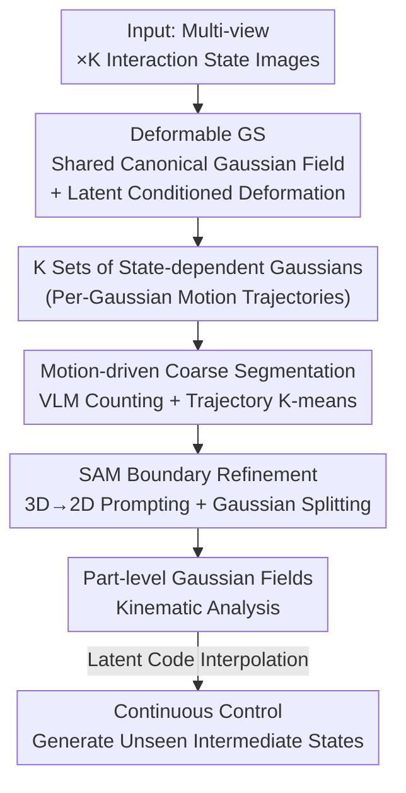

# PD²GS: Part-Level Decoupling and Continuous Deformation of Articulated Objects via Gaussian Splatting

**Conference**: ICLR 2026  
**arXiv**: [2506.09663](https://arxiv.org/abs/2506.09663)  
**Code**: Available  
**Area**: 3D Vision / Articulated Object Modeling  
**Keywords**: articulated objects, 3D Gaussian Splatting, part segmentation, continuous deformation, SAM

## TL;DR
The PD²GS framework is proposed to achieve part-level decoupling, reconstruction, and continuous control of articulated objects by learning a shared canonical Gaussian field and modeling each interaction state as its continuous deformation. It employs coarse-to-fine motion trajectory clustering and SAM-guided boundary refinement without manual supervision.

## Background & Motivation

**Background**: 3D modeling of articulated objects (doors, drawers, laptops) is essential for robotics, AR/VR, and digital twins. Recent works like PARIS and GAPartNet use NeRF/3DGS for self-supervised modeling, but are mostly limited to single-joint, two-state scenarios.

**Limitations of Prior Work**: (1) Two-state methods only perform discrete pairwise comparisons and cannot model continuous motion; (2) They require a known number of parts or strict geometric constraints; (3) Multi-part decoupling relies on explicit meshes from Marching Cubes, leading to severe error accumulation.

**Key Challenge**: How to learn continuous part-level motion models under limited observations of discrete interaction states?

**Goal**: Learn from multi-view multi-state images in a self-supervised manner: (1) Part-aware reconstruction; (2) Part-level continuous control; (3) Precise kinematic modeling.

**Key Insight**: Each interaction state can be modeled as a continuous deformation of a shared canonical Gaussian field, where intra-part motion is consistent and inter-part motion differs.

**Core Idea**: A deformation network conditioned on latent codes drives the continuous deformation of the canonical Gaussian field, achieving automatic part decoupling through motion trajectory clustering and SAM boundary refinement.

## Method

### Overall Architecture
PD²GS aims to learn a model capable of continuous motion and automatic part decoupling from multi-view images of an articulated object across $K$ discrete interaction states. The Mechanism is to unify the "K states" into a shared canonical Gaussian field plus $K$ deformations: first, a deformation network conditioned on latent codes transforms the canonical field into each observed state (Deformable GS). Part structures are then "back-inferred" from these deformations using a coarse-to-fine pipeline—starting with coarse-grained clustering based on Gaussian motion trajectories (motion-driven coarse segmentation), followed by refining part boundaries to pixel-level precision using SAM (SAM boundary refinement). Once part-level Gaussian fields are obtained, kinematic analysis allows for continuous interpolation in the latent code space to generate intermediate configurations not seen during training.

### Key Designs

**1. Deformable Gaussian Splatting: Unifying Discrete States into Shared Field Deformation**

Two-state methods can only compare discrete observations, failing to characterize intermediate states like a "half-open door." PD²GS maintains a state-independent canonical Gaussian field and assigns a latent code $\alpha_k \in \mathbb{R}^D$ to each interaction state $k$. A deformation MLP $f_{def}$ predicts the displacement for each Gaussian: $(\Delta\mu_i, \Delta q_i, \Delta s_i) = f_{def}(\mu_i, q_i, s_i \mid \alpha_k)$. Deformation is applied as addition to position and quaternion multiplication to rotation. Since states are continuously parameterized by latent codes, interpolating in $\alpha$-space after training enables rendering of unseen continuous intermediate states.

**2. Coarse-grained Motion-driven Part Segmentation: Motion as Segmentation Signal**

Without manual part annotations, PD²GS leverages the observation that Gaussians within the same rigid part move in the same direction (even if displacement magnitudes vary by distance to the joint). It first calculates the maximum displacement of each Gaussian across $K$ states, using a threshold $\tau_{mot}$ to separate static background from dynamic parts. Then, a VLM (BLIP/Gemini) estimates the number of moving parts from image pairs, using majority voting for stability. Finally, motion descriptors (normalized direction + magnitude) are constructed for each dynamic Gaussian to perform K-means clustering on a unit sphere.

**3. SAM-guided Boundary Refinement: Pixel-level Precision via Visual Priors**

Motion clustering often produces coarse boundaries where Gaussians at part junctions are misclassified. PD²GS uses SAM's pixel-level segmentation to refine these: automatic prompt points are generated via 3D→2D projection on Gaussians in boundary regions, fed to SAM to obtain 2D masks, and back-projected to 3D to correct labels. For Gaussians spanning boundaries, a splitting operation is performed, subdividing one Gaussian into smaller ones with recalibrated labels to fit actual part contours.

### Loss & Training
The training target is $\mathcal{L}_{total} = \mathcal{L}_{photo} + \mathcal{L}_{D_{SIMM}}$, combining photometric reconstruction loss to ensure alignment with input images and density similarity regularization to constrain Gaussian density distribution across deformations.

## Key Experimental Results

### Main Results (PartNet-Mobility)

| Method | PSNR↑ | SSIM↑ | Part IoU↑ | Joint Error↓ |
|------|-------|-------|----------|---------|
| PARIS | Low | Low | ~50% | High |
| CAGE | Mid | Mid | ~55% | Mid |
| **Ours** | **Highest** | **Highest** | **~70%** | **Lowest** |

### Ablation Study

| Configuration | Recon. Quality | Segment Accuracy | Description |
|------|---------|---------|------|
| Full PD²GS | Best | Best | Complete model |
| w/o SAM Refinement | Slightly lower | Drop ~10% | Coarse clustering boundaries |
| w/o VLM Counting | Comparable | Drop ~5% | Manual K specification is close |
| 2 States vs 4 States | Lower | Lower | More states provide better motion constraints |

### Key Findings
- **Continuous Control**: Latent code interpolation generates smooth intermediate states, whereas previous methods jump between discrete states.
- **Multi-part Support**: Successfully handles complex objects like chest of drawers with multiple independently moving parts.
- **RS-Art Real Data**: Performance holds on self-collected real-to-sim datasets, validating sim-to-real generalization.

## Highlights & Insights
- **Elegant Latent-driven Deformation**: Encoding discrete observations into a continuous motion space supports the generation of unseen configurations.
- **Self-supervised "Motion as Segmentation"**: Automatically discovers part structures from motion differences without any human labeling.
- **Innovative 3D-to-2D SAM Prompting**: Generating 2D prompts directly from 3D part boundaries avoids the need for manual SAM interaction.

## Limitations & Future Work
- VLM counting may be inconsistent, requiring majority voting for stability.
- The motion threshold $\tau_{mot}$ requires manual tuning.
- Only handles rigid articulated motion; non-rigid deformation (e.g., cloth) is not supported.
- The RS-Art dataset scale is relatively small.

## Related Work & Insights
- **vs PARIS**: Only supports single-joint two-state scenarios; PD²GS supports multi-part multi-state continuous control.
- **vs Dynamic 3DGS (e.g., 4D-GS)**: Dynamic methods do not distinguish part motion semantics; PD²GS explicitly decouples them.
- Direct application value for robotic manipulation—operational strategies can be planned after predicting parts and kinematic parameters.

## Rating
- Novelty: ⭐⭐⭐⭐⭐ Integration of canonical fields, latent deformation, and auto-part discovery is innovative.
- Experimental Thoroughness: ⭐⭐⭐⭐ Extensive testing on PartNet-Mobility and RS-Art with complete ablations.
- Writing Quality: ⭐⭐⭐⭐ Clear method descriptions and standardized formulas.
- Value: ⭐⭐⭐⭐⭐ Significant progress in continuous modeling of articulated objects.

<!-- RELATED:START -->

## Related Papers

- [\[CVPR 2026\] Part$^{2}$GS: Part-aware Modeling of Articulated Objects using 3D Gaussian Splatting](../../CVPR2026/3d_vision/part2gs_part-aware_modeling_of_articulated_objects_using_3d_gaussian_splatting.md)
- [\[ICLR 2026\] CLoD-GS: Continuous Level-of-Detail via 3D Gaussian Splatting](clod-gs_continuous_level-of-detail_via_3d_gaussian_splatting.md)
- [\[ICLR 2026\] MoE-GS: Mixture of Experts for Dynamic Gaussian Splatting](moe-gs_mixture_of_experts_for_dynamic_gaussian_splatting.md)
- [\[ICLR 2026\] Mobile-GS: Real-time Gaussian Splatting for Mobile Devices](mobile-gs_real-time_gaussian_splatting_for_mobile_devices.md)
- [\[ICLR 2026\] SSD-GS: Scattering and Shadow Decomposition for Relightable 3D Gaussian Splatting](ssd-gs_scattering_and_shadow_decomposition_for_relightable_3d_gaussian_splatting.md)

<!-- RELATED:END -->
