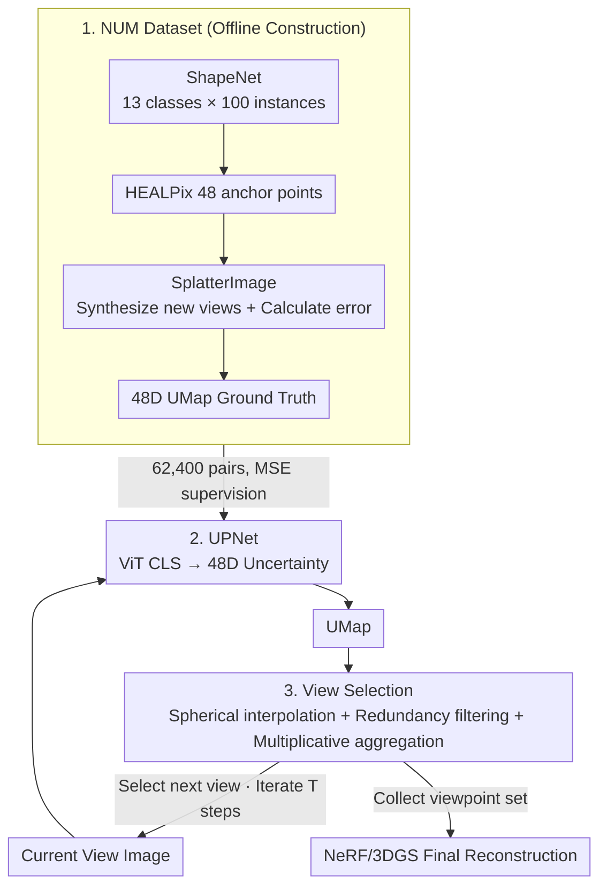

# Peering into the Unknown: Active View Selection with Neural Uncertainty Maps for 3D Reconstruction

**Conference**: ICLR 2026  
**arXiv**: [2506.14856](https://arxiv.org/abs/2506.14856)  
**Code**: [https://github.com/ZhangLab-DeepNeuroCogLab/PUN](https://github.com/ZhangLab-DeepNeuroCogLab/PUN)  
**Area**: 3D Vision  
**Keywords**: active view selection, neural uncertainty map, 3D reconstruction, NeRF, 3DGS

## TL;DR

Ours proposes PUN (Peering into the UnkNowN), which utilizes a lightweight feed-forward network, UPNet, to directly predict the uncertainty distribution (neural uncertainty map) across all candidate viewpoints on a sphere from a single image. This replaces the traditional active view selection (AVS) pipeline that requires iterative retraining of NeRF/3DGS. PUN achieves comparable reconstruction quality using only half the viewpoints of the upper bound, while realizing a 400x speedup in the selection phase and over 50% savings in computational resources.

## Background & Motivation

The Goal of Active View Selection (AVS) is to identify the minimum yet most informative set of viewpoints to train 3D rendering models. This holds significant practical value in scenarios such as robotic exploration, cultural heritage digitization, and search-and-rescue.

Existing AVS methods almost exclusively follow a "train-evaluate-select-retrain" iterative paradigm: a NeRF or 3DGS model is first trained on the current viewpoint set, then the trained model is used to estimate uncertainty for each candidate viewpoint (e.g., entropy of ray weight distribution, color variance, occlusion visibility). After selecting the next most informative viewpoint, the model must be retrained with the new addition. This loop creates a severe computational bottleneck—the NVF method requires approximately 175 minutes to select 20 viewpoints.

Another category of methods based on reinforcement learning or supervised learning avoids retraining but relies on fixed discrete candidate sets, leading to limited generalization. 3DGS-based methods (ActiveSplat, ActiveGS) focus on geometric information but ignore pixel-level color cues.

**Key Insight**: Reconstruction uncertainty patterns for a vast number of natural objects exhibit regularities—viewpoints with complex geometry and rich textures typically have higher uncertainty, while object symmetry reduces uncertainty for symmetric views. If this "appearance-to-uncertainty" mapping can be learned from data, it becomes unnecessary to train a rendering model from scratch every time to evaluate uncertainty.

## Method

### Overall Architecture

PUN completely transforms AVS from an iterative optimization of "retraining the rendering model at each step" into a single feed-forward prediction. In the offline phase, a lightweight network, UPNet, is trained on a large-scale Neural Uncertainty Map (NUM) dataset to learn to output the global spherical uncertainty distribution directly from a single image. In the online phase, for a given viewpoint, UPNet infers a UMap. Multiple historical UMaps are aggregated to select the most informative next viewpoint. The viewpoint set collected after $T$ iterations is then provided to the target NeRF/3DGS for final training. The selection process no longer involves any training of 3D rendering models, which is the source of the 400x speedup.

### Key Designs

**1. NUM Dataset: Converting "Appearance → Uncertainty" Mapping into a Supervised Regression Target**

To enable the network to learn uncertainty prediction, a large-scale set of (image, uncertainty) pairs is required. The authors selected 100 instances from 13 categories in ShapeNet. For each instance, 48 anchor viewpoints were uniformly distributed on a sphere using HEALPix (nside=2). For each anchor, a pre-trained SplatterImage (a single-view feed-forward 3DGS) was used to synthesize new views of the remaining 47 anchors, and the reconstruction errors (PSNR/SSIM/LPIPS/MSE) were calculated against Blender ground truths to form a 48-dimensional UMap vector. Thus, one viewpoint image corresponds to one global spherical uncertainty map, totaling $13 \times 100 \times 48 = 62{,}400$ pairs. SplatterImage was chosen as the synthesis backbone because it is end-to-end and feed-forward, requiring no individual training per viewpoint. Data was split 8:1:1 for training/validation/testing, with 2 categories reserved entirely for cross-category generalization testing.

**2. UPNet: Mapping Single Images to 48D Uncertainty via Minimal Architecture**

With supervision signals, the prediction side is deliberately lightweight. A ViT pre-trained on ImageNet serves as the visual encoder. The CLS token is passed through a fully connected layer to directly output a 48-dimensional uncertainty vector corresponding to the 48 anchors. Training utilizes MSE to supervise the difference between the predicted UMap and the ground truth UMap, with PSNR as the default target metric. The architecture can be this simple because uncertainty patterns possess cross-object, domain-agnostic regularities (high uncertainty at geometric/textural complexity, low uncertainty at symmetry planes) that pre-trained ViT features can capture without refitting a rendering field for every object.

**3. View Selection via Spherical Interpolation + Temporal Aggregation: Extending Anchors and Eliminating Redundancy**

Since the UMap only covers 48 anchors while candidate viewpoints can be anywhere on the sphere, interpolation is required. For each candidate $C_i$, a neighborhood $\tilde{P}$ of anchors within a 30° angular distance is taken, and uncertainty is calculated as a softmax-weighted sum: $U^{C_i} = \sum_{\tilde{P_j} \in \tilde{P}} \omega_j U^{\tilde{P_j}}$, where $\omega_j = \frac{e^{-\theta_{ij}}}{\sum e^{-\theta_{ij}}}$. Selection involves two layers of logic: first, redundancy filtering, where any candidate with uncertainty below a 0.1 threshold at any historical time step is eliminated (as it is too close to an already observed view); second, multiplicative aggregation, where the product of uncertainties across time steps is maximized for the remaining candidates: $v_{t+1} = \arg\max_{C_i} \prod_{t} U_t^{C_i}$. Multiplicative aggregation represents joint uncertainty—only directions that remain consistently high-uncertainty across all observations are explored, naturally avoiding redundant views.

## Key Experimental Results

### Main Results

Ours was compared against 4 AVS baselines across 6 datasets. All methods selected 20 viewpoints and trained a NeRF backbone for 2,000 steps.

| Dataset | Method | PSNR↑ | SSIM↑ | LPIPS↓ | MSE↓ |
|---------|--------|-------|-------|--------|------|
| NUM-inst (Same cat, new inst) | A-NeRF | 32.71 | 0.982 | 0.031 | 8.19 |
| | NVF | 33.08 | 0.984 | 0.028 | 6.98 |
| | **Ours** | **33.19** | **0.984** | **0.025** | **6.96** |
| | Upper-bnd | 36.47 | 0.989 | 0.017 | 4.11 |
| NUM-cat (Unseen cat) | A-NeRF | 33.16 | 0.984 | 0.024 | 7.04 |
| | NVF | 33.15 | 0.985 | 0.021 | 6.65 |
| | **Ours** | **34.74** | **0.985** | **0.019** | **5.03** |
| | Upper-bnd | 36.91 | 0.990 | 0.013 | 3.33 |
| NUM-3DGS (3DGS backbone) | NVF | 30.67 | 0.977 | 0.07 | 2.28 |
| | **Ours** | **36.71** | **0.990** | **0.03** | **0.40** |
| NeRFAssets (Real scenes) | NVF | 26.31 | 0.928 | 0.115 | 0.005 |
| | **Ours** | **26.73** | **0.944** | **0.093** | **0.003** |
| MIP360 (Real scenes) | NVF | 15.41 | 0.203 | 0.653 | 32.03 |
| | **Ours** | **17.49** | **0.294** | **0.545** | **19.98** |

On NUM-cat, PUN outperforms NVF by 1.59 dB PSNR, demonstrating that feed-forward uncertainty prediction generalizes significantly better than iterative methods on unseen categories. In the real-world MIP360 dataset, PUN leads NVF by over 2 dB PSNR.

### Ablation Study

| Ablation Dimension | Configuration | PSNR |
|-------------------|---------------|------|
| Uncertainty Metric | PSNR (Default) | 37.4 |
| | SSIM | 36.4 |
| | LPIPS | 36.1 |
| | MSE | 35.0 |
| Redundancy Filter | small+all (Default) | 37.4 |
| | Disable | 36.9 |
| | Top-32 Exclusion | 36.8 |
| | Single (5° neighbor) | 36.9 |
| Aggregation | Multiplicative (Default) | 37.4 |
| | Latest UMap only | 36.9 |
| | Difference strategy | 36.8 |
| | Additive aggregation | 36.9 |
| Data Diversity | 80 inst / 12 views | 36.9 |
| | 40 inst / 24 views | 36.3 |
| | 20 inst / 48 views | 35.7 |
| Anchor Count | 12 | 37.0 |
| | 48 (Default) | 36.8 |
| | 108 | 36.8 |

**Key Findings**:
- **PSNR is the optimal training metric**, outperforming SSIM/LPIPS/MSE by 1.0–2.4 dB.
- **Redundancy filtering and temporal aggregation are both essential**, with the removal of either leading to a 0.5 dB drop.
- **Instance diversity is far more important than viewpoint density**: Given a fixed total sample size, using more object instances (80×12) is significantly better than fewer instances with more views (20×48), as redundant views on symmetric objects provide limited incremental information.
- Increasing anchors from 12 to 48 shows Gain, but 108 provides almost no further benefit, making 48 the most cost-effective configuration.

### Computational Efficiency

The core advantage of PUN is efficiency:
- View selection process takes **5.5 mins** vs. **175 mins** for NVF (400x speedup).
- GPU Memory reduced from **8,098 MB** to **655 MB**.
- CPU Usage reduced from **903%** to **74%**.
- RAM Usage reduced from **4,292 MB** to **1,870 MB**.
- GPU Utilization dropped from **30.6%** to **0.3%**.

This is because PUN avoids all rendering model training during selection, requiring only a few ViT forward passes.

## Highlights & Insights

**Core Prerequisite for Paradigm Shift**: The authors discovered that uncertainty patterns are learnable across objects—the Pearson correlation between UPNet predictions and ground truth UMaps reaches 0.82. Further analysis indicates that UPNet implicitly captures geometric complexity (depth gradient variance, edge density) and textural complexity (color entropy, Laplacian energy). These low-level features are domain-agnostic, explaining the cross-category generalization.

**Rationality of Multiplicative Aggregation**: Treating each UMap as an uncertainty estimate from an independent information source makes multiplication equivalent to finding the joint probability—only regions consistently uncertain across all observations are explored. This full utilization of temporal information yields more stable performance than additive aggregation or using only the latest step.

**Symmetry Phenomenon**: When predicting UMaps for highly symmetric objects like cabinets, UPNet correctly assigns low uncertainty to symmetric planes. This indicates the network has learned to utilize object symmetry to reduce exploration redundancy and can generalize this capability to unseen categories.

## Limitations & Future Work

- Assumes cameras are distributed on a sphere with a fixed radius; does not support free-trajectory distributions.
- Targeted at single-object reconstruction; scene-level multi-object AVS requires more complex uncertainty modeling.
- The UMap training target is based on image reconstruction error (PSNR, etc.) rather than direct geometric quality (mesh accuracy, completion rate), which might be suboptimal for downstream tasks requiring precise geometry.
- SplatterImage as a synthesis backbone introduces its own bias; although ablations show effectiveness across backbones, a stronger synthesis model might provide more accurate UMap supervision.

## Related Work & Insights

- **vs. NVF**: NVF's visibility modeling is a major contribution but requires retraining NeRF at each step. PUN replaces iterative training with feed-forward prediction, winning on both efficiency and generalization.
- **vs. ActiveSplat / ActiveGS**: These estimate uncertainty from 3D Gaussian attributes (variance, density), focusing on spatial coverage while ignoring pixel-level color cues. PUN's UMap captures both geometric and textural complexity.
- **vs. Supervised/RL Methods**: Fixed candidate sets limit generalization. PUN supports arbitrary viewpoint selection through continuous spherical interpolation.

## Rating

- Novelty: ⭐⭐⭐⭐⭐ — A true paradigm shift moving AVS from iterative optimization to feed-forward prediction.
- Experimental Thoroughness: ⭐⭐⭐⭐⭐ — 6 datasets covering synthetic/real/cross-category/cross-backbone/cross-illumination/cross-distance, with extensive ablations.
- Writing Quality: ⭐⭐⭐⭐ — Clear structure and well-made figures, though some paragraphs are slightly repetitive.
- Value: ⭐⭐⭐⭐⭐ — 400x speedup and extremely low memory requirements make AVS truly viable in resource-constrained scenarios (robotics, mobile devices).

<!-- RELATED:START -->

## Related Papers

- [\[AAAI 2026\] Surface-Based Visibility-Guided Uncertainty for Continuous Active 3D Neural Reconstruction](../../AAAI2026/3d_vision/surface-based_visibility-guided_uncertainty_for_continuous_active_3d_neural_reco.md)
- [\[ICLR 2026\] COOPERTRIM: Adaptive Data Selection for Uncertainty-Aware Cooperative Perception](coopertrim_adaptive_data_selection_for_uncertainty-aware_cooperative_perception.md)
- [\[ICLR 2026\] Uncertainty-Aware 3D Reconstruction for Dynamic Underwater Scenes](uncertainty-aware_3d_reconstruction_for_dynamic_underwater_scenes.md)
- [\[CVPR 2026\] Coverage Optimization for Camera View Selection](../../CVPR2026/3d_vision/coverage_optimization_for_camera_view_selection.md)
- [\[ICLR 2026\] Text-to-3D by Stitching a Multi-view Reconstruction Network to a Video Generator](text-to-3d_by_stitching_a_multi-view_reconstruction_network_to_a_video_generator.md)

<!-- RELATED:END -->
