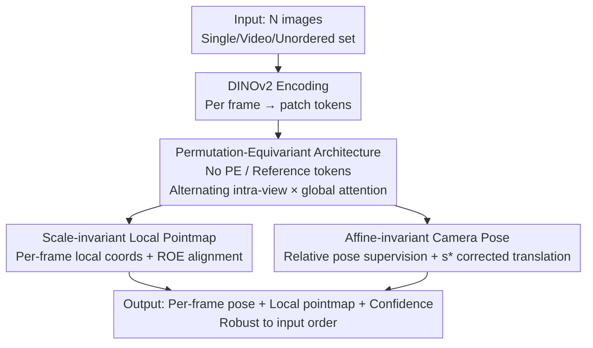

# $\pi^3$: Permutation-Equivariant Visual Geometry Learning

**Conference**: ICLR 2026  
**OpenReview**: [https://openreview.net/forum?id=DTQIjngDta](https://openreview.net/forum?id=DTQIjngDta)  
**Code**: https://github.com/yyfz/Pi3  
**Area**: 3D Vision  
**Keywords**: Visual geometry reconstruction, Permutation-equivariant, Feed-forward 3D reconstruction, Camera pose estimation, Point cloud reconstruction

## TL;DR
$\pi^3$ proposes a fully permutation-equivariant feed-forward network that completely discards the "fixed reference view" inductive bias inherited from traditional SfM. Instead, it predicts "affine-invariant camera poses + scale-invariant local pointmaps" in each frame's own coordinate system. This approach is naturally robust to input order and sets new SOTA records across tasks like camera pose estimation, monocular/video depth, and dense pointmaps, while achieving 57.4 FPS.

## Background & Motivation
**Background**: Reconstructing 3D structures directly from images is a long-standing problem in computer vision. Traditional approaches rely on SfM / MVS followed by iterative Bundle Adjustment, which is robust but involve multi-stage, slow pipelines. Recently, DUSt3R and its successors (Fast3R, FLARE, VGGT, etc.) have used feed-forward neural networks to regress geometry in a single forward pass, improving speed and ease of use.

**Limitations of Prior Work**: Both traditional and modern methods share a hidden assumption—they must **select a fixed reference view** and treat its camera coordinate system as the global coordinate system, anchoring all other views to it. For instance, DUSt3R defines point clouds in the coordinate system of the first image, while VGGT uses a dedicated camera token/reference embedding to mark the reference frame.

**Key Challenge**: This "reference frame" is man-made and arbitrary. The authors demonstrate through experiments that reconstruction quality, even for the SOTA VGGT, is highly sensitive to the choice of reference view—switching the reference frame can cause accuracy (Acc/Comp) to plummet from 0.12 to 0.95 (Fig. 2). In other words, reconstruction outcomes should not depend on, but currently do depend heavily on, "which image is seen first," which is a harmful inductive bias limiting robustness.

**Goal**: Is it possible to build a network that requires no reference view at all, making reconstruction results completely insensitive to input order or "who serves as the first frame"?

**Key Insight**: The authors realized that the reference frame exists because the model must output geometry in a unified global coordinate system. If the model instead **predicts only local geometry in each frame's own coordinate system** (local pointmaps) and **relative poses between views**, a global coordinate system is no longer needed, and the reference frame problem vanishes.

**Core Idea**: Replace "fixed reference views + global coordinate systems" with a "permutation-equivariant architecture + local/relative supervision," embedding invariance to input order into the network structure rather than relying on post-processing alignment.

## Method

### Overall Architecture
$\pi^3$ is a feed-forward network $\phi$ that takes a sequence of $N$ images $S=(I_1,\dots,I_N)$ (which can be a single image, video, or unordered image set, dynamic or static) and outputs a triplet for each image: camera pose $T_i\in SE(3)$, a pixel-aligned pointmap $X_i\in\mathbb{R}^{H\times W\times 3}$ defined in that frame's own camera coordinate system, and a confidence map $C_i$.

The entire pipeline is intentionally designed to "remove all order-dependent components": DINOv2 encodes each image into patch tokens; these tokens pass through alternating "intra-view self-attention" and "global self-attention" layers (borrowing this alternating structure from VGGT) to allow information flow within and across frames. Finally, the decoder outputs poses, local pointmaps, and confidence. Crucially, there are **no** frame-index positional encodings and **no** special learnable tokens to mark a reference frame—exactly the elements that broke permutation equivariance in previous methods. Consequently, the network satisfies $\phi(P_\pi(S))=P_\pi(\phi(S))$: if the input order is shuffled, the output is shuffled identically, but the geometry/pose corresponding to each image remains unchanged. On the training side, the global coordinate system is eliminated through "relative/local" supervision: pointmaps use scale-invariant supervision, and poses use affine-invariant (relative pose) supervision.

### Key Designs

**1. Permutation-Equivariant Architecture: Building "Order-Indifference" into the Structure**

Addressing the "failure upon changing reference frame" issue, the authors require the network $\phi$ to satisfy equivariance $\phi(P_\pi(S))=P_\pi(\phi(S))$ for any permutation $P_\pi$ (Eqs. 2–3). This is achieved not by adding constraints, but by **removing components**: positional encodings used to distinguish frame order are deleted, as are reference-specifying camera tokens like those in VGGT. Only the DINOv2 encoding and alternating intra-view/global self-attention are retained (self-attention is inherently permutation-equivariant to token order). This ensures a stable one-to-one correspondence between each input image and its output, making reconstruction quality independent of "who is the reference." Unlike previous "select reference $\rightarrow$ global alignment" paradigms, a reference frame never exists here, eliminating failure modes from poor reference selection and improving robustness to noise/uncertain observations.

**2. Scale-Invariant Local Pointmap: Managing Individual Coordinate Systems**

After removing the global coordinate system, each frame's pointmap $\hat X_i$ is defined in its own local camera coordinate system, yet the inherent scale ambiguity of monocular reconstruction remains. The authors task the network with predicting point clouds that "differ by an unknown but sequence-consistent scale factor," and an optimal scale $s^*$ is computed during training to align predictions to the ground truth (GT). $s^*$ is found by minimizing a depth-weighted $L_1$ distance:

$$s^*=\arg\min_s \sum_{i=1}^{N}\sum_{j=1}^{H\times W}\frac{1}{z_{i,j}}\lVert s\hat x_{i,j}-x_{i,j}\rVert_1$$

where $z_{i,j}$ is the GT depth, solved using MoGe's ROE solver. The point loss $L_{points}$ uses $s^*$ to calculate the same depth-weighted $L_1$. Additionally, a normal loss $L_{normal}$ (using cross-products of adjacent pixels to obtain normals, minimizing the angle $\arccos(\hat n\cdot n)$ with GT normals) encourages smooth local surfaces. Confidence $C_i$ is supervised via BCE—the target is 1 if the $L_1$ reconstruction error of a point is below threshold $\epsilon$, otherwise 0. This "local + scale-invariant" approach allows the model to avoid predicting absolute scale, requiring only that individual frame geometries be placed within a unified scale.

**3. Affine-Invariant Camera Pose: Eliminating Global Reference Ambiguity via Relative Pose**

Permutation equivariance + scale ambiguity implies that output poses can only be determined up to a similarity transform (rigid body + single global scale). Therefore, the authors **do not supervise absolute poses, but rather relative poses between views** $\hat T_{i\leftarrow j}=\hat T_i^{-1}\hat T_j$ (Eq. 7). Relative rotation is naturally invariant to global transforms, but relative translation scale remains ambiguous—the same $s^*$ derived for pointmap alignment is reused to correct all predicted translations, allowing both rotation and "scale-corrected translation" to be supervised directly. The camera loss $L_{cam}$ is averaged over all ordered view pairs $(i\neq j)$, using a geodesic angle loss $\arccos\big(\frac{\mathrm{Tr}(R^\top\hat R)-1}{2}\big)$ for rotation and an outlier-robust Huber loss $H_\delta(s^*\hat t_{i\leftarrow j}-t_{i\leftarrow j})$ for translation. The authors observe that this reference-free relative modeling naturally aligns with the low-dimensional manifold structure of real camera trajectories (e.g., orbiting an object $\rightarrow$ spherical, car-mounted $\rightarrow$ curvilinear); eigenvalue analysis shows the variance of predicted poses is concentrated on fewer principal components than VGGT.

### Loss & Training
The model is trained end-to-end with a total loss that is a weighted sum of four terms: pointmap, normal, confidence, and camera:

$$L = L_{points} + \lambda_{normal}L_{normal} + \lambda_{conf}L_{conf} + \lambda_{cam}L_{cam}$$

To ensure generalization and broad coverage, the model is trained on a massive aggregation of **15 datasets**, covering indoor/outdoor, synthetic/real, and static/dynamic scenes (GTA-SfM, CO3D, WildRGB-D, Habitat, ARKitScenes, TartanAir, ScanNet/ScanNet++, BlendedMVG, MatrixCity, MegaDepth, Hypersim, Taskonomy, Mid-Air, and an internal dynamic scene dataset).

## Key Experimental Results

### Main Results
$\pi^3$ achieves SOTA or comparable results across four task categories: camera pose estimation, pointmaps, and video/monocular depth, while being smaller and faster (959M parameters, 57.4 FPS).

Camera Pose Estimation (Selected Sintel / RealEstate10K, arrows indicate lower/higher is better):

| Dataset | Metric | VGGT | $\pi^3$ |
|--------|------|------|---------|
| Sintel | ATE ↓ | 0.167 | **0.074** |
| Sintel | RPE-t ↓ | 0.062 | **0.040** |
| RealEstate10K | AUC ↑ | 77.62 | **85.90** |
| Co3Dv2 | RTA ↑ | 97.13 | **97.33** |

Video Depth Estimation (Abs Rel ↓ / FPS):

| Dataset/Metric | DUSt3R | VGGT | $\pi^3$ |
|------|--------|------|---------|
| Sintel Abs Rel ↓ | 0.662 | 0.299 | **0.233** |
| Bonn Abs Rel ↓ | 0.151 | 0.057 | **0.049** |
| KITTI Abs Rel ↓ | 0.143 | 0.062 | **0.038** |
| FPS ↑ | 1.25 | 43.2 | **57.4** |

Pointmap reconstruction also leads across most metrics on DTU / ETH3D / 7-Scenes / NRGBD; monocular depth is close to the specialized MoGe, even though $\pi^3$ is not optimized for single-frame depth.

### Ablation Study
The authors define two weakened versions: Model 1 (removes affine-invariant pose + scale-invariant pointmap), Model 2 (removes only affine-invariant pose), and compare them with the Full Model on pointmap reconstruction (Selected ETH3D / NRGBD, Acc/Comp ↓):

| Configuration | ETH3D Acc.↓ | ETH3D Comp.↓ | NRGBD Acc.↓ | Description |
|------|------|------|------|------|
| Model 1 | 0.229 | 0.166 | 0.034 | No scale-inv points + No affine-inv pose |
| Model 2 | 0.197 | 0.118 | 0.031 | No affine-inv pose only |
| Full Model | **0.131** | **0.079** | **0.028** | Full Model |

Permutation Robustness (Running an N-frame sequence N times by rotating the first frame, calculating standard deviation, lower is more robust):

| Method | DTU Acc. std.↓ | ETH3D Acc. std.↓ |
|------|------|------|
| VGGT | 0.033 | 0.049 |
| $\pi^3$ | **0.003** | **0.000** |

### Key Findings
- Affine-invariant pose modeling provides more than just accuracy gains; it makes the model truly **permutation-equivariant**—the standard deviation is orders of magnitude lower than VGGT (nearly zero on ETH3D), proving that order-independence is a structural guarantee, not just a slogan.
- Scale-invariant pointmapping shows modest gains indoors (7-Scenes/NRGBD) but significant improvements outdoors, consistent with existing findings that outdoor scenes are more affected by scale ambiguity.
- Removing reference frame bias notably strengthens generalization on zero-shot data (Sintel, RealEstate10K) without sacrificing performance on in-domain data.

## Highlights & Insights
- **Attributing robustness issues to the "reference frame" inductive bias** is the most "Eureka" moment of the paper. While others pile on data or tasks, the authors point out that SOTA fragility stems from a default SfM-era setting, proving it via the failure of switched reference frames.
- **Equivariance through "Subtraction" rather than "Addition"**: By deleting positional encodings and reference tokens, the inherent permutation equivariance of self-attention is allowed to take effect—this "less is more" design is clean and transferable to other order-independent multi-view tasks.
- **A Single $s^*$ for Both Pointmaps and Poses**: The optimal scale factor from pointmap alignment is reused to calibrate camera translations, elegantly solving two seemingly independent ambiguities (point cloud scale and translation scale) with one parameter.
- **Low-dimensional Trajectory Manifold Insight**: Relative pose modeling naturally fits the low-dimensional structure of real camera motion, a byproduct of the reference-free representation that also explains why the poses are more stable.

## Limitations & Future Work
- Performance on monocular depth still lags slightly behind the specialized MoGe, suggesting a trade-off remains between "multi-view generalist" and "single-view expert."
- The gains from scale-invariant pointmaps are limited in indoor scenes; the benefit depends on the degree of scale ambiguity in the scene.
- While feed-forward reconstruction quality and robustness are shown, the discussion on VRAM/computational costs for global self-attention in very large view sets (thousands of frames) and handling of moving objects in dynamic scenes is brief, serving as a direction for future engineering.
- Reliance on large-scale training across 15 datasets makes reproduction costly; the sensitivity of results to hyperparameters like the confidence threshold $\epsilon$ is not fully explored.

## Related Work & Insights
- **vs VGGT**: VGGT uses camera tokens/reference embeddings to mark a reference frame and relies on multi-tasking + big data for precision; $\pi^3$ removes these order-dependent components for local/relative supervision, resulting in insensitivity to reference frames (std dev is orders of magnitude lower), a smaller/faster model, and superior performance on most tasks.
- **vs DUSt3R / Fast3R**: DUSt3R defines point clouds in the coordinate system of the first image and requires subsequent global alignment; Fast3R handles thousands of images but still anchors to a reference structure. $\pi^3$ eliminates the global coordinate system entirely, predicting geometry in each frame's own system and skipping the fragile alignment phase.
- **vs FLARE**: FLARE estimates poses before geometry and still relies on reference views; $\pi^3$ uses a unified permutation-equivariant backbone to jointly output poses and pointmaps, avoiding multi-stage error accumulation and reference bias.

## Rating
- Novelty: ⭐⭐⭐⭐⭐ Identifying and systematically eliminating "reference frame bias" is a unique and impactful perspective.
- Experimental Thoroughness: ⭐⭐⭐⭐⭐ Comprehensive demonstration across four task types, multiple datasets, permutation robustness, and ablation.
- Writing Quality: ⭐⭐⭐⭐⭐ Clear logic from motivation to method and experiment; Figs 2 and 4 are highly convincing.
- Value: ⭐⭐⭐⭐⭐ A fast, stable, and accurate general-purpose feed-forward geometry reconstruction model with high practical value.

<!-- RELATED:START -->

## Related Papers

- [\[ICLR 2026\] Quantized Visual Geometry Grounded Transformer](quantized_visual_geometry_grounded_transformer.md)
- [\[ICLR 2026\] FastVGGT: Fast Visual Geometry Transformer](fastvggt_fast_visual_geometry_transformer.md)
- [\[CVPR 2026\] Flow3r: Factored Flow Prediction for Scalable Visual Geometry Learning](../../CVPR2026/3d_vision/flow3r_factored_flow_prediction_for_scalable_visual_geometry_learning.md)
- [\[ICLR 2026\] Ctrl&Shift: High-Quality Geometry-Aware Object Manipulation in Visual Generation](ctrlshift_high-quality_geometry-aware_object_manipulation_in_visual_generation.md)
- [\[ICLR 2026\] CloDS: Visual-Only Unsupervised Cloth Dynamics Learning in Unknown Conditions](clods_visual-only_unsupervised_cloth_dynamics_learning_in_unknown_conditions.md)

<!-- RELATED:END -->
