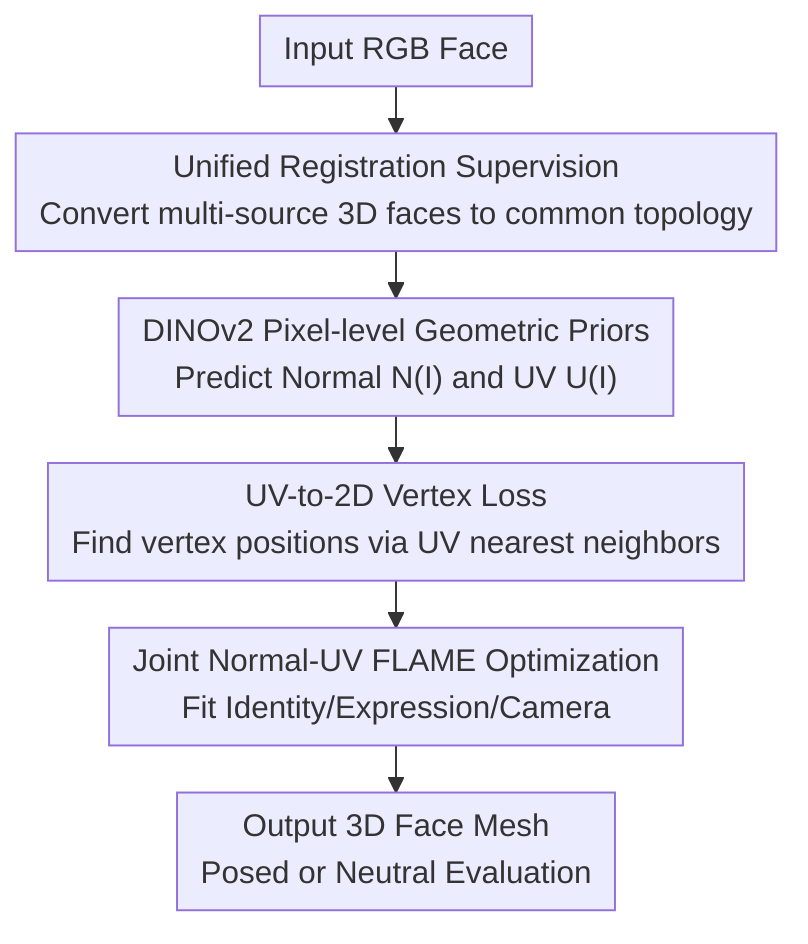

# Pixel3DMM: Versatile Screen-Space Priors for Single-Image 3D Face Reconstruction

**Conference**: ICLR2026  
**OpenReview**: [https://openreview.net/forum?id=UmOdd5KQ8K](https://openreview.net/forum?id=UmOdd5KQ8K)  
**Code**: To be released  
**Area**: 3D Vision / Single-Image 3D Face Reconstruction  
**Keywords**: 3D Face Reconstruction, 3DMM, FLAME, Surface Normals, UV Coordinates

## TL;DR
Pixel3DMM utilizes DINOv2-driven pixel-level normal and UV coordinate priors to constrain FLAME optimization, significantly improving 3D face reconstruction accuracy—especially in exaggerated expression scenarios—and proposes a new benchmark for simultaneously evaluating posed and neutral geometry.

## Background & Motivation
**Background**: Common routes for single-image 3D face reconstruction include direct regression of 3DMM/FLAME parameters (fast and scalable) or test-time optimization of a 3DMM to align the projected model with image observations, landmarks, or dense correspondences. 3DMMs are well-suited for downstream tasks like animation, AR/VR, video conferencing, and digital humans due to their low-dimensional and interpretable space for identity and expression.

**Limitations of Prior Work**: Single RGB images lack depth, and lighting, shadows, and skin texture are often entangled with geometric deformation. Sparse landmarks provide insufficient constraints for regions like the lips, cheeks, and extreme profiles. Photometric loss is easily misled by albedo and lighting. While convenient, direct parameter regression methods often underfit or overfit expressions on extreme inputs, making it difficult to recover accurate posed geometry.

**Key Challenge**: Face reconstruction requires both the structural prior of a 3DMM to mitigate unconstrained 3D ambiguity and denser, more geometric image evidence than landmarks to inform the optimizer exactly how the face is currently bulging, opening, or rotating. Relying solely on the 3DMM flattens expression details, while relying solely on image color leads to optimization driven by texture and lighting.

**Goal**: The authors aim to predict two types of screen-space geometric cues from a single image: surface normals for every visible pixel and UV coordinates mapping each pixel to the FLAME template. These cues are then converted into constraints for FLAME fitting to simultaneously recover identity, expression, jaw pose, camera pose, and intrinsics.

**Key Insight**: Foundation models like DINOv2 already possess strong generalized visual features but do not directly output 3D facial geometry. Rather than training a massive 3D network from scratch, DINOv2 is fine-tuned into a "facial geometry expert," using high-quality 3D face data to supervise the prediction of pixel-aligned geometric cues.

**Core Idea**: Replace sparse landmarks or pure photometric constraints with face-oriented pixel-level normal and UV predictions, reframing single-image reconstruction as FLAME parameter optimization driven by screen-space geometric priors.

## Method

### Overall Architecture
Pixel3DMM is divided into prior learning during training and FLAME fitting during testing. In the training phase, three high-quality 3D face datasets (NPHM, FaceScape, Ava256) are unified via registration to the FLAME topology. RGB, normal, and UV supervision signals are rendered to fine-tune two DINOv2-ViT networks to predict $N(I)$ and $U(I)$. During inference, given a single input image, the networks output normal and UV coordinate maps. The UV map is then converted into 2D target positions for each FLAME vertex, which, along with normal rendering losses and identity/expression regularizations, are used to optimize FLAME and camera parameters.

In this framework, data registration and the prior networks address "where to source reliable, dense 3D supervision"; the UV-to-2D vertex loss addresses "how to convert pixel predictions into usable correspondences for the optimizer"; and the joint energy terms address "how to maintain stability between expression geometry and identity decoupling." All three components converge on one goal: making single-image FLAME fitting rely on pixel-level geometric evidence rather than just sparse points or color.

### Key Designs
**1. Unified Registration Supervision: Creating a Common Topology Training Set**

The supervision signals for Pixel3DMM are not standard 2D annotations but rather the normal and FLAME UV coordinates corresponding to each pixel. To obtain these, the authors unified three 3D face datasets (NPHM, FaceScape, Ava256) into the FLAME topology: NPHM provides 376k sets of RGB/normal/UV from 470 identities; FaceScape provides ~350k sets from 350 identities; and Ava256 provides ~250k sets from video data using furthest point sampling for diverse expressions.

The value of this step lies in ensuring all training samples share the same template semantics: a specific UV coordinate always maps to the same facial location, and a normal pixel always originates from the real or registered 3D surface. To mitigate the simple lighting in FaceScape and Ava256, authors used IC-Light for diffusion-based relighting, increasing variation in background and illumination.

**2. DINOv2 Pixel-level Geometric Priors: Converting Foundation Features to Normals and UVs**

The model consists of two networks, $N: \mathbb{R}^{512\times512\times3}\rightarrow[-1,1]^{512\times512\times3}$ and $U: \mathbb{R}^{512\times512\times3}\rightarrow[0,1]^{512\times512\times2}$, outputting surface normals and UV coordinates, respectively. Both share a common design: a pre-trained DINOv2 ViT backbone followed by 4 transformer blocks and 3 up-convolutions to restore $32\times32$ features to $256\times256$, with a final linear layer to unpatchify to $512\times512\times c$.

The key is the restrained learning rate: the DINOv2 backbone is not fully frozen but updated at 1/10th the learning rate of the prediction heads. This retains the foundation model's generalization to in-the-wild images, occlusions, and lighting while allowing adaptation to facial geometry tasks. The training objective is pixel regression within the foreground mask: minimize $\|f(I^k)_p-Y^k_p\|_2$ for sample $k$ and pixel $p\in M^k$.

**3. UV-to-2D Vertex Loss: Converting UV Maps to Convergent Vertex Constraints**

If one directly computed pixel-level differences between the currently rendered UV map and the predicted $U(I)$, the optimization's basin of attraction would be narrow. Pixel3DMM instead looks up the 2D position for each visible FLAME vertex from the predicted UV map. For vertex $v$ with template UV coordinates $T^{uv}_v$, the nearest neighbor pixel $p^*_v$ is found in the predicted map: $p^*_v=\arg\min_{p\in P}\|T^{uv}_v-U(I)_p\|$.

The loss then compares "where the network thinks the vertex should be" with "where the current FLAME vertex projects": $L_{uv}=\sum_{v\in V}\mathbf{1}_{\|T^{uv}_v-U(I)_{p^*_v}\|<\delta_{uv}}\cdot\|p^*_v-\pi(v)\|$. This converts UV predictions into dense 2D vertex supervision, retaining template semantics while covering a wider area than sparse landmarks.

**4. Joint Normal-UV FLAME Optimization: Constraining Expression, Pose, and Identity**

The variables optimized during testing include FLAME identity $z_{id}\in\mathbb{R}^{300}$, expression $z_{ex}\in\mathbb{R}^{100}$, jaw rotation $\theta\in SO(3)$, and camera parameters. The total energy is defined as $E=\lambda_{uv}L_{uv}+\lambda_nL_n+R$, where $L_n=|N(I)-render_n(V)|$ compares predicted and rendered normals, and $R=\lambda_{id}\|z_{id}-z^{MICA}_{id}\|_2^2+\lambda_{ex}\|z_{ex}\|_2^2$ uses MICA's identity prediction as an anchor.

The energy terms have clear roles: the UV vertex loss provides semantic positioning, the normal loss provides local surface orientation and wrinkles, and the MICA regularization prevents identity and expression from being misinterpreted as one another.

### Loss & Training
The prior networks were trained using Adam with a batch size of 40 on 2 A6000 GPUs for approximately 3 days. Predictor head learning rates were $1\times10^{-4}$, and the DINO backbone was $1\times10^{-5}$.

FLAME fitting also utilizes Adam. The learning rates were $lr_{id}=0.001$ and $lr_{ex}=0.003$. Weights were set to $\lambda_{uv}=2000$, $\lambda_n=200$, $\lambda_{id}=0.15$, and $\lambda_{ex}=0.01$. Single-image fitting runs for 500 steps, taking approximately 30 seconds in an unoptimized implementation.

## Key Experimental Results

### Main Results
The main experiments compare Pixel3DMM on a new benchmark, existing NoW/FaceScape benchmarks, and surface normal estimation. The new benchmark is crucial as it evaluates both posed and neutral geometry, specifically covering extreme expressions.

| Dataset / Task | Metric | Ours | Best Baseline | Gain |
| :--- | :--- | :--- | :--- | :--- |
| New Benchmark / Posed | L1 Chamfer ↓ | 1.66 | FlowFace 1.96 | ~15.3% Lower |
| New Benchmark / Posed | R2.5 ↑ | 91.6 | FlowFace 87.9 | +3.7 |
| New Benchmark / Neutral | L1 Chamfer ↓ | 1.66 | MICA 1.68 / FlowFace 1.93 | Slightly > MICA |
| FaceScape | Chamfer Distance ↓ | 1.76 | FlowFace 2.21 | ~20.4% Lower |
| NoW | Median / Mean ↓ | 0.87 / 1.07 | FlowFace 0.87 / 1.07 | Parity |

On the new benchmark, Ours shows the most significant advantage in posed tasks. While neutral reconstruction gains are smaller, it indicates that identity/expression decoupling remains a challenge under single-image conditions.

### Ablation Study
Ablations demonstrate two points: traditional landmark/photometric terms are insufficient for extreme expressions, and the Normal/UV priors are complementary.

| Configuration | Neutral L1 ↓ | Posed L1 ↓ | Posed R2.5 ↑ | Description |
| :--- | :--- | :--- | :--- | :--- |
| Lmks. | 1.68 | 2.02 | 85.7 | Landmark-only constraints fail on posed geometry |
| Lmks.+Pho. | 1.69 | 2.05 | 85.4 | Photometric loss offers no improvement |
| Ours+Lmks.+Pho. | 1.68 | 1.86 | 88.3 | Traditional terms degrade the full model |
| Only U | 1.66 | 1.72 | 90.6 | UV vertex constraints are strong but lack local tilt |
| Only N | 1.69 | 1.70 | 91.0 | Normals recover orientation but lack semantic pos. |
| Ours | 1.66 | 1.66 | 91.6 | Normal + UV + MICA Reg is most stable |

### Key Findings
- The primary Gain of Pixel3DMM comes from posed reconstruction: pixel-level geometric priors are more reliable than feed-forward regression or traditional optimization in extreme expressions and diverse views.
- UV and Normal priors are highly complementary: UV provides dense semantic correspondence, while normals provide local geometric orientation.
- MICA identity prediction is essential for neutral reconstruction; removing it increases Neutral L1 from 1.66 to 1.90, showing identity/expression "leakage."
- Neutral-only benchmarks like NoW do not fully reflect reconstruction capabilities for extreme expressions.

## Highlights & Insights
- Fine-tuning DINOv2 as a "pixel-level 3DMM prior" is an effective strategy; it preserves the interpretable parameter space of FLAME while leveraging foundation features for geometric evidence.
- The UV loss formulation is more practical than direct UV rendering. By finding vertex targets via nearest neighbors, it behaves like dense 2D vertex supervision, making it easier to pull the optimization toward the correct region even with poor initialization.
- The new benchmark's posed + neutral dual-task setup is highly valuable, as many methods can fit a current expression without accurately recovering the neutral identity.
- Traditional photometric terms are not inherently beneficial in 3D face optimization; geometric predictions are more stable intermediate representations when image color and lighting are ambiguous.

## Limitations & Future Work
- Single-image decoupling of identity and expression remains difficult; optimization-based methods still tend to entangle the two.
- FLAME's expressive capacity limits extreme mouth movements; registration errors in training data can propagate to the networks.
- Inference speed is not yet real-time (30s for 500 steps), suggesting a need for distillation or faster initialization.
- Currently, the priors only consider single-view images; future work could utilize multi-frame information for better temporal consistency.

## Related Work & Insights
- **vs. DECA / EMOCA**: These regress FLAME parameters directly. Pixel3DMM avoids direct regression in favor of predicting geometric cues for optimization, better utilizing dense deformation evidence in the input.
- **vs. FlowFace**: FlowFace predicts flow from UV space to image space. Ours predicts UV from image pixels and introduces a normal prior, proving more robust in extreme expression scenarios.
- **vs. Sapiens / DAViD**: General normal estimators (Sapiens) or those trained on synthetic data (DAViD) are outperformed by Ours' face-specific normals trained on registered real 3D data.

## Rating
- Novelty: ⭐⭐⭐⭐☆ (Strong combination of screen-space priors with FLAME optimization).
- Experimental Thoroughness: ⭐⭐⭐⭐⭐ (Comprehensive benchmarks and detailed ablations).
- Writing Quality: ⭐⭐⭐⭐☆ (Clear structure and well-supported conclusions).
- Value: ⭐⭐⭐⭐⭐ (Directly advances single-image 3DMM fitting and expression capture).

<!-- RELATED:START -->

## Related Papers

- [\[ICCV 2025\] FaceLift: Learning Generalizable Single Image 3D Face Reconstruction from Synthetic Heads](../../ICCV2025/3d_vision/facelift_learning_generalizable_single_image_3d_face_reconstruction_from_synthet.md)
- [\[ECCV 2024\] Compress3D: a Compressed Latent Space for 3D Generation from a Single Image](../../ECCV2024/3d_vision/compress3d_a_compressed_latent_space_for_3d_generation_from_a_single_image.md)
- [\[CVPR 2026\] Human Interaction-Aware 3D Reconstruction from a Single Image](../../CVPR2026/3d_vision/human_interaction-aware_3d_reconstruction_from_a_single_image.md)
- [\[AAAI 2026\] 3D-Free Meets 3D Priors: Novel View Synthesis from a Single Image with Pretrained Diffusion Guidance](../../AAAI2026/3d_vision/3d-free_meets_3d_priors_novel_view_synthesis_from_a_single_image_with_pretrained.md)
- [\[ICLR 2026\] One2Scene: Geometric Consistent Explorable 3D Scene Generation from a Single Image](one2scene_geometric_consistent_explorable_3d_scene_generation_from_a_single_imag.md)

<!-- RELATED:END -->
