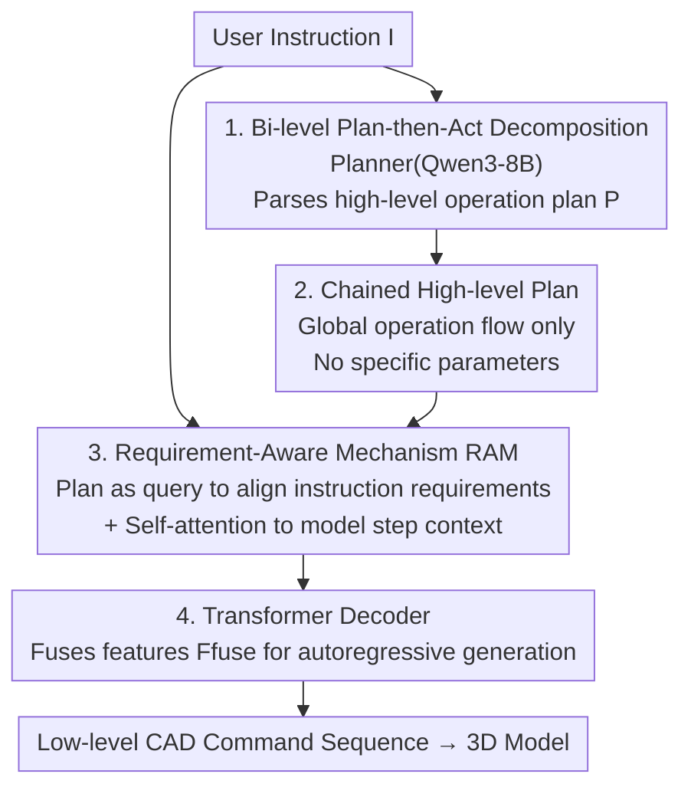

# Plan then Act: Bi-level CAD Command Sequence Generation

**Conference**: ICLR 2026  
**OpenReview**: [https://openreview.net/forum?id=LhE03r8X8z](https://openreview.net/forum?id=LhE03r8X8z)  
**Code**: [https://github.com/QiferG/Plan-then-Act](https://github.com/QiferG/Plan-then-Act)  
**Area**: 3D Vision / CAD Generation / Text-to-3D  
**Keywords**: CAD command sequence, text-to-CAD, bi-level generation, requirement-aware mechanism, LLM planning

## TL;DR
To address the poor quality of CAD command sequences directly generated by LLMs, this paper proposes PTA: a fine-tuned Planner (Qwen3-8B) first parses user text into a "chained high-level operation plan," which is then implemented by an Actioner equipped with a Requirement-Aware Mechanism (RAM) into executable low-level CAD command sequences. PTA reduces the invalid rate to 0.85% and achieves leading performance across various geometric metrics on the Text2CAD dataset.

## Background & Motivation

**Background**: Computer-Aided Design (CAD) is the cornerstone of industrial digital design, but it requires professional skills in parameter configuration and geometric constraints, making the modeling process tedious and time-consuming. Recently, "text-driven CAD generation" has become a hotspot—representing CAD models as **command sequences** (2D sketch primitives + 3D operations like extrusion, as proposed by DeepCAD), allowing users to describe requirements in natural language for the model to generate the sequence autoregressively. Early methods (Text2CAD, CAD Translator) trained text encoders from scratch with limited semantic parsing capabilities; later works shifted to using large-scale pre-trained LLMs to understand instructions and generate sequences.

**Limitations of Prior Work**: The authors performed key pilot experiments (Section 3) and found that **pre-trained LLMs are not good at directly outputting task-specific low-level CAD control sequences**. The Invalid Rate (IR) for sequences directly generated by GPT-4o reached 70.35%; even with fine-tuned LLaMA3.1-8B and Qwen3-8B, the IR remained at 33.46% and 20.06%, respectively. Applying DPO to the fine-tuned Qwen3-8B only reduced the IR to 18.29%. In short, a large number of token combinations in the sequences cannot be correctly executed as 3D models.

**Key Challenge**: Low-level CAD command chains are highly structured "machine languages" with strong constraints (precise coordinates, Boolean operations, end markers, etc.), while the strength of LLMs lies in semantic understanding and reasoning. Forcing an LLM to jump from abstract descriptions to precise control codes in one step—requiring both global structure planning and precise parameter calculation—exceeds its stable capability range, leading to hallucinations that pollute the parameters.

**Goal**: Instead of a one-step generation, decouple "understanding intent and planning structure" from "generating precise control codes," assigning each task to its most suitable module.

**Key Insight**: Inspired by human planning strategies, the authors hypothesized that **decomposing abstract instructions into chained operation plans first improves the accuracy of command sequence generation**. Controlled experiments verified this: on a task-specific model trained from scratch, the Median CD was 200.32 and F1 was 45.16 with instructions only; providing an additional operation plan reduced Median CD to 104.56, increased F1 to 67.42, and dropped IR from 2.66% to 0.63%. Planning is indeed effective.

**Core Idea**: Use LLMs for "planning" rather than "execution"—parse instructions into high-level operation plans first, then use a specialized module to combine the plan with requirement details from the original instructions to generate precise low-level command sequences (i.e., "Plan then Act").

## Method

### Overall Architecture

PTA is a **bi-level generation** framework that takes a natural language user instruction as input and outputs an executable low-level CAD command sequence. The process consists of two serial stages:

-   **High-level stage (Planner)**: Qwen3-8B is fine-tuned as a CAD planner, taking instruction $I$ as input and outputting a chained high-level operation plan $P = \text{Planner}(I)$ (e.g., "1. Draw circle → 2. Extrude into disk → 3. Select top face → 4. Draw second circle → 5. Extrude into cylinder"). The plan describes only the **global operation flow** without specific parameters.
-   **Low-level stage (Actioner)**: The original instruction $I$ and high-level plan $P$ are fed into the Actioner to obtain $\hat{C} = \text{Actioner}(I, P)$. Inside the Actioner, a weight-shared BERT text encoder encodes the instruction and plan into $F_{inst}$ and $F_{plan}$, respectively. These are fused into $F_{fuse}$ via the **Requirement-Aware Mechanism (RAM)**, and finally, a Transformer decoder generates the command sequence autoregressively.

A bi-level approach is used rather than treating the plan as a detailed instruction because the high-level plan only provides "global guidance" and lacks dimensions or geometric constraints (the **requirement details**). These details are scattered in the original instruction and must be accurately aligned with each operation step—which is exactly what RAM addresses.

### Key Designs

**1. Bi-level Plan-then-Act Decomposition: Splitting "Planning" and "Execution"**

This is the core of the paper. Directly generating low-level sequences with LLMs results in extremely high invalid rates (70% for GPT-4o, 20% for fine-tuned Qwen3-8B). The authors split the task into two levels: the high level lets the LLM perform semantic parsing and reasoning to produce a coarse-grained chained operation plan $P=\text{Planner}(I)$; the low level uses a lightweight Actioner specifically trained for CAD command syntax, $\hat{C}=\text{Actioner}(I,P)$. Ablation results (Table 2) highlight the importance: if the fine-tuned Planner directly generates low-level sequences (Planner only), performance is poor (IR 20.06% on L0); if the high-level plan is removed (Actioner only), CD/F1 are significantly worse than the full PTA (L0 Median CD 200.32 vs 113.79). Both levels are indispensable—the plan provides the structural skeleton, and the Actioner translates it into legal, precise control codes, reducing IR to 0.63%.

**2. Chained High-Level Plan: Global Flow without Parameters to Avoid Hallucinations**

One might ask: why not let the Planner generate detailed low-level operations including parameters? The authors found that LLM hallucinations introduce significant errors when generating specific operation types and parameters. Therefore, the Planner is only required to produce a "relatively simple but clear high-level flow"—each step generalizes low-level actions without precise parameters. Full-parameter SFT is performed on Qwen3-8B using paired $(I, P)$ with few-shot prompts, targeting:
$$L_{plan} = -\sum_{t=1}^{T} \log P(p_t \mid p_{<t}, I, \text{Prompt}).$$
The supervision signal for $P$ is "aggregated/refined" from the NLI data provided by Text2CAD using Qwen2.5-32B. A comparison (Table 4) shows that using NLI data with parameters as the plan (forcing the Planner to generate detailed flows) actually performs worse (Median CD 156.00 vs 113.79, IR 2.46% vs 0.63%)—because the Actioner degrades into a pure translator, putting all accuracy pressure back on the hallucination-prone LLM. Leaving parameter generation to the more deterministic Actioner is a crucial design choice.

**3. Requirement-Aware Mechanism (RAM): Precise Alignment of Requirements per Step**

High-level plans lack details, while original instructions contain them; however, the entire instruction should not be fed indiscriminately to every operation step. Each step (e.g., "Draw circle") should only focus on its relevant requirement (e.g., "radius is half of the base"). RAM solves this with two-level multi-head attention. First, **cross-attention** uses plan features as queries and instruction features as keys/values to retrieve relevant requirement information for each step:
$$O = \text{Atten}_1(Q_1=F_{plan},\ K_1=V_1=F_{inst}).$$
Then, $O$ and $F_{plan}$ are summed for a preliminary fused vector. Second, **self-attention** models the associations between steps (since steps are not isolated; the result of a previous step determines the face for the next):
$$F_{fuse} = \text{Atten}_2(Q_2=K_2=V_2=F_{plan}+O).$$
Finally, $F_{fuse}$ guides the decoder. Ablations (Table 3) show that using $F_{plan}$ only (ignoring instruction requirements) performs the worst (L0 Median CD 259.31); simple Concat or Add operations improve results but are inferior to RAM. RAM achieves the lowest CD and highest F1 across levels, proving that "per-step requirement retrieval followed by inter-step context modeling" utilizes requirements more effectively than brute-force splicing.

**4. CAD-oriented Transformer Decoder: Translating Fused Guidance into Command Chains**

The CAD command sequence is represented as a chain of sketch primitives and extrusion operations. Each token is a 2D token (encoding 2D coordinates of sketch primitives, extrusion parameters like Euler angles/distance/Boolean operations/scaling, or end markers like curve/loop/sketch/end), initialized as 256-dimensional one-hot vectors. The sequence is split into $x$ and $y$ embedding paths with positional encoding: $F^0_{t-1} = C^x_{1:t-1}W^x_{t-1} + C^y_{1:t-1}W^y_{t-1} + pos$. The decoder contains 8 blocks; each block performs self-attention on the command sequence embeddings, then retrieves guidance from $F_{fuse}$ as query, refining step-by-step. The MLP finally outputs executable commands. The training objective is standard autoregressive cross-entropy:
$$L_{act} = -\sum_{t=1}^{N_c} \log P(c_t \mid c_{<t}, I, P).$$
During inference, the plan is automatically generated from instructions by the fine-tuned Planner, imposing no extra burden on users.

### Mechanism Example

Consider the instruction: "This CAD model has a disc base, with a cylinder at the center of the base, and the cylinder's radius is half that of the base."

1.  **Planner** parses the chained plan: ① Draw circle → ② Extrude into disk → ③ Select top face of disk → ④ Draw second circle → ⑤ Extrude into cylinder. Note that parameters like "radius is half" are **not** in the plan.
2.  **Actioner** passes instruction and plan through BERT to get $F_{inst}$ and $F_{plan}$.
3.  **RAM** cross-attention allows the "draw second circle" step (query) to retrieve "radius is half the base" from the instruction; self-attention makes "⑤ Extrude into cylinder" aware that it builds on "③ Select top face."
4.  **Decoder** generates the legal sequence token-by-token based on $F_{fuse}$: `<SOL> Circle(...) Extrude(...) Circle(0.x, ...) Extrude(...) <EOS>`, where parameters match the "halved radius" requirement. Execution results in the correct disk+cylinder model.

## Key Experimental Results

The dataset is the public Text2CAD (170k CAD command sequences, each corresponding to instructions across four abstraction levels L0–L3, totaling 660k text entries; split into 150k training / 8k testing). Metrics include GPT-4V preference evaluation, Chamfer Distance (CD), F1 (Sketch/Extrude primitives), Invalid Ratio (IR), JSD, COV, and MMD. Baselines: Text2CAD (SOTA text-to-CAD), DeepCAD (classic VAE sequence generation with BERT encoder for text), LLaMA3.1-8B, GPT-4o.

### Main Results (Comparison with SOTA, selected L0 Abstract / L1 Beginner)

| Level | Method | GPT-4V↑ | Median CD↓ | Sketch F1↑ | IR↓ |
| :--- | :--- | :--- | :--- | :--- | :--- |
| L0 Abstract | GPT-4o | 7.60 | 247.11 | 10.37 | 70.35 |
| L0 Abstract | Text2CAD | 23.90 | 187.31 | 24.22 | 1.78 |
| L0 Abstract | **PTA (Ours)** | **44.30** | **113.79** | **40.63** | **0.63** |
| L1 Beginner | Text2CAD | 20.50 | 206.28 | 21.87 | 1.50 |
| L1 Beginner | **PTA (Ours)** | **40.90** | **142.50** | **37.50** | **0.68** |

PTA outperformed baselines in GPT-4V, CD, JSD, MMD, COV, F1, and IR across all four levels. Median CD improved by 39% and 31% on L0/L1, respectively, and JSD improved by ~79%/80%. Sketch F1 increased by 11.11/8.33. The average IR across the four levels was only 0.85%, meaning the execution success rate is ~99.15%.

### Ablation Study

| Dimension | Configuration | L0 Median CD↓ | L0 IR↓ | Description |
| :--- | :--- | :--- | :--- | :--- |
| Bi-level vs. Single (Table 2) | Planner only | 218.97 | 20.06 | Direct LLM generation, high IR |
| | Actioner only | 200.32 | 2.66 | No high-level plan, CD significantly worse |
| | **PTA** | **113.79** | **0.63** | Both levels are essential |
| RAM Fusion (Table 3) | $F_{plan}$ only | 259.31 | 3.05 | No instruction requirements, worst |
| | Concat | 159.98 | 2.32 | Simple concatenation |
| | Add | 163.27 | 2.92 | Simple addition |
| | **RAM** | **113.79** | **0.63** | Retrieval + context modeling, optimal |
| Plan Type (Table 4) | nli data plan | 156.00 | 2.46 | Detailed parameters force LLM precision → worse |
| | **high-level plan** | **113.79** | **0.63** | Global flow only → better |

### Key Findings
-   **Bi-level structure is the main performance source**: Using the Planner or Actioner alone is significantly inferior to the full PTA; synergy between them drops IR from the 20% range to 0.6%.
-   **Plans should be "coarse" rather than "fine"**: Using NLI data with parameters as the plan performed worse, confirming the philosophy of "leaving parameter precision to the Actioner and using LLMs only for coarse planning to avoid hallucinations."
-   **RAM is superior to concatenation/addition**: Structured "per-step retrieval + inter-step self-attention" utilizes requirement information better than crude concatenation.
-   **Failure Modes**: When instructions contain rare descriptions (e.g., "teardrop shape," "like a building or roof"), PTA struggles to fully satisfy requirements but still captures the basic shape (arc+line combinations); data augmentation is suggested for rare descriptions.

## Highlights & Insights
-   **"LLM for planning, not execution" is a transferable paradigm**: For any task where the output is a strongly structured, highly constrained "machine language" (CAD sequences, CAD code, CNC G-code, circuit netlists, formal proof scripts), a bi-level structure—LLM for high-level plan + specialized deterministic module for precise code—can block hallucinations from parameter generation.
-   **Plan granularity is a design variable**: The counter-intuitive finding in Table 4—that more detailed plans (NLI) are worse—reveals a universal lesson: putting too much accuracy burden on a hallucination-prone generator is harmful. Plans should hit the "sweet spot" of clear structure but empty parameters.
-   **Effective RAM query/key assignment**: Using the plan as query and instruction as key/value naturally implements the semantic alignment of "finding corresponding requirements in the instruction for each operation step," which is more structural than simply concatenating two text blocks.

## Limitations & Future Work
-   **Dependency on high-quality plan supervision**: High-level plans are aggregated from Text2CAD's NLI data using Qwen2.5-32B; plan quality directly affects the Planner, requiring plan construction when moving to new datasets without NLI data.
-   **Weak generalization to rare/creative descriptions**: The authors acknowledge inaccuracies for rare shape descriptions (teardrops, building outlines), suggesting that the method is inherently constrained by the training distribution.
-   **Single modality and dataset validation**: Evaluated only on Text2CAD text conditions; future exploration into multi-modal conditions (text+image+point cloud) for CAD generation is planned but currently unverified.
-   **Actioner capacity limit unknown**: The Transformer decoder has a maximum sequence length of 272; there is no discussion on whether the bi-level approach maintains low IR for ultra-long/complex models with many operation steps.

## Related Work & Insights
-   **vs. Text2CAD**: Text2CAD is an end-to-end translation of text to command sequences; PTA inserts the "high-level plan" layer and uses RAM to explicitly align requirement details. PTA leads in GPT-4V, CD, F1, and IR, especially for abstract/beginner instructions—showing that explicit planning yields higher returns as instructions become more abstract.
-   **vs. DeepCAD**: DeepCAD is a classic VAE sequence generator that does not accept text (the experiment used a BERT encoder); PTA's contribution lies in the text→plan→sequence parsing pipeline, making the roles complementary.
-   **vs. Direct LLM generation (GPT-4o / LLaMA3.1)**: The pilot experiments provide a strong contrast—direct LLM generation of low-level sequences results in IRs of 20%–70%, proving the "direct generation" route is unfeasible for strongly constrained sequences like CAD and establishing the necessity of the bi-level approach.

## Rating
- Novelty: ⭐⭐⭐⭐ Applying the "LLM Planning + Specialized Module Execution" paradigm to CAD sequences and arguing that "coarse plans are better than fine ones" is insightful.
- Experimental Thoroughness: ⭐⭐⭐⭐ Evaluation across four levels × seven metrics + three ablation studies (bi-level/RAM/plan type) + failure analysis provides a complete argument chain.
- Writing Quality: ⭐⭐⭐⭐ Pilot experiments on IR are highly persuasive, and methods/formulas are clearly presented.
- Value: ⭐⭐⭐⭐ Pushing the execution success rate of text-to-CAD to ~99% has practical significance for CAD automation, and the paradigm is transferable to other structural generation tasks.

<!-- RELATED:START -->

## Related Papers

- [\[ICLR 2026\] Scaling Sequence-to-Sequence Generative Neural Rendering](scaling_sequence-to-sequence_generative_neural_rendering.md)
- [\[CVPR 2026\] AutoRegressive Generation with B-rep Holistic Token Sequence Representation](../../CVPR2026/3d_vision/autoregressive_generation_with_b-rep_holistic_token_sequence_representation.md)
- [\[ICLR 2026\] Sat3DGen: Comprehensive Street-level 3D Scene Generation from Single Satellite Image](sat3dgen_comprehensive_street-level_3d_scene_generation_from_single_satellite_im.md)
- [\[CVPR 2026\] Think-Then-Generate: Structural Chain-of-Thought Reasoning for Consistent 3D Generation](../../CVPR2026/3d_vision/think-then-generate_structural_chain-of-thought_reasoning_for_consistent_3d_gene.md)
- [\[CVPR 2025\] CADDreamer: CAD Object Generation from Single-view Images](../../CVPR2025/3d_vision/caddreamer_cad_object_generation_from_single-view_images.md)

<!-- RELATED:END -->
