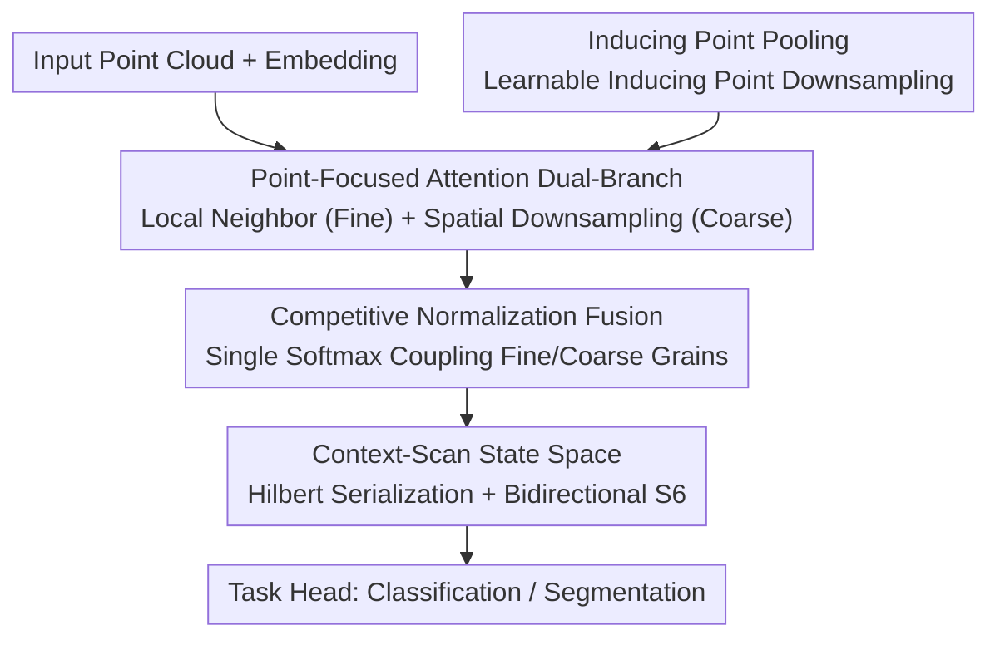

# Point-Focused Attention Meets Context-Scan State Space: Robust Biological Visual Perception for Point Cloud Representation

**Conference**: ICLR 2026  
**OpenReview**: [https://openreview.net/forum?id=KQPoMbxInu](https://openreview.net/forum?id=KQPoMbxInu)  
**Code**: https://github.com/Point-Cloud-Learning/PointLearner  
**Area**: 3D Vision / Point Cloud Representation Learning  
**Keywords**: Point Cloud, Foveal Vision, Attention, State Space Model, Hilbert Curve

## TL;DR
PointLearner utilizes a biomimetic "focus-then-scan" design—Point-Focused Attention (simulating foveal vision) and Context-Scan State Space (simulating saccadic reasoning)—to model local fine-grained structures and global long-range dependencies under linear complexity. It achieves SOTA performance on ModelNet40/ScanObjectNN/ShapeNet/S3DIS and demonstrates strong robustness to noise and sparse sampling.

## Background & Motivation

**Background**: Point cloud representation learning is currently dominated by local attention networks (e.g., Point Transformer series). These networks limit attention calculations to local neighborhoods or windows for each point, reducing complexity from quadratic to linear relative to the number of points. Another research direction introduces Selective State Space Models (S6) from Mamba into point clouds, leveraging "linear complexity + long-range modeling" for global interactions.

**Limitations of Prior Work**: To save computation, local attention narrows the receptive field, sacrificing the global sensing capability inherent to attention mechanisms. This results in insufficient modeling of long-range dependencies between objects in a scene. Conversely, bidirectional S6 reaches the other extreme by compressing all context into "historical hidden states" for global connectivity, which results in inadequate learning of local fine-grained structures.

**Key Challenge**: There is a trade-off between "local fine-grained structure" and "global contextual dependency." Attention excels at the former but struggles with the latter (unless quadratic complexity is accepted), whereas SSM excels at the latter but is weaker at the former. Simultaneously capturing both within linear complexity is a core challenge in point cloud representation learning.

**Key Insight**: The authors draw inspiration from the human visual system. Human foveal vision exhibits significant spatial non-uniformity: extremely high acuity near the focal point (to distinguish details), with acuity decreasing as eccentricity increases (the periphery performs coarse processing). Furthermore, vision is dynamic, relying on continuous saccades to collect information across a sequence of focal points to infer the semantic structure of a scene. This mechanism naturally integrates "local refinement at the focus" and "global reasoning across foci," corresponding directly to the aforementioned trade-off in point clouds.

**Core Idea**: A biomimetic "focus-then-context" network is constructed. It first uses **Point-Focused Attention** at each point's focus to simulate foveal vision (fine local + coarse peripheral). Subsequently, it uses **Context-Scan State Space** along a Hilbert scan path to simulate saccades for global reasoning. Combining the two in series allows for the simultaneous capture of local and global features under linear complexity.

## Method

### Overall Architecture
PointLearner follows a standard Point Transformer-style encoder-decoder structure. Point clouds are projected into high-dimensional space via MLP embedding, then pass through hierarchical residual encoding-decoding layers (downsampling using FPS, upsampling using linear interpolation). Finally, they reach a recognition head (average pooling + MLP for category logits) or a segmentation head (point-wise MLP). The innovation lies in the core component of each layer: the **PointLearner block**. It sequentially performs **Point-Focused Attention (PFA)** for local-global fusion at the focus and **Context-Scan State Space (CSSS)** for scene-level reasoning along the scan path—"focus first, then scan."

PFA follows a dual-branch design: a local neighbor branch for fine-grained perception near the focus, and a spatial downsampling branch for coarse-grained global semantic perception. Downsampling is achieved via **Inducing Point Pooling**. The two branches are coupled within a single softmax through **Competitive Normalization Fusion**. CSSS then utilizes a **Hilbert curve** to serialize PFA features, which are fed into a **bidirectional S6** for geometric reasoning.

### Key Designs

**1. Point-Focused Attention Dual-Branch: Simulating Foveal "Fine Focus, Coarse Periphery" per Point**

This design addresses the limitation where local attention has a narrow receptive field. For each query point $p_i$, the Local Neighbor Branch (LNB) performs standard attention over $K$ neighbors $\mathcal{N}_i$ found via KNN to provide high-acuity fine-grained perception: $A_i^l=\mathrm{softmax}(\langle Q_i^l,K_{\mathcal{N}_i}^l\rangle/\sqrt{D})$, $\mathrm{LNB}(p_i)=A_i^l V_{\mathcal{N}_i}^l$. Simultaneously, the Spatial Downsampling Branch (SDB) allows the same query point to attend to a set of "spatial downsampled features" $S\in\mathbb{R}^{M\times D}$ to maintain low-acuity coarse perception of global semantics: $A_i^s=\mathrm{softmax}(\langle Q_i^s,K^s\rangle/\sqrt{D})$, $\mathrm{SDB}(p_i)=A_i^s V^s$. These branches simulate foveal spatial non-uniformity, ensuring each point perceives both local geometry and distant scene semantics.

**2. Inducing Point Pooling: Downsampling with Learnable Inducing Points for Non-uniform Distributions**

The SDB requires a compact set of global features $S$. Unlike 2D images, point clouds cannot rely on uniform average pooling for downsampling, and common FPS requires small sampling rates to cover the global space, which increases computational costs. Drawing from inducing point ideas in Sparse Gaussian Processes, $M$ trainable $D$-dimensional vectors $I\in\mathbb{R}^{M\times D}$ (inducing points) are defined. These interact directly with data points via attention to "summarize" the point cloud: $S=\mathrm{IPP}(F)=\mathrm{softmax}(\langle I,K^p\rangle/\sqrt{D})V^p$, where $(K^p,V^p)=(W_k^p,W_v^p)F$. Learnable inducing points adapt to non-uniform distributions and compress global semantics into $M$ tokens efficiently.

**3. Competitive Normalization Fusion: Coupling Coarse/Fine Grains within a Single Softmax**

Instead of a simple addition $\mathrm{PFA}(p_i)=\mathrm{LNB}(p_i)+\mathrm{SDB}(p_i)$, which fails to capture the dynamic interaction between scales, the authors concatenate query/key from both branches and perform **one** softmax: $A_i=\mathrm{softmax}(\mathrm{Concat}(Q_i^l,K_{\mathcal{N}_i}^l,Q_i^s,K^s)/\sqrt{D})$, $A_i^l,A_i^s=\mathrm{split}(A_i,[K,M])$, then $\mathrm{PFA}(p_i)=A_i^l V_{\mathcal{N}_i}^l+A_i^s V^s$. Because segments share the same normalization denominator, they **compete** for attention, allowing each point to adaptively select the most effective receptive field information. This improved OA from 93.43% to 94.17% with negligible overhead. The total complexity of PFA $\Omega(\mathrm{PFA})=6ND^2+2MD^2+2NKD+4NMD$ is linear with respect to $N$.

**4. Context-Scan State Space: Global Scene Reasoning via Hilbert Scanning and Bidirectional S6**

While PFA handles local-global fusion at the focus, CSSS simulates saccades for scene-level reasoning. It serializes the point cloud using a space-filling curve. The Hilbert curve is chosen over Z-Order for its superior locality preservation and self-similar rotation/scaling properties, which align with human saccadic visual search patterns. A single Hilbert curve provides a high-fidelity scan path. This sequence is fed into a bidirectional S6. Since standard S6 is a forward recursion that only "sees" preceding content, parallel forward and backward S6 layers are deployed to provide each point with a global receptive field, mirroring the way human eyes saccade back and forth to identify objects.

### Loss & Training
No additional loss reaches are introduced. The model uses standard supervised training with category logits for recognition and point-wise logits for segmentation. Ablations are performed on ModelNet40 across triplicate runs.

## Key Experimental Results

### Main Results
PointLearner (Hybrid architecture) achieves SOTA across four standard datasets:

| Dataset | Task | Metric | Ours | Prev. SOTA | Description |
|--------|------|------|------|----------|------|
| ModelNet40 | Object Recognition | OA | 94.2 | 93.8 (GAD, Attention) | Breaks the 93.2–93.8% saturation range |
| ShapeNet | Part Segmentation | Ins. mIoU | 86.9 | 86.4 (ReCon) | Outperforms pure Attention / pure SSM |
| S3DIS | Semantic Segmentation | mIoU | 74.3 | 73.8 (MVNet) | Leads on more difficult tasks |
| ScanObjectNN (PB_T50_RS) | Robust Recognition | OA | 89.8 | 89.3 (PointMamba) | Outperforms all existing models in noisy scenarios |

Efficiency (S3DIS, single inference, RTX 4090): PointLearner (52.78M param, 63ms latency, 6.5G VRAM, 74.3 mIoU) provides a superior computation-performance trade-off compared to PTv3 (46.17M/49ms/73.4) and HydraMamba (63.14M/54ms/73.6), and is significantly faster than Swin3D (71.15M/365ms/72.5).

### Ablation Study (ModelNet40, OA)

| Configuration | OA | Throughput | Description |
|------|------|-----------|------|
| Full (Bid. S6 + Competitive Fusion + Dual Branch) | 94.17 | 163FPS | Full Model |
| w/o Local Neighbor Branch (LNB) | 92.11 | 221FPS | -2.06, lack of fine-grained local sensing is most detrimental |
| w/o Spatial Downsampling Branch (SDB) | 93.06 | 183FPS | -1.11, lack of coarse global sensing |
| Additive Fusion (instead of Competitive) | 93.43 | 166FPS | -0.74, shallow addition is inferior to single softmax competition |
| Unidirectional S6 (instead of Bidirectional) | 93.08 | 181FPS | -1.09, lack of backward scan global field |
| PFA Only (No CSSS) | 92.93 | 198FPS | Focus without scanning |
| CSSS Only (No PFA) | 91.94 | 231FPS | Scan without focus, worst performance |

### Key Findings
- **LNB is the most critical**: Removing it drops OA by 2.06% (94.17 $\rightarrow$ 92.11), supporting the biomimetic intuition that fine-grained local refinement is the foundation of global reasoning.
- **PFA and CSSS are complementary**: Neither on its own reaches the 94.17% performance. Focus and scanning are both necessary.
- **Superior Robustness**: When sampling points drop from 1024 to 256, PointLearner only drops 2.2% OA, outperforming strong attention (GAD) and SSM (PCM) methods. This is attributed to the adaptive weighting of Competitive Normalization and CSSS reasoning.

## Highlights & Insights
- **Mapping biological mechanisms to specific operators**: Foveal vision (fine focus, coarse periphery) $\leftrightarrow$ dual-branch attention; Saccades (serialized scan + inference) $\leftrightarrow$ Hilbert + bidirectional S6. This mapping explains why the Attention-SSM hybrid compensates for individual weaknesses.
- **Competitive Normalization is a lightweight yet key trick**: Sharing a softmax denominator forces competition between scales for almost zero extra cost, yielding +0.74% OA. This "coupling via normalization" idea is transferable to other multi-scale fusion scenarios.
- **Inducing Point Pooling** uses learnable vectors to interact with data for downsampling, bypassing FPS issues in point clouds where sampling rates for global coverage dramatically increase computation.

## Limitations & Future Work
- Evaluation is concentrated on object recognition and indoor segmentation; large-scale outdoor/autonomous driving datasets (e.g., nuScenes, SemanticKITTI) are not covered.
- The block contains several components (dual-branch + IPP + Bidirectional S6). While complexity is linear, it is heavier than pure PTv3. Sensitivity to hyperparameters like $M$ and $K$ is not fully detailed.
- "Biomimetic" remains a structural analogy; it lacks quantitative comparison against real biological visual properties (e.g., eccentricity-acuity curves).

## Related Work & Insights
- **vs. Local Attention Networks (Point Transformer / PTv3)**: These limit attention for linear complexity but suffer from narrow fields. Ours uses SDB + CSSS to restore global modeling while maintaining linear complexity.
- **vs. Pure SSM approaches (PointMamba / PCM / Mamba3D)**: These compress context well but struggle with local structural learning. Ours uses PFA to explicitly supplement local details.
- **vs. Hybrid Architecture PoinTramba**: While both are hybrid Attention+SSM, this work organizes operators via the "fovea + saccade" mechanism and achieves better robustness and multi-task performance.

## Rating
- Novelty: ⭐⭐⭐⭐ Clear mapping from biological mechanisms to hybrid operators; clever use of competitive normalization and inducing points.
- Experimental Thoroughness: ⭐⭐⭐⭐ Four datasets + robustness/efficiency analysis + detailed ablations; lacks outdoor large-scale scenes.
- Writing Quality: ⭐⭐⭐⭐ Consistent biomimetic narrative; natural transition from motivation to method.
- Value: ⭐⭐⭐⭐ SOTA across multiple tasks with high robustness; the hybrid paradigm and downsampling components are reusable.

<!-- RELATED:START -->

## Related Papers

- [\[ICLR 2026\] Test-Time Optimization of 3D Point Cloud LLM via Manifold-Aware In-Context Guidance and Refinement](test-time_optimization_of_3d_point_cloud_llm_via_manifold-aware_in-context_guida.md)
- [\[CVPR 2026\] Deformation-based In-Context Learning for Point Cloud Understanding](../../CVPR2026/3d_vision/deformation-based_in-context_learning_for_point_cloud_understanding.md)
- [\[ICCV 2025\] UST-SSM: Unified Spatio-Temporal State Space Models for Point Cloud Video Modeling](../../ICCV2025/3d_vision/ust-ssm_unified_spatio-temporal_state_space_models_for_point_cloud_video_modelin.md)
- [\[ICLR 2026\] PointRePar: SpatioTemporal Point Relation Parsing for Robust Category-Unified 3D Tracking](pointrepar_spatiotemporal_point_relation_parsing_for_robust_category-unified_3d_.md)
- [\[ICLR 2026\] Guaranteed Simply Connected Mesh Reconstruction from an Unorganized Point Cloud](guaranteed_simply_connected_mesh_reconstruction_from_an_unorganized_point_cloud.md)

<!-- RELATED:END -->
