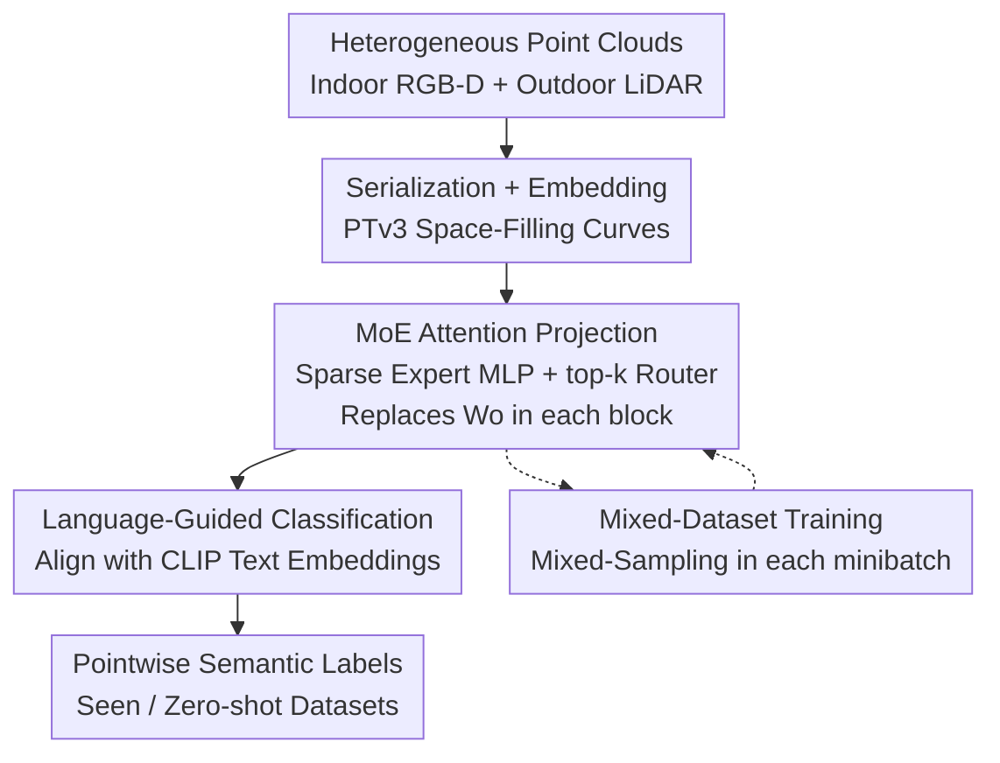

# Point-MoE: Large-Scale Multi-Dataset Training with Mixture-of-Experts for 3D Semantic Segmentation

**Conference**: ICLR 2026  
**OpenReview**: [https://openreview.net/forum?id=35HahPHrFG](https://openreview.net/forum?id=35HahPHrFG)  
**Code**: [https://point-moe.cs.virginia.edu/](https://point-moe.cs.virginia.edu/)  
**Area**: 3D Vision / Point Cloud Semantic Segmentation  
**Keywords**: Point Cloud Semantic Segmentation, Mixture-of-Experts, Multi-dataset Joint Training, Zero-shot Generalization, Point Transformer

## TL;DR
This work integrates a sparsely activated Mixture-of-Experts (MoE) module into the attention output projection layer of Point Transformer V3 (PTv3). This allows a unified model to jointly train on heterogeneous indoor and outdoor point cloud datasets without relying on "dataset labels." By allowing routers to spontaneously select experts for tokens, the model achieves a semantic segmentation mIoU across 7 datasets (including zero-shot) that surpasses PPT (which requires dataset labels), while reducing inference FLOPs by 30.9%.

## Background & Motivation
**Background**: Advancements in NLP and 2D vision largely result from "aggregating massive heterogeneous data + training a unified large model." 3D point cloud understanding has not yet followed this path. In 3D semantic segmentation, datasets like ScanNet, SemanticKITTI, nuScenes, and Structured3D each cover only a narrow slice of reality. Data comes from varied pipelines (RGB-D, LiDAR, multi-view stereo) with different densities, noise, and semantic biases, leaving 3D models in "isolated islands" where models trained on one domain fail on others.

**Limitations of Prior Work**: A natural solution is "cross-silo joint training" to obtain universal parameters. However, training a SOTA PTv3 on mixed indoor/outdoor data fails to reconcile distributional heterogeneity, even with increased capacity (mIoU drops to single digits when migrating models). To mitigate this, recent methods introduce "dataset-aware components": PPT provides dataset-specific normalization layers, and One-for-All uses a lightweight dataset classifier with dataset-specific adapters.

**Key Challenge**: These methods depend on **dataset labels**—the dataset ID must be known during both training and inference. In real-world deployment, point clouds come from mixed, unlabeled sensors of unknown origin, lacking an oracle "dataset ID." Furthermore, adjusting only normalization parameters may provide insufficient expressivity for large-scale multi-dataset training.

**Goal**: Investigate a more realistic setting—large-scale multi-dataset joint 3D semantic segmentation where **no dataset labels are provided** during training or inference. The goal is a single model that excels on seen datasets and generalizes zero-shot to unseen distributions.

**Key Insight**: The authors hypothesize that MoE architectures are naturally suited for this setting. Three observations support this: ① MoE encourages expert specialization and token-to-expert routing, allowing a single model to learn from mixed data without dataset labels; ② Compared to normalization-only adaptation (PPT/One-for-All), MoE provides significantly higher capacity to model inner-dataset differences; ③ Sparse MoE activates few experts, maintaining efficient training/inference while expanding capacity—a standard approach for scaling in NLP and 2D vision.

**Core Idea**: Replace "hard-coding structure via manual dataset heuristics" with "allowing the model to discover structure within heterogeneous 3D data." Specifically, the attention output projection in each PTv3 block is replaced with sparse MoE, where routers unsupervisedly determine the experts for each token.

## Method

### Overall Architecture
Point-MoE is built upon PTv3. The input is a point cloud $P=\{p_i\}_{i=1}^M$ with XYZ coordinates, and the output is a per-point semantic class $\hat y_i \in C$. The pipeline follows three steps: first, unstructured point clouds are **serialized and embedded** into 1D tokens using PTv3's space-filling curves; next, stacked multi-head self-attention blocks perform multi-scale inference with down/up-sampling, where **the attention output projection $W_o$ of each block is replaced by an MoE module** (expert MLP pool + lightweight top-k router), while QKV projections remain dense; finally, a "language-guided classification head" projects point features into the CLIP text space to use class names as supervision, bypassing inconsistent label spaces across datasets. During training, minibatches are **mixed-sampled** from multiple datasets to allow interaction and foster expert specialization.

The training objective targets unified parameters $\theta$ (without per-dataset fine-tuning): $\min_\theta \mathbb{E}_{D_j\sim\mathcal{D}}\,\mathbb{E}_{(P,y)\sim D_j}[L(y,\Phi_\theta(P))]$, assuming no oracle dataset labels. This contrasts with PPT's objective of learning dataset-specific parameters $\omega_j$, which requires identifying the dataset ID during inference.

### Key Designs

**1. MoE on Attention Output Projection $W_o$ instead of FFN**

A standard PTv3 block computes $X=\text{Norm}(x_{\ell-1})$, $Q,K,V = XW_q,XW_k,XW_v$, $A=\text{Softmax}(QK^\top/\sqrt{d_h})V$, and $O=W_oA$, followed by FFN. Point-MoE redefines $O=W_oA$ as $O=\text{MoE}(A)$, keeping QKV shared. The MoE layer is a weighted sum of top-k experts: $\text{MoE}(x)=\sum_{i\in S_x} G_i(x)\,f_i(x)$, where $\{f_i\}_{i=1}^N$ are experts ($f_i:\mathbb{R}^D\to\mathbb{R}^D$), and $G$ is a gating network mapping to sparse softmax.

Why $W_o$ over FFN? $W_o$ is the "junction" where multi-head outputs merge before the next normalization. Experts here route based on richer signals that retain cross-dataset geometric cues after head aggregation, while keeping $W_q,W_k,W_v$ stable. FFN experts act on normalized activations where dataset cues are weakened. Additionally, since the projection is linear, adding MoE injects non-linearity and capacity. Ablations (Tab.3d) confirm Proj-MoE consistently outperforms FFN-MoE.

**2. Token-level Sparse Routing without Dataset Labels**

The router decides experts based on token features alone, without "dataset ID" input. Consequently, experts self-organize. t-SNE visualizations show PTv3 features do not separate (insufficient capacity), while PPT forms sharp clusters due to dataset labels (rigid partitioning that hurts generalization). Point-MoE shows a unique pattern: **encoder features remain mixed across datasets** (supporting shared representation learning), while the **decoder decouples into dataset-specific structures**, performing "implicit dataset inference." Visualizations show encoder layers route by local geometry (edges, fine structures), while decoder layers route by semantics (chairs, floors across scenes). In zero-shot Matterport3D, Point-MoE aligns samples with the most semantically similar seen dataset cluster (e.g., ScanNet), explaining its strong generalization.

**3. Mixed-Dataset Batching**

Each minibatch samples from multiple datasets (indoor + outdoor) simultaneously. Samples interact via shared normalization statistics and competition for the expert pool. This benefits all backbones, but the gain for Point-MoE is massive: Tab.4 shows that enabling mixed-sampling improves PTv3 by +8.3 mIoU and Point-MoE by **+16.6**. Diverse minibatches facilitate expert specialization across datasets and stabilize routing.

**4. Counter-intuitive Designs: No Auxiliary Load Loss, No Shared Experts**

Standard MoE uses an auxiliary loss to encourage uniform expert usage. However, **removing the auxiliary loss performed better** in 3D point clouds (Tab.3a: 74.5 mIoU at $\alpha=0$ vs. 71.6 at $\alpha=10^{-3}$). Stronger auxiliary losses significantly degrade performance. The authors hypothesize that forced balancing contradicts the naturally skewed distribution of 3D datasets. Similarly, adding "shared experts" consistently degraded results (Tab.3g). These findings suggest that in heterogeneous 3D scenarios, one should accommodate rather than suppress expert imbalance.

### Loss & Training
The primary supervision is pointwise cross-entropy $L(y, \hat{y})$. The classification head projects features to the CLIP text space to bridge semantic gaps (e.g., mapping "other" in ScanNet to its CLIP embedding). No auxiliary MoE load-balancing loss. Configuration: Top-2 gating, BatchNorm, ReLU, no shared experts. Point-MoE-S uses 4 experts (1x hidden dim), Point-MoE-L uses 8 experts (2x hidden dim).

## Key Experimental Results

Datasets: Joint training on indoor ScanNet / S3DIS / Structured3D with zero-shot evaluation on Matterport3D. Extended joint training includes outdoor nuScenes / SemanticKITTI with zero-shot evaluation on Waymo. Baselines: PTv3, PPT (PPT uses a dataset classifier with ≥95% accuracy for inference).

### Main Results

| Setting | Method | Use Dataset Label | Avg mIoU |
|------|------|:---:|:---:|
| Indoor Joint | PTv3-L | No | 63.4 |
| Indoor Joint | PPT-L | Yes | 67.6 |
| Indoor Joint | **Point-MoE-L** | No | **71.5** |
| Ind/Out Joint | PTv3-L | No | 67.2 |
| Ind/Out Joint | PPT-L | Yes | 68.3 |
| Ind/Out Joint | **Point-MoE-L** | No | **70.8** |

In indoor/outdoor joint settings, Point-MoE-L outperforms PTv3-L by 3.55 mIoU and the label-dependent PPT-L by 2.45 mIoU. The advantage is more pronounced in zero-shot settings (Tab.2): Point-MoE-L achieves 35.0 mIoU on Matterport3D + Waymo, while PPT-L drops to 20.3 due to over-reliance on dataset cues.

| Efficiency (vs PPT-L) | FLOPs/step | Peak VRAM |
|------|:---:|:---:|
| PPT-L | 384.4 GFLOPs | 41.1 GiB |
| **Point-MoE-L** | **265.7 (↓30.9%)** | **33.3 (↓19.0%)** |

Sparse activation makes Point-MoE more efficient than dense PPT while achieving higher accuracy.

### Ablation Study

| Configuration | Choice | ScanNet mIoU | Description |
|------|------|:---:|------|
| Aux. Bal. Loss | $\alpha=0$ | 74.5 | Best without; $\alpha=10^{-3}$ drops to 71.6 |
| top-k | top-2 | 74.5 | Better than top-1 (74.4)/top-3 (73.8) |
| MoE Position | Proj. | 74.5 | Better than FFN (72.6) |
| Normalization | BatchNorm | 74.5 | LN 70.8, RMSNorm only 45.3 |
| Shared Expert | None | 74.5 | Shared drops to 73.6 |
| Expert Count | 4→8 | 73.6→High | More experts improve seen/zero-shot |
| Mixed Sampling | On | 62.5 avg | Off drops to 45.9 (+16.6) |

### Key Findings
- **Mixed-dataset training** is the largest contributor: Point-MoE's gain (+16.6) far exceeds PTv3 (+8.3), showing that expert specialization relies on observing diverse distributions.
- **Normalization Sensitivity**: RMSNorm causes performance to collapse (74.5 to 45.3), indicating that BatchNorm's cross-sample statistics are essential for stability in 3D multi-dataset scenarios.
- Adding outdoor data **does not** sacrifice indoor accuracy, indicating "negative transfer" is effectively avoided.
- Feature alignment in zero-shot Matterport3D to ScanNet clusters provides direct evidence of Point-MoE's generalization capability.

## Highlights & Insights
- **"Label-free is stronger"**: Point-MoE avoids dataset labels but outperforms label-dependent PPT. Explicit dataset supervision makes models brittle in zero-shot scenarios, whereas implicit routing based on semantics/geometry is more robust.
- **Encoder-Mixed, Decoder-Decoupled**: Emergent behavior where early layers share representations while deeper layers perform implicit dataset inference.
- **Removing Auxiliary Loss**: In heterogeneous, long-tail multi-source scenarios, forcing uniform expert usage can be counter-productive.
- Placing MoE at $W_o$ instead of FFN utilizes the linear merging of projections to justify the injection of non-linearity, echoing findings in NLP (UMoE).

## Limitations & Future Work
- Focuses solely on semantic segmentation; does not yet cover detection, instance segmentation, or 3D reconstruction.
- Data scale (7 datasets) is still small compared to NLP/2D; scaling laws require further validation.
- Optimal expert configurations (count, sparsity, width) show dataset-dependent trends, lacking a universal scaling law.
- Isolated tokens are occasionally routed differently from neighbors, attributed to PTv3's serialization.

## Related Work & Insights
- **vs PTv3**: Point-MoE solves the performance degradation of PTv3 in joint training settings via expert capacity.
- **vs PPT / One-for-All**: These rely on domain labels and dataset classifiers; Point-MoE is label-free, cheaper (30.9% fewer FLOPs), and stronger in zero-shot.
- **vs UniDet3D / Sonata**: This is the first systematic study of MoE for 3D point cloud large-scale multi-dataset training across indoor and outdoor domains.
- **vs NLP/2D MoE**: Migrating MoE to 3D requires re-calibration, notably regarding auxiliary loss and the necessity of BatchNorm.

## Rating
- Novelty: ⭐⭐⭐⭐⭐ First systematic introduction of MoE to large-scale 3D multi-dataset training; proves label-free routing exceeds label-dependent adaptation.
- Experimental Thoroughness: ⭐⭐⭐⭐⭐ 7 datasets, indoor/outdoor joint, and comprehensive design space ablation.
- Writing Quality: ⭐⭐⭐⭐ Clear motivation and strong visual analysis.
- Value: ⭐⭐⭐⭐⭐ Establishes a feasible path for "unified 3D models scaling via laws" while improving efficiency.

<!-- RELATED:START -->

## Related Papers

- [\[ICLR 2026\] MoE-GS: Mixture of Experts for Dynamic Gaussian Splatting](moe-gs_mixture_of_experts_for_dynamic_gaussian_splatting.md)
- [\[ICLR 2026\] SkyEvents: A Large-Scale Event-Enhanced UAV Dataset for Robust 3D Scene Reconstruction](skyevents_a_large-scale_event-enhanced_uav_dataset_for_robust_3d_scene_reconstru.md)
- [\[ICLR 2026\] GOOD: Geometry-guided Out-of-Distribution Modeling for Open-set Test-time Adaptation in Point Cloud Semantic Segmentation](good_geometry-guided_out-of-distribution_modeling_for_open-set_test-time_adaptat.md)
- [\[CVPR 2026\] SceneScribe-1M: A Large-Scale Video Dataset with Comprehensive Geometric and Semantic Annotations](../../CVPR2026/3d_vision/scenescribe-1m_a_large-scale_video_dataset_with_comprehensive_geometric_and_sema.md)
- [\[ICLR 2026\] OmniWorld: A Multi-Domain and Multi-Modal Dataset for 4D World Modeling](omniworld_a_multi-domain_and_multi-modal_dataset_for_4d_world_modeling.md)

<!-- RELATED:END -->
