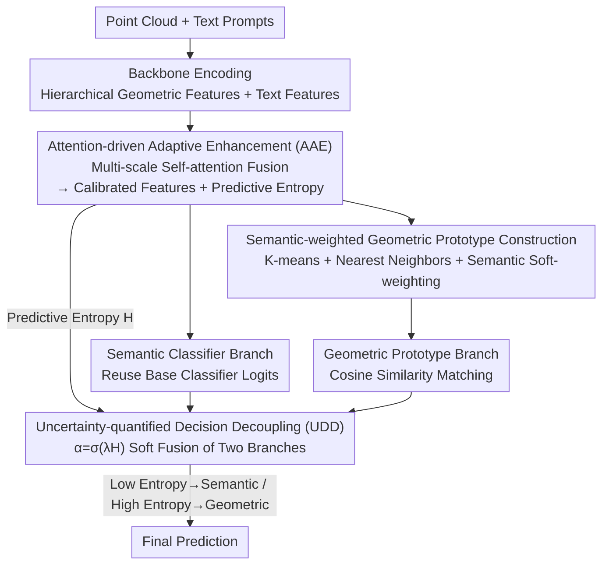

# Point-UQ: An Uncertainty Quantification Paradigm for Point Cloud Few-Shot Class-Incremental Learning

**Conference**: ICLR 2026  
**OpenReview**: [https://openreview.net/forum?id=fhVfyiiAqt](https://openreview.net/forum?id=fhVfyiiAqt)  
**Area**: 3D Vision  
**Keywords**: Point Cloud, Few-Shot Class-Incremental Learning, Uncertainty Quantification, Decision Decoupling, Training-free

## TL;DR
Point-UQ shifts the focus of 3D Few-Shot Class-Incremental Learning (FSCIL) from "repeatedly fine-tuning features" to "dynamically optimizing decisions." It uses predictive entropy to measure cognitive uncertainty for each sample to adaptively arbitrate between semantic classifiers and geometric prototypes, thereby preserving old class knowledge while correctly identifying new class samples without retraining.

## Background & Motivation

**Background**: 3D Few-Shot Class-Incremental Learning (3D FSCIL) requires models to first train on data-rich synthetic base classes and subsequently adapt to new classes incrementally using only a few real scanned samples. Dominant approaches (Microshape, Cross-Domain, C3PR, FoundationModel, etc.) primarily focus on "features"—enhancing discriminative power through sophisticated fine-tuning strategies and strengthening semantics via multi-modal alignment (e.g., projecting point clouds into depth maps to leverage cross-modal knowledge from CLIP).

**Limitations of Prior Work**: These methods implicitly assume that **features must be continuously fine-tuned while decision boundaries remain static**. This creates a fundamental dilemma: insufficient fine-tuning leads to confusion between classes and overfitting to base classes, while excessive fine-tuning overfits to scarce new samples, accelerating catastrophic forgetting of old classes. Moreover, re-tuning at every incremental stage increases training costs and accumulates the risk of forgetting as sessions progress.

**Key Challenge**: The root problem lies in the "static decision mechanism." While base class samples are abundant and yield stable, confident classifier outputs, directly applying these confident semantic classifiers to sample-scarce new classes leads to failure. For new classes, semantic classifier weights are insufficiently trained, whereas geometric prototype matching based on class centers remains more robust. Existing paradigms focus solely on feature enhancement, completely neglecting that the "decision process itself can be made smarter."

**Goal**: To find an efficient path that balances old class retention and new class adaptation without relying on repeated fine-tuning, but rather through "dynamically allocating existing knowledge" given limited feature representation capabilities.

**Key Insight**: The authors observe that uncertainty quantification can provide a reliable basis for "designing dynamic inference paths"—the more ambiguous a sample's prediction (higher entropy), the less the semantic classifier should be trusted and the more geometric structure should be prioritized. This significantly improves adaptability and robustness in incremental scenarios with minimal parameter overhead.

**Core Idea**: Replace "repeated fine-tuning of features" with "uncertainty-based dynamic decision arbitration," allowing an incremental-training-free paradigm to adaptively switch between semantic classification and geometric matching based on entropy.

## Method

### Overall Architecture
Point-UQ is an **incremental-training-free** 3D FSCIL paradigm: all learnable parameters are trained only once during the base class stage. The point cloud encoder and text encoder are frozen throughout, and no network weights are updated during incremental stages. The architecture consists of two collaborative modules: AAE (Attention-driven Adaptive Enhancement) responsible for fusing multi-scale geometric features from the backbone into calibrated representations during base training and calculating predictive entropy as a measure of cognitive uncertainty; and UDD (Uncertainty-quantified Decision Decoupling) which uses this entropy signal during incremental inference to perform dynamic weighted arbitration between the "semantic classifier branch" and the "geometric prototype branch."

Intuitively, when a point cloud arrives, it passes through the backbone and AAE to obtain enhanced features and an entropy value. If entropy is low (high confidence, likely a base class), the system primarily follows the semantic classifier to reuse stable base class decision boundaries. If entropy is high (ambiguous, likely a new class), trust shifts to geometric prototype matching, relying on spatial structural similarity. Scores from both branches are fused via an entropy-driven coefficient $\alpha$ to produce the final prediction.

### Key Designs

**1. AAE: Fusing multi-scale features via self-attention and using predictive entropy as a reliable uncertainty signal**

To address the issue where shallow local geometric details are underutilized and deep semantic aggregation loses detail while fixed-weight fusion fails to adapt to dynamic discriminative needs, AAE replaces fixed rules with learnable multi-head self-attention to dynamically fuse hierarchical features. Specifically, features $\{F_l\}_{l=1}^{L}$ (shallow $F_1, F_2$ for local geometry, deep $F_{L-1}, F_L$ for global semantics) are stacked into a tensor $F_{\text{stack}}\in\mathbb{R}^{B\times L\times D}$. The main point cloud feature $F_{pc}$ is used as a query to form $F_{\text{joint}}\in\mathbb{R}^{B\times(L+1)\times D}$ for multi-head self-attention:

$$A_h=\text{Softmax}\Big(\frac{Q_h K_h^\top}{\sqrt{d_k}}\Big),\quad F_{\text{fused}}=\text{Concat}(\text{Head}_1,\dots,\text{Head}_H)W_{\text{out}}$$

A residual connection $F_{\text{final}}=F_{pc}+W_{\text{res}}\cdot F^{(0)}_{\text{fused}}$ is added to prevent fusion from washing out original local geometry. AAE also calculates the predictive entropy $H(p)=-\sum_c p_c\log p_c$ from the semantic classifier's softmax output, serving as a reliable estimate of cognitive uncertainty and feeding directly into UDD.

**2. Semantic-weighted Geometric Prototype Construction: Preparing noise-resistant, semantic-aware prototypes for high-uncertainty cases**

UDD relies on geometric prototypes when entropy is high. If prototypes are simply intra-class means, they are easily skewed by outliers. This design uses semantic-weighted prototypes: first, K-means identifies class centers $\mu_c = \text{KMeans}(F_c)$. The $m$ nearest core samples are selected by Euclidean distance $d_i=\lVert f_i-\mu_c\rVert_2$. Semantic similarity $s_j=f_{ij}^\top p_c$ is calculated using class text features $p_c$ and normalized via softmax:

$$w_j=\frac{\exp(s_j-\max(s))}{\sum_{j=1}^{m}\exp(s_j-\max(s))},\qquad c_c=\frac{\sum_{j=1}^{m} w_j f_{ij}}{\sum_{j=1}^{m} w_j}$$

This combines "closeness to center" and "semantic relevance," ensuring prototypes are robust and representative of the actual class semantics.

**3. UDD: Soft arbitration between semantic and geometric branches via entropy-driven coefficients**

UDD resolves the conflict where base classifiers are overconfident on new classes and new class semantic weights are poorly trained. It decouples the decision into two branches: the semantic branch reuses the pre-trained base classifier to compute logits $s_{\text{sem}}=f\cdot W_{\text{base}}^\top$; the geometric branch computes cosine similarity $s_{\text{geo}}(k)=\frac{f\cdot c_k}{\lVert f\rVert\lVert c_k\rVert}$ using enhanced features and prototypes $c_k$. The fusion coefficient is determined by the entropy from AAE:

$$\alpha=\sigma(\lambda\cdot H(p))\in[0,1],\qquad s_{\text{final}}=\alpha\cdot s_{\text{geo}}+(1-\alpha)\cdot s_{\text{sem}}$$

where $\lambda$ is a scaling factor. As entropy increases, $\alpha$ approaches 1, shifting the decision toward geometric matching (handling ambiguous new classes). As entropy decreases, $\alpha$ approaches 0, favoring the semantic classifier (reusing stable base boundaries).

### Loss & Training
The model is trained only on base classes. Point cloud and text encoders are frozen; only AAE and prototype-related parameters are updated. Two losses are used: cross-entropy $L_{ce}=-\frac{1}{N}\sum_i\sum_c y_{ic}\log(p_{ic})$ for classification accuracy and cosine similarity loss $L_{cos}=1-\frac{1}{N}\sum_i\frac{f_i^\top c_{y_i}}{\lVert f_i\rVert\lVert c_{y_i}\rVert}$ to pull features toward class prototypes. Total loss is $L_{total}=\beta\cdot L_{ce}+L_{cos}$. No training occurs during incremental stages.

## Key Experimental Results

### Main Results
Evaluations were conducted on ModelNet, ShapeNet, ScanObjectNN, and CO3D for both intra-dataset and cross-dataset settings. Metrics include Average Accuracy, relative accuracy drop $\Delta\!\downarrow$, and Harmonic Accuracy. The table below shows Average Accuracy at the final session (selected baselines):

| Dataset | Metric | Point-UQ | Next Best Baseline | Comparison |
|--------|------|----------|----------|------|
| ModelNet (40 classes, last) | Avg Acc | 79.0 | Microshape 67.1 / C3PR 70.9 | +8+ |
| CO3D (50 classes, last) | Avg Acc | 66.5 | C3PR 53.8 | +12.7 |
| ShapeNet (55 classes, last) | Avg Acc | 86.5 | C3PR 74.7 | +11.8 |
| ShapeNet (55 classes) | $\Delta\!\downarrow$ | 7.0 | C3PR 15.1 | ~Half forgetting |

In cross-dataset settings (testing domain adaptation), Point-UQ leads significantly, e.g., ShapeNet→CO3D last session Avg Acc 80.3 vs FoundationModel 72.6, and ModelNet→ScanObjectNN 86.6 vs FoundationModel 79.2. Harmonic accuracy exceeds existing methods by approximately 9% on average.

### Ablation Study
Ablation of AAE and UDD on ShapeNet→CO3D:

| AAE | UDD | Mean Avg Acc (%) | Mean Harmonic Acc (%) | Note |
|-----|-----|----------------|----------------|------|
| ✕ | ✕ | — | 54.5 | Baseline |
| ✓ | ✕ | — | 55.7 | AAE only, base discriminativity |
| ✕ | ✓ | — | 60.0 | UDD only, major decision gain |
| ✓ | ✓ | — | 64.8 | Full model, +10.3 Harmonic |

Feature fusion ablation (Tab.4): Deep-Semantic-only (60.0), LayerWise-To-Last (61.0), and Symmetric-Cross-Fusion (59.4) were all outperformed by the proposed multi-scale self-attention (64.8).

### Key Findings
- UDD is the primary driver of performance gains: Adding UDD alone raised Harmonic Accuracy by 5.5 points, proving decision optimization is more impactful than simple feature enhancement in this context.
- Cross-dataset advantages: While 2D-adapted methods often drop 20% accuracy on new classes due to domain shift, Point-UQ remains stable by triggering geometric matching in high-entropy states.
- Prototype quality impacts uncertainty: Semantic-weighted prototypes are more stable for both identification and uncertainty estimation than simple MeanProto or ClusterProto.

## Highlights & Insights
- **Uncertainty as a routing switch**: Entropy is used as a continuous control via $\alpha = \sigma(\lambda H)$ to decide between "semantic" or "geometric" components, achieving dynamic inference with near-zero additional parameters.
- **Incremental-training-free**: Not updating weights during incremental sessions avoids the "fine-tuning-forgetting" cycle and eliminates session-specific training costs.
- **Geometric fallback for domain robustness**: The observation that geometric matching is more resistant to domain shifts than semantic classifiers under high uncertainty is a valuable strategy for 3D tasks.

## Limitations & Future Work
- Entropy as a measure depends on the calibration of the semantic classifier; if the base classifier is overconfident (biased low entropy), the geometric fallback may fail.
- Geometric prototypes rely on text features for weighting; quality may decrease for classes with poor text-point cloud alignment or vague descriptions.
- The method assumes base classes are available at once; it does not cover scenarios where base classes themselves arrive in a stream. Hyperparameters $\lambda, \beta, m$ require tuning.

## Related Work & Insights
- **vs Microshape / Cross-Domain**: These focus on domain-invariant descriptors or dual-branch feature modeling. Point-UQ keeps features static and focuses on dynamic decisions, nearly halving the forgetting rate.
- **vs C3PR / FoundationModel**: These leverage CLIP or large-scale 3D-language models for semantic strength but often sacrifice 3D geometric fidelity and use static boundaries. Point-UQ's entropy-driven arbitration outperforms FoundationModel by ~9% in cross-dataset settings.

## Rating
- Novelty: ⭐⭐⭐⭐ Shifting focus from feature fine-tuning to uncertainty-driven arbitration is novel and consistent.
- Experimental Thoroughness: ⭐⭐⭐⭐ Four datasets, cross-settings, and extensive ablations.
- Writing Quality: ⭐⭐⭐⭐ Clear logic from motivation to experimentation.
- Value: ⭐⭐⭐⭐ Training-free and reduced forgetting are significant for resource-constrained 3D deployment.

<!-- RELATED:START -->

## Related Papers

- [\[ICLR 2026\] Point-Focused Attention Meets Context-Scan State Space: Robust Biological Visual Perception for Point Cloud Representation](point-focused_attention_meets_context-scan_state_space_robust_biological_visual_.md)
- [\[ICLR 2026\] Guaranteed Simply Connected Mesh Reconstruction from an Unorganized Point Cloud](guaranteed_simply_connected_mesh_reconstruction_from_an_unorganized_point_cloud.md)
- [\[ICLR 2026\] PointRePar: SpatioTemporal Point Relation Parsing for Robust Category-Unified 3D Tracking](pointrepar_spatiotemporal_point_relation_parsing_for_robust_category-unified_3d_.md)
- [\[ICLR 2026\] Spiking Discrepancy Transformer for Point Cloud Analysis](spiking_discrepancy_transformer_for_point_cloud_analysis.md)
- [\[ICLR 2026\] RayI2P: Learning Rays for Image-to-Point Cloud Registration](rayi2p_learning_rays_for_image-to-point_cloud_registration.md)

<!-- RELATED:END -->
