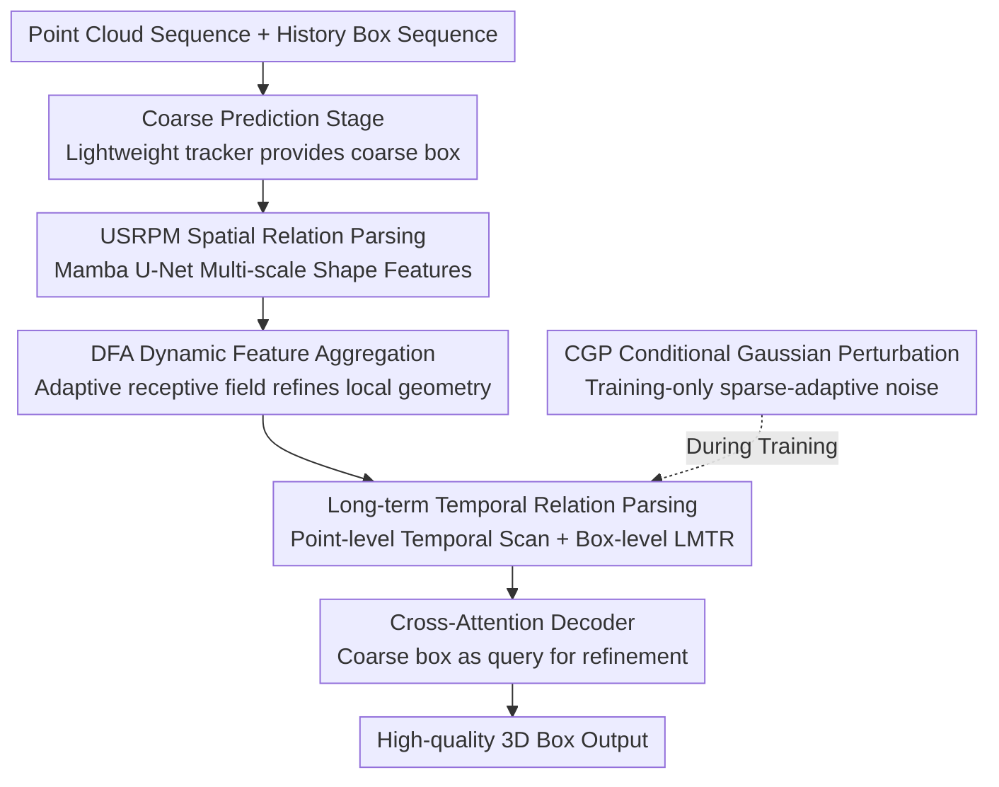

# PointRePar: SpatioTemporal Point Relation Parsing for Robust Category-Unified 3D Tracking

**Conference**: ICLR 2026  
**OpenReview**: [https://openreview.net/forum?id=DLcnrY5Uqo](https://openreview.net/forum?id=DLcnrY5Uqo)  
**Code**: To be confirmed  
**Area**: 3D Vision  
**Keywords**: 3D Single Object Tracking, Point Cloud, Category-Unified, Mamba, Spatiotemporal Relation Parsing

## TL;DR
PointRePar is a "category-unified" 3D single-object tracker. It employs a U-shaped spatial relation parsing backbone built with Mamba and Dynamic Feature Aggregation to learn more discriminative shape features, combined with a dual-layer point-level/box-level temporal parsing mechanism to capture motion. Coupled with sparse-adaptive Gaussian perturbation training, a single model trained jointly across all categories outperforms the previous category-unified method CUTrack and competes with category-specific SOTA models.

## Background & Motivation

**Background**: 3D Single Object Tracking (SOT) involves predicting the position and orientation of a target frame-by-frame given its initial 3D bounding box. Dominant approaches follow the Siamese matching paradigm (SC3D, P2B, BAT, etc.) or the motion-centric paradigm (M2Track, SeqTrack3D), and almost all utilize **category-specific training**—training separate models for "Car," "Pedestrian," and "Truck."

**Limitations of Prior Work**: The category-specific paradigm focuses the entire model capacity on a single category, which facilitates optimization and high precision but has two major drawbacks: first, the model fails to learn universal laws across categories, limiting generalization and robustness; second, training and storing a separate model for every category is highly inefficient. CUTrack was the first to attempt "category-unified" joint training using deformable group vector attention to adapt to different sizes and shapes, but its accuracy lagged significantly behind category-specific SOTAs.

**Key Challenge**: The authors systematically analyze the root cause of CUTrack's underperformance—its **insufficient feature learning capability**. This manifests in three ways: (1) neither PointNet++ nor CUTrack’s AdaFormer can effectively **separate** target points from background points in the feature space during single-frame encoding, making them susceptible to background interference; (2) features of the same target between adjacent frames show **huge differences**, leading to temporal inconsistency that undermines matching; (3) although CUTrack unifies motion into a normal distribution, it **lacks sufficient temporal modeling** and category-agnostic designs for temporal relation parsing.

**Goal**: To develop a category-unified tracker that can truly be trained jointly across multiple categories while excelling in both spatial shape learning and temporal motion modeling.

**Key Insight**: The core bottleneck of tracking is formulated as "point relation parsing"—spatially, it requires parsing multi-scale point-to-point relations to learn discriminative shapes; temporally, it requires parsing point-level and box-level relations to learn consistent motion.

**Core Idea**: Utilizing Mamba for spatiotemporal point relation parsing. Spatially, a U-shaped Mamba with Dynamic Feature Aggregation (DFA) refines shape features; temporally, a point-level Mamba scan combined with box-level trajectory correction captures motion, while sparse-adaptive perturbations enhance robustness.

## Method

### Overall Architecture

PointRePar adopts a **coarse-to-fine two-stage** framework. In the Coarse Prediction Stage, a lightweight tracker (SegPointNet + miniPointNet) provides a rough initial bounding box. In the Refining Stage, this coarse box serves as a query for cross-attention decoding against encoded features enriched with spatiotemporal point relations to output high-quality boxes. Within the pipeline: the spatial side uses the **U-shaped Spatial Relation Parsing Mamba (USRPM)** (containing the **Dynamic Feature Aggregation (DFA)** sub-module) to extract multi-scale discriminative shape features; the temporal side uses a **Temporal Scan Mamba** (point-level) and **Long-term Motion Trajectory Rectification (LMTR)** (box-level) to parse motion; during training, **Conditional Gaussian Perturbation (CGP)** injects sparse-adaptive noise into historical trajectories to improve robustness.

### Key Designs

**1. USRPM: Multi-scale Spatial Relation Parsing with Weight-Shared Bidirectional Mamba U-Net**

To address the "target-background inseparability" in single-frame encoding, the authors designed the U-shaped Spatial Relation Parsing Mamba (USRPM), inspired by MSVMamba. It utilizes Mamba's long-sequence modeling to maintain global spatial modeling with controlled efficiency. It hierarchically downsamples point cloud features to construct a multi-scale representation $F = \{F^1, F^2, F^3\}$. A key innovation is the **weight-shared Mamba blocks**: the same set of Mamba parameters performs the forward scan during downsampling and the backward scan during upsampling. This maintains the efficiency of bidirectional modeling while **enforcing semantic consistency across scales**—preventing the two paths from learning disjointed representations.

**2. DFA: Dynamic Feature Aggregation with Point-Adaptive Receptive Fields**

Mamba alone struggles with fine-grained local geometry and varying target sizes. DFA addresses this by using a two-layer MLP to predict $K$ offset scales $\Delta p_i \in \mathbb{R}^{K\times3}$ (constrained to $[0,1]$) and weights $w_i$ for each point, "expanding" the original point into $N \times K$ virtual points:

$$P_i^o = \{p_i + \Delta p_{ik}\cdot R_{max} \mid k=1,...,K\},\quad W_i^o = \{\mathrm{Sigmoid}(\mathrm{MLP}(f_i))\}_{k=1}^{K}$$

Where $R_{max}$ is the maximum displacement radius. Virtual point features $f_{ik}$ are obtained via inverse distance weighted interpolation and aggregated back: $p_i' = \mathrm{LayerNorm}(f_i + \sum_{k=1}^{K} w_{ik} f_{ik})$. This **dynamically selects a receptive field for each point**, allowing the network to learn offsets that reduce information loss during downsampling while increasing feature similarity within an object and discriminability against the background. Ablations show $K=1$ is optimal for sparse 3D SOT point clouds.

**3. Dual-layer Long-term Temporal Relation Parsing: Point-level Temporal Scan Mamba + Box-level LMTR**

To address temporal inconsistency and insufficient modeling, the authors **simultaneously** model point features and target trajectories using lightweight Mambas. Point-level **Temporal Scan Mamba** scans multi-scale features across frames to capture motion details. To handle larger temporal windows without computational explosion, **Long-term Motion Trajectory Rectification (LMTR)** is used: LMTR takes the historical box sequence $B_L=\{B_{t-L},...,B_{t-1}\}$ ($L>T$) plus the coarse prediction $B_t$ and maps them to tokens $X_L \in \mathbb{R}^{L\times8\times C}$ via corner representation. After adding temporal embeddings $E$, a Mamba models long-range dependencies: $Y=\mathrm{Mamba}(\hat X_L)$. This dual-layer design is **category-agnostic** and effectively mitigates drift caused by occlusion or intra-class distractors.

**4. CGP: Conditional Gaussian Perturbation with Scene-Sparsity Adaptation**

Unlike previous methods that use **uniform noise** to simulate localization errors, CGP adapts perturbation intensity based on scene sparsity. Empirical analysis shows that localization uncertainty increases as point cloud density decreases. Given a sparsity rate $r$ (inverse of point density), axis-wise perturbations are applied:

$$\delta_{x,y,z} = \beta_{x,y,z}\cdot c^{-r}\cdot \mathcal{N}(0,1)$$

Where $c>1$ controls the exponential decay of noise magnitude relative to density. By **amplifying perturbations in sparse observations**, it simulates error accumulation in low-density regions while maintaining reasonable noise boundaries in dense scenes, significantly improving robustness.

### Loss & Training
The backbone uses three Set Abstraction (SA) layers for downsampling with radii of 0.3/0.5/0.7m. Training is performed on an NVIDIA RTX-3090 using Adam with a batch size of 64. CGP is enabled only during training.

## Key Experimental Results

### Main Results

On NuScenes (which contains many sparse scenes), PointRePar significantly outperforms the category-unified MoCUT, with Mean Success/Precision gains of approximately **15.57 / 15.01**. The category-specific version also overall surpasses the SOTA SiamMo.

| Dataset | Paradigm | Method | Mean Success/Precision |
|--------|------|------|------------------------|
| NuScenes | Category-Unified | MoCUT | 51.19 / 64.63 |
| NuScenes | Category-Unified | TrackAny3D | 54.57 / 66.25 |
| NuScenes | Category-Unified | **Ours (PointRePar)** | **66.76 / 79.64** |
| NuScenes | Category-Specific | SiamMo | 60.31 / 72.68 |
| NuScenes | Category-Specific | **Ours (PointRePar)** | **64.15 / 76.81** |
| KITTI | Category-Unified | MoCUT | 65.8 / 85.0 |
| KITTI | Category-Unified | **Ours (PointRePar)** | **72.0 / 89.1** |
| KITTI | Category-Specific | SiamMo | 72.3 / 90.1 |

On KITTI, the category-unified PointRePar (72.0/89.1) exceeds MoCUT and most category-specific methods, just slightly below SiamMo. In cross-dataset generalization (KITTI pre-train $\rightarrow$ WOD), it shows gains of up to +4.0%/+9.7% over the best category-unified competitors. The inference speed is ~36.6 FPS.

### Ablation Study (KITTI, Mean Success/Precision)

| Configuration | Mean | Description |
|------|------|------|
| Baseline | 65.7 / 84.6 | No core designs |
| +DFA | 68.9 / 87.2 | Dynamic Feature Aggregation |
| +DFA+USRPM | 69.9 / 88.1 | Added Mamba U-Net spatial backbone |
| Full Model | **72.0 / 89.1** | DFA+USRPM+LMTR+CGP |

### Key Findings
- **DFA and USRPM provide the primary spatial gains**: Both are essential for parsing spatial relations and refining shape features.
- **CGP excels at hard-to-predict trajectories**: Gains are most prominent for the "Pedestrian" category, confirming its effectiveness in simulating historical error for robustness.
- **Hyperparameter Sensitivity**: $K=1$ is optimal for DFA; LMTR box sequence length 7 is optimal, as excessive length introduces noise.
- **Sparsity Robustness**: In extremely sparse scenes ($<15$ points), the USRPM backbone and overall model significantly outperform PointNet++/AdaFormer and SiamMo.

## Highlights & Insights
- **"Weight-Sharing + Bidirectional Scanning"**: Using forward scanning for downsampling and backward scanning for upsampling with shared parameters achieves bidirectional efficiency and cross-scale consistency—a clever adaptation of Mamba for point cloud U-Nets.
- **Bounding Boxes as Explicit Motion Signals**: While most multi-frame methods focus on point features, LMTR demonstrates that historical box sequences explicitly encode trajectories. Modeling these tokens with Mamba provides box-level motion at low cost.
- **Conditional Noise Injection**: The CGP strategy (Scaling noise $\propto$ sparsity) is a clean data augmentation idea that could be generalized to other 3D tasks affected by observation density.
- **Unified parity with Specific models**: This is the first category-unified 3D tracker to compete with category-specific SOTAs on most metrics, suggesting that feature learning capability was the true bottleneck, not the unified paradigm itself.

## Limitations & Future Work
- Hyperparameters like box sequence length and offset points are sensitive to category distributions and may require re-tuning for new datasets.
- Cross-domain potential is not yet fully explored, as WOD was only used for zero-shot evaluation.
- CGP relies on density estimation, which may fail in scenes with inaccurate density or severe dynamic occlusions.
- As a two-stage framework, the refinement stage has limited ability to correct extreme errors from the initial coarse stage.

## Related Work & Insights
- **vs. CUTrack (MoCUT/SiamCUT)**: PointRePar replaces AdaFormer with Mamba U-Net + DFA and adds dual-layer temporal parsing, leading to a ~15 point gain in Mean Success on NuScenes.
- **vs. TrackAny3D**: TrackAny3D uses Mixture-of-Experts (MoE) for different geometries but remains slower and less accurate than PointRePar's lightweight Mamba architecture.
- **vs. SiamMo (Category-Specific SOTA)**: PointRePar manages to outperform the category-specific SiamMo on NuScenes with a single model and shows better robustness in sparse scenarios.

## Rating
- Novelty: ⭐⭐⭐⭐ 
- Experimental Thoroughness: ⭐⭐⭐⭐⭐ 
- Writing Quality: ⭐⭐⭐⭐ 
- Value: ⭐⭐⭐⭐ 

<!-- RELATED:START -->

## Related Papers

- [\[CVPR 2026\] Generalizable Structure-Aware Keypoint Correspondence for Category-Unified 3D Single Object Tracking](../../CVPR2026/3d_vision/generalizable_structure-aware_keypoint_correspondence_for_category-unified_3d_si.md)
- [\[ICLR 2026\] Point-Focused Attention Meets Context-Scan State Space: Robust Biological Visual Perception for Point Cloud Representation](point-focused_attention_meets_context-scan_state_space_robust_biological_visual_.md)
- [\[CVPR 2026\] ComPose: A Unified Completion-Pose Framework for Robust Category-Level Object Pose Estimation](../../CVPR2026/3d_vision/compose_a_unified_completion-pose_framework_for_robust_category-level_object_pos.md)
- [\[ECCV 2024\] 3D Single-Object Tracking in Point Clouds with High Temporal Variation](../../ECCV2024/3d_vision/3d_single-object_tracking_in_point_clouds_with_high_temporal_variation.md)
- [\[ICLR 2026\] Point-UQ：面向点云小样本类增量学习的不确定性量化范式](point-uq_an_uncertainty-quantification_paradigm_for_point_cloud_few-shot_class_i.md)

<!-- RELATED:END -->
