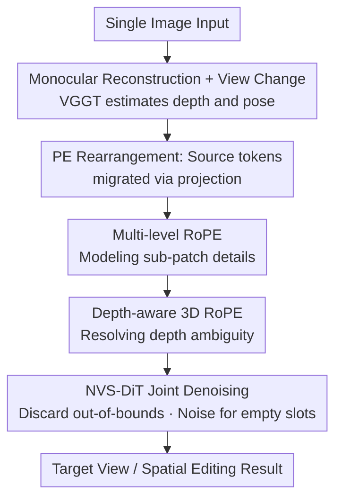

# Positional Encoding Field

**Conference**: ICLR 2026  
**OpenReview**: [https://openreview.net/forum?id=STPO8onj9d](https://openreview.net/forum?id=STPO8onj9d)  
**Code**: TBD  
**Area**: 3D Vision / Diffusion Models / Novel View Synthesis  
**Keywords**: Novel View Synthesis, Diffusion Transformer, Positional Encoding, Rotary Positional Encoding (RoPE), Depth-aware

## TL;DR
This paper discovers that image tokens in DiT are highly independent, with spatial coherence almost entirely determined by positional encodings (PE). Based on this, it extends 2D PE into a 3D "Positional Encoding Field" (PE-Field) with depth and hierarchy. By simply modifying the PE, the Diffusion Transformer can rearrange image content in 3D space, achieving SOTA results in single-image novel view synthesis (NVS) and naturally generalizing to controllable spatial editing.

## Background & Motivation
**Background**: Diffusion Transformers (DiT) have become the mainstream backbone for visual generation, powering top models like Flux, Qwen-Image, CogVideo, and Wan. DiT partitions an image into patches, encodes each as a token, and overlays 2D positional encodings (PE), trading spatial inductive bias for Transformer scalability.

**Limitations of Prior Work**: Understanding of how DiT internally organizes and assembles visual content remains limited. In the specific field of single-image novel view synthesis (NVS), current approaches either encode camera poses as text conditions (lacking precise control), use "monocular reconstruction → image-space warping → inpainting" pipelines (where re-projection errors destroy source semantics), or leverage video models to generate intermediate frames (inefficient when only the target view is needed).

**Key Challenge**: View transformations inherently occur in 3D space, while DiT positional encodings reside only on the 2D image plane. 2D coordinates cannot resolve depth ambiguities where multiple 3D points project to the same pixel, nor can they perform fine-grained geometric adjustments within a patch.

**Key Insight**: The authors make a simple yet striking observation: when the PEs of image (or noise) tokens are reassigned, the decoded/generated image remains globally coherent, but its content is rearranged according to the new PEs, with visible patch boundaries. This suggests that **global coherence is primarily enforced by positional encodings rather than explicit dependencies between tokens**. Consequently, modifying the PE without changing the token content allows for the structured spatial rearrangement of image content.

**Core Idea**: Upgrade positional encodings from a "2D plane" to a "3D structured field" by adding a depth axis for voxel reasoning and a hierarchical structure for sub-patch control. Thus, DiT can reason about geometry directly within the 3D PE-Field without being retrained as a 3D model.

## Method

### Overall Architecture
The goal is to generate a geometrically consistent target view given a source image and a target camera pose. The core mechanism is **"transporting" tokens in the PE space** rather than warping in pixel space. First, monocular reconstruction estimates the 3D position and depth of each pixel. Source tokens are then migrated to new positions based on the target camera projection and assigned 3D PEs with depth and hierarchy. Simultaneously, noise tokens are placed on a regular 2D grid of the target view for joint denoising by DiT. Tokens projected out of bounds are discarded, and empty slots are filled with noise and progressively refined. The process merges "observed image evidence" and "generative completion" into a single DiT forward pass.

### Key Designs

**1. Patch-level Independence and PE Rearrangement: View Synthesis as Token Transport**

This foundational observation corresponds to the "PE Rearrangement" step. Each token in DiT primarily encodes its local patch, maintaining significant independence. Reassigning token PEs causes the decoded image to follow the new layout with clear patch boundaries. Even in denoising, rearranging noise token PEs still generates coherent faces, albeit with blocky discontinuities aligned with new positions. Since spatial organization is dictated by PE, the authors avoid pixel warping and instead reassign source tokens' PEs to their projected positions under the target view. This bypasses re-projection errors in pixel warping. However, two issues arise: **resolution mismatch** (patch grids are ~16×16 pixels, coarser than 3D reconstruction) and **depth ambiguity** (multiple 3D points projecting to one token position). These are addressed by the designs below.

**2. Hierarchical Positional Encoding: Restoring Fine-grained Spatial Structure**

To address resolution mismatch, the authors modify the Multi-Head Attention (MHA) structure. In standard DiT, all heads share the same patch-level RoPE. The authors "inject" fine-grained details by reserving some heads for the original patch-level RoPE ($l_h=0$, 16×16 pixels) to maintain pre-trained global structure, while assigning the remaining heads to higher-resolution grids. For each increasing level, the grid resolution doubles and the area shrinks to $1/4$. The number of levels $M$ is determined by the total heads $H$: $M=\lfloor \log_4(3H+1)\rfloor$, with total hierarchical heads $W=\frac{4^M-1}{3}$. Each head is mapped to a level based on a geometric quota ($1:4:16:\dots$). For Flux (24 heads): Head 1 uses $l=0$, heads 2–5 use $l=1$, and heads 6–21 use $l=2$. The coarsest level corresponds to 16×16 patches, while the finest level corresponds to 4×4 sub-patches.

**3. Depth-aware Rotary Positional Encoding (RoPE): Adding the Z-axis**

To resolve depth ambiguity, the authors extend RoPE to 3D. Standard 2D RoPE encodes $x$ and $y$ into disjoint subspaces of the embedding vector. The authors introduce a third spatial axis, depth $z$, representing the distance along the camera axis. Thus, $(x,y,z)$ each occupy a disjoint subspace with their own 1D RoPE: $Q^{(h)}=\big(\mathrm{RoPE}^{(l_h)}_x(Q^{(h)}_x),\ \mathrm{RoPE}^{(l_h)}_y(Q^{(h)}_y),\ \mathrm{RoPE}^{(l_h)}_z(Q^{(h)}_z)\big)$, and similarly for $K$. This 3D RoPE allows the Transformer to distinguish tokens that overlap in 2D but differ in depth, maintaining geometric consistency across views.

**4. NVS-DiT Joint Denoising Architecture**

The Transformer processes two types of tokens: noise tokens on a regular grid (depth initialized to 0) and source image tokens projected to the target view with hierarchical 3D PEs $(x,y,z)$. Out-of-bounds tokens are discarded; empty slots are filled with noise tokens for refinement. Training uses a rectified flow matching loss under multi-view supervision: $\mathcal{L}_\theta=\mathbb{E}\big[\lVert v_\theta(z_t,t,x^{\text{trans-PE}}_{\text{src}})-(\varepsilon-x_{\text{tgt}})\rVert_2^2\big]$, where $z_t=(1-t)x_{\text{tgt}}+t\varepsilon$. The model is based on Flux.1 Kontext, removing text inputs and using the source image as the condition, trained on DL3DV and MannequinChallenge.

### Multi-step Generation for Large Rotations
For large view changes, the model must synthesize significant unseen content. The authors decompose the transformation into multiple steps. For a large rotation, the process is split into 5 steps; after each step, new content is merged back into the image tokens/point cloud before transforming to the next intermediate view. This progressive strategy ensures better consistency with the source view.

## Key Experimental Results

### Main Results
Evaluated on Tanks-and-Temples, RE10K, and DL3DV for single-image NVS using VGGT depth/poses.

| Dataset | Metric | Ours | Prev. SOTA (GEN3C) | Gain |
|--------|------|------|----------|------|
| Tanks-and-Temples | PSNR↑ | 22.12 | 19.18 | +2.94 |
| RE10K | PSNR↑ | 21.65 | 20.64 | +1.01 |
| DL3DV | PSNR↑ | 22.23 | 19.14 | +3.09 |
| Tanks-and-Temples | LPIPS↓ | 0.174 | 0.207 | −0.033 |
| DL3DV | SSIM↑ | 0.742 | 0.658 | +0.084 |

Qualitatively, GEN3C often propagates artifacts as white streaks, whereas others suffer from warping errors. Notably, this model does not require intermediate frames, making it over an order of magnitude faster than video-based methods while maintaining consistency.

### Ablation Study

| Configuration | PSNR↑ (T&T) | PSNR↑ (DL3DV) | Description |
|------|------|------|------|
| Original PE | 20.03 | 19.92 | Using standard 2D PE for token transport |
| w/o Depth | 20.63 | 20.46 | Removing the depth axis |
| w/o Multi-Level | 21.97 | 21.91 | Removing hierarchical fine-grained PE |
| Ours (Full) | 22.12 | 22.23 | Full PE-Field model |

### Key Findings
- The combination of both components is essential for peak performance.
- Without hierarchical PE, discrepancies between patch-level PE and reconstruction lead to significant distortion.
- Removing depth information results in severe spatial misalignment, confirming the role of the Z-axis in resolving projection ambiguity.
- The model learns to reason about visual tokens in 3D, allowing zero-shot transfer to object-level 3D editing and removal.

## Highlights & Insights
- The "Aha!" moment: Global coherence in DiT is managed by PE, while token content is largely independent. This reduces "view synthesis" to the "transport of positional encodings."
- Low-cost extension: 3D and hierarchical RoPE only modify positional encodings, staying compatible with pre-trained DiT backbones without changing token contents.
- The hierarchical quota rule ($1:4:16$) is adaptive to any number of heads, facilitating migration to other backbones.
- The "Editing via PE" paradigm transfers to tasks like rotation and removal without additional training.

## Limitations & Future Work
- Dependency on reconstruction quality: Errors in depth/pose from VGGT propagate directly into the positional encodings.
- Consistency in large rotations still benefits significantly from multi-step generation; single-step large-angle synthesis remains a challenge for consistency.
- Resolution mismatch: While hierarchical RoPE mitigates the issue, the precision of token transport is still bounded by the token grid resolution.

## Related Work & Insights
- **vs GenWarp**: GenWarp uses warped 2D coordinates but lacks depth, leading to ambiguities; this work uses 3D PE for direct reasoning.
- **vs Warp-then-Inpaint**: These methods warp in pixel space, where errors are hard to fix; this work transports tokens in PE space to avoid such errors.
- **vs Video-based NVS**: Video models are slow due to generating redundant frames; this work is direct and significantly faster.
- **vs Prompt-based Editing**: Prompts lack precise geometric control; this work enables exact perspective control via physical 3D fields.

## Rating
- Novelty: ⭐⭐⭐⭐⭐ 
- Experimental Thoroughness: ⭐⭐⭐⭐ 
- Writing Quality: ⭐⭐⭐⭐ 
- Value: ⭐⭐⭐⭐⭐ 

<!-- RELATED:START -->

## Related Papers

- [\[ICLR 2026\] UniUGG: Unified 3D Understanding and Generation via Geometric-Semantic Encoding](uniugg_unified_3d_understanding_and_generation_via_geometric-semantic_encoding.md)
- [\[ICLR 2026\] LiTo: Surface Light Field Tokenization](lito_surface_light_field_tokenization.md)
- [\[ICLR 2026\] MAVEN: A Mesh-Aware Volumetric Encoding Network for Simulating 3D Flexible Deformation](maven_a_mesh-aware_volumetric_encoding_network_for_simulating_3d_flexible_deform.md)
- [\[CVPR 2026\] SoPE: Spherical Coordinate-Based Positional Embedding for Enhancing Spatial Perception of 3D LVLMs](../../CVPR2026/3d_vision/sope_spherical_coordinate-based_positional_embedding_for_enhancing_spatial_perce.md)
- [\[ICLR 2026\] WAFT: Warping-Alone Field Transforms for Optical Flow](waft_warping-alone_field_transforms_for_optical_flow.md)

<!-- RELATED:END -->
